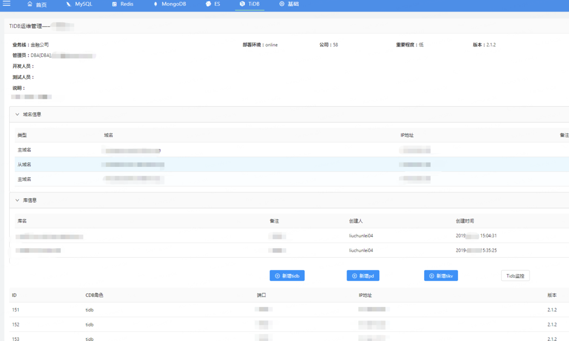
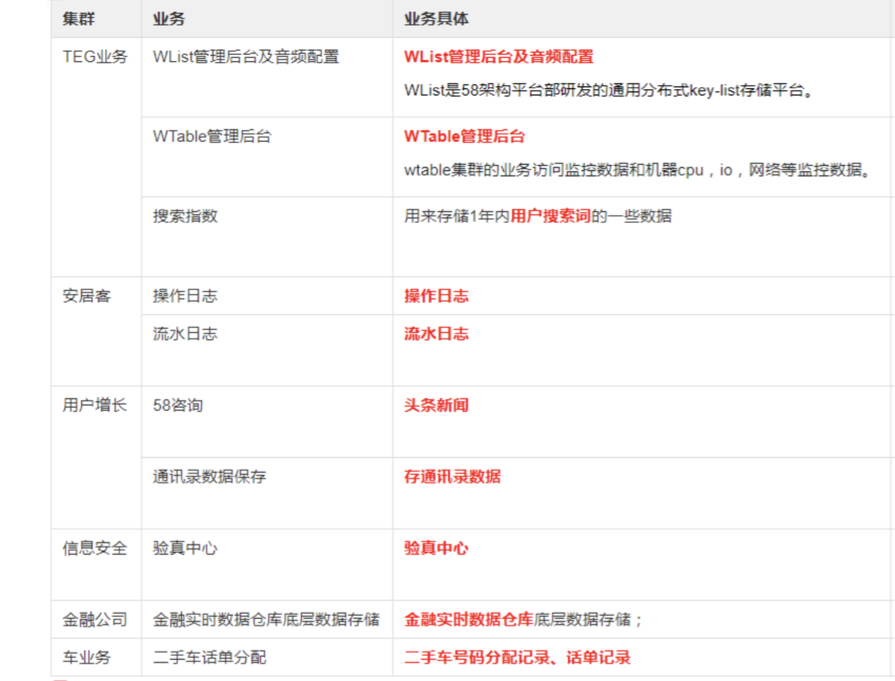

> **作者介绍**：刘春雷，58 集团高级 DBA，负责 MySQL 和 TiDB 的运维工作，TUG Ambassador。

58 集团业务种类繁多，目前包括的业务有 58 同城、赶集网、安居客、58 金融公司、中华英才网、驾校一点通等，数据库种类包括 MySQL、Redis、MongoDB、ES、TiDB。我们自己构建了“58 云 DB 平台”，整合了所有数据库的一体化运维。

本文将重点从运维的角度，介绍 TiDB 在 58 集团应用实践及后续计划。

## 一、TiDB 在 58 集团的使用概况

我们目前使用 TiDB 的服务器为 50+ 台，服务器的配置为 24 核的 CPU，128G 内存，用的是宝存的闪存卡。部署 TiKV 实例 88 个，集群共 7 套，每个业务一套集群，涉及到 TiDB 多个版本。由于是单集群多个库，目前库的数量大概是 21 个左右。磁盘目前数据量并不算大，在 10T 左右。涵盖的业务线大概目前有 7 条，包括 58 招聘、TEG、安居客、用户增长、信息安全、金融公司还有车业务，后续还会有比较多的业务推进。

## 二、业务需求及解决方案

图 1 业务及需求

业务需求目前有 4 点：

*   **有大容量、需要长期保留的数据**

	目前 MySQL 都是单机存储，物理机容量有限，大约是 3T 的单机容量，由于磁盘空间瓶颈，MySQL 扩容比较麻烦。
	
*   **保证业务高可用**

	目前我们在 MySQL 上做的是主从复制+ MHA，这个方案有一个问题是，当主库挂掉的时候，需要切换主从，就会影响一定时间的写入，这对于业务来说影响比较大。
	
*   **需要更高的读写性能**

	MySQL 目前都是单点写入，也就是主库写入，如果要读的话，就需要通过从域名到从库来进行读操作，读延时比较高，同时读流量增加会进一步加大延迟高的问题。
	
*   **分库分表很痛苦**

	在数据量特别大的情况下，就需要分库分表，分库分表大家都比较痛苦，因为聚合比较困难，业务侧开发同事也要自己维护库表的对应路由信息。

上面这几点在 TiDB 上都被很好的解决了，比如 TiDB 可以水平伸缩，如果计算能力不够的话，直接加节点就可以了，而且 TiDB 有多副本，可以保证数据安全及高可用。另外，TiDB Server 没有状态，支持多点读写。TiDB 无需分库分表，操作比较简单，也不用定期清理数据。

## 三、TiDB 环境建设

TiDB 的环境建设包括开发工具进行慢 SQL 的分析，完善监控系统，并把 TiDB 接入到“58 云 DB 平台”，收集数据、做可视化报表等等。

### 1. 架构

图 2 TiDB 部署架构

TiDB 在 58 集团应用的架构如上图，主要分为管理机、云平台、监控、TiDB 集群等四个模块：

* 管理机

	主要是负责环境部署、监控程序、拓扑查询后、 SQL 的分析、报表程序、TiDB 集群的状态检查工具。
	
* 58 云 DB 平台
	
	平台主要功能有元信息维护、工单处理、集群信息的具体展示、监控概览，还有一些自助查询的接入，比如开发利用自助查询查看各自业务的 TiDB 集群情况。此外还有运营报表、TiDB 集群申请等功能。
* 监控

	包括实例监控、服务器监控和报警。
	
*   具体的 TiDB 集群

	主要分为读写 DNS 和只读 DNS，分别下接读写 TGW 和只读 TGW（TGW 是腾讯的 Tencent GateWay），通过读写账号或者只读账号，路由到具体的 TiDB 集群上。

### 2. TiDB 生态工具

我们最近开发了以下几个运维工具。

**(1) 拓扑查询工具：`qtidb`**

用于查看一个集群的具体拓扑情况。

**(2) SQL 分析工具：`tidb_slow_query`**

TiDB 2.X 版本的慢 SQL 收集分析相比起来复杂一些，还不支持 `pt-query-degist` 这个工具（在最新的 2.1 及 3.0 版本中已支持），所以我们就着手写了一个 SQL 分析工具，直接分析慢 SQL 的一个日志文件，将结果汇总展示（这个问题在 TiDB 3.0 中已经已经很好的解决了，直接从 `SLOW_QUERY` 这张表提取结果，直接进行汇总展示）。

图 3 慢 SQL 分析工具

这个针对 TiDB 2.X 版本的慢 SQL 分析工具，主要是判断慢日志的采集区间，把所有的 SQL 格式化、逻辑化，把每类 SQL 的类型、具体信息采集出来，然后再把此类逻辑 SQL 的具体 SQL 放在一个具体的文件上，然后再去展示它的具体情况，如下图所示。

图 4 慢SQL 分析结果举例

主要信息包括比如排序情况、库名、账号、平均执行时间、执行次数、具体逻辑 SQL 等。

**(3) 状态检查工具：`tidb_check`**

我们会临时查看某个集群的状态，比如宕机检查等等。这是跟监控类似的工具，防止集群繁忙时的状态误报情况。因为我们当前的监控是通过 Prometheus 来获取数据的，但 Prometheus 是单点，如果 Prometheus 挂了，或者在 TiDB 集群特别繁忙的时候，可能从 Prometheus 采集数据延迟高，然后大家判断 TiDB 集群可能挂掉了，这时我们就会用 `tidb_check` 查看 TiDB 集群的真实状态。

图 5 TiDB 状态检查工具

主要实现方式是根据元信息来生成一个实例的拓扑的文件，我们查看集群的所有的拓扑之后再去从 Prometheus 获取数据然后汇总，最后把结果推送到 Zabbix 进行报警服务（目前我们用 Zabbix 做统一监控、报警平台，后面暂时没有用官方推荐的 Altermanager），然后再入库进行展示。其实集群状态误报的问题也可以从另外一个角度来解决，从各个组件的一个接口去获取集群的一个状态，防止 Prometheus 单点或其他的问题导致误报，这个功能目前也在开发中。

**(4) 报表信息收集工具：`tidb_report`**

报表信息收集工具也是通过 Prometheus 的一个接口来获取数据，获取当前的数据库和表的情况，到具体的集群上面去查，在 TiDB 3.0 版本下也会查一些 Slow Query 的表，汇总慢 SQL 的情况。

**(5) 监控自动化工具：`tidb_monitor`**

监控我们是通过 `tidb_monitor` 这个工具，从 Prometheus 来获取各个节点的监控数据，逻辑化之后推到 Zabbix，我们的监控平台，然后利用 Zabbix 进行趋势图展示和报警。

### 3. 平台化

图 6 运维管理平台架构

在平台化方面，我们把 TiDB 接入到了“58 云 DB 平台”，利用开源 inception 来处理 DDL/DML 工单。平台分为管理端和用户端，管理端就是 DBA 用来做元信息维护、工单处理、运营报表、监控概览等。用户端方面，业务会在上面申请 TiDB 集群、DDL/DML 工单，账号管理，查看集群的信息及监控情况，他们还可以自助查询库中的数据。

图 7 运维管理平台展示（1/2）

图 8 运维管理平台展示（2/2）

TiDB 运维管理方面主要是集群的信息展示、查看集群的监控，或者添加 TiDB/TiKV/PD 节点。另外我们也可以批量添加实例，选好机器、配好角色，然后指定开发负责人，就可以直接添加了。

### 4. 可视化报表

图 9 可视化报表分类

可视化报表方面的工作是将 Prometheus 或者服务器的 Zabbix 的监控数据汇总放在平台上，提供给开发人员和 DBA 查看，主要维度包括服务器负载情况、CPU 内存、磁盘、网络、IO 等。集群方面是通过 Prometheus 的接口获取该集群当前使用量和总容量情况，库、表方面就是通过定期采集观察库的数据增长情况。

## 四、业务及 TiDB 使用情况

图 10 目前使用 TiDB 的业务

目前，58 集团使用 TiDB 的业务主要有 TEG 业务、安居客（日志类）、用户增长业务（58 咨询、通讯录数据保存）、信息安全（验真中心）、金融公司（金融实时数据仓库底层存储）、车业务（二手车话单分配） 等，其中应用最多的是 TEG 业务。

**TEG 的业务主要包含 WList、WTable 管理后台、搜索指数等，这些都是我们自研数据库的管理端，目前写入量比较大，数据量在 6T 左右，数据增长 500G/月 左右，近半年 TEG 业务损坏了 8 块闪存卡，但是都没有影响业务，让我们充分感受到了 TiDB 高可用的优势。**

图 11 TiDB 数据库总量增长趋势

目前 TiDB 在 58 集团内部应用总量增长趋势是很快的，从 2018 年中开始接入 TiDB，到目前 TiKV 实例是达到 88 个，库的增长是达到 22 个左右，尤其是今年第二季度开始发力增长。

## 五、后续计划

**我们后续计划将服务管理平台、PMC 订单流水等 6 个业务，共 18 套 MySQL 集群全部迁移到 TiDB，总计磁盘量 30T，数据量 2000 亿。其中最重要的是 PMC 订单流水这个库，它有 8 套 MySQL 集群都是分库，每套集群磁盘量 2T，迁移 TiDB 的过程应该会有很大的挑战。**

图 12 后续计划使用 TiDB 的业务

在运维方面，我们已经着手准备版本升级，可能会全部迁到 TiDB 3.0 版本，目前已经升级了一套，还是非常平稳的。至于监控完善，刚刚已经提到过，之后监控工具将通过多个组件接口来获取数据，防止单点问题导致误报。在报表功能方面，我们也在持续开发完善，比如包括 3.0 版本下的慢 SQL 查询的优化等。另外，因为有数仓类的业务，所以我们也考虑使用 TiSpark 和 TiFlash 提升系统性能。最后，我们也在做自动化部署、扩缩容、故障处理方面的开发。

>本文整理自刘春雷老师在 TiDB TechDay 2019 成都站上的演讲。
