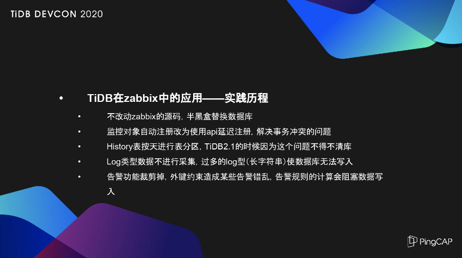
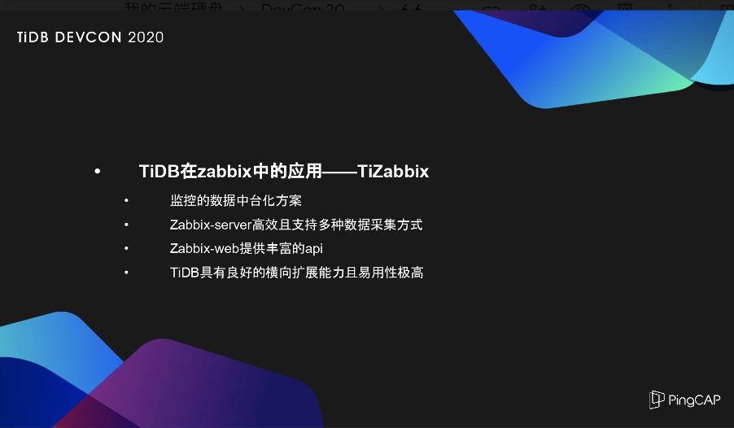
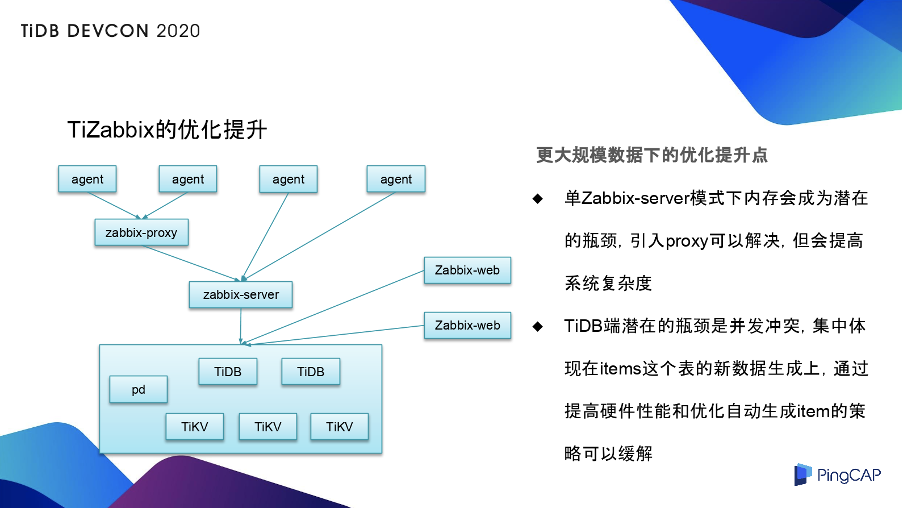

>作者介绍：韩宇，中国银行信息科技运营中心工程师。

本文的内容可能和之前的金融企业将 TiDB 应用在业务上的实践不同，下面主要介绍我们如何把 TiDB 应用在金融行业的后台运维监控上。Zabbix 作为一个老牌的开源监控方案，长期被用于生产实践。但是原生方案一般会采用 MySQL 作为后端存储，无法应对更大规模的监控。**TiDB 兼容 MySQL 协议，可以替换 MySQL 从而增强 Zabbix 的大规模监控能力，实现新的监控方案 TiZabbix。TiZabbix 通过优化监控实施逻辑，弥补因 TiDB 和 MySQL 差异造成的诸多问题，成功完成了 10000+ 监控对象和 16T 数据存储查询的实践。**

下文将从以下三部分展开：一是传统的 Zabbix 监控方案， 二是 TiDB 在 Zabbix 中的应用，三是 TiZabbix 的优化提升。

## 一、传统的 Zabbix 监控方案及主要问题

Zabbix 是一个比较老牌的开源监控方案，这里只做一个简单介绍，Zabbix 主要分为四个部分：

*   Agent：数据采集代理，部署于被监控服务器上；

*   Server： Zabbix 的服务端，用于数据的采集和发送告警等；

*   Web：用于数据采集和告警规则等配置，前端数据展示和 API 调用；

*   数据库：MySQL 用的比较多，用于配置信息和监控数据的存储。当然了，随着 Zabbix 的版本的迭代升级，除了 MySQL 也支持了其他的数据库，在后面会简要的提到一些。

**传统的 Zabbix 监控方案主要有以下几个问题，这些问题都是由单机数据库 MySQL 引起的：**

1. 数据库 MySQL 是单机的，因此不能支持较大量（指上几 T 量级的数据）的数据；

2. 由于这个的原因，所以监控对象的数量和数据存储时间不能兼得；

3. 官方给出了 proxy 的解决方案，想通过 proxy 来提升监控纳管被监控对象的能力，但是 proxy 最终也是要把数据发到最后面的主 MySQL 上，其实并没有减轻数据库的压力。

由于 MySQL 对 Zabbix 的限制，所以后来考虑用 TiDB 在 Zabbix 中直接替换掉 MySQL，来提升 Zabbix 的数据采集量。

## 二、TiDB 在 Zabbix 中的应用

### 1. 应用时间轴

这里是一个简单的时间轴：

*   2016 年：用的单实例的 Zabbix，用了 MySQL，监控了 1000 + 的 Linux 服务器，当时存储了 60 天的分钟级数据。

*   2017 年：使用  Zabbix Server 进行双实例部署，各监控  1000 + 的 Linux 的服务器，尝试将历史数据用 Python 写入 Elasticsearch。但是，由于中间用了 Python 的读取写入过程，不如直接往数据库里写些稳定。所以当时用了一段时间，没有继续用下去。

*   2018 年：开始尝试使用 TiDB 代替 MySQL，这时的生产环境开始使用原生 Zabbix ，原生的 Zabbix 方案也已经支持 Elasticsearch 作为后端存储。但是考虑到 TiDB 兼容 MySQL 协议，且 TiDB 是分布式数据库，可能比 Elasticsearch 会有一些优势。再加上 Elasticsearch 在当时的易用性也不是很好，特别是升级的操作对于刚入门的用户来说是比较痛苦的，而 TiDB 的升级就比较平滑，因此，综合考虑后开始使用 TiDB 代替 MySQL。

*   2019 年：通过解决若干的替换问题后，TiZabbix 监控对象达到 9000+ ，数据量达到 15T。

*   **2020 年：TiZabbix 监控对象达到了 10000+，数据量达到 18T，每日采集的数据条目大概是 14.5 亿条**。同时，稳定性也得到显著的提升，这里的稳定性，不是指单独 TiDB 的稳定性，由于 TiDB 官方建议用的硬件性能要求比较高，但是由于各种原因的限制，我们使用到的 TiZabbix 环境下 TiDB 的硬件性能不是很好，所以硬件性能的问题，会限制 TiDB 的稳定性。**在 2020 年，通过解决了若干问题，在这些较差的硬件上，同样将 TiDB 的稳定性是达到了一个比较理想的水平。**

### 2. 实践历程

接着分享一下具体的实践历程，我们在这个过程中陆陆续续解决了一些问题，才达到了刚才说的 18T 的监控数据的一个相对稳定的状态。

首先，一开始是不改动 Zabbix 的源码，半黑盒替换数据库。改源码是一个系统性的工程，难度比较大。为什么说半黑盒替换呢？因为虽然没有改源码，但是在遇到问题时，需要通过阅读源码来通过一些替换方案或者绕行方案来解决替换过程中遇到的问题。

下面就是实践中遇到的一些问题。和原生不一样，监控对象自动注册我们改为使用 API 延迟注册，Zabbix 自动注册功能是它实现监控自动化的一个重要功能。但是 TiDB 是乐观锁（较新的版本已经支持悲观锁了），和 MySQL 的悲观锁是有区别的，当大规模的自动注册时，它是有严重的事务冲突的，所以就把自动注册功能改为用串行的 API 的延迟注册，通过 API 调用的方法，来将新上的监控分区注册上来，解决事务冲突的问题。

接着就遇到了 History 表的问题，因为 Zabbix 里几个 History 表是监控数据的存储表，是非常大的。当时一开始，我们用的是 TiDB 2.1 版本，还不支持表分区，所以存储时间长了后，删数据的问题比较难处理。升级到 3.0 版本，支持了表分区，通过 Drop Partition 来解决历史数据的删除问题。所以在用的过程中，对于大表的表分区还是非常重要的。

接下来还遇到一个问题，Log 类型的数据是一个长字符串，在 2.1 版本的时候，到了一定的数据量后发现所有数据都写入不进去。当时，看了 TiDB 的官方手册里提到写放大的问题，觉得可能是 Log 类型的长字符串引起的。对于监控来说，数值性的数据它的历史参考价值比较大，像 Log 的参考价值比较小。因此，把 Log 型的采集关掉后，数据库的写入就恢复了。

规模更大了以后，又遇到了外键约束的问题。因为 TiDB 是不支持外键约束的，而原生 Zabbix 后端数据库是 MySQL，是有外键约束的要求的，特别是在外键里，有一个主键和外键的级联删除功能，相当于从数据库层面实现而不是应用代码实现这个功能。所以，因为外键的问题也造成了某些因为 Low level discovery（Zabbix 里的自动发现功能）的问题，简单举例来说，就是比如说 Linux 和挂载点，需要发现每个挂载点来监控每个挂载点的磁盘使用量，这种自动发现的功能产生的告警就会因为外键的问题发生错乱。

除了外键约束的问题外，又发生了数据无法写入的问题。后来阅读了 Zabbix 的源码，在源码中发现，在判断告警规则的时候，有一个锁缓存的操作，可以锁掉 Zabbix Server 上的缓存。因为 Zabbix Agent 采上来的数据是先缓存到 Zabbix Server 的内存里，锁缓存以后，缓存的东西就不往数据库里写了，因此，后端数据库就无法写入。

最终因为这两方面的原因，我们决定把告警功能裁减掉，将TiDB 用在 Zabbix 后，只用它来采集、存储和查询数据。但是告警去掉了，怎么来弥补这个功能呢？在生产环境上，我们通过使用 Zabbix Agent 的本身双写能力（双写到不同 Server)，往两个方向的 Server 上写数据。一个 Server 上对应的是 MySQL，用来实现告警功能，它的告警不会受外键的影响，但是它的数据存储就特别特别少，可以解决性能问题。另一方向的数据把它写到对接 TiDB 的 Server上，就不要告警功能，只要数据的访问和大规模存储。最终通过数据和告警的分离解决了这个问题。

### 3. 一些技巧

接下来，简单说一下使用过程的一些小技巧。

1）在设计过程中，架构要尽量的简单。Zabbix 支持主 Server 上再放 proxy，但是一开始使用，建议先不用  proxy，因为 proxy 会引入复杂度。单 Zabbix Server 的情况下，按照现在的性能指标，保持现在的数据采集频率和存储时间，20000+ 的监控对象应该是没有问题的。

2） Agent 采用主动模式即  Zabbix agent active，这种模式可以有效减少 Zabbix server 的压力。因为在被动模式下，Zabbix server 性能消耗比较多，而在主动模式下，相当于把压力下推到 Zabbix Agent 的采集端，这个压力对单个服务器来说是微乎其微的；但是如果都叠加压到 Server 上， Server 肯定受不了的，所以通过选择 active 的模式，来减小 Server 的压力。

3）将 Zabbix 里的配置项  HistoryCache Size 设置为 2G 最大值，可以弥补硬件的不稳定性。刚才也提到了，因为没有用到 TiDB 建议的比较好的硬件，所以硬件性能的缺失就造成了 TiDB 的一些不稳定因素，有时数据写入会比较慢，就会积压到缓存里，把缓存设置的尽量大就会保证数据的不流失。虽然积压了，但是随着性能的恢复，数据是可以重新再写进去的，只是产生了一定的延时，但没有造成数据的丢失。

4） API 的调用不要过于频繁。因为 API 调用过程中权限的检查是要频繁的查和写同一个表的同一行数据，这会产生严重的事务冲突，特别是在 TiDB 乐观事务下，严重的事务冲突会拖垮数据库的。所以，API 调用不要过于频繁，如果需要多进程，或者多线程的调用 API，最好是多用几个 Session ID，Session ID 是权限检查的最小单元，这样可以避免这种情况。

5）随着数据量的增大，Web 的一些操作会失效，需要灵活的使用 API。失效主要是因为数据库事务比较大，前端会超时，因此，当数据量比较大时，比如说要在前端大规模的改一些东西，这时就要灵活的使用 API。因为 API 是一个自动化非常好的手段，通过灵活的使用 API，会规避这个问题。

### 4. TiZabbix 方案优势

我们通过以上的探索来解决了一些问题，完成了 TiDB 在 Zabbix 中的有效应用。

1）监控的数据中台化方案。TiZabbix 是用在监控数据的中台化方案，主要解决数据大量的采集、存储和查询，可以提供更大量的、更长时间监控的历史数据，方便我们进行数据分析、查询和一些复杂问题的定位。

2） Zabbix-Server 高效且支持多种数据采集方式。我们知道，原生的告警规则是比较简单的，只有通过较多历史数据的关联查询分析才能有效定位一些问题。同时， Zabbix-Server 比较高效，单 Server 下我们用的是虚机（一般最大 64G 内存），它是支持 20000+ 的 Linux 的采集的管理分区没有问题，而且它支持多种的数据采集方式，这就是一个很好的数据集成的支持。

3）Zabbix-Web 提供丰富的 API，可以通过 API 来调用数据。

4）TiDB 本身就是良好的横向扩展能力，且易用性极高。通过横向扩展提高数据库的容量和性能，这样可以获取更多的数据和更长时间的存储。

## 三、TiZabbix 的优化提升

上图是 TiZabbix 简单的架构图， Zabbix Proxy 在这里是没有用到的，但当规模更大的时候会使用它来分摊 Zabbix Server 的压力。因为在单 Zabbix Server 下，它的内存会是潜在的瓶颈，当被管理端多了后，对应 Server 的内存肯定会不断的增长，增长到一定程度后单机就无法再增大了，就需要 proxy 来分担 Server 的压力。所以，当达到更大的规模后  proxy 是需要引入的。架构图的右半部分是提供 API 的 Web ，相当于第三方的调用来消费监控到的数据。

架构图最下面一层是 TiDB，TiDB 目前来看也是存在着一定的潜在的瓶颈，可能主要是并发冲突。因为用到的是比较差的硬件，肯定是要受点限制的，具体表现在并发的性能上会下降一些，不过这个也可以通过逻辑上的方案来规避一下，就是 item（Zabbix 的一个关键数据模型）。在一些极端场景下，自动产生的 item 会比较多，如果它不断的自动生成，相当于会出现写热点，然后会产生并发冲突，进而拖垮整个数据库。所以，在更大规模下，需要优化自动生成的 item 策略。将 item 的自动生成策略打散，不要在同一时间点生成过多的 item，来缓解可能引起的并发冲突。当然，通过提升硬件的性能，也能够来弥补这个问题。

以上就是关于 TiDB 在我们中国银行 Zabbix 监控方案中的应用，谢谢大家。

