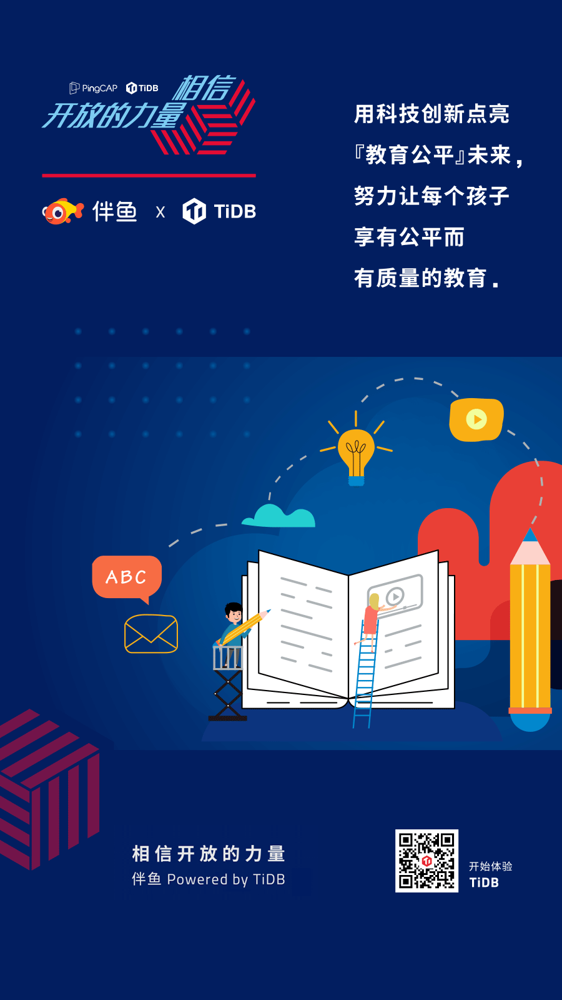

**「我们已经用起来了」**，是我们最喜欢听到的话，简简单单几个字的背后代表着沉甸甸的信任和托付。从今天开始，我们将通过 **「相信开放的力量」** 系列深度案例分享，从业务的角度，看看一个数据库为各行业用户带来的业务价值。 **本篇文章让我们看看伴鱼 All in TiDB 背后的故事。**

>用科技创新点亮『教育公平』未来，努力让每个孩子享有公平而有质量的教育。

伴鱼成立于 2015 年，于 2017 年进入在线少儿英语行业，从入场之初就开始搭建产品矩阵生态，是一个覆盖全年龄、全场景的在线少儿英语教育品牌。

2020 年，伴鱼已发展为在线少儿英语赛道的头部企业，在 COVID-19 的大背景下，加速了儿童教育线上化的进程，伴鱼从去年 12 月到今年 10 月，其用户量经历从 2000 多万到 4000 多万的跨越，付费用户实现从 50 多万到 200 多万的跃迁，增长幅度达 300%。

## 面临的挑战

市场规模的高速增长反映出用户需求对资本市场的推动，但在线教育行业本身形势却并不乐观，仍存在许多痛点。

- **首先，成本**。对于在线教育平台来说，线上产品是运营核心，入口、后台搭建，投入成本以及日常运维人员，都是一笔不小开支；

- **其次，市场竞争激烈，产品同质化严重**。激烈的竞争带来的是高速的产品迭代节奏和层出不穷的新业务。

这些业务上的压力最终都传递到伴鱼的技术团队。

伴鱼 CTO 王强在沟通中表示：“通过技术的创新去支撑业务的发展，降低企业成本的支出是我们要做的一部分。我们认为做在线教育，既要做用户获取、沉淀，又要做好的课程服务，用效果说话。”

>我们做的是互联网教育，希望通过互联网技术创新和教育结合，让学习这件事情变得更公平、更效率。
>——伴鱼 CTO 王强

教育这个领域天生就有教学科目和教学场景两个维度，这两个维度的笛卡尔积就是它可能的业务类型数量，当然有多个科目和多个场景适合由一个业务线来负责，但总体上由于科目和场景的业务差别会非常大，出现多个业务线是必然的趋势。

产品及业务上的创新发展，离不开底层 IT 基础设施的支撑。在这个背景下，随着伴鱼产品矩阵快速发展带来的数据量和一对一在线课堂的并发量爆炸性增长，业务侧对伴鱼 IT 系统整体的响应速度及稳定性的要求也更为严苛，特别是数据库这个关键的基础设施。

面对业务快速发展、创新的需求，伴鱼技术团队开始谨慎思考数据库选型的问题，他们理想型的数据库是这样的：

- 具备高可用能力，节省运维成本；

- 兼容传统数据库的使用方式，节省新业务开发成本和学习成本；

- 大数据生态友好，节约与其它大数据系统的接入成本；

- 有水平扩张能力，并且尽量做到不侵入业务。

为了应对这些挑战，伴鱼技术团队认真地评估了各种解决方案，综合考虑了产品、服务、安全、技术支持等多方面因素，最终选择以 TiDB 为基础进行整体的数据架构规划。

## 为什么选择 TiDB

>宁花机器一分，不花程序员一秒。
>——伴鱼技术中台负责人陈现麟

### 技术后发优势的理解

伴鱼公司中台技术负责人陈现麟表示，初创公司在技术沉淀和积累上是远远不及一些成熟公司的，这些沉淀和积累就是成熟公司在技术上的先发优势，当技术没有出现变革的时候我们没有选择，但是当技术正出现重大变革的时候，如果我们还做同样的技术选型，那么也需要花同样的时间和成本才能达到成熟公司的水平，然后等大家都开始迁移到新的技术上的时候，这些技术沉淀和积累就可能会变成技术债务。

技术选择上一定要服务好业务，做好业务的发动机，技术与业务彼此配合才能相互成就。所以初创公司应该去预判技术趋势，选择面向未来的技术，在技术上弯道超车，避免自己的技术债务。

### 成本与效率的权衡

MySQL 相比较 TiDB 而言，MySQL 的集群高可用需要 DBA 和基础架构团队花时间成本去解决，MySQL 的大表分库分表方案需要 DBA、基础架构团队和业务研发团队花成本去解决，这些都是隐性成本。

面对机器越来越便宜，人才越来越值钱的趋势，选择 TiDB，将复杂性交给 TiDB 去做，是经过对成本与效率进行充分权衡后的结果。

### 技术生态与红利的思考

选择一个技术，其实也是选择了这个技术的生态，如果技术生态完善，做事情往往会事半功倍，极大地提高研发效率。TiDB 全面兼容 MySQL 协议，让 TiDB 的用户在享受到 NewSQL 能力的同时也享受到 MySQL 的生态。

同时，选择 TiDB 意味着可以享受技术红利，通过新技术去优雅而高效的解决问题。比如，面对大表的解决方案，MySQL 提供的解决方案是分库分表，业务研发和 DBA 一起配合非常低效地解决这个问题，但是对于 TiDB 而言，单表为无限大，从根本上解决了这个问题，业务研发和 DBA 不再为数据的增加而不停地进行分库分表，这个就是巨大的技术红利。
所以，基于上面的一些讨论与思考，**伴鱼决定「All in TiDB」。**

## 获得的成效

由于篇幅关系，在这里就介绍 TiDB 在伴鱼应用中的两个典型的场景。

1. **在线课堂白板记录存储**

    在线课堂包括了学生与教师互动信息，教学白板、场景内容展示等信息，是在线教育必备的核心业务之一，面对线上教育需求暴涨，特别是在今年三月份短时间内用户量和上课量均增长超 100% 的情况下，伴鱼技术团队在对数据库架构没有调整的情况下，圆满的支撑了业务的增长其中，TiDB 数据库满足了面对大规模业务增长所需的水平扩展能力，仅在线课堂中白板操作轨迹记录数据，单表就达到了 1.5 T，总数据量 4.3 T。

2. **在线核心交易系统**

    作为一个商业化的在线教育平台，要很好的实现付费，一个必要的商城及交易系统是必不可少的。目前交易系统包括：伴鱼绘本，少儿英语等等各 APP 内的现金、虚拟货币支付交易业务。

    交易相关的场景对数据安全的要求极高，交易数据不能丢，不能错，需要选择支持强一致性和原子操作等 ACID 特性的数据库，同时由于今年用户量和并发量的爆发性增加，扩展性也是必选项，TIDB 作为核心交易的底层数据库，从去年 12 月到今年 10 月，付费用户实现从 50 多万到 200 多万的跃迁，增长幅度达 300% 的背景下，平滑稳定的支撑着交易业务。

现在伴鱼有 10 套 TiDB 数据库，60+ 数据库实例，6 个 QPS 过万核心集群，999 线基本维持在 16~30 ms 左右，响应时间、稳定性、扩展性都达到预期。**所以，从目前的情况来看，伴鱼选择 All in TiDB 是一次非常正确的选择。**

在数据库技术方面弯道超车，避免了对 MySQL 技术的重复建设与积累，享受了 NewSQL 数据库 TiDB 在高可用和水平扩展等方面的技术红利，一套基础设置及人员服务了多条产品、业务线，提高了业务研发和 DBA 的工作效率，降低了人力开销成本。从而释放更多的人力及公司资源在业务拓展及产品打磨上，这也意味着伴鱼将比同行拥有更多增加营收和驱动创新的机会。

当前，教育正朝着全面提升用户综合能力的教育体系转变，孩子们无论在城市还是乡村、家境贫困还是富有，都可以接受最适合自己的教育，如何通过大数据、AI 等技术创新，提升用户的学习体验，帮助孩子提高学习效率，达到最好的学习效果，这是伴鱼等头部在线教育企业持续思考和落实的事情，人类社会的未来也将因此变得更加多元而美好。

## 与客户同行，相信开放的力量

每次数据库架构改善与落地，无论是 TB 级还是 PB 级，都需要付出努力，但这也值得每一个企业去实践。在当下这个时代，不管企业的规模如何，都要学会借助开源的力量，避免去重复的造轮子。

每一个看似轻松的背后都有不为人知的努力，每一个看似光鲜亮丽的背后，都有不为人知的付出。分布式数据库建设之路道阻且长，TiDB 愿与伴鱼及每个客户一起，携手并肩把事情做好。