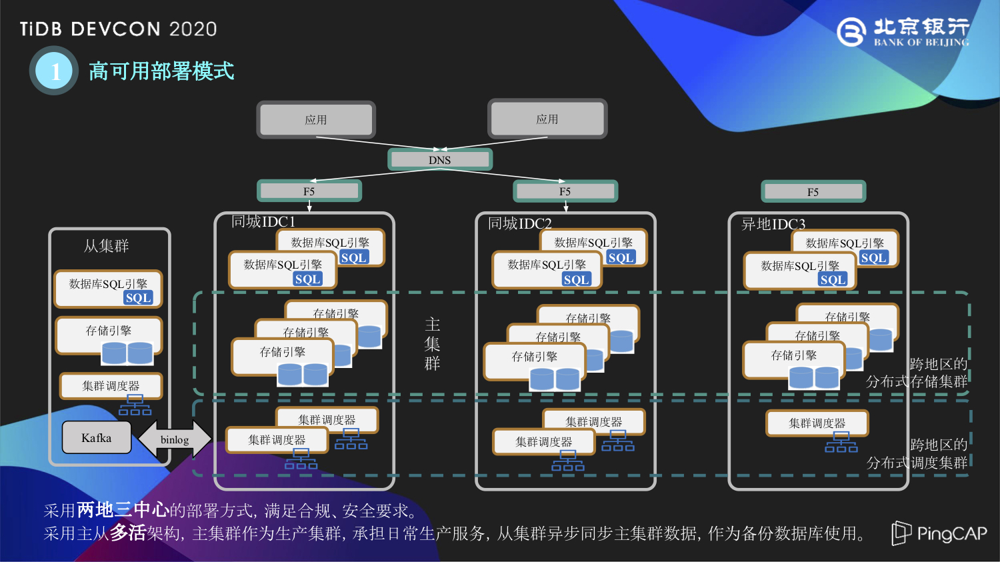
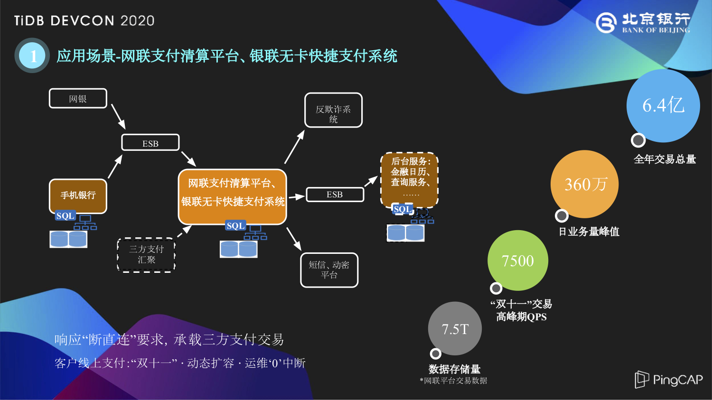
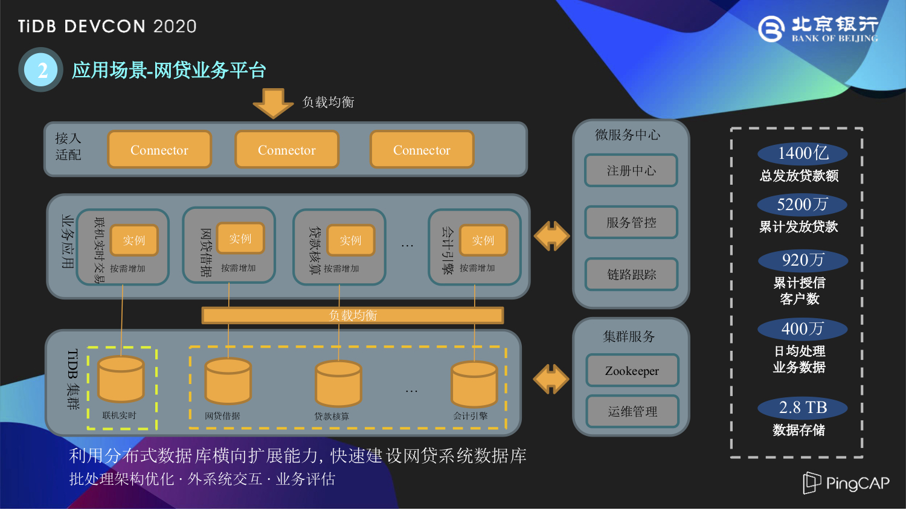
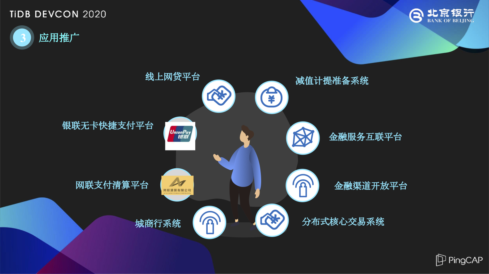
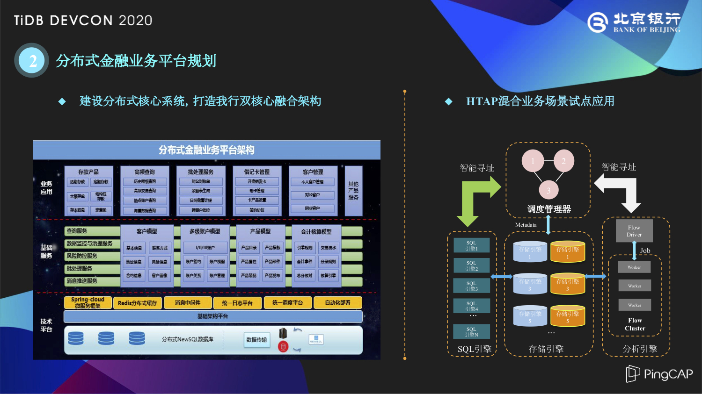

>作者介绍：陈振东，北京银行软件开发部

北京银行是一家城市商业银行，公司价值位列中国区域性发展银行的首位，依托于中国经济的大环境，北京银行的资产总量在全球千家大银行中名列第 61 位，连续六年跻身全球银行业百强。北京银行积极开辟多元化的业务经营，例如北京地区的社保缴纳和医保代发，都是由北京银行在提供服务，在你入职一家公司的时候，收到的医保折子就是来自北京银行。

## 业务转型驱动分布式架构建设

由于快速的业务发展需求，北京银行在业务转型中对系统架构进行了升级，逐渐向分布式架构进行转移。早在 2016 年，北京银行就开始了对分布式数据库的探索，并于 2018 年正式投产上线了 TiDB 分布式数据库，当时在业内还没有一个比较完善与成熟的体系，我们也是根据银行的安全合规需求建设了两地三中心的部署方案。

如上图所示，在两地三中心部署了 TiDB 分布式数据库集群，采用主从的多活架构，主集群作为生产集群承担日常的生产服务，从集群是建设在西安的异地灾备中心，主从之间是用 Kafka 同步 Binlog 形式进行数据的同步。

在这两年的建设过程中，北京银行与 PingCAP 进行专项的深度合作，这里简单介绍三个方面：

- **两地三中心**：在两地三中心的部署方案中，异地中心的网络延时会对整个集群的性能产生较大影响，我们在这层面上对 gRPC 的消息格式进行了压缩，同时利用 Multi-Raft 特性将主节点都固定到北京 IDC 的节点。

- **增量备份**：有一些系统对增量备份有需求，特别是审计、监管这类数据的导入和导出，北京银行和 PingCAP 共同展开增量备份和指定时间数据恢复的方案研究，将 Binlog 保存到本地，以 ProtoBuf 的形式存下来，再利用 Reparo 相关工具能够恢复到指定的时间节点。

- **事务**：金融行业大家都比较关心数据库事务，例如大事务处理、RC 级别、悲观锁的应用等，北京银行在这些需求层面也与 PingCAP 进行了专项的合作，当然在 TiDB 4.0 版本里面已经包括了这些功能特性。

## TiDB 在金融交易场景中的应用实践

### 网联支付清算平台 & 银联无卡快捷支付系统

在构建数据库之后，我们来看看 TiDB 在北京银行交易场景中的应用时间。首先给大家介绍的是网联支付清算平台和银联无卡快捷支付的场景，这两个是最早使用 TiDB 数据库的业务系统。

根据当时中国人民银行“断直连”的要求，所有银行的三方支付交易都要进行集中的汇总。在此之前，银行对这种三方支付的建设方案会采用一些通用平台去承载这些专用业务，比如支付宝有专业的支付宝系统、微信支付、京东支付等等都有各自专用的支付系统。在有了“断直连”汇聚三方支付的要求之后，北京银行对业务和系统进行了整合，以便更好地迎接互联网金融带来的大数据量和高并发的挑战。

在这两个系统投产之后，已经成功应对了两次双十一挑战，上图列出了 2019 年双十一巅峰的 QPS 达到了 7500，是平时 QPS 的十倍以上。**IT 团队进行多次线上的运维操作，包括版本升级、打补丁等，很好地利用了 TiDB 分布式数据库的多副本特性实现“运维零中断”的操作。随着北京银行系统的升级，在网联这条业务链上，包括上游的手机银行到网联、银联无卡快捷支付这样的业务中台，再到后台的金融日历、查询服务都已经进行了分布式架构的升级，完成了与 TiDB 的对接。** 在这里，手机银行指的是手机银行 App 的后台管理端，并不是说您下载一个北京银行手机 App 就能获得一个 TiDB。

### 网贷业务平台

第二个比较典型的应用场景就是网贷业务平台，网贷平台不同于网联平台的联机实时高并发的交易，主要进行的是一些批处理的业务，比如像借呗、花呗、度小满这类比较热门的互联网金融明星产品，其实在银行侧就是一笔笔贷款与一笔笔借据，我们需要对它们进行无差别的处理。

网贷平台跟上面提到的网联平台还是非常有渊源的，整个网贷平台采用敏捷化的建设方式，包括敏捷的项目管理、敏捷开发与敏捷测试。最开始的时候，项目组是计划通过采购实体服务器专门搭建一套数据库集群给网贷平台使用，但是由于整个采购物流的周期太长，**我们最终决定对网联、银联无卡这套比较完备的系统进行一个 Scale-in 缩容，将缩容出来的五台 TiKV、两台 TiDB 给到网贷平台使用，PD 由网贷和网联两套系统共同使用，我们采用这种方式快速完成了系统的构建。**

在这个过程中，有几点经验分享给大家：

首先是对批处理结构的优化，起初网贷平台专门处理网贷借据、贷款核算等批处理业务，随着后期的一些消费贷、贷款查询、用户查询这类联机交易上来以后，对 TiDB server 层的批处理性能会产生较大的影响。于是，我们将刚才提到的两台 TiDB 其中的一台专门用于处理这些实时联机交易，另一台 TiDB 专门进行批处理。

另外一点，网贷平台在处理完自己的会计分录之后，由传统的核心总账系统进行核算与账务处理。外系统也是在这种交互过程中，由于  TiDB 的 SI 隔离级别，MVCC 多版本 有它的回收机制，之前开发测试中没有考虑到这一点，后期在性能测试中发现了有 GC 超时的现象，我们通过对事务的合理编排解决了这个问题。

在业务评估层面，当银行的业务人员说有一个 300 万的贷款合同、贷款借据，其实到网贷平台经过流水表、当日表与历史表这样一系列处理之后，就成了一个 3000 万行需要处理的数据，网贷平台需要去跑批处理的数据也就是这 3000 万，不再是业务人员的 300 万。再从 TiDB 数据库层面去看，加上了副本、索引等等之后，这样的数据量其实已经远远大于最开始业务预期的评估，这就是一个金融场景大数据产生的过程。

然后跟大家分享一下 TiDB 的批处理效率，刚才提到的 3000 万跑批是在一个小时左右完成的，后期随着版本的升级和系统优化，还有很大的提升空间。

### 应用推广

除了上面两个比较典型的交易系统之外，**北京银行也在减值计提准备系统、金融服务互联平台、金融渠道开放平台、城商行系统等场景都用到了 TiDB，涵盖了包括支付、账务核算、金融渠道等方面所有的金融场景。**

### 分布式数据库建设过程感受总结

简单总结一下分布式数据库建设过程中的一些感受。

- **业务转型**：大家都提到在金融互联网的上半场，银行是一个完败的结局，其实互联网金融这个场景给了大家一个公平的竞技场，只有以客户为中心，才能生存下来。刚才提到的网联场景，用户就是喜欢零点抢购，我们就要有应对策略，我们需要搭建更灵活、更大容量的系统去承载这些流量。

- **动态维护**：随着架构的转型，分布式架构在灵活部署等方面逐渐体现出优势。我们需要更智慧、更优雅地去解决可能带来的服务中断的情况。银行对业务连续性保障要求非常高，我们现在可以充分利用分布式数据库的架构优势，真正实现零停机的集群动态节点调整。

- **行内生态**：随着 TiDB 分布式微服务架构的全面推广，北京银行内部也是以点带面，有越来越多的项目组参与进来，学会从分布式的架构出发，思考在这种架构和技术栈下，应该如何去进行业务层的规划和设计。

## 金融场景业务与分布式数据库的明天

接下来谈谈我们对未来的展望，有点像昨天、今天和明天。

### 总体目标

在未来，北京银行的分布式数据库团队，主要是着手两方面的工作：

**一方面是拓宽领域**。首先从刚才提到的这些专业系统的范畴出发，继续下沉去探索分布式数据库在银行的账务类、客户信息类的核心业务场景中的应用。并从数据库技术角度出发，将分区表、悲观锁，甚至 HTAP 这种特性与银行系统进行结合，不断推进分布式数据库在金融领域的落地。并且随着今年北京银行顺义研发中心的投产使用，我们也面临同城双中心方案制定的挑战。

**另一个大方面就是协力共进**。这里的力，包括协内力和协外力两个方面。协内力方面刚才我已经提到，随着行内越来越多的项目组开始使用 TiDB，去进行微服务的转移，我们的系统开发人员需要拓宽思路，在分布式的架构下，应该怎样去设计和开发代码。随着 TiDB 分布式数据库的引入，对我们的架构管理与运维管理都带来一些挑战，需要总结前期的经验，把曾经掉过的坑进行归纳，化繁为简，形成一套比较成熟的银行业的建设方法论。协外力方面，北京银行在分布式数据库建设的过程中，参与了金融业内的标准制定与交流，在未来我们会继续保持这样的姿态，为行业建设贡献一份力量。

### 分布式金融业务平台规划

最后，跟大家分享北京银行分布式金融业务平台的规划。

首先是分布式核心的下移的工作，包括上面提到的帐务核算、客户管理等一系列业务应用的迁移工作。

另一个层面，研究 HTAP 混合业务场景的试点应用，这也是 TiDB 4.0 里面比较有亮点的功能。TiDB 4.0 发布之后，我们在行内已经开始对 TiFlash 进行初步的评测，我们相信 HTAP 混合型的数据库是未来的技术发展方向，我们将继续去探索，找到 HTAP 真正的归属之处。

>本文整理自陈振东在 [TiDB DevCon 2020](https://pingcap.com/community-cn/devcon2020/) 上的演讲。