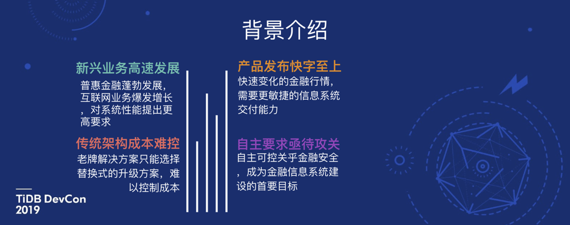

>作者介绍：于振华，北京银行软件开发部资深架构师，长期从事银行核心系统研发、规划，参与过多个核心信息系统建设工作，包括一、二代支付系统、第四代银行核心系统建设、分布式核心系统建设等企业级项目工作。当前主要研发方向集中在构建先进、高效、面向 OLTP 的银行交易系统，提升银行信息系统服务能力。

>本文整理自于振华老师在 [TiDB DevCon 2019](http://mp.weixin.qq.com/s?__biz=MzI3NDIxNTQyOQ==&mid=2247487846&idx=1&sn=5d349facbf078b19b886ccfa16b152c4&chksm=eb16360cdc61bf1a29efb65e0413877e3cb31bf4e8a3e439c615ae03eeb94a937ccb23948942&scene=21#wechat_redirect) 上的演讲实录，演讲主题为《TiDB 在银行核心金融领域的研究与实践》。

今天参加 TiDB DevCon 2019 能够和这么多各行各业的朋友一起来交流 TiDB 的实践情况，这个机会非常难得，因为平时都是我们技术团队和 TiDB 团队单向的交流，横向的这种客户之间交流的机会很少，像刚才几位老师讲的，我觉得都很有意思，也希望通过咱们这次大会，大家能擦出不一样的火花。

北京银行和 PingCAP 团队进行了深度的合作，目前有几套重要的实时交易类系统已经对接，包括比较重要网联系统、银联无卡支付、金融互联服务平台等。现在怎么来评价一款产品到底稳不稳，很大程度上要看这款产品在金融，尤其是核心金融的场景有没有应用，能不能支持金融场景的要求。我们是在 2018 年 3 月份、5 月份、6 月份进行了投产。经过半年多的时间，我们看到 TiDB 也能够支持金融场景了。从侧面来讲，分布式数据库技术，确实已经到达了一定的成熟度。

## 一、背景介绍

我相信这几年，尤其是这三四年，大家应该都有感触。无论是工作方式，还是生活方式，都发生了很大的变化，各种信息、科技产品铺面而来，有人说是这种变化叫**工业科技革命 4.0**。不知道这种提法准确不准确，但这种变化确实对我们银行的系统产生了比较大的挑战。

图 1

在图 1 中 ，我列出了几项，比如**高并发的要求**，要求你具备很快的扩展能力。再比如产品发布，要求你**具备快速的发布能力**，在座的应该有很多做产品、做实施的团队，大家应该很有感触，比如可能前一天还无人问津的产品，第二天可能就会卖的很火爆，来的每个项目都是紧急项目，都要求你在最快的时间发布出去。当然还包括一些老生常谈的问题，像**传统架构成本难以控制**，还有**自主可控亟待攻关**，其实在传统闭源的生态里面，我们很难达到自主可控的要求。

## 二、系统分析

图 2

在这种背景下，我们从全局的角度出发，对银行以往的技术形态做了系统性的分析，图 2 中列举了一些典型的架构形态，有一些在现在的银行架构里边还是存在的，比如单体的应用，再比如传统的数据库，现在用的最多的 DB2 和 Oracle，还有传统的单机或者集群部署模式，以及瀑布开发模型，当然还有面向传统架构的运维模式。

今天我们来谈分布式数据库，它是一个新技术，但不能说把以往技术架构就否定掉。以往的技术形态好不好？坦白讲，我认为很好，不好的话不可能支撑了这么多年的金融业务发展，但站在今天这样的时间点来说问题也是存在的。像刚才讲到的，高并发的要求、扩展能力、成本、以及产品交付能力都存在一些不尽如人意的地方。

在这种情况下，我们启动了北京银行新一轮的架构转型的工作，分布式数据库也纳入到我们的工作范围里。我们和 PingCAP 很早就接触了，在一年多的工作过程中，要谈的技术细节、技术方案、工作流程等等这些内容会很多，如果真的来总结一下这项工作是怎么做的话，我总结出以下三条。大家一看可能会觉得很虚，但是你如果真的来实践这件事，也许会有同样的感触。

**第一个就是「务实」**。架构转型不是一个为了技术而技术，为了新产品而新产品的工作，而是确实要对你的业务发展、开发、运维的效率有所提升。

**第二个，我觉得可能是最重要的，就是要做到「速赢」**。无论是你在什么样的企业来做技术升级，技术转型，或多或少的都会遇到一些阻力，尤其是在传统企业。那做到速赢，迅速的释放价值，让你周围的人、让你的团队、让你的组织，迅速看到它的价值，会让你未来的工作开展更加平滑。

**第三个是「全栈」**。因为是整体的架构转型工作，我们希望建设一套平台，它能够释放整体的价值，而不是在乎一城一池的得失。今天本来我想介绍北京银行的应用架构和分布式数据库架构，因为时间关系今天只说一下分布式数据库建设的情况。

## 三、进展情况

图 3

在介绍具体内容之前，先跟大家同步一下，我们现在的工作进展。2018 年 3 月，我们投产了行业内首个面向核心金融业务的分布式数据库，采用的是**两地三中心五副本**的架构模式。以分布式数据库为基础，5 月份我们投产了网联支付清算平台，这也是很重要的一个带资金业务的实时交易系统，6 月份投产了银联无卡支付平台。这张图（图 3）可能稍微有点老，现在我们投产的还包括金融互联服务平台，IFRS9 减值系统。我们未来要做的事其实和刚才[刘奇](http://mp.weixin.qq.com/s?__biz=MzI3NDIxNTQyOQ==&mid=2247487846&idx=1&sn=5d349facbf078b19b886ccfa16b152c4&chksm=eb16360cdc61bf1a29efb65e0413877e3cb31bf4e8a3e439c615ae03eeb94a937ccb23948942&scene=21#wechat_redirect)讲的比较一致，包括 HTAP，包括容器云的这些方案等等，这也是我们目前最迫切的需求。

### 3.1 专项评测

现在回想起来，北京银行开展分布式数据库建设的工作，其实是在行业里面算很早的，也是因为我们开展这件工作的时间比较早，所以在整个过程中遇到了很多的困难困惑。行里的技术力量集中在 DB2、Oracle 上可能比较多，对于分布式数据库的掌握来讲，需要有一个周期。**我们做的第一步，为了保证产品可用，建设了面向金融业务的评测体系**。

图 4

图 4 左上角是面向这个功能的测试，比如数据库有没有高可用性，能不能做线性扩展，有没有在线升级能力，这些都是我们的测试点。图 4 左下角这块，是面向性能的测试，**我们并没有采用市面上已经有的工具，比如 TPCC、Sysbench 等等。因为我们实际分析下来觉得市面已经有的这些工具和我们的金融场景有一些距离，用它们来测试可能不会有很好的参考意义****，所以我们自研了这套面向分布式数据库的金融性能评测体系，能够让我们明确出分布式数据库可以应用在金融场景，并且对于功能和性能，让大家能有一个可度量的工具**。

在这个过程中，要感谢支付清算协会、信通院等上级单位和组织给予我们的帮助，另外，我们也和硬件厂商英特尔进行了比较深的合作，比如今年（2018 年）新的硬件平台，我们也做了专项的分布式数据库测试，为未来我们硬件的架构选型提供了有效的参考。

### 3.2 部署模式
 
 

图 5

对于分布式数据库的技术层面来讲，刚才几位讲师介绍的比较多了，我就来讲一些北京银行比较不一样的、走在前面的一些地方。 大家看到图 5 这套架构是北京银行的数据存储层的架构。**北京银行的架构采用两地三中心五副本的模式部署**。

跨城长距离的分布式数据库建设具有很大的挑战。比如北京和西安大概一千多公里，两地距离比较远，延时比较高，我们实测的延时大概是十七毫秒左右。这十七毫秒，如果放在一条 SQL 来讲，一来一回三十几毫秒，这样的延时我们肯定是接受不了。所以在这种情况下，**我们用了一个五副本的模式：北京两个 IDC，各放置两副本，西安一个 IDC 放置一个副本，采用 2:2:1 的模式。这样做的好处就是当前端应用请求过来之后，不需要用到北京到西安的这个网络，北京的四个副本中成功三个，就可以给前端实时返回，而且北京的部分实例允许失效。这样做 SQL 平均延时，大概在 1.2 毫秒左右，.95 延时大概 5 毫秒左右，这是比较不错的一个成绩（网联、银联的业务其实要比互联网业务复杂很多）**。

这里给大家分享一个我们实际在生产过程中遇到的一个小故事。在某个周六的中午我接到我们运维值班人员的电话，他说 TiKV 存储服务器坏了一台，当日我第一时间问的是：坏了一台有没有影响服务。他说没有影响服务，服务还是正常的。我说那就赶紧找硬件厂商给修一下机器。当时还觉得挺高兴的，不经意间在生产系统验证了一把。到了第二天周日的中午，他又给我打了一个电话，说又坏了一台服务器。当时有一些担心，是不是我们这批采购的硬件服务器有什么问题，想到这点就立马做排查，当然第一时间问的还是有没有影响服务，他说没有影响服务。**这样连着两天坏了两台存储服务器都没有影响服务，也证明了多副本方案的有效性**。

### 3.3 两地三中心

图 6

图 6 展示的是整个包括应用、F5 到 TiDB、PD、TiKV 等整个部署的模式。目前我们接着有网联、银联这两个比较大的系统，这两个系统业务量相对来讲比较大，每天有一两百万笔的业务。在西安，我们还部署了一个从集群，那这个从集群是做什么呢？这个从集群就是为了对接一些 OLAP 或者说比较大的报表的情况，从而避免它对主集群的负载产生过大的影响。

## 四、应用实践

### 4.1 出现过的问题

图 7

有人说“当你有了锤子，好像什么问题都看上去像钉子”。我们期待从传统数据库过渡到分布式数据库，什么问题都可以解决。但事实上，肯定是没有一个万能的技术方案。图 7 右下角，我列了一些从我们项目开展之初到现在，产生一些问题或者说一些小插曲。

比如我们刚才介绍了行里的 DB2、Oracle 应用的比较多。DB2、Oracle 以前用的是 READ COMMITTED 的隔离级别，那现在到了 TiDB 的 Repeatable Read 的这种形式可能还需要适应。我们建设初期也出现过这种问题：这边  Insert 的数据，那边却查不到，就因为 TiDB 是这种快照的隔离级别。

还有执行计划的索引没有选中的问题，这个在我们实际的生产过程中也遇到过，明明有索引，却没有精确选中那一个索引。造成 SQL 运行的特别慢，内存吃的也比较多。这个问题，我觉得是可以解决好的，临时解决方案就是手动强制加 Hint，未来我相信 TiDB 在版本升级上也会考虑这一点，让执行计划更加准确。

还有热点数据的问题，热点数据指望数据库来解决，现阶段来看是不可能了。无论是传统数据库，还是分布式数据库，要引入另外的应用缓存的组件才可以解决，在传统方案里边，我们做的技术方案也有很多，像比较传统的散列方式，把热点数据散列出去来解决，现在有了缓存，可以引入缓存解决这件事。

我们应用架构采用微服务的形态，对比单体应用形态，微服务对于数据库的要求会更高。因为传统的单体应用，事务的 SQL 数量比较多，划分成微服务的话，无论是应用逻辑，还是数据库的处理逻辑，都会比较细粒度，事务提交次数成倍增长，对于 MVCC 的乐观提交模型有一定的压力，在我们实测的过程中，越细粒度的可能表现的性能越不好。

以上就是我们实践过程中出现的一些小插曲。

### 4.2 与互联网行业在应用实践上的区别

图 8

今天很多来自互联网企业的朋友也分享了自己的经验，**那在金融行业做分布式数据库落地和互联网行业有什么不同呢**？

**首先来讲，银行的发展时期和很多互联网新兴科技公司是不同的，银行有很成熟的硬件体系、部署模式、软件的设计模式、开发模式、运维模式，站在这种平台上来做新型技术落地会更加的困难**。为什么会得到这个结论？因为现在也有很多的软件厂商，很多做产品的人，大家都希望做新建系统的事情。但对于庞大的历史系统做迁移的话，肯定不会是一刀切的方案，因为代价太大了。所以需要并行运行，对于这种新旧架构并行，很多时候就没有了方案，做不了。其实现在我们也在做这项工作，做一个新旧系统优雅的并行方案，包括业务逻辑的并行，还有业务数据的并行，如果大家有兴趣的话，也可以和我们私下交流这部分内容，我觉得这是很重要的一个事情。

**第二点就是组织架构不同**。就拿微服务来说，单体的应用发展这么多年，每一个应用它的技术负责人是谁，对应的业务负责人是谁，是哪个部门，都很明确。如果做微服务化，进行拆分，很多情况下很难确定权责，如果要企业组织架构来适应系统架构也不太现实。当然历史资产、业务场景和互联网企业也是不一样的，银行信息化历史资产更多、业务比互联网更加复杂。

### 4.3 新型架构

图 9

图 9 是我们系统建设架构图的一部分，最底下是分布式 NewSQL 数据库的基础平台，上边是应用系统，目前是传统架构和新型微服务架构并存。

## 五、未来展望

图 10

最后再介绍一下未来我们的建设方向。

第一，经过阶段性的实践，新的架构仍需要进行多方位的验证，来确保高可用性、扩展性、成本等方面的优势。下一个阶段我们希望扩大应用范围，把业务发展快、规模大、对并发要求高的系统，逐步的迁移过去。

第二，我们要建立一套应用规范，或者说面向 TiDB 的金融级开发的规范指引。目前我们正在做这个事儿，包括最佳研发应用实践以及新老架构并行方案。建设传统数据库和 TiDB 之间的异构数据库传输的中间件是我们目前很重要的一项工作，这部分做完之后，相信对我们扩大应用会比较有好处。

第三，我们还要做 HTAP，这点和刚才 [刘奇](https://mp.weixin.qq.com/s/43_DvoaQiYO8-21ncFLSgQ) 谈到的可能会比较契合。之前我看过 TiFlash 的设计理念和设计方式，我觉得是比较新颖的一种方式，比现在有些还需要 T+1 的数据分析方案会好很多，技术架构更加一体化、业务过程更加流畅。另外，我们一直在做性能提升、网络依赖消减等工作。

最后，我们也希望能够把北京银行的经验和大家多多分享，让大家不再遇到我们建设过程中遇到的问题和麻烦，更加顺畅的进行架构转型工作。

以上就是我今天分享的内容，谢谢大家。

