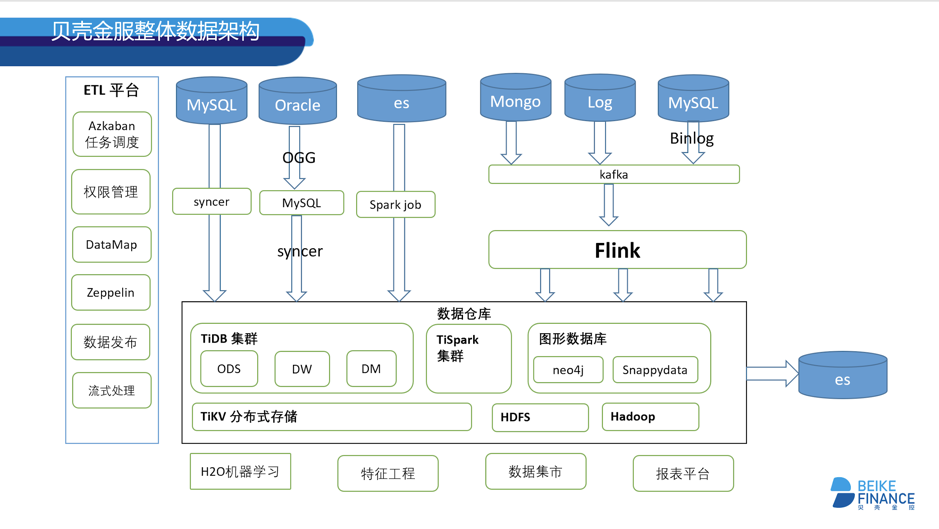

>作者介绍：**李振环**，贝壳金服数据基础架构负责人，目前负责数据平台和企业级数据仓库开发。

## 一、公司介绍

贝壳金服是专注居住场景的金融科技服务商，起步于 2006 年成立的链家金融事业部，并于 2017 年 3 月正式独立运营。贝壳金服聚焦于居住场景，在租赁、买卖、家装、安居等场景中为用户提供定制化的居住金融服务。贝壳金服以独家大数据与场景风控能力见长，致力于解决居住金融需求，以 Fintech 驱动产业升级，让每个家庭都能享受高品质的居住生活。截至 2018 年底，贝壳金服业务已覆盖全国 90 多个城市及地区，为超过 130 万用户提供了金融服务。

## 二、项目背景

贝壳金服数据中台使用 TiDB 和 TiSpark 平台，基于 Syncer 将业务数据实时从 MySQL 备库抽取到 TiDB 中，并通过 TiSpark 对 TiDB 中的数据进行数据分析处理，供上游业务消费，现已服务于 70 多名数据开发人员。**现有集群已经使用 100 多个 Syncer 同步上游 MySQL 数据，目前已经达到 4.7TB 热数据，上百张离线和实时报表。由于机房调整，数据中台也需要同步迁移到新机房，结合 TiDB 的特性，我们探索了一种在线不停机迁移机房的方式。**

TiDB 是一个分布式 NewSQL 数据库。它支持水平弹性扩展、ACID 事务、MySQL 语法，具有数据强一致的高可用特性，是一个不仅适合 OLTP 场景还适合 OLAP 场景的混合数据库。而 TiSpark 是为解决较重的 OLAP 需求而推出的产品。它借助 Spark 平台，同时融合 TiKV 分布式集群的优势，和 TiDB 一起为用户一站式解决 HTAP 的业务需求。TiSpark 依赖于 TiKV 集群和 PD 组件，使用同一个数据源，减少对于 ETL 工具的维护，并且可以使用 Spark 进行复杂查询计算。

图 1 贝壳金服整体数据架构图

## 三、业务类型

由于原有 MySQL 数据库提供服务非常吃力，使用 100 多个 Syncer 同步上游的 MySQL 数据，而 TiDB 作为一个数据中台，主要使用 TiSpark 在做查询。

## 四、集群规模

| 组件 | 数量 |
|:-----|:---------|
| TiDB | 4 |
| TiKV | 9*3（物理机\*实例数）| 
| PD | 3 |
| 数据量 | 4.7 TB+ |

图 2 集群拓扑图

## 五、迁移实践

### 5.1 迁移业务挑战

本次数据迁移主要有两个关键因素：

1. **尽可能减少对业务的影响，业务方希望服务不能中断超过 1 小时。**

2. 由于跨机房网络带宽有限，并且与线上业务共用跨机房网络专线，在迁移过程中需要能控制迁移速度，在白天线上业务繁忙时以较慢的速度迁移，等到晚上业务空闲时加快迁移速度。另外网络运维同事如果发现流量过载，为了不影响其他业务正常网络资源使用，可能随时限制正在迁移的网络带宽，切断迁移网络连接，**因此迁移方案必须要支持“断点续传功能”**。

### 5.2 迁移方案设计

本次迁移最初设想了三套方案（如下），最终通过技术考察和验证，采用了技术上更有优势的第三套方案。

**方案一**：只使用 Syncer 在新机房同步 ODS（Operational Data Store 操作性数据存储）数据，然后从 ODS 数据再次全部计算 DW 和 ADM 层等数据。此方案需要迁移的数据最小，但是只从 ODS 计算出所有的其它数据是不现实的。其中很多拉链表（拉链表是数据仓库的数据模型设计中常用的数据模式，该模型记录历史，通常记录一个事务从开始，一直到当前状态的所有变化的信息）的数据都是基于历史时间点计算出来的结果，由于 TiDB 目前版本刚刚开始支持部分分区表功能，不能马上用于生产。并且历史数据没有分区备份，历史的拉链数据无法真实还原。另外此方案业务迁移成本也很高，两边需要不断校准数据，查漏补缺，重新计算所有非 ODS 层数据计算量也过大，导致迁移时间和大量人力投入。

**方案二**：在某个时间点将老机房数据 Dump 出来，全量导入到新机房。之后再开启 TiDB 集群的 Binlog 增量同步老集群数据，待新集群慢慢追上老集群之后再迁移业务。这个方案中 Dump 数据无法实现单库 Dump。因为 Dump 出来的 Position 值不一样，而且有的表没有主键，多次导入会导致数据重复。因此全量 Dump 所有数据是一个很“重”的操作，Dump 后的大文件传输也存在无法断点续传的问题。具体存在问题如下：

+ 锁问题：全量备份时，需要对库进行加锁操作，如果数据量很大，备份时间较长，可能会影响业务。
+ 备份失败可能性较高：如果数据量较大，比如对 2T 的数据进行备份，可能会达到 3h 以上的备份时间，如果备份失败，那么这次备份就相当于不可用。
+ Binlog 增量同步延迟问题：如果上游 MySQL 压力较大，或者跨机房的网络带宽成为了瓶颈，那么增量同步可能追不上，Binlog 同步无法控制速度，断点续传也需要人工参与。
+ 最终数据校验任务较重：数据迁移完成之后，需要对上下游数据进行校验，最简单的方式是业务校验和对比上下游标的行数。或者使用 pt-toolkit 工具进行数据校验。
+ 停业务风险：在机房迁移完成后，业务需要停止，等待同步和数据校验完成才可以启动。

**方案三**：采用 TiDB 原生的 Raft 三副本机制自动同步数据。在新机房添加 TiKV 节点，待数据均衡之后再下线老机房 TiKV 节点。老机房 TiKV 下线完成则表示数据迁移完成。此方案操作简单，业务影响在分钟级别。网络层面可以通过 PD 调度参数控制 TiKV 迁移速度，Raft 副本迁移如果网络中断会自动重新传输。具体优点如下：

+ 迁移数据期间不会影响线上业务，整个迁移过程都是在线提供服务的。
+ 迁移效率非常高。一个机房内部 balance 3T 的数据只需要 10 小时左右，跨机房迁移一般受限于网络。
+ 容错性高，没有很多的人工干预，集群高可用依然保留。

### 5.3 机房迁移实施过程

操作描述：

图 3

1. 配置防火墙，将两个机房所需端口开通。

2. 新机房扩容 3+ 个 TiKV，3 个 PD，2+ 个 TiDB。

3. 执行下线 TiKV 命令，一次性下线所有旧机房的 TiKV。

4. PD Leader 手动切换到新机房，业务迁移到新机房，等待 TiKV balance 完成之后，下线旧机房的 TiKV、PD 和 TiDB。

整个过程人为操作较少，耗时较长的只有 TiKV balance 数据的过程，可以调整调度并发度来加速整个过程。

**注意事项：**

1. 新机房的 TiKV 节点尽量要多于旧机房，否则在下线过程中，可能由于集群 TiKV 实例数比以前要少，导致 TiKV 压力较大。

2. 跨机房迁移，网络延迟不能高于 3ms。

3. TiKV 下线过程中， Region Leader(s) 会逐渐迁移到新机房，这时业务已经可以并行的迁移，将压力转移到新机房去。

### 5.4 在 TiDB 中的二次开发

1. Syncer 二次开发：在贝壳金服，有 100 多个 Syncer 实时同步线上数据，由于 TiDB 语法与 MySQL 语法不是 100% 兼容，特别是上游修改 DDL 操作，比如从 INT 改成 VARCHAR，会导致 Syncer 同步失败。在贝壳金服实战中，优化了失败恢复工作，监控程序会监控失败原因并自动化恢复 Syncer 错误。

2. TiSpark 二次开发：TiSpark 无法实现 TiDB 数据插入和删除。贝壳金服基于 TiSpark 二次开发封装了 TiSpark，因此可以实现 TiSpark 直接原生 SparkSQL 执行 Insert 、Create 操作。实现新增 executeTidbSQL 实现 delete、update、drop 操作。增加 TiSpark View 的功能，弥补现阶段 TiDB 不支持 View 的问题。

3. TiSpark 权限控制：TiDB 和 TiSpark 都无法实现基于组和大量用户的权限控制。贝壳金服基于 Catalyst 自研了一套兼容 TiSpark SQL 和 TiDB SQL 的 SQL 解析引擎，并基于此引擎之上开发权限验证、权限申请、权限审批、数据发现等功能。 

## 趟过的坑

1. Region 过多：由于 TiDB 目前版本暂不支持 Partition 功能，我们的 job 都是需要支持可以重复跑，因此有一些业务会直接先 drop table 然后再创建 table。默认情况下每次创建 table 都会申请一套 Region，导致现在单台 TiKV Region 数过载。

2. DDL 排队执行：有一次对一个 2 亿级别的大表添加索引，希望提高基于时间查询的效率，结果导致集群业务中所有 drop table 、create table 相关 job 全部卡住。最终了解到 DDL 是串行化操作。Add index 大操作让其他 DDL 操作 pending，手动 kill add index 操作后集群恢复。**目前 TiDB 2.1 版本已经将添加索引操作和其他的 DDL 操作分开，这个问题已经解决。**

3. Syncer 恢复自动化：TiDB 现在对某些 alter column sql（字段从 INT 改为 VARCHAR 的跨类型修改操作）依然不兼容，因此在上游执行不兼容 SQL 之后，Syncer 同步会失败。修复过程需要使用到 Syncer 同步 position，DB name，table name。获取这些信息之后可以一个 shell 自动恢复 Syncer 同步，但是上面的三个信息输出不够友好，需要人为查看才能获取到。如果在失败 Syncer 日志中可以格式化输出以上三个信息，Syncer 恢复可以更自动化。**目前新版本的 Syncer 已经解决这个问题。**

4. Decimal Hash Join 结果不正确：在使用两个 Decimal 字段做表 join 时，发现使用 limit 可以查询出来数据，不 limit 返回无结果。查看执行计划发现 limit 之后改变了执行计划，将 HashLeftJoin 改为了 IndexJoin。调查之后发现 Decimal 在计算 hash 值时返回结果不正确，导致相同 Decimal 无法 join 上。可以使用 hint 强制使用 IndexJoin 来解决此问题。**目前 TiDB 2.0.11 及以上版本已经解决了这个问题。**

5. 列式存储：由于现在 TiDB 是行存，即使是 TiSpark 读取 TiDB 一个字段也会在底层取出此记录所有值，导致性能问题。在 OLAP 大宽表场景中使用列式存储性能会显著提升。

## 后续计划

**机房顺利迁移完成后，后续计划升级到 TiDB 3.0，利用 TiDB 3.0 产品路线图中提供的新功能来优化和提升使用效果：**

+ **开启 Region merge 功能，自动在后台合并空 Region 从而减少 Region 的数量。**
+ **使用 3.0 所提供的视图 View 和分区 Partition 功能。**
+ **尝试 PingCAP 新一代的列计算/存储引擎 TiFlash ，提升 OLAP 宽表查询性能。**

此外，在应用 TiDB 支持业务的过程中，贝壳金服的技术团队也通过自身对数据中台的业务理解和技术实践，打磨出了以下配套工具及平台：

+ 基于 TiDB 的数据发布平台
+ 基于 TiDB 的元数据管理平台
+ 支持 TiSpark+TiDB 的权限管理系统
+ 基于 Flink + TiDB 的在线 SQL 流式处理平台

在上面这些技术成果的基础上，贝壳金服的技术团队正在做未来的数据中台技术栈演进规划，即基于 TiDB + Azkaban + 自研的数据质量平台。