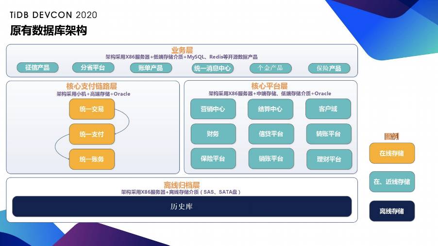
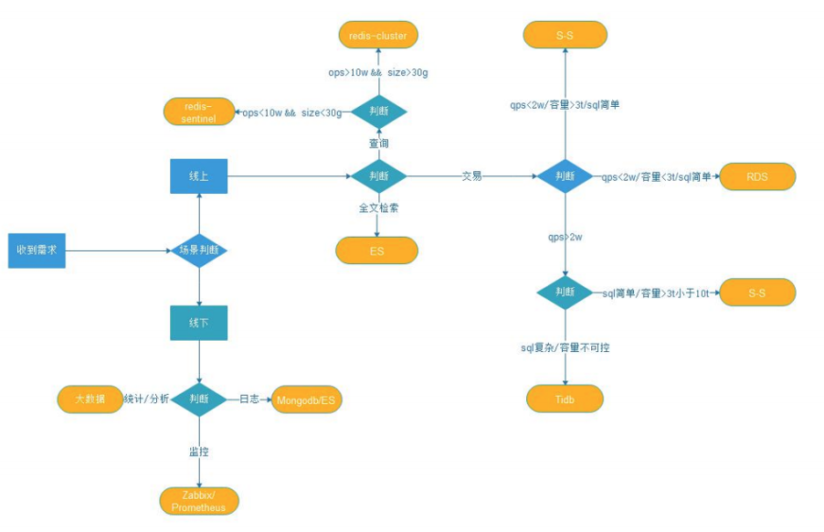
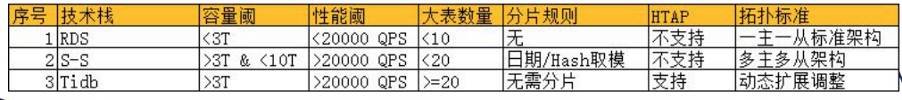
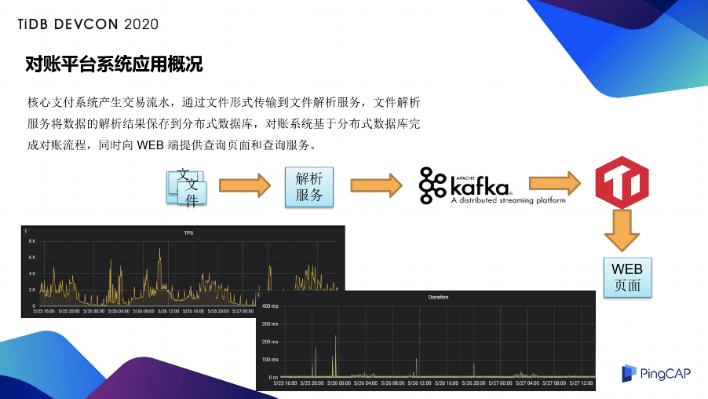
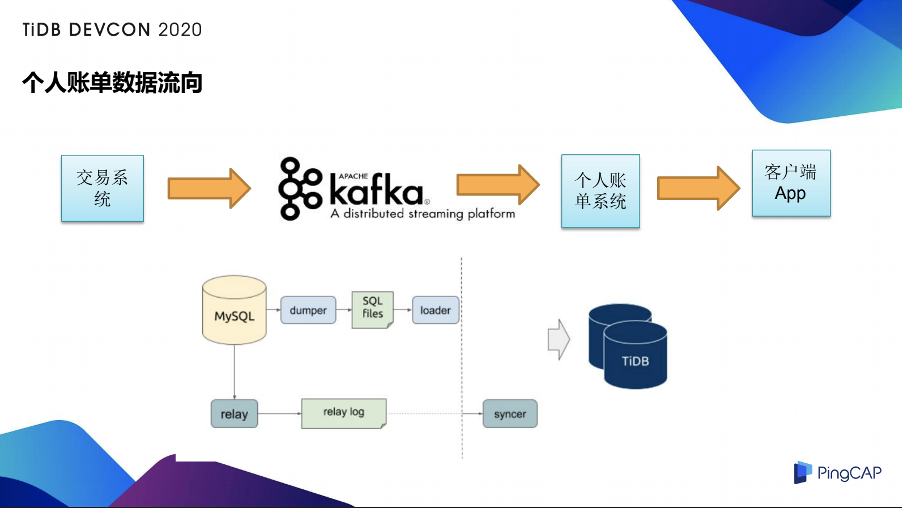
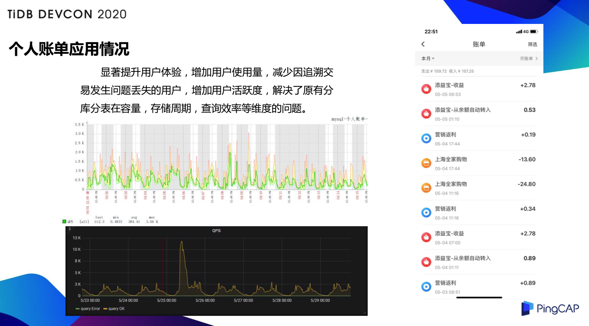
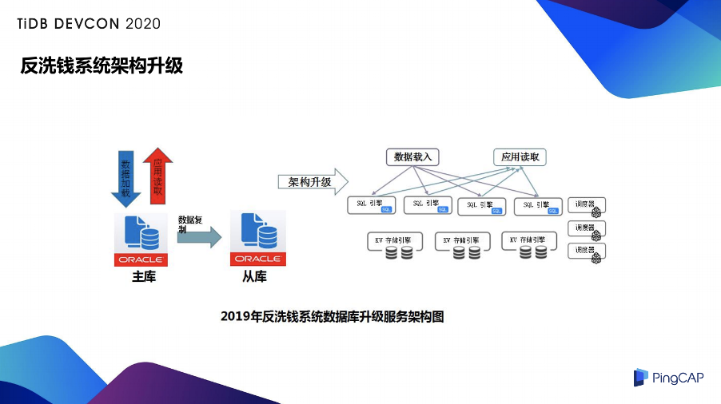
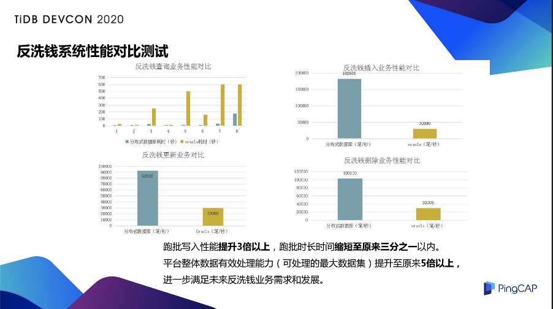
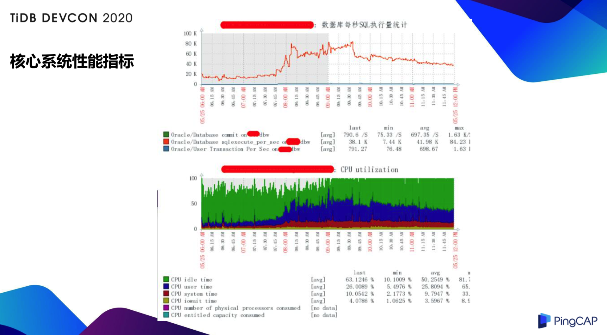

>作者介绍：刘宇，天翼支付资深架构师。

天翼电子商务有限公司（翼支付）成立于 2011 年 3 月，是中国电信股份有限公司的全资子公司、中国人民银行核准的第三方支付机构、中国证监会核准的基金支付结算机构，是中国电信布局互联网金融的重要板块，是行业领先的创新型金融科技企业。业务覆盖全国近 400 个主要城市，注册用户超 5 亿，合作商户超过 1000 万，覆盖餐饮、娱乐、交通出行、电商购物、民生缴费，通信交费等多个生活场景的便民服务。秉承“响应监管、服务民生、资源共享、合作共赢”的理念，致力于打造安全、便捷、时尚的支付解决方案。

为了在有限的时间里，让大家了解更多的内容，本次分享将按照数据库架构的演进思路，来介绍 TiDB 在翼支付的演进过程。希望可以给大家在使用分布式数据库 TiDB 的时候，能够提供帮助或者启发。如果当中有存疑的地方，欢迎大家来多指正、多交流、多探讨。

## 原有数据库架构与数据库评估模型

先看一下我们现在的数据库架构：

按照业务主要分为四层：

首先是业务层，业务层的含义就是指自身为具体的产品或者工艺模块，需要调用核心电路或者核心平台来实现自己的功能。这部分的架构主要是采用了 X86 服务器和低端存储介质+MySQL、Redis 开源的产品，这一层在实现业务注册的同时会最大程度的减少成本。

第二层是核心支付链路层，是业务的核心层，如果出现问题，将会导致整个平台的交易失败，因此这层会最大保证数据安全、数据可用性以及一致性。它的架构主要用小机+高端存储，以及 Oracle 来实现的。

第三层是核心平台层，指的是辅助核心支付链路完成整个交易流程的平台，或者是自己具备一些自身能力的平台，该层在保证性能及稳定性的同时会减少高端存储的使用成本。

最后就是离线的归档层。根据我们目前的架构划分在 TiDB 的落地过程中，我们选择的路线是从业务层开始，到核心平台层，再往核心支付链路层。目前，业务层以及核心平台层都进行了 TiDB 的推广使用，在过程中，虽然遇到了一些小问题，但总体来看，在数据一致性等关键点都是没有出现过问题的。其它关于性能解读和参数调优问题也都得到了妥善的解决。并且，在推进过程中，我们针对分布式数据库建立了一套应用规范，包括最佳研发的应用实践、新老架构并行方案等来降低风险，保障运行。

上图就是我们建立的用来快速进行数据库选型建议的数据库评估模型。现在对于新采用的项目，在关系型数据库的选型上，已经不再考虑使用 Oracle 了，而是在内部的 RDS、Sharding-Sphere、TiDB 中做架构的选型。进行了大量的测试，包括 TPCC、Sysbench、业务测试以及充分的和原厂进行沟通后，最终确定了中国电信翼支付基于业务场景的数据库选型评估模型。

下面这个表里显示的，我们主要就是三类技术站，按照容量阀、性能阀、大表的数量、分区规则、 HTAP，以及拓扑结构这几个纬度进行筛选。

- 首先是容量上，比如说我的容量小于 3T ，QPS 小于 20000，大表小于 10 个，这种场景就会使用 RDS；

- 如果是 3T 到 10T 之间，QPS 超过 20000，大表比较少，有明确的分表规则，没有统计类的查询的场景，会选择 Sharding-Sphere；

- 容量大于 3T，QPS 至少大于 20000，大表数量也比较多，而且分片规则也很难定义，或者是一些混合场景，这种就会选择 TiDB 。

这里就是我们后面进行案例选择时能够做出快速选型的一个建议。

## 数据库演进路径

在业务选取和应用上，我们从边缘做起，首先从历史归档库进行产品的基础功能和性能验证；然后从外围切入，比如说选取统一消息、营销业务进行实际业务切入；然后再向重要的业务进行过渡，比如选取征信业务、账单业务、账目、以及结算的对账类的业务进行推进，这些是我们现在已经推进的内容。接下来我们规划的要做的就是向核心进发，在 CIF、支付、交易、账务体系中选取试点业务。

在业务应用和切换的原则上有如下几点：

- 采用业务双写，对应用和数据库的适配层进行改造，并行运行，逐步进行流量切换；

- 对数据要求是不能丢也不能错；

- 敏感服务在双写验证后，需要快速的切换到 TiDB 的架构上；

- 迁移的过程中，随时能够切换到原有的架构；

- 对部分分库分区的表要进行合表。

下面就详细介绍下在 TiDB 使用过程中的实践和优化。**TiDB 在翼支付的应用场景主要包括 OLTP 和一些混合场景，大部分场景都是在 TB 级数据库的业务规模。**

## 对账平台系统应用

对账平台（支付系统与渠道间的对账）包括两个纬度，一是信息流的勾兑，即业务对账/交易对账，主要是就收单交易的支付信息与银行提供的信息流文件进行勾兑。信息流的勾兑能发现支付系统与银行系统间的掉单，两边由于系统间的原因导致同一笔交易支付金额不一致或者支付状态不一致。二是资金流的勾兑，即资金对账，主要就收单交易的支付信息与银行提供的资金流信息进行勾兑。资金流的勾兑能发现支付系统在银行的帐户资金实际发生的变动与应该发生的变动的差异。这个系统涉及到多张表，单表的规模超 10 亿，整体数据规模在 8T+，业务应用的逻辑相对复杂，并发场景中等，根据架构选型图及评估模型来选择的话，是比较适用于 TiDB。

### 对账平台的应用概况

这是它的数据流向图，首先是核心支付系统产生交易流水，通过文件形式传输到文件解析服务，文件解析服务将数据的解析结果保存到分布式数据库，对账系统基于分布式数据库完成对账的流程，同时向 WEB 端提供查询页面和查询服务。

下面两个监控图是对账平台上线后的监控图，日常的（TPS）和响应时间，目前 TPS 日均在 7000 以下，相应的响应时间也满足我们的需要。

### 对账平台系统应用价值

对账单系统平台我们选取的三个最常用的对账渠道来进行的比较：

- 银联支付宝通道，以前使用 MySQL 整体的用时是两分钟，现在使用 TiDB 整体的用时是 40 秒，性能提高了 300%。

- 银联无卡快捷通道，原来使用 MySQL 用时是 3 到 5 分钟，目前使用 TiDB 是 1 到 2 分钟，性能提升也达到了 200% - 300% 的提升比。

- 微信支付，原来用 MySQL 用时是 3 分钟，目前使用 TiDB 大概是 1 分钟，性能也提升了 300%。

**这个系统现在对财务部门运营的处理能效都得到了很大的提升，大大降低了技术团队的工作复杂度。我们上线以后，内部对 TiDB 目前的表现还是比较满意的。**

## 个人账单系统应用

个人账单系统在翼支付 APP 客户端内为个人用户提供所有交易的账单数据的管理、查询功能，以及数据的分类和统计功能，以便用户能更好的掌握自己通过翼支付所做的所有的交易。

数据来源主要来自于 kafka 队列的接收，来源于交易系统。

个人账单数据原来是存在 MySQL 中，使用 MyCat 进行分库分表的策略，但是仍然解决不了日益增长的数据和存储空间不足的问题，只能保存一年的数据。同时个人账单数据的主表数据量大概在 80 亿，无论是加列加索引，使用在线的 pt-online-schema，或者 gh-ost 都会面临着拷贝一张临时表时间过长，面临磁盘打满，或者是中间处理的时间过长的问题。

根据评估模型，也是属于典型的一个 TiDB 的适用场景，按照应用切换原则短时间内进行了应用切换和迁移工作。

这里是个人账单的数据流向图。首先是交易系统会把交易的信息同步到 kafka 里，然后会消费到个人账单系统里面，经过个人账单系统的处理展示到 APP 端。这里我们选用了 TiDB 的 DM 进行了 MySQL 迁移到 TiDB， DM 工具既可以支持全量备份文件，将 MySQL 的数据导入 TiDB，也支持通过解析执行 MySQL binlog 的方式来增量同步到 TiDB，同时它也满足了我们多个 MyCat 的分库分表，需要合并到同一个 TiDB 一张表的场景。DM 提供了比较好的支持，大家可以看一下 DM 的工作原理图，上面就是数据的全量迁移的功能，下面的数据流就属于一个增量数据同步的过程。

对于全量的数据迁移， DM 首先使用了 dumper 单元从上游的 MySQL 将表结构与数据导成了 SQL 文件，然后通过 loader 单元读取这些 SQL 文件并同步给下游的 TiDB。增量同步的部分首先使用了 relay 单元作为 Slave，连接到上游的 MySQL 并拉取 binlog 作为 relay log 数据导到本地，然后通过 syncer 单元读取 relay log 并解析成 syncer 的语句同步到下游的 TiDB，这个增量的过程就和 MySQL 的主从复制很相似。

我们的迁移是等 DM 把全量数据以及增量都同步到 TiDB 后，经过多种验证它的数据一致性，之后选取一天进行了短暂的写入暂停（大概是 10 分钟左右），交由业务时业务其实是做了一个双写的改造，这时把双写开关打开，同时会写 TiDB，逐步写把读慢慢切过去，同时会校验 TiDB 和 MySQL 在双写时的数据是否一致，确认没有问题的时候，后续就把 MySQL 的同步断掉，然后就完成了一个迁移。

### 个人账单应用情况

大家可以看一下监控图，上面的是从 Zabbix 上取出来的，因为它原来使用的是 MySQL 所以我们最早使用的是 Zabbix 的监控， QPS 平时最大的大概达到 3 - 4 K，下面的是 TiDB 的图。大家可以看，平时 QPS 是差不多的，但是在活动的时候 QPS 会增加好几倍，这时使用 TiDB 也没有发现问题，说明在流量增加好几倍的时候也是可以应对这种系统处理的。

**显著提升了用户体验，增加用户使用量，减少因追溯交易发生问题丢失的用户，增加了用户活跃度，解决了原有分库分表在容量、存储周期、查询效率等纬度的问题。**

## 反洗钱系统应用

随着监控数据的数量和类型发生许多变化，反洗钱业务需求数据日益增大，监控的范围不断的扩大，目前平台面临以下几个方面的问题：

- 数据库批量处理系统出现显著性能瓶颈；

- 统计分析系统不满足响应反洗钱监管的时效性要求；

- 数据库性能无法进行性能扩展。

监管部门对处理时间的要求是 T+1 的时间内必须要完成可疑的规则和风险评级的计算要求。目前跑批单的任务时间大概都在几百分钟，整体任务每天处理的时间都会在 15 小时，随着数据量越来越大，就满足不了这种性能需求，所以就有改造的需要。

由于监管的严格要求，所以反洗钱系统在性能上也提出了比较强的要求：

- 满足 SQL2003 的标准；

- 多表关联，能够查询数据集 1 千万以下，响应时间 5 秒以内；

- 数据文件批量加载，20G 大小，大概不能超过 30 分钟；

- 亿万数据中要删除 50 万数据，响应时间要在 10 秒之内；

- 3 亿数据中删除两千万，也要有 10 秒之内的响应时间；

- 3 亿数据量更新 100 万，响应时间 5 分钟左右。

评估下来使用 TiDB 是能够完成这种性能要求的，所以就选择了 TiDB 的方案。

我们按照 TiDB 的形式进行架构升级，从原来的 Oracle 同步到 TiDB 使用的是（OGG for MySQL client ) 来完成的。还有一部分数据是在大数据平台，我们使用大数据的发布功能，从 Hive 直接去同步到 TiDB。

这里我们在反洗钱系统上做了四项性能对比的测试，包括反洗钱查询业务性能对比、反洗钱插入业务性能对比、反洗钱更新业务对比，以及反洗钱的删除性能对比。**从测试结果来看，整体跑批性能提高了 3 倍以上，跑批时间也缩短到原来的 ⅓，平台整体有效处理能力提升到 5 倍以上，进一步满足了反洗钱的需求。**

## 向核心进发

最后介绍我们下一步的目标。下一阶段我们将会扩大应用范围，把业务发展快、规模大的核心链路的系统逐步往 TiDB 迁移。主要是目前外部环境发生了很多的变化，未来可能在数据库上也会做很多的限制，所以我们必须提前做一些准备。

另一方面也是出于性能的考虑。大家可以看这个监控图，是翼支付的一个活动中，核心系统的 QPS 和 CPU。可以看出来，在活动的高峰我们使用的系统是两台高端的小机和高端存储，其中一个单节点的执行量大概在 8 万 4，这时候 CPU 的最小贡献在 10%，说明我们的性能已经基本达到上限了，一旦后面有业务增长，数据规模再增长的时候，性能可能会出现一些瓶颈，小机设备难以扩容，这也是核心链路上考虑分布式数据库的原因。因此我们可以利用 TiDB 的分布式特性进行水平的扩展，使业务得到一个快速的扩容。当前还处于一个调研阶段，由于核心系统对稳定性和性能的要求也是对 TiDB 数据库的挑战，这是我们下一步的目标。

我们目前的核心库都会有上亿数据量的规模，单库总数据量 10T 以上，在探索的过程中，我们也产生了很多的构想，主要是核心业务可能停机时间非常短或不能停，难度会非常高。

这方面我们可能需要在开发模式上进行更新，包括：

- Oracle 和 TiDB 共存的双模式开发；

- 灰度或者双写的切换过程；

- 具备业务校验能力；

- 模块和批次进度的设计。

在运维管理上也会有一些更高的要求，包括窗口的切换操作的过程、回退的预案等。

## 携手趟坑

最后，分享一下这些年跟原厂一起趟过的坑，希望大家可以给大家参考，避免走一些弯路。

**1.insert 周期性超时。**

早期 2.0 版本某业务出现过 TiDB 的 insert 约每秒 2W 周期性零星 200 毫秒的超时，排查原因由于 Region 数量快速上涨， Raftstore 单线程工作带来性能瓶颈，临时增加 Heartbeat 的周期来解决，后期升级到 3.0.8 的版本，通过 Raftstore 多线程工作已解决此问题。

**2.执行计划不准，走错索引。**

早期的 2.0 版本出现过若干次 TiDB 的统计信息不准导致执行计划出错，业务受影响。我们尝试在每小时进行一个全库表的分析，但是这个问题仍然会间歇性的出现。目前是通过升级到 3.0.8 基本解决掉了。

**3.备份并发数过高，导致备份时间的业务偶发超时。**

在某个业务使用 TiDB 3.0.8 版本，库容量约 8T，凌晨 3 点发起备份，造成业务偶发超时。经排查发现是备份引起，因为 TiDB 大于 TiKV 备份时占用业务网带宽太大，通过减小备份并发来解决。

**4.TiDB+keepalived 的问题。**

TiDB 的负载均衡策略使用 HAproxy+keepalived 方案，keepalived 使用 2.0.18 的版本发现偶发丢包，造成业务超时。后来替换为低版本的 1.2.8 后解决，这块建议希望 TiDB 能统一访问层也能自己实现，多一个外部组件就多了一个故障点。

**5.乐观锁和悲观锁的问题。**

TiDB 3.0.8 之前的版本使用乐观锁模型，从 MySQL 迁移过来的应用，在事物中执行 DML 语句时不像 MySQL 那样使用行级锁锁定相关记录行，只有在事物真正提交时才会检查写冲突，这些虽然可以通过应用改造来解决，但也确实造成了迁移成本的提高，对开发人员造成了一些困扰。但 TiDB 4.0 版本的悲观锁特性比较成熟，也让我们对核心迁移有更多的期待以及更好的基础。

最后引用鲁迅先生的一句话，世上本没有路，走的人多了便成了路。架构落地的过程探索是非常艰辛的，但这也值得每一个企业去做，在当下这个时代，不管企业的规模如何，都要学会借助开源的力量，避免去重复的造轮子。如果企业规模小，可以直接用开源软件来解决痛点，如果企业规模大，可以投身进入开源者软件的开发，成为贡献者，同时也解决自己的问题。

每一个看似轻松的背后都有不为人知的努力，每一个看似光鲜亮丽的背后，都有不为人知的付出。分布式数据库建设之路道阻且长，我们翼支付的人有信心也有动力把他做好。

>本文整理自刘宇在 [TiDB DevCon 2020](https://pingcap.com/community-cn/devcon2020/) 上的演讲。