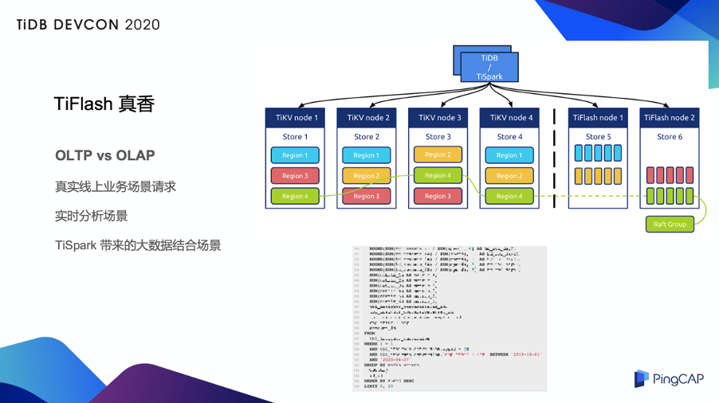

>作者介绍：徐嘉埥，Bigo DBA，TUG 华南区大使。

Bigo 于 2014 年成立，是一家高速发展的科技公司。Bigo 基于强大的音视频处理技术、全球音视频实时传输技术、人工智能技术、CDN 技术，推出了一系列音视频类社交及内容产品，包括 Bigo Live、Likee、imo、Hello 语音等，在全球已拥有近 4 亿月活用户，产品及服务已覆盖超过 150 个国家和地区。

## TiDB 4.0 在 Bigo 的使用情况

我们在今年年初开始使用 TiDB 4.0 测试版本，在测试的时候搭建了一个测试环境的集群，它始终会跟随着 TiDB 的最新版本迭代，所以我们前不久也迅速升级到了 [4.0 GA 版](https://pingcap.com/blog-cn/tidb-4.0-the-leading-real-time-htap-database-is-ready-for-cloud/)。

对于 TiDB 在生产环境的上线，我们非常勇敢，也是非常大胆的部署了 2 套生产环境集群，这两个集群规模不算非常大，更多的是偏分析类的业务。一套是网络监控的分析，特点是数据量增长大，且 SQL 偏分析类，同时对响应时间由一定要求；还有一套是做大数据的下游存储，大数据分析后的数据提供线上的实时服务来使用，单表数据量通常也不小，大多是运营类的后台汇总业务。我们使用了 [TiUP](https://pingcap.com/blog-cn/tiup-introduction/) 进行集群部署，这也是官方相对比较推荐的部署方式，简单来说 TiUP 这个部署的方式比之前的 TiDB Ansible 好很多，解决了我们一大部分的问题。

另外，我们使用 TiDB 4.0 更多的组件和功能，包括 Pump、TiFlash 等等。由于  Bigo  的业务覆盖全球，所以我们希望在全球各个大洲（或者说各个大区）都能够部署上自己的服务，而服务的跨大洲延迟，对于一部分业务来说是不可接受的，因此我们会通过 Pump 之类同步的方式，来进行各洲之间的数据同步。关于 TiFlash，稍后我会花更多篇幅分享实践经验，熟悉我的 TiDB 社区伙伴们应该都知道，我总在各个场合夸“TiFlash 是真的香”。

## 我们为什么会使用 TiDB 4.0？

**一方面业务上有新的需求，通常作为 DBA 我们会尽量去满足业务的需求。**

比如 TiDB 4.0 支持通过字符集排序规则来控制大小写是否敏感，在此之前我们是没有办法控制的，所以说经常有业务同学向我们吐槽说你们 TiDB 的服务部署了之后，字符级的排序就跟“假”的一样，当然确实之前好像也是假的，因为没有办法控制。

还有一些电商、金融平台会使用悲观事务，而 TiDB 4.0 实现了 [悲观事务](https://pingcap.com/blog-cn/tidb-4.0-pessimistic-lock/)，对于业务来说不需要那么关注一致性或者说数据冲突之类的问题了。

**另一方面是运维方面的需求。**

我们现在使用 TiUP 的包管理的方式来部署 TiDB，包括升级迭代，之前我们用的是 TiDB Ansible，需要做授权认证等一系列的工作，而且它通过 playground 也没有那么灵活。而 TiUP 做得更好的一点就是它更灵活，它的包管理机制不需要每一次授权都需要找最底层的 SaaS 团队让他们去开一些权限，会减轻更多的交互。而且我们可以通过 TiUP 来查看真个集群的状况。

还有就是备份功能，我们很多核心业务一直想在 TiDB 上做一些尝试，但是由于之前只能通过 Mydumper 或者磁盘快照等等，可能对 DBA 运维上不那么友好的方式去进行备份，现在 TiDB  4.0 已经有了非常完善的备份功能，因此我们会尽一切可能地去推动 TiDB 4.0 在更多业务中上线。

**当然最重要、最核心的理由是 TiFlash**。TiFlash 从架构上来看，在 KV 旁边多了一个列存的副本，这个副本当然也通过 MVCC 之类的可以做一致性的读取，更重要的它是一个列存。

按照我们之前的理解，我们会把线上或者我们会把所有的请求分为 OLTP 和 OLAP 这两类，那些灌输的知识都会告诉我们，线上实时的业务请求都是 OLTP 的请求，大数据的汇总都是 OLAP 的请求，但是我们真真正正的去想一想，真实的线上业务场景的请求真的只有 OLTP 吗？或者说所有经过大数据汇总的数据真的只有 OLAP 的查询吗？其实未必。很多业务场景上会有一些运营类的需求，会有实时报表类的查询。如果说我们用以往大数据的那一套东西，通常会是一个 T+1 或 T+N 的时间，做不到实时。但是线上业务需要去管理平台做汇总类的查询，有时候就直接把它扔到了线上TP 类的存储上去，当然有的业务会通过改索引、进行数据异构来做。但现在 TiFlash 给了我们另一种选择，就是通过增加一个新的列存副本来解决实时分析的场景。

在上图的右下角，我列了一个 SQL（处理了一些敏感信息），大家可以看到这个 SQL 有 100 多行，它有一堆的表和 groupby，还有一些条件，在上面还做了 SUM 计算。这个是实时业务的请求，通常放在线上的 MySQL 上或者放在只有 TiKV 引擎的 TiDB 上，可能要跑到分钟级甚至更多。在这个业务上面我们直接勇敢尝试了 TiFlash，事实证明直接使用 TiFlash 的引擎，我们可以把这样的请求直接降到 50 秒左右，这对于业务会更加友好，并且它的数据是实时的，因为 TiFlash 的每一个 Region 都是通过 TiKV 的 Region 来进行同步，并通过 Raft 保证一致性。

除此之外，TiDB 本身还可以和我们已有的大数据进行结合，通过 TiSpark 来直接打到下面的引擎层，包括 TiKV 和 TiFlash。

当然做了这样的优化以后，业务方通常还会看着我们说：DBA 大佬们能不能再给力一点？于是我们向 PinpCAP 技术团队寻求了一些帮助。是不是可以再给力一点呢？答案是可以的。

**在 TiDB 4.0 GA 版本里，TiFlash 增加了两个新的算子，它可以把更多算子进行下推，同时把更多 Region 进行合并，也就是说多了两个相应的优化参数，这两个优化参数虽然默认是关闭的，但是我们可以通过设置将它打开，打开以后提升效果会非常明显，至少在我们的测试中提升了一倍以上，从原来的 25 秒稳定在了 11 秒到 12 秒。这样下来的话，实际上已经和线上的实时查询差距并不大了，也就是说我们拥有了非常实时的线上分析能力。**

所以现在我们的业务会倾向于选择 TiFlash，而不是选择通过大数据的那一套数据的导入和导出，因为我所有的大数据导入、导出涉及数据管道的链路相对比较长，并且缺乏来回的校验，这也是我们在最终选择引擎的时候选择 TiFlash 的原因。

总的来说，Bigo 整个线上业务的所有的 TiDB  4.0 集群，都会至少配备一个 TiFlash 的副本。对于 DBA 来说，稳定性很重要，而 TiFlash 带来的保证是：至少不会变得更差，即使 TiFlash 的副本挂了，在没有其他 TiFlash 副本的情况下我们也同样可以把算子打到 TiKV 上。这就是我们作为 DBA 去选择 TiDB 4.0 以及选择 TiFlash 的重要原因。

## 基于 TiDB 4.0 我们还会做什么？

### 1. 对于同步场景的 TiCDC 尝试 

我们的业务会有一个多点同步的问题，在多个大洲都有写入。多点同步的问题我们最开始是使用 Pump+Drainer 的方式，但因为我们会有一些多点写入的问题，所以还需要做一些去重之类的改造工作。而现在 Pump+Drainer  本身的部署还有一些可用性的问题，而且资源消耗也比较大，还会产生一些我们并不希望产生的中间 binlog，所以我们试图通过新的 TiCDC 数据同步工具来进行多个 TiDB 以及多个不同数据源之间的同步，我们可能还会再做一些自己的开发，包括解决冲突、数据之间的合并等等。

### 2. 基于 PD 的服务发现

因为整个 TiDB 很多业务部署架构是把 TiKV 和 TiFlash 作为引擎层的部署，TiDB Server 层或者是一个无状态的服务，大部分的业务会接在无状态的服务之上，再加一层类似于 proxy 之类的东西进行转发，以达到负载均衡。这个方法并没有非常优雅，比如将它上接上了容器以后，可能通过容器的弹性扩缩容以及其他的方式来做，就会出现 proxy 无法及时的感知到后端的变化的情况。

一个比较好的方面是 PD 基于 etcd 的一些接口，我们可以直接拿来用，然后从中发现可用的 TiDB 节点，当进行弹性扩容的时候，比如一波流量高峰来临的时候，弹性扩容一个无状态的 TiDB 会非常快，这时 PD 会迅速的发现那个 DB，我们就可以直接从 Client 端发现那个服务，直接把流量打过去。这样可以更快让一个扩容出来的服务快速上线，而这对于业务来说并不需要更多的改造。如果通过传统的方式，我们可能需要当扩容出来的 DB 真真正正的注册到服务以后，还需要再次在 proxy 中进行重新注册，就会拖慢了整个流程。

### 3. 基于 Dashboard 的更多的探索

下图是实际上是 TiDB Dashboard 的一张热点图：

作为一个 DBA，有的时候也会和业务产生一些“对立”的情况，比如业务同学：我没有做请求，我没有任何变化，我的数据没有热点、很均匀。但现在我们有了 [TiDB Dashboard](https://pingcap.com/blog-cn/observability-of-distributed-system/) 以后，我们可以自己看到这个数据是「长什么样」的了。这个热点图横向是时间轴、纵向是各个数据的分区、分片，可以看到这个数据在某个时间、在各个分片上的量。如果再遇到当业务同学说“我的数据没有热点、我的数据完全均匀、我的数据非常 ok”的时候，DBA 就可以拿出一张这样的热点图来，明确指出哪个数据有热点、哪个数据有变化，业务上是不是有什么样的数据的倾向、或者有什么样的数据的变化导致了热点的产生。

很多时候业务同学也并不完全能够掌控自己的数据和变化趋势，有了这样一份“完全的数据快照”会给我们的工作带来巨大的便利。当然 Dashboard 同时带来了更多好处，比如说它更好地检查到慢查询，提供了检查各种日志的方式，我们甚至可以在 Dashboard 上面去一键抓取 Perf 火焰图，然后通过火焰图来分析当前的集群究竟问题出在什么地方。

