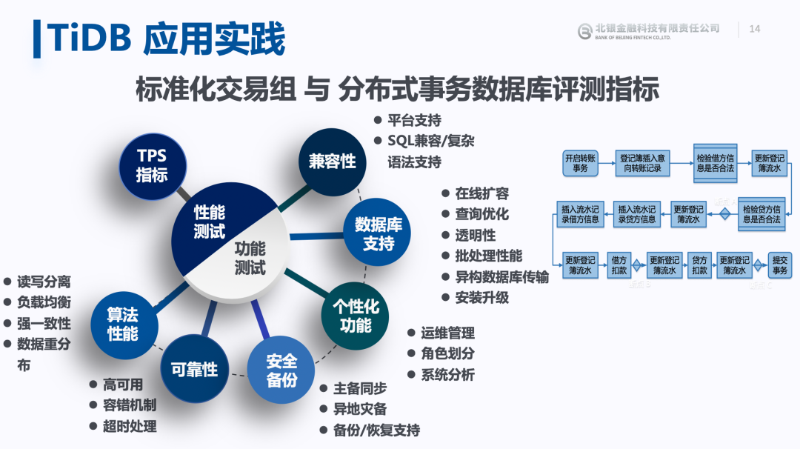
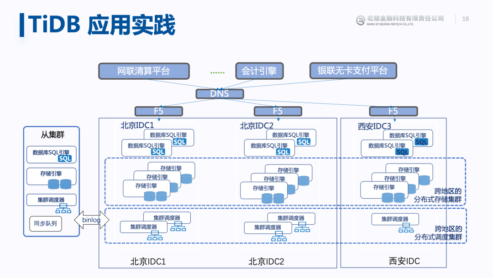
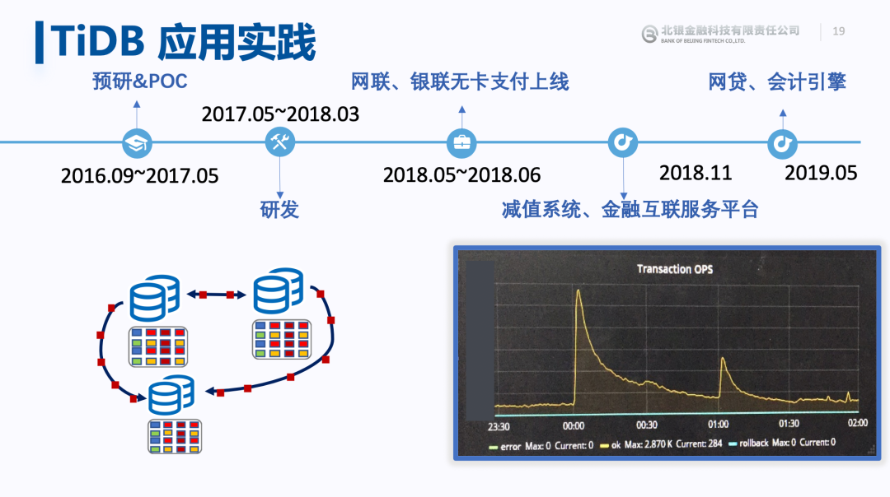
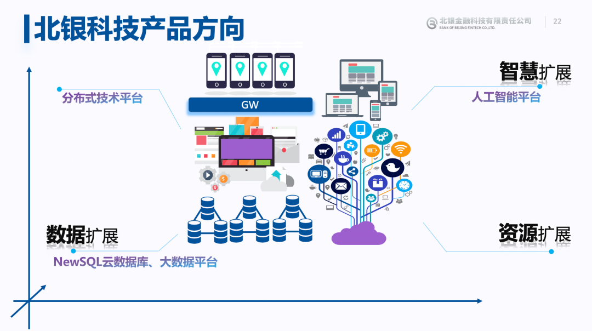
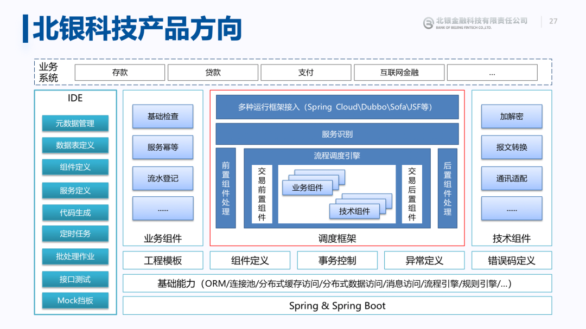

>今年春天突如其来的新冠病毒疫情，在一定程度上改变了人们的生活、工作习惯，给各行各业带来了巨大影响。银行也难逃“池鱼之殃”：传统商业银行的盈利能力、资产和信贷规模都受到了一定程度的影响。疫情期间，人们对线上银行服务的需求激增，原本深受诟病传统银行的技术架构，又一次被推上了风口浪尖。有”危“就有“机”，疫情期间，北银金科云计算应用部副总经理 & 金融业务及解决方案专家于振华老师做客 TiDB 直播间，分享了 TiDB 在金融场景的应用，以下为直播文字回顾。

本文以银行业数据库架构演进为契机，结合商业银行的核心业务，探讨未来商业银行的技术发展趋势和机遇。

## 第一部分：背景介绍

我发现随着时间的推进，金融科技工作者感觉越来越累，因为技术变化是一直存在的，金融科技发展有一个非常快的加速度，并且我觉得未来应该也会延续这种趋势。下面这张图，如果是你能够站上这条曲线，能够追上科技的发展，那就能够利用科技的力量来赋能业务，这就是为什么我们现在这么累，为什么大家感觉科技工作者的节奏越来越快的理解。

具体谈到在业务层面，第一是互联网的业务爆发增长，对系统提出了更高的要求，以往没有互联网的时候，业务可能是恒定的量，有了互联网，有了线上化的模式，需要系统架构有一定的可扩展能力。第二是我们现在做互联网金融产品，就是要快速上线，快速适应市场的行情，具备快速交付能力。第三就是要做到自主可控，做到金融安全可以把控，我们强调做一套生态，从底层做起，做数据库，做云，也是综合了这几个因素对我们提出的挑战，要快速来应变。

谈到技术层面，在商业银行里面，单体应用还是有的，包括单体数据库和常规的瀑布式的开发模式，传统的架构模式很长一段时间支撑了银行的业务发展，但是在向互联网化、向线上化、向快速交付能力的方向上，它确实也存在一些问题。所以我们在积极推进整个架构升级，在架构升级的工作中，因为涉及到业务，涉及到技术，涉及系统之间的关联等等，要详细讲起来的话可能是千头万绪。所以根据以往的经验，从顶层架构设计来讲，总结了三个我觉得比较好的原则：

* 第一，**务实**，无论技术怎么发展，一定是为业务服务的，我们在选取一项技术是一定要对业务有真实的促进作用。

* 第二，**速赢**，其实在整个架构升级过程中，这一点我觉得最为重要，做到速赢，让组织很快的能看到它的价值，对于未来业务开展非常有利。

* 第三，**全栈**，我们需要具备一个全栈性的价值，我们要选取的场景是数据库，是云，就是因为我们觉得在全栈上都有价值输出的话，是比较有意义的。

谈到技术架构，不得不说数据库架构，因为它是重中之重，它承载了上层应用和业务，在数据库架构选择上，我们也有三点考量：

* 第一，**通过动态增加或者减少机器来实现分布式数据库系统的灵活架构**，满足业务使用需求，应用层可以不用关心容量和吞吐量等问题。

* 第二，**支持完整的 ACID 事务**，提供金融级别的可靠性保证。

* 第三，**提供跨数据中心的数据安全保证**，任意一个数据副本或数据中心宕机，均可快速自动的进行副本内接管，无需人工接入，确保数据服务的持续性，以及准确性。

## 第二部分：TiDB 应用实践

我们和 TiDB 的接触是比较早的，主要觉得 TiDB 是国产数据库里面技术比较强的一个，在 2016 年就进行了接触。之前，我们采用的是一体化的数据库的方法。那为什么要做分布式数据库，其实当时也是希望能够从这个数据库的层面能够具备一定的线性扩展的能力，能够打破以往只能在硬件上做纵向升级的情况。**[北京银行](https://pingcap.com/cases-cn/user-case-beijing-bank/) 也是在国内首发了针对面向分布式数据库的评测标准的体系和评测软件。在这里我想强调的是：TiDB 首先是一个 100%  OLTP 数据库，我们的选型和测试和最终的上线业务也是基于 OLTP 的场景**。

### 评测体系

上面这张图，其实是面向数据库功能的测试，包括高可用性、SQL 兼容、横向扩展、扩容等等这些能力。像我们这个评测的过程中，比如高可用性，其实也是做了很多努力，包括拔网线、杀进程、杀操作系统这个都做了，就是在验证分布式数据库，在这种场景下能不能做到高可靠性的服务，TiDB 都通过这些苟刻的测试流程。另外像 TPC-C、Sysbench 等等这些工具，都是面向非金融场景，为了考察 TiDB 在金融场景下的服务能力，我们和中国信通院进行了合作，开发了一个工具，主要包括：数据初始化功能，业务性能测试，把我们实际需要的业务场景，迁移到分布式数据库上，来验证 TiDB 的性能。该工具包括两个部分：

**第一部分是数据初始化的功能**，比如银行的基础的信息表，包括网点，科目，帐户表，客户表等等这些。在数据规模上，1000 万 和 1 亿的客户数据都顺利完成该项测试。

**第二个部分是业务性能测试**。我们选取的场景其实也是银行最典型的业务场景，包括转帐，代发工资，帐户查询，存款，取款，以及资产盘点等等。虽然我们做这个工具是面向性能测试的，但是我们觉得这个性能测试也离不开准确性。在整个数据库的性能测试过程中，都会实时检测 TiDB 的 ACID 特性。这就是我们为了做分布式数据库构建的评测体系。

### 部署架构

**在部署架构上我们目前是采用两地三中心五副本的模式进行建设**。在北京，有两个 IDC，在西安有一个 IDC。为了保障安全，在异地同时建设了 TiDB 的从集群，允许非实时性的查询交易，能够放在从集群上，来分担主集群的压力。上图就是我们整个 TiDB 集群部署架构图，为什么要采用两地三中心五副本呢？因为北京到西安的距离非常远，大概 1000 多公里，延时也是比较高的，应该是有 10 几毫秒左右。对于这种高并发的线上业务，如果一笔交易 10 几毫秒，然后 SQL 的数量又比较多，那一个交易整个延时就会非常高，**我们利用了TiDB 的 Multi-Raft 机制，将 Raft Leader 都固定在北京两个 IDC 。这样的话，其实他们每一笔业务的请求，对于数据库的请求，不会强行经过西安的网络，才给业务方返回请求结果，避免了网络的延时。满足业务高性能的服务，也具备了低延时的特性**。

### 业务选型

**目前也很多的典型的业务系统，包括大家每天都会用到微信支付，网联清算的功能。如果你有北京银行的卡，那么每天你做扫码支付，包括银联无卡支付等等，都会用到 TiDB 的数据库。目前都和 TiDB 的数据库进行了对接。从 2018 年的 5 月份到现在，目前生产比较稳定，每天的交易量大概在数百万笔。**

上图是 TiDB 对接行内的主要场景，只列到了 2019 年 5 月份，从 2016 年的 9 月进行预研 ，我们花了很大的力量，因为之前没有人做过，我们也是做了第一次尝试。比较可喜的是什么？我们确实利用 TiDB 可扩展的架构解决了一些问题。**上图右下角是 2019 年双十一的截图，大家可以特别看到，在这个零点的时候，交易激增了 10 几倍。我们也是利用这种可扩展的架构来克服掉了零点那一刻的交易激增，这个也体现出可扩展的分布式数据库的一个魅力**。在我们在做 IT 系统规划的时候，我们按零点之前的这个性能压力来做规划，不可取，那如果我们按照零点这一刻来做规划的话，也不可取。所以可扩展的数据库的意义，在此刻就体现的比较全面。

另外目前网贷业务系统成功上线投产，已经实现授信客户数近千万，发放贷款突破千亿规模，日均渠道数据处理超百万笔，账务交易日处理量数十万笔，日批处理量达百万笔，通过对基础资源的弹性扩所容满足业务增长需求，现有资源完全满足其未来五到十年线上网贷业务发展需求。

### 产品未来

上图是关于「如果我是 PingCAP 的产品经理，我会想，产品未来要从哪些方向做突破？」这个问题，我的一些想法。

第一点就是持续保持的 ACID 事务的支持；

第二点，因为银行的业务是不可以被间断的，所以我希望可用性上能够做到更加的稳定。另外要谈到成本，比如 N 台物理机，组成了一个集群，平日能够提供 1000 TPS 的服务，遇到业务高峰在不扩展集群规模的情况下，是否能够提供 2000 TPS 的服务，能够让我们硬件投入的更少，更加具有性价比；

第三点就是生态，包括我们也希望 TiDB 能够融入进来，能够适配金融的 IT 的现状。之前，应该是在很早之前，我就提过一个建议，我建议加入悲观锁的功能，TiDB 官方后来也采纳了这个建议，在后续的版本中 [加入这个功能](https://pingcap.com/blog-cn/tidb-4.0-pessimistic-lock/)。因为整个生态历史资产，都是以悲观锁的模型来做的。TiDB 这个产品，也要适当的做一些改变，来纳入整个生态圈；

第四，简单运维，减少人力，运维无压力；

第五是 HTAP，现在整个 HTAP 这块是蛮热的，业务的需求也特别的大，都希望不单是能做交易性的系统，也可以在做交易系统业务的同时，能够提供准实时的分析能力；

最后一块云上产品，这个是之前我没想到的，但是这次由于这次疫情的影响，让大家办公起来，都不太方便，这块我也是希望未来 TiDB 能够在云上。

## 第三部分：北银科技产品方向

我现在到北银科技了，下面我就介绍一下北银科技的产品的方向。

这张图是列的现在比较热的大家都在做的一些技术，包括分布式技术平台，包括人工智能平台，还有一个在底层的数据架构，底层的基础设施上，我们是在与 TiDB 合作，也是一个数据库国产化和平台化的尝试，还包括下边我要讲到的北银科技的一个主力产品。

其实在做整个系统生态建设中，我们觉得不应该制订一个特别大，特别宏伟的目标，反而应该立足于做整个垂直能力的建设，所以我们采用的是先纵后横的建设方案。现在这个基础设施层，比如我们自主建设的 PaaS 容器云平台，包括相关的数据库，中间件的支撑，再到上图箭头上所指的具体的业务场景。我们也是先做垂直能力上的建设，然后把这个关打通之后，再在横向上铺开我们对外服务的业务能力。

目前我们这个容器云平台已经发布了 1.0 版本，也欢迎大家来合作。我们也是第一时间把我们的容器云产品和 TiDB 产品进行了集成，目前我们在环境上已经是跑的 TiDB 的集群版本。

北银科技产品的方向首先是容器云，因为我们觉得它对应用的业务的价值更大，更靠近应用。我们也和行业内的主流的应用厂商，比如 Spring Cloud/Dubbo 这些微服务的架构厂商进行了对接，来验证我们的这个容器云的稳定性，服务能力。目前这部分工作，已经接近尾声，应该很快就会完成。

刚才已经讲到了为什么要做整个云化的数据中心，从传统数据中心转到这个虚拟化的数据中心，而目前我看到的大多数金融机构，应该是停留在第二个阶段：就是大家都有针对物理资源的虚拟化的一个管理能力。在做应用部署的时候，都在虚拟主机上来进行部署。现在随着容器技术的发展，先逐步的来走到第三个阶段：云化的数据中心，实现软件定义的这种 IT 架构。

## 第四部分:展望未来

未来的方向，我们是比较务实的，第一个，刚才我介绍了，我们已经发布了容器云的产品，在容器云产品现在也已经进行到了尾声，未来一段时间，我们要更加的面向整个银行的 IT 生态，来推广我们的产品，通过和业务方的对接和业务系统的对接，来产出一些更有价值的功能，预计到今年年底，是要完成整个云生态的初步的一个建设工作。依托与这个容器云产品，我们也要做很多能力上的建设，很多业务方向的建设，包括微服务标准框架、人工智能、智能客服、知识图谱、RPA、机器人等等。
