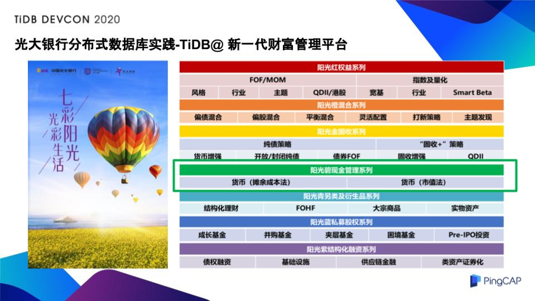
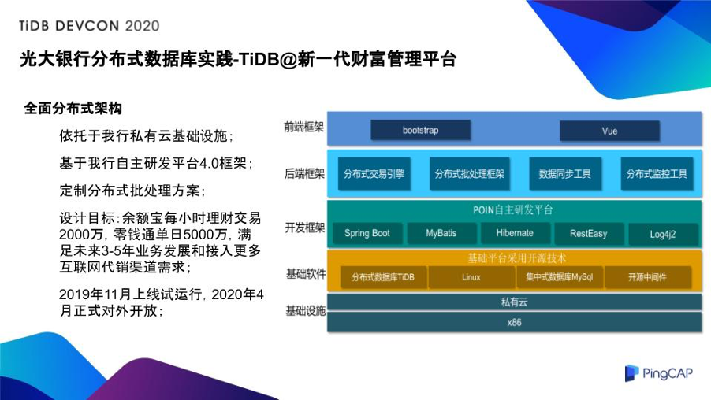
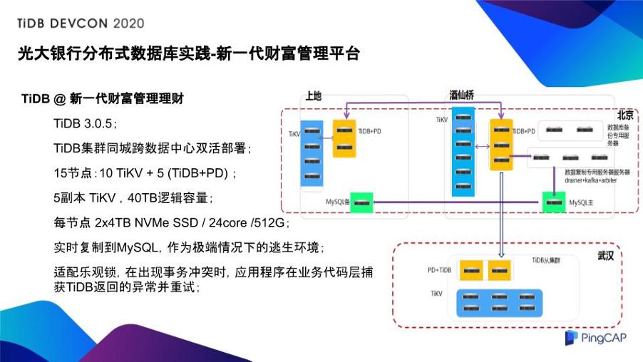

>作者介绍：王志刚，光大银行数据库运维主管。

大家好，我是来自中国光大银行信息科技部的王志刚，非常高兴有机会给大家分享一些分布式数据库在光大银行的应用探索。我目前在光大银行银行信息科技部负责数据库管理团队，在加入光大银行之前在三星、索尼爱立信，还有 Oracle 工作过，一直在负责数据库相关的工作。在近十年我和我的团队一直负责光大银行总行的数据库运维，这里面既包括我们的交易型数据库，也包括 MPP，还有 Hadoop 这样的大数据运维。在运维的过程中，我们一直也在思考现在的数据库有哪些问题、面临哪些风险、数据库技术的发展趋势是什么，这一点是很重要的，因为它决定了我们为什么要转向分布式，我们希望分布式能替我们解决哪些问题，它能够解决哪些问题和它不能够解决哪些问题。

我们现在运维的数据库包括商业数据库，像 Oracle、SQL Server、DB2；也有开源数据库，像关系型的 MySQL、NoSQL 数据库、Redis（KV 型），还有大数据、MPP，和分布式数据库等等。

## 目前运维的数据库面临哪些挑战？

以我们的观点去看现在银行数据库面临哪些挑战呢？我们认为有下面几点。

### 1. 处理能力受限

很多人都认为我们现在处理能力受限，但是数据库能力受限到底瓶颈在哪里？在我们看来在高的业务压力下瓶颈主要有两点：

**一是集中式存储资源的压力**。我们可以用最高端的存储，用最好的设备，但他终究是一个单点，他的性能受整体的限制；

**二是热点资源**。其实我们做数据库的时候更会发现相较于硬件的限制，软件的限制可能更大，像我们经常遇到的锁冲突的问题可能还是比较表层的问题，其实更多的是在数据库软件给你提供 ACID 和各种 SQL 接口的时候，他本身不是没有代价的，而是有成本的，这些成本本身会造成热点的内存、热点的序列、热点的内部闩锁等冲突，这些冲突在高压力下会对我们的性能造成极大的影响。

### 2. 部署集中会导致风险的集中

我们可以用最高端的设备，可以用最好的软件集群，我们可以将故障率降低到非常非常的低，也可以让切换时间变得非常短，变成秒级，让他可以在几秒的时间切换完，但是他仍旧避免不了一点，就是在我们的数据库是集中式的时候，一旦出现问题，在这几秒之内我们所有的交易都会停止。这其实是我们想提升的一个方面，我们希望有一个能够 24 小时不间断运行的数据库。

### 3. 跨数据库中心多活部署

银行是两地三中心的结构，它的投入很大，我们希望每个中心都利用起来，能够利用我们运维中数据中心的资源尽量的对外提供业务服务，这也是我们希望能够通过分布式的方案去解决的。因为在传统的架构下，我们只能用最高端的设备，比如双活的存储、双活的软件，但这在更多的情况下提供的是更高的可用性，并不能保证我们在所有的数据中心同时对外服务。

### 4. 数据库产品多样化

面对内外部多变形势，抵御产品供应链风险，我认为供应链的问题一直存在，在这我们必须要感谢大洋彼岸的大统领，因为他让我们知道这个问题现在有多么的紧迫，因为我们是 China，我们可能要跟大统领说一下“感谢，让我们意识到这个问题”。它决定了我们为什么要转向分布式数据库，我们希望分布式数据库或者说分布式架构替我们解决什么样的问题，因为这是一个比较复杂的应用场景，当我们在整个应用场景遇到一些问题的时候，当我们面临一些抉择的时候，甚至是遇到一些困难的时候，它可以让我们回到问题的本原，回到我们的初心，让我们想想我们当时要解决什么问题，我们要选择什么样的技术去解决这个问题。

## 银行需要什么样的数据库？

我们总结了一下银行到底需要什么样的数据库。

**首先数据库是科技重器。**

大家回想一下银行的本原，银行是经营什么的？有人说银行是经营钱的，我觉得不准确，印钞厂是经营钱的，银行的使命其实是财富的流转。以前的票号说汇通天下，意思是让财富在空间之间流转，现在大家贷款买房，银行给你贷款，过几十年你把他还清，在几十年之后你去住这个房子，这是银行让财富在时间上流转，其实银行的使命是让财富在时空之中流转，在流转的过程中为什么你相信银行能承担这个使命呢？是因为银行有一个经营的核心，这个核心是信用，只有有信用的银行你才愿意把钱存给它，这个信用不仅仅是你的钱要一分不差的给你，同时还要准时的给你。如果你取存款的时候银行跟你说：“你一个月之后再来吧，对不起现在没有钱。”你还会存给他吗？不会。银行经营的核心决定了我们后台支撑银行的整个系统，不仅仅是数据库，都要有准确极致的要求，既要时间准确，又要数字准确。

**第二是银行业务发展本身的需要。**

互联网金融某信、某宝的发展倒逼银行信息系统不断提升，既要提升交易的性能，也要提升我们批处理的性能，因为银行整个金融系统是互相连接的，你要这样做，别人也要这样做，我们要连成一个整体的金融网。

**第三是监管的要求。**

这一点可能是银行发展和互联网金融发展比较大的一个区别，在这里我跟大家分享一下，在过去两年双十一大促的时候，光大银行一直在双十一网联的统计中成功率排名第一，其实准确的说网联考核的不仅是成功率，成功率是 99.9%，可以说很好，但是不够，网联还要考核成功的绝对数量。去年双十一大促的时候，光大银行在全国银行中排名第一，是因为光大银行在整个双十一促销过程中只有三笔交易超时，所以整个系统对我们的要求是相当苛刻的。我们在整个环境中，不仅在量大之后只能有很低的失败比例，而且几乎要求你每笔交易都不能错。另外监管要求，如果有几笔交易错了一定要找出原因，他对我们的运维管理和对我们的问题分析有极高的要求，这可能是在实际应用场景中和现有的互联网金融的一个区别。

**第四是银行也同样面临成本压力。**

经常有人跟我们说银行很好，有钱，你买买买就可以了，银行是有钱，但是没有一分钱是可以随便花的，所以买买买只存在于段子中，现实是每一分钱都要精打细算，我们希望把钱投入到一个真正有收益的地方，银行需要的就是这样的数据库，这样的科技产品。

## 关于分布式数据库，我们的思考

基于上面这些思考，我们转向分布式数据库，我们希望分布式数据库能解决我们的难题，同时符合银行对数据库的要求。关于分布式数据库我们的思考大概有以下几种说法，有的我们同意，有的我们不太同意，在这里我跟大家分享一下。

**第一点是说中国的分布式数据库技术是世界第一梯队，这点我们认同。**

因为中国的分布式数据库技术得益于中国有世界上最大的互联网应用，就像你要做一个好的厨子，一定要有好的食客一样，我们有了好的食客，我们就有了成为好厨子的潜质。

**第二点是当前（2020 年）分布式数据库产品已经成熟了吗？**

经过我们的调研对比测试，我们觉得这个答案是 No。分布式数据库产品的完全成熟，当然也不排除后面会出现技术爆炸、飞跃，我们认为还需要五年以上的时间。大家可以回想一下这个路程，我们举一个国外产品的例子，现在国外最大的一个数据库厂商 70 年代末成立，进入中国是 80 年代末，真正在中国铺开是 90 年代末，经历了 20 年的时间。我们现在虽然有了各种技术的飞跃，但是有些时间跨度还是不可避免的，所以对于第二个问题的答案我们认为是 No。紧接着是第三个问题，我们要继续等待五年之后吗？对不起，我们的答案也是 No，其实不光是数据库，对所有产品的成熟，我们认为有三种因素：

*   第一产品自身；
*   第二是应用开发的成熟，产品自身好还是不好是他自身的能力，但你需要知道怎么用他；
*   第三是运维管理，就是你会不会管理他，会不会维护他。

**就像一辆车一样，把车做的很好这是产品自身的问题，那我们会不会开，你会开了之后有没有人会修。当所有这三个条件都成熟的时候，一个产品和他的环境才成熟，我们没法等待一个产品，先把车造好了，我们再去学怎么开，然后我们再去学怎么修，这三个条件一定是同步的。**

所以正是基于这个判断，光大银行在做分布式数据库这个项目的时候定了一个原则，叫躬身入局，我们要参与其中，通过我们的应用开发、测试、运维、实践与产品、技术和生态共同成长。生态也很重要，大家想想原来的厂商在中国的推广是仅靠厂商本身吗？我觉得不仅仅是，我们要感谢像 ITPUB 这样的互联网社区， 是这些社区让我们一起成熟起来，包括在同业之间的分享和促进。

## **光大银行分布式数据库实践**

我们比较早认知到分布式数据库和整个分布式架构转型对银行科技工作的重要作用。从光大银行信息科技部整个部门来说，把分布式数据库的建设工作列为了部门的年度重点工作之一，从 2018 年就开始研究，到 2019 年我们连续同业调研、技术测试、选型论证以及试点的上线，今年我们的计划是进一步推广使用的范围。因为我是分布式数据库建设的项目经理，我们以前也经常引入一些新产品，那这个项目和以前我们做的其他项目有什么不同呢？还是回到问题的本原，回到我们的初心，我们一开始要拿分布式数据库解决什么问题。我们希望它解决的是三个问题：

*   第一是性能的问题；
*   第二是可用性的问题；
*   第三是多活的问题。

银行有很多系统，小的有几百个，大的有几千个，这些系统中有大量的边缘系统，在以前这些边缘系统可以给我们新技术的测试提供很好的场景，但是在分布式数据库这个项目中，这个场景不太适用，因为我们对边缘系统的可用性的容忍度很高，一个边缘系统没有我们之前说的那几个问题，他没法验证我们的处理能力、稳定性、可用性，没法帮助我们去锻造开发测试和运维团队的技术能力。而且我们知道分布式数据库是比较复杂的，在这种系统中引入分布式数据库的时候，相对来说投入的设备量也比较大，并且他没有真正解决技术问题，也没有真正创造技术价值，所以正是基于这些考虑，我们首先要把分布式数据库应用到真正需要的系统。所以有人跟我开玩笑说，我们以前做项目都是 Normal 模式，但这个项目一上来就是 Hard 模式

**光大银行有两个受客面最大的系统，也就是对客的系统，一个是理财，一个是缴费，恰恰是这两个系统，我们把他拿来做分布式数据库的引入的试点，可以说是“到中流击水”，我们就要做到“第一战即攻坚战”。**

### 1. 新一代财富管理平台

光大银行是一个有理财基因的银行，2004 年光大银行在国内发行了第一款人民币理财产品，所以 2004 年也被称为中国的理财元年，2018 年光大集团的董事长李晓鹏提出了打造一流财富管理银行的愿景， 2019 年光大银行成为了首批获批成立理财子公司的股份制商业银行，到了同年的 9 月，光大银行理财公司正式开业，成为了首家开业的股份制商业银行的理财公司。

新一代财富管理平台是支撑我们整个光大银行理财公司运营的核心系统，首先它要符合我们的资管新规和理财新规，是新一代的理财业务的全流程管理平台，里面既包括销售注册登记，还要包括理财产品的研发设计、生命管理以及理财相关实时业务管理，可以说是被银行上下寄予厚望的一套系统。

在这里安利一下光大的理财，光大理财的品牌叫做七彩阳光理财，大家看到这个图里七彩阳光是七种不同的理财风格，既有权益理财，也有混合型理财，**我们把 TiDB 用到了现金理财，就是绿色的这一部分，叫阳光碧现金理财，在这里我们是在受众最广的渠道中去应用我们真正需要它的技术。**

并不是说有了分布式数据库，整个就万事大吉，一键我们分布式了，其实整个过程还是很复杂的，我们设计了全面的分布式架构来确保我们的新一代理财系统能够支撑光大银行理财子公司的财富管理的业务，依托光大银行私有云基础设施，基于我行自主研发平台 4.0 开发框架，并且定制了分布式批处理的方案。**我们的设计目标是余额宝每小时理财交易 2000 万，零钱通单日 5000 万，同时还要满足未来三到五年的业务发展和接入更多互联网的渠道，其实他是一个面向未来的系统，这个系统去年 11 月上线运行，今年 4 月正式对外开放。**

具体到了 TiDB，我们这次实施的是 TiDB 3.0.5 产品，我们在北京有两个中心，同城跨中心部署，15 节点，5 副本的 TiKV，设计的是 40TB 的逻辑容量，每个节点是专门为这个项目采购的机架式服务器，有两个 4TB 的 SSD，24 核，512G 的内存。因为这是个重要产品，应该说“切入即决战”，所以为了保障新一代数据库的平稳运行，我们可以开最好的车，但是一定要系好安全带，这个安全带就是我们在实施的过程中，除了 TiDB 本身，我们还把 TiDB 的数据实时复制到了 MySQL，用一个异构的数据库来保证一旦出现极端情况，能有一个逃生环境，去挽救我们的数据，挽救我们整个的应用。大家都知道 TiDB 之前版本有个乐观锁特性（[TiDB 4.0 版本](https://pingcap.com/blog-cn/tidb-4.0-the-leading-real-time-htap-database-is-ready-for-cloud/) 正式推出了悲观锁功能，和 RC 隔离级别，使用 TiDB 4.0 让应用适配更容易），这个是怎么适配的呢？后面 TiDB 有他自己的一个方案，但是我们这个版本还没有这个特性，我们在整个过程中做了大量的适配的，在出现业务冲突的时候，应用程序和业务代码能捕获异常、重试机制，我们和 TiDB 的专家也做了很多合作，我们的开发人员也做了很多修改，为什么这么做呢？还是回到初心，我们希望用一个产品解决这个问题，但我们不完全依赖某个产品解决我们的问题，我们根据他的特色选定了他，然后我们要适配他，这个事就像爱情一样，你爱他就要爱他的全部。

### 2. 云缴费

再安利一下我们另外一个项目，就是光大银行的云缴费。我们有一个口号叫“云缴费缴出新生活”，这是光大银行近年来着力打造的一个名品业务，它也是我们光大银行在金融惠民宗旨下，通过银行的资源、银行的科技能力不断的去方便大家，通过整合水、电、燃气等等项目，我们向第三方开放这些缴费资源，把各个服务提供商整合在一起，向我们其他的银行同业，行内、行外、某信、某宝这些第三方支付公司提供输出。大家用某信、某宝去缴费的时候可没有注意过，后面真正的缴费系统其实是光大银行的云缴费。另外说一句云缴费其实是光大银行目前 TPS 最高的系统，在这个系统中我们用的是由光大银行、光大科技和万里开源合作打造的一款分布式数据库中间件叫 EverDB，是我们自有知识产权的一个产品。

## 光大银行数据库技术领域发展规划

我们回到初心，再分享一下光大银行在数据库技术发展上的规划。我们虽然这次讲分布式，但分布式并不是光大银行在数据库领域的所有，尤其银行的系统特点是系统多，我们相信未来分布式数据库和集中数据库一定会各司其职。并不是每个系统都会用分布式数据库，分布式数据库适配的是那些大并发、高频次的业务系统，集中式数据库仍然有它的生存空间，而且从数量来说，它没准还是占相对大的一个比例，它适配的是传统业务系统，我们通过 RDS 的服务化部署能够提供数据库服务，国外商业产品、国内数据库、开源产品结合使用，最后达到一个比较均衡的比例。在分布式数据库领域我们会做到产品引入和自主研发结合，通过这种开放共赢的方法，打造有光大银行特色分布式的技术方案。最后在应用推广方面，今年我们还会在互联网渠道、支付等系统中应用分布式数据库产品，同时我们会启动新一代分布式核心建设。所有这些规划，我们都非常欢迎像 PingCAP 这样有实力的公司和我们共同发展、共同创造，当然更希望数据库领域的专家还有才俊能够加入我们，让我们共同创造科技、创造财富。

>本文整理自王志刚在 [TiDB DevCon 2020](https://pingcap.com/community-cn/devcon2020/) 上的演讲。
