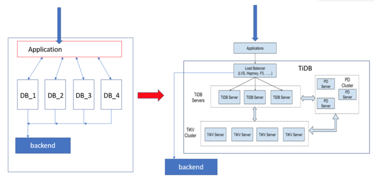

>作者：张明塘，FUNYOURS JAPAN 运营系统工程師 

## 背景

[株式会社 FUNYOURS JAPAN]( http://company.funyours.co.jp/ ) 自 2014 在日本成立以来，营运多款颇受好评的页游跟手游，如：剣戟のソティラス、九十九姬 等，对于营运游戏来说，能够了解游戏中的玩家在做什么，喜欢的偏好是什么，关卡的设计是否平衡，都是相当重要的，所以随着营运时间的增长，资料库数据在亿笔以上也是寻常的。

所以我们的技术单位也一直不断在评估市面上的各种资料库以及如何改进目前现有系统与架构，近年来最热门的资料库系统可以说是 NoSQL 了，不论 MongoDB，Cassandra，Redis，HBase 等等都占有一片天，具有读写快速，容易扩展等特性。经过初步了解后，采用 NoSQL 方式，需要对于目前的资料储存架构整个重新设计，并且需要配合采用的该套 NoSQL 资料库进行业务改造设计，那么该采用哪一套 NoSQL 资料库又是一个需要慎重考虑的课题。先回过头来看当前最需要处理改进的项目：

1\. 储存空间扩展不易

2\. 单台资料库效能有限

## 初期方案
在处理储存空间不足的部分，一开始我们先采用了 MySQL innoDB 提供的压缩表格格式，对于需要时常读写更新的部分使用了 8K page size，过往的日志部分采用 4K page size，效果非常令人满意，释放了大量的储存空间，并且对于效能来说没有造成可察觉的影响。这部分网路上的测试比较多，就不在此多做说明。但是很快的压缩表格节省的空间毕竟是有限的，接下来只能增加 volume 容量以及将没有需要更新的过往日志移动到其他资料库上，虽然造成维护工作跟时间的繁复与负担，但是问题解决了。

基于 MySQL 资料库架构单台的性能限制上，我们采用了多组的资料库伺服器，来满足所需的效能。当然不同组之间资料是不共通的，也就是无法直接使用 SQL 来做跨组间的操作，需要额外的程式来作业。而当然为了大量的资料存取上的效能，分表分库对表格进行 partition 这些作业都少不了。

## 初识 TiDB
使用 NoSQL 式资料库看似可以完美的提供出一个解法，但需要付出的成本也是高昂的。于是我们把眼光落到了 MySQL Cluster 上，这时看到了 Google 发布 Cloud Spanner beta 的新闻，NewSQL？这是什么? 很快的引起了我们浓厚的兴趣，然后经过多方调研，我们发现了 TiDB：一个开源在 GitHub 上的 NewSQL 资料库。官方也持续不断发布了很多相关的文章，随着对 TiDB 的认识，认为对于目前现况是很合适的最佳化方案，相容于  MySQL，高可用性，容易水平扩展。

在可行性评估与测试的时候，一开始采用了 TiKV 3 台搭配 PD 3 台，TiDB 2 台混搭 PD 的架构，使用了文件建议的 ansible 安装，这时遇到两个困难，第一个是在 ansible 检查机器效能的时候会因为硬碟读写效能而无法安装。由于是使用云端机器，所以对硬体方面没有太大的弹性，只好自己手动去修改脚本才能顺利安装。第二个也是在 ansible 里面会检查 ntp 同步服务是否启动，但是 centos7 预设的时间同步服务是 chrony，所以也是修改了脚本（后来的版本有提供 flag 能切换，也有自动安装 ntp 的选项），总之是顺利安装了。这时因为 PingCAP 才刚发布了 ansible 安装的方式，所以文件对于水平扩展部分，如新增 TiKV、 PD 、TiDB 机器，或者移除机器，官方 doc 没有详细说明，于是就写了封 mail 联系 PingCAP，发完信出去吃午餐回来，官方已经回复并且邀请加入 wechat，提供更即时的沟通跟支援，实在是很令人惊艳。

备份与还原的机制，TiDB 在这部分提供了一个性能比官方的 mysqldump 更快的方案- mydumper/loader，这里我们一开始使用 GitHub 上的 source 自己 build，但是有点问题，跟官方交流后，才知道原来 tidb-enterprise-tools 这个工具包里面已经有提供了。mydumper 能够使用正则表达式去挑选出想要的 database 跟 table 备份，对于原本架构就会分库分表的设计，更添加了不少方便，备份出来的档案会全部放在一个资料夹内，使用 loader 就可以将这个备份的资料再次进入 DB。但是采用 TiDB 不就是为了使用同一张表的便利性吗?当巨量的数据都在同一个表内的时候，虽然 mydumper/loader 的效能很好，由于必需全量备份的关系，还是需要一点时间，因为 TiDB 也支援 mysqldump，所以如果需要进行增量备份，也可以采用 mysqldump 搭配 `where` 条件式来进行。

因为需要对于不同的服务进行权限的管制，所以也一并测试了 TiDB 的帐号权限机制，那时还是 pre-GA 版本，根据文件上赋予模糊匹配会无法获得权限，必须要完全匹配才能正常取得；另外是在使用 revoke 回收权限方面会没有正确收回权限。但是在回报 PingCAP 后，很快的在 GA 版中就修复了。

## 上线 TiDB
初期上线采用了 4 core cpu、记忆体 32 GB 作为 TiKV，8 core cpu、记忆体 16 GB 作为 TiDB/PD，3 台 TiKV、3 台 PD 、2 台 TiDB 跟 PD 混搭的方式。透过 prometheus 观察，发现 loading 都集中在同一台 TiKV 上，且 loadaverage 在高峰期间会冲到 7 以上，初步判断可能是规格不够，于是决定将 TiKV 都提升到 16 core 、24 GB 记忆体。因为线上正在举办活动，所以不希望停机，采用先增加三台 TiKV 机器同步后，再移除三台原本 TiKV 的方式进行，也特别感谢 PingCAP 在置换机器中间，一直在线上支援，过程中很平顺的完成了切换机器。机器提高规格后，高峰期的 loadaverage 下降到 4，但是还是会集中在其中某一台 TiKV 上不会分散到三台，在 PingCAP 的协助分析下，判断出可能是业务行为中的 `select count(1)` 这个 SQL 太过频繁，涉及该业务数据一直存取在同 1 个 region，通过尝试在文件上的提高开发度的方式，还是无法解决（最新的 v1.1 版有在对 `count(*)`  进行最佳化），最后结合数据特性对业务行为进行了变更，loadavg 几乎都是保持在 1 以下。

比较原本架构与 TiDB 架构，原本架构上是采用多组 DB 的方式来让使用者分布在不同组 DB 上面，来达到所需的效能。但是当其中某几组负荷较大时，其他组 DB 并无法协助分担负荷。采用 TiDB 的架构后，在机器的使用上更有效率，并且在使用后台查找分析资料时，原本的架构下，只要时间一拉长到一个月以上，就会对该组 DB 的效能造成影响，而在 TiDB 的架构下，并不会有这样的问题。

现在运营上最直接的效益就是硬体成本的节约,原架构下每一组 DB 规格都必须符合尖峰期间的运作。但是在 TiDB 的架构下，将全部的机器整合成一体后，只要全部机器加总起来的效能能够达到尖峰期间即可，在监控上搭配 Prometheus/Grafana 的视觉化系统与能弹性的自订规则的警示，也免去了原本使用 snmp 自建监视系统的成本。另外由于降低了撰写程式的复杂度，当运营企划人员提出新的想得知的分析资料时，能够更快的从资料库中取出，而可以有更多的时间来应对与分析使用者偏好。

## 未来计划
目前正在评估 TiSpark 的使用，未来计划将后台分析资料部份，改采用 TiSpark。因为 TiSpark 可以直接操作 TiKV，也能够应用 Spark 提供的许多现成的函式库来对收集到的 log 做数据分析。预期利用 Spark 的机器学习来初步判断系统内的每个功能是否正常运作，并提出警示，例如当使用者的登入频率异常时等，来协助人工监控游戏运行状态。

