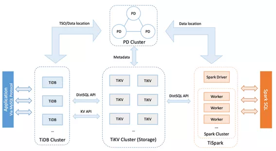
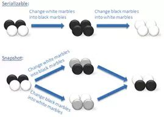
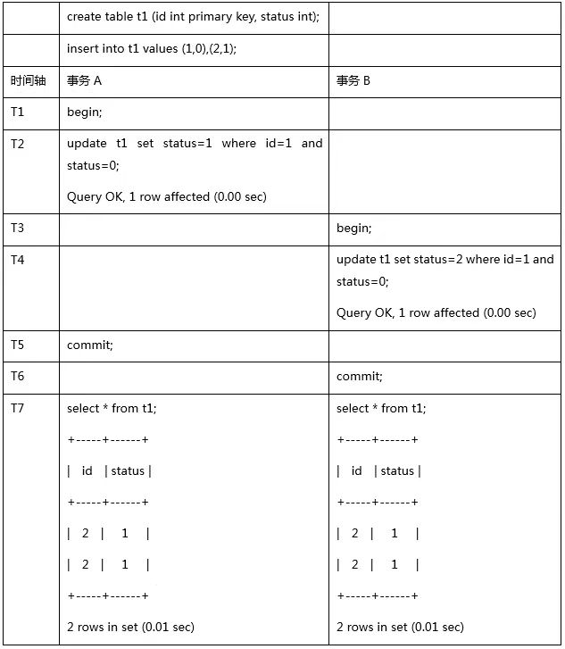

>本文转载自微信公众号“[华泰证券数字科技](https://mp.weixin.qq.com/s/Hp-ZJLdvd3z2w9IJ_32NRw?scene=25#wechat_redirect)”。
>
>**作者介绍**：华泰证券数字科技分布式数据库项目组，主要负责华泰证券分布式数据库系统建设工作，项目组成员均拥有多年数据库从业经历，对数据库运作原理具有较深的研究，并积累了大量实战经验。


传统数据库存储能力有限、扩容成本高、服务器压力大、响应时间长等问题逐渐凸显，分布式数据库应运而生。2016 年底，华泰证券就已经开始着手调研分布式数据库产品。近年来，国家不断提高对信息技术自主可控的战略要求，发展和支持国产数据库事业，不仅可以提升自主掌控能力，还可以不断降低企业经营成本。经过多方比较，本文将从 TiDB 技术特点、开发注意事项以及 TiDB 在华泰证券的实践进展等方面进行介绍。

## 1. TiDB 技术特点

### 1.1 TiDB 简介

TiDB 是一款开源分布式 NewSQL 数据库，结合了传统 RDBMS 和 NoSQL 的最佳特性，其设计灵感来源于 Google Spanner 和 F1。TiDB 的设计目标是覆盖 100% 的 OLTP 场景和 80% 的 OLAP 场景，更复杂的 OLAP 分析则通过 TiSpark 来完成。TiDB 屏蔽了分库分表等 Sharding 方案对业务的侵入性，开发人员不再需要关注数据如何分片等细节问题，专注于业务开发，极大地提升研发的生产力。

### 1.2 整体架构

TiDB 采用 Shared-Nothing、计算存储分离的分布式集群架构，主要包括三个核心组件：TiDB Server、PD Server 和 TiKV Server。此外，还有用于解决用户复杂 OLAP 需求的 TiSpark 组件。整体架构如下图所示：



- TiDB Server

  负责接收 SQL 请求，处理 SQL 相关的逻辑，并通过 PD 找到存储计算所需数据的 TiKV 地址，与 TiKV 交互获取数据，最终返回结果。TiDB Server 是无状态的，其本身并不存储数据，只负责计算，可以无限水平扩展，可以通过负载均衡组件（如 LVS、HAProxy 或 F5）对外提供统一的接入地址。
  
- PD（Placement Driver）Server

	PD Server 是整个集群的管理模块，通过 Raft 协议实现多副本集群架构，保证数据的一致性和高可用。其主要工作有三个：一是存储集群的元数据信息（某个 Key 存储在哪个 TiKV 节点）；二是对 TiKV 集群进行调度和负载均衡（如数据的迁移、Raft group leader 的迁移等）；三是分配全局唯一且递增的事务 ID。

- TiKV Server

	TiKV Server 负责存储数据，从外部看 TiKV 是一个支持事务的分布式 Key-Value 存储引擎。存储数据的基本单位是 Region，每个 Region 负责存储一个 Key Range（从 StartKey 到 EndKey 的左闭右开区间）的数据，每个 TiKV 节点会负责多个 Region。TiKV 使用 Raft 协议做复制，保持数据的一致性和高可用。副本以 Region 为单位进行管理，不同节点上的多个 Region 构成一个 Raft Group，互为副本。数据在多个 TiKV 之间的负载均衡由 PD 以 Region 为单位进行调度。

- TiSpark

	TiSpark 作为 TiDB 中解决用户复杂 OLAP 需求的主要组件，将 Spark SQL 直接运行在 TiDB 存储层 TiKV 上，同时融合 TiKV 分布式集群的优势，并融入大数据社区生态。至此，TiDB 可以通过一套系统，同时支持 OLTP 与 OLAP，免除用户数据同步的烦恼。

### 1.3 核心特性

TiDB 具备如下核心特性：

- 高度兼容 MySQL

	对于没有事务冲突场景的业务系统，在大多数情况下无需修改代码即可从 MySQL 轻松迁移至 TiDB，分库分表后的 MySQL 集群亦可通过 TiDB 工具进行实时迁移。

- 水平弹性扩展

	这里说的水平扩展包括两方面：计算能力和存储能力。TiDB Server 负责处理 SQL 请求，随着业务的增长，可以简单的添加 TiDB Server 节点，提高整体的处理能力。TiKV 负责存储数据，随着数据量的增长，可以部署更多的 TiKV Server 节点解决数据容量的问题。PD 会在 TiKV 节点之间以 Region 为单位做调度，将部分数据迁移到新加的节点上。所以在业务的早期，可以只部署少量的服务实例，随着业务量的增长，按照需求添加 TiKV 或者 TiDB 实例。

- 支持分布式事务

	TiDB 支持标准的 ACID 事务，通过两阶段提交和乐观锁实现分布式事务。

- 高可用

	TiDB/TiKV/PD 这三个组件都能容忍部分实例失效，不影响整个集群的可用性。TiDB 是无状态的，可以部署多个实例，前端通过负载均衡组件对外提供服务。当单个实例失效时，会影响正在这个实例上进行的会话，从应用的角度看，会出现单次请求失败的情况，重新连接后即可继续获得服务。PD 是一个集群，通过 Raft 协议保持数据的一致性，单个实例失效时，如果这个实例不是 Raft 的 leader，那么服务完全不受影响；如果这个实例是 Raft 的 leader，会重新选出新的 Raft leader，自动恢复服务。PD 在选举的过程中无法对外提供服务，这个时间大约是 3 秒钟。TiKV 是一个集群，通过 Raft 协议保持数据的一致性，并通过 PD 做负载均衡调度。单个节点失效时，会影响这个节点上存储的所有 Region。对于 Region 中的 Leader 节点，会中断服务，等待重新选举；对于 Region 中的 Follower 节点，不会影响服务。当某个 TiKV 节点失效，并且在一段时间内无法恢复，PD 会将其上的数据迁移到其他的 TiKV 节点。

- 一站式 HTAP 解决方案

	TiDB 作为典型的 OLTP 行存数据库，同时兼具强大的 OLAP 性能，配合 TiSpark，可提供一站式 HTAP（Hybrid Transactional and Analytical Processing）解决方案，一份存储同时处理 OLTP & OLAP，无需传统繁琐的 ETL 过程。

- 云原生 SQL 数据库

	TiDB 是为云而设计的数据库，支持公有云、私有云和混合云。

## 2. TiDB 开发注意事项

作为一款新兴的 NewSQL 数据库，TiDB 在许多方面取得了令人瞩目的成绩。尤其在兼容性方面，TiDB 可以说兼容 MySQL 90% 以上的行为，这为业务系统平滑迁移奠定了良好的基础。但我们依旧需要对剩下的 10% 的不兼容行为保持严谨的态度，避免给业务系统带来风险。

### 2.1 事务

#### 2.1.1 TiDB 的隔离级别

与很多传统数据库不同，TiDB 支持的隔离级别是 Snapshot Isolation（SI，快照隔离级别），采用“乐观锁+MVCC”的实现方式。它和 Repeatable Read（RR）隔离级别基本等价但也有一定的差异，详细情况如下：

**① TiDB 的 SI 隔离级别可以避免幻读（Phantom Reads），但 ANSI/ISO SQL 标准中的 RR 隔离级别不能避免。**

所谓幻读是指：事务 A 首先根据条件查询得到 n 条记录，然后事务 B 改变了这 n 条记录之外的 m 条记录或者增添了 m 条符合事务 A 查询条件的记录，导致事务 A 再次发起请求时发现有 n+m 条符合条件记录，就产生了幻读。

**② TiDB 的 SI 隔离级别不能避免写偏斜（Write Skew），需要使用 select for update 语法来避免写偏斜。**

写偏斜是指：两个并发的事务读取了两行不同但相关的记录，接着这两个事务各自更新了自己读到的那行数据，并最终都提交了事务，如果这两行相关的记录之间存在着某种约束，那么最终结果可能是违反约束的。下图的“黑白球”常常被用来说明写偏斜问题：



**③ TiDB 在默认配置下不能避免丢失更新（Lost Updates）。**

所谓丢失更新是指：两个事务 A、B 读取相同记录并更新同一列的值，若 A 先于 B 提交事务，当 B 事务提交后 A 再次查询时发现自己的更新丢失了。

TiDB 在默认配置下不能避免丢失更新是由于在事务冲突中提交较晚的事务被自动重试导致的（重试时会获取最新的 tso，相当于重新开启了一个事务），可以将参数 `tidb_disable_txn_auto_retry` 设成 1 来避免丢失更新，但是修改后发生冲突的事务将会失败并回滚，而不进行自动重试。

#### 2.1.2 显式事务中 DML 语句返回的 affected rows 不可信

与所有使用了乐观锁机制的分布式数据库一样，在显式执行的事务中（设置为非自动提交 `autocommit=0`，或使用 begin 语句显式声明事务开始），DML 操作所返回的 affected rows 并不保证与最终提交事务时所影响的数据行数一致。

如下案例，事务 B 在并发中丢失了它的更新，它的 affected rows 并不可靠。



这是由于在显式执行的事务中 DML 操作与提交操作分开被执行，在事务提交过程中，如果由于事务冲突、找不到 TiKV、网络不稳定等原因而发生了重试，TiDB 将获取新的时间戳重新执行本事务中的 DML 操作，原本的 SI 隔离级别在重试后会产生类似 RC（Read Committed）隔离级别的不可重复读与幻读异常现象。由于重试机制在内部完成，如果最终事务提交成功，用户一般是无法感知到是否发生了重试的，因此不能通过 affected rows 来作为程序执行逻辑的判断条件。而隐式事务中（以单条 SQL 为单位进行提交），语句的返回是提交之后的结果，因此隐式事务中的 affected rows 是可信的。

#### 2.1.3 不支持 Spring 的 PROPAGATION_NESTED 传播行为

Spring 支持的 `PROPAGATION_NESTED` 传播行为会启动一个嵌套的事务，它是当前事务之上独立启动的一个子事务。嵌套事务开始时会记录一个 savepoint，如果嵌套事务执行失败，事务将会回滚到 savepoint 的状态，嵌套事务是外层事务的一部分，它将会在外层事务提交时一起被提交。下面案例展示了 savepoint 机制：

```
mysql> BEGIN;
mysql> INSERT INTO T2 VALUES(100);
mysql> SAVEPOINT svp1;
mysql> INSERT INTO T2 VALUES(200);
mysql> ROLLBACK TO SAVEPOINT svp1;
mysql> RELEASE SAVEPOINT svp1;
mysql> COMMIT;
mysql> SELECT * FROM T2;
+------+
| ID |
+------+
| 100 |
+------+
```

TiDB 不支持 savepoint 机制，因此也不支持 `PROPAGATION_NESTED` 传播行为。基于 Java Spring 框架的应用如果使用了 `PROPAGATION_NESTED` 传播行为，需要在应用端做出调整，将嵌套事务的逻辑移除。

#### 2.1.4 对大事务的限制

基于日志的数据库在面对大事务时，需要手动调大可用日志的容量，以避免日志被单一事务占满。由于 TiDB 分布式两阶段提交的要求，修改数据的大事务可能会出现一些问题。因此，TiDB 对事务大小设置了一些限制以减少这种影响：

- 每个键值对不超过 6MB

- 键值对的总数不超过 300000

- 键值对的总大小不超过 100MB

一行数据是一个键值对，一行索引也是一个键值对，当一张表只有 2 个索引时，每 insert 一行数据会写入 3 个键值对。据此，涉及大量数据增删改的事务（如批量的对账事务等），需要进行缩减事务量的改造，最佳实践是将大事务改写为分页 SQL，分段提交，TiDB 中可以利用 order by 配合 limit 的 offset 实现分页功能，写法如下：

```
update tab set value=’new_value’ where id in (select id from tab order by id limit 0,10000);
commit;
update tab set value=’new_value’ where id in (select id from tab order by id limit 10000,10000);
commit;
update tab set value=’new_value’ where id in (select id from tab order by id limit 20000,10000);
commit;
... ...
```

### 2.2 自增 ID

TiDB 的自增 ID（`auto_increment`）只保证自增且唯一，并不保证连续分配。TiDB 目前采用批量分配的方式，所以如果在多台 TiDB 上同时插入数据，分配的自增 ID 会不连续。当多个线程并发往不同的 tidb-server 插入数据的时候，有可能会出现后插入的数据自增 ID 小的情况。此外，TiDB 允许给整型类型的列指定 `auto_increment`，且一个表只允许一个属性为 `auto_increment`的列。

### 2.3 唯一性约束

和其他数据库一样，TiDB 中的主键和唯一索引都是表中数据的唯一性约束，但是有如下不同点：

- TiDB 中的主键必须在建表时声明，目前版本（v2.1.0）还不能为已有的表添加、修改或删除主键；唯一索引没有此限制。

- Drop Column 操作不支持删除主键列。

TiDB 不支持外键，要去掉所有表结构中创建外键的相关语句。外键的级联操作多表数据的功能需要在应用中完成。

### 2.4 索引

和表中的数据一样，TiDB 中表的索引在存储引擎中也被作为 KV 来存储，一行索引是一个 KV 对。例如一张有 2 个索引的表，每插入一行数据的时候，会写入 3 个 KV 对。

TiDB 支持主键索引、唯一索引，也支持二级索引，构成以上索引的可以是单一列，也可以是多个列（复合索引）。TiDB 目前（v2.1.0）还不支持双向索引、全文索引、分区表的全局索引。

TiDB 中在查询的谓词是 `=`，`>`，`<`，`>=`，`<=`，`like ‘...%’`，`not like ‘...%’`，`in`，`not in`，`<>`，`!=`，`is null`，`is not null` 时能够使用索引，使用与否由优化器来决策。TiDB 中在查询的谓词是 `like ‘%...’`，`like ‘%...%’`，`not like ‘%...’`，`not like ‘%...%’`，`<=>` 时无法使用索引。

TiDB 目前（v2.1.0）对于一张表的查询还不能同时利用到这张表上的两个索引。

TiDB 中的复合索引与其他数据库一样，设计的一般原则是尽可能的把数据值区分度高的列排在前面，这样就可以让 SQL 在执行时尽快筛选出更少的数据行。在当前版本（v2.1.0 及以下的全部版本）使用中需要特别注意，复合索引中前一列的范围查询会中止后续索引列的使用，可以通过下面的案例来理解这个特性。在如下的查询中：

```
select a,b,c from tablename where a<predicate>’<value1>’ and b<predicate>’<value2>’and c<predicate>’<value3>’;
```

如果 `a` 条件的谓词是 `=` 或 `in`，那么在 `b` 的查询条件上就可以利用到组合索引`（a,b,c）`。例：`select a,b,c from tablename where a = 1 and b<5 and c=’abc’`。

同样的，如果 `a` 条件和 `b` 条件的谓词都是 `=` 或 `in`，那么在 `c` 上的查询就可以利用到组合索引`（a,b,c）`。例：`select a,b,c from tablename where a in (1,2,3) and b = 5 and c=’abc’`。

如果 `a` 条件的谓词不是 `=` 也不是 `in`，那么 `b` 上的查询就无法利用到组合索引`（a,b,c）`。此时 `b` 条件将在 `a` 条件筛选后的数据中进行无索引的数据扫描。例：`select a,b,c from tablename where a > 1 and b<5 and c=’abc’`。

这是由于在 TiDB 中，复合索引中排在前面的列如果被用于范围查询，那么后续列的查询就会在前一列筛选后的数据范围中进行非索引的扫描。

综上，在 TiDB 中进行复合索引设计时，需要尽可能的将区分度高的列排在前面，将经常进行范围查询的列排在后面。


### 2.5 写入热点

TiKV 是一个按 range 切分的 KV 系统，KV 的 Key 决定了写入位置在哪个 region。对于主键为非整数或没有主键的表，TiDB 会使用一个隐式的自增 rowid，大量 `INSERT` 时会把数据集中写入单个 region，造成写入热点。通过设置表级别选项 `SHARD_ROW_ID_BITS`（如下所示）可以把 rowid 打散写入多个不同的 region，缓解写入热点问题。但是设置的过大会造成 RPC 请求数放大，增加 CPU 和网络开销。

`SHARD_ROW_ID_BITS = 4` 表示 2^4=16 个分片

`SHARD_ROW_ID_BITS = 6` 表示 2^6=64 个分片

`SHARD_ROW_ID_BITS = 0` 表示 2^0，就是默认值 1 个分片

CREATE TABLE 语句示例：

`CREATE TABLE t (c int) SHARD_ROW_ID_BITS = 4`;

ALTER TABLE 语句示例：

`ALTER TABLE t SHARD_ROW_ID_BITS = 4`;

分区表可以将一张表的数据分散到多张物理表中，通过合理的设计分区规则，可以进一步避免写入热点问题。

### 2.6 暂不支持的特性

TiDB 在大部分情况下能保证与 MySQL 的兼容，不过一些特性由于在分布式环境下没法很好的实现，目前暂时不支持，比如：

- 存储过程

- 视图

- 触发器

- 自定义函数

- 外键约束

- 全文索引

- 空间索引

- 非 UTF8 字符集

- CREATE TABLE tblName AS SELECT stmt 语法

- … …

## 3. 实践机器

我们从 2017 年初就开始了 TiDB 的调研与测试工作，到目前为止，已经在多个业务系统测试了 TiDB 的功能与性能。TiDB 也从最初运行不稳定、性能不好、周边工具缺失的年轻产品，慢慢成长为了产品稳定、性能可随节点数目线性扩展、周边工具丰富、社区火热的金融级分布式 NewSQL 数据库。

2019 年 4 月下旬，我们上线了第一套 TiDB 生产集群，采用 6 台服务器构成“3 TiDB Server + 3 TiKV Server”的架构。PD Server 与 TiDB Server 共享服务器。每台服务器配置 128 GB 内存，2 路共 12 核 CPU，6 块 960GB SSD 盘做成 RAID 10。

目前接入生产 TiDB 集群的业务系统分为以下几个阶段进行实施：

1）通过 TiDB Lightning 工具将当月以前的历史存量数据以文件的方式导入 TiDB 集群

2）上线当日，通过 TiDB Lightning 工具将当月的数据以文件的方式导入 TiDB 集群

3）上线之后，业务端进行双写，利用 kafka 将新的数据同步到 TiDB 生产集群

4）稳定运行几个月后，将查询流量逐步切到 TiDB

5）继续稳定运行几个月后，将查询流量和写入流量全部切到 TiDB，通过业务双写将新的数据同步到原 Mycat+MySQL 环境

6）彻底下线原 Mycat+MySQL 环境

**当前处于第三个阶段。自上线以来，TiDB 集群运行稳定，最高 QPS 达到每秒 3.4 万笔。写入速度与原 MySQL 环境相当，kafka 端未出现数据积压，系统资源使用均衡，并且尚有余量。**

## 总结

**从我们实践的结果来看，TiDB 这种 NewSQL 数据库确实展现了不错的技术优势。其提供的 MySQL 兼容性让业务系统的改造代价大大降低，对分布式事务的支持让业务系统可以像访问单个 MySQL 库一样访问 TiDB。基于 raft 协议的多副本机制，极大的保证了数据的一致性和可用性。其云原生的设计理念，让扩容缩容变得非常方便，大大解放了运维人员的时间。**

但是我们也需要看到它的缺点，TiDB 最大的缺点是还比较年轻，不少功能尚未完善，因此我们的思路是先小范围试用，选择非交易类系统进行推广，待稳定运行后再扩大推广范围。


