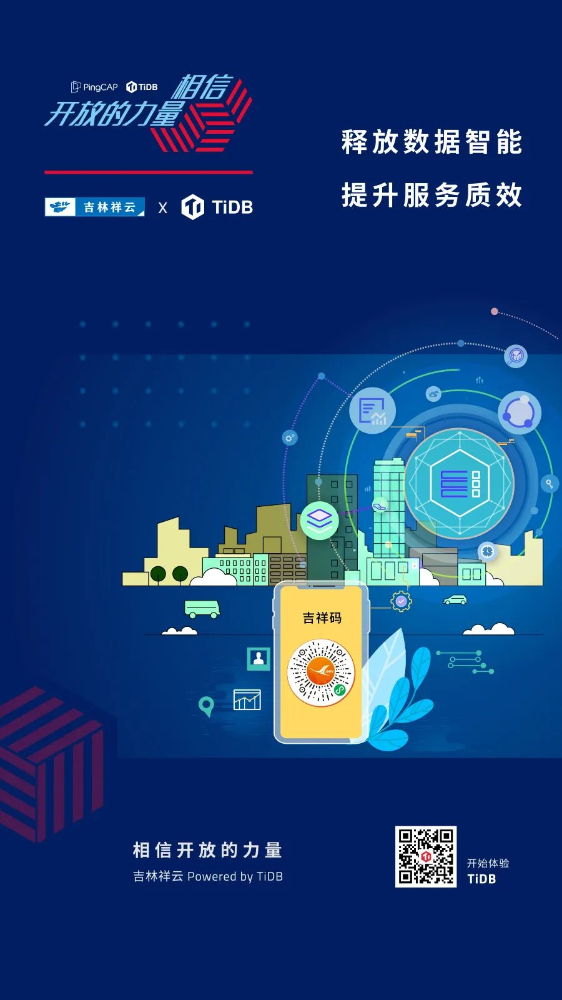

**「我们已经用起来了」**，是我们最喜欢听到的话，简简单单几个字的背后代表着沉甸甸的信任和托付。我们将通过 **「相信开放的力量」** 系列深度案例分享，从业务的角度，看看一个数据库为各行业用户带来的业务价值。**本篇文章将介绍 TiDB 在吉林祥云政务大数据平台的应用与实践。**

>释放数据智能，提升服务质效。

疫情以来，各地纷纷推出个人查询自身防疫相关健康状态的工具，例如健康宝、健康码等。在吉林，注册“吉事办”微信小程序可以获取本人的“吉祥码”，根据现场测温登记、与国家政务服务平台防疫数据核验等，为“吉祥码”加载健康状态颜色，利用大数据对疫情进行实时监测分析，实现“一人一码”的精准防控。

**“吉祥码”的背后是 TiDB 分布式数据库通过“吉林祥云”政务大数据平台提供的各类数据服务支撑。** “吉林祥云”作为集云网一体化的政务大数据平台，为吉林省“数字政府”建设提供统一的云计算、云存储、云安全和云网络等基础资源服务，平台按照“两地三中心”模式建设，具备应用系统双活和数据异地容灾备份能力。

## 智能数据基础设施显成效

“吉林祥云”大数据智能平台一期工程优化了政务信息资源共享体系，打通了全省的数据通路。作为支撑该平台的分布式数据库，TiDB 作出了一系列贡献：

- TiDB 与吉林祥云共同完成了全省千余个省、市、县、乡、村机构的数据统建，全平台共计构建上万个数据库实例，几万张表，平台上线后实现了全省各委办厅局的数据交换共享。

- TiDB 为吉祥码提供数据管理平台的支撑，满足了业务高吞吐和低时延要求，支持单表几亿数据的同步复制，在确保数据安全的基础上实现扫码情况的实时统计分析。

## 业务挑战

吉林祥云与吉林省政务服务和数字化建设管理局统筹建设了吉林省政务数据共享交换平台，汇聚人口、法人、自然资源和空间地理、社会信用信息、电子证照、宏观经济六大类公共基础数据库，并联合吉林省各省直机关单位制定了政务信息资源共享清单。

为满足整体的业务服务与数据处理的分析需求，实现各种不同类型的海量异构数据的存储、检索与管理需求，并针对不同的环境、不同的用户提供不同的数据服务。经多轮选型和认证之后，吉林祥云决定引入 TiDB 分布式数据库。

## TiDB 的解决之道

吉林祥云在两地三中心部署 TiDB 集群，采用主从的多活架构，实现多中心、多活运行，并且实现各级故障场景下的常态化切换，提升平台业务对各级风险的抵御能力。**目前 TiDB 已上线投产两大应用：吉林省政务数据共享交换平台和吉祥码数据管理平台，并取得一些列显著成效，后续将应用于更多的核心业务场景。**

**吉林祥云通过构建 TiDB 统一存储数据平台，打破了以前吉林省各委办厅局各个数据孤岛的状态，实现多源数据的关联应用，提升了应用效率**，主要优势体现在以下几个方面：

- 分布式架构具备在线的横向扩展能力，保障海量数据、高并发的业务场景对接；

- 自动的灾难恢复和故障转移特性，保障数据安全的同时大幅提升业务的容灾能力 ；

- 解决了数据多源接入的问题，大幅缩减数据同步和抽取的开支，通过 TiFlash 实现业务实时的查询与统计分析需求；

- TiDB 高度兼容 MySQL，业务不需要进行过多改动即可实现平滑迁移，代码开发与迁移成本显著降低。

## 与客户同行，相信开放的力量

每次数据库架构改善与落地，无论是 TB 级还是 PB 级，都需要付出努力，但这也值得每一个企业去实践。在当下这个时代，不管企业的规模如何，都要学会借助开源的力量，避免去重复的造轮子。

每一个看似轻松的背后都有不为人知的努力，每一个看似光鲜亮丽的背后，都有不为人知的付出。分布式数据库建设之路道阻且长，TiDB 愿与吉林祥云及每个客户一起，携手并肩把事情做好。