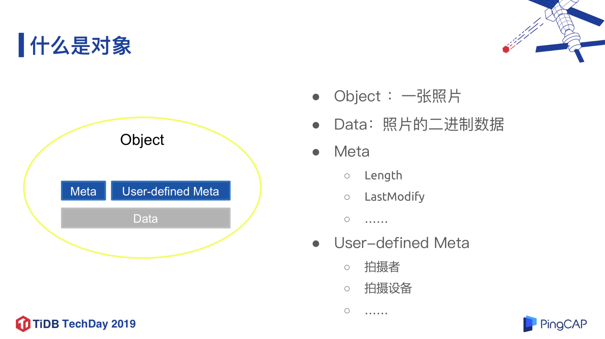
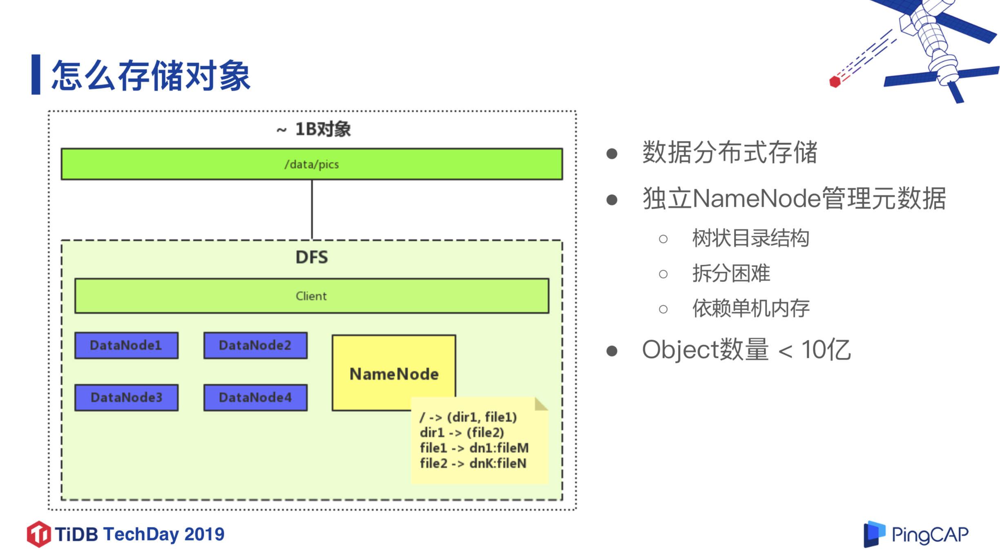
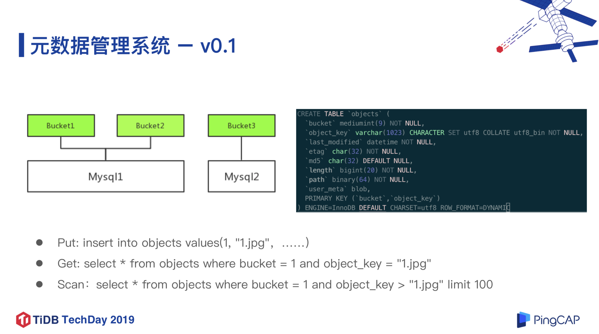
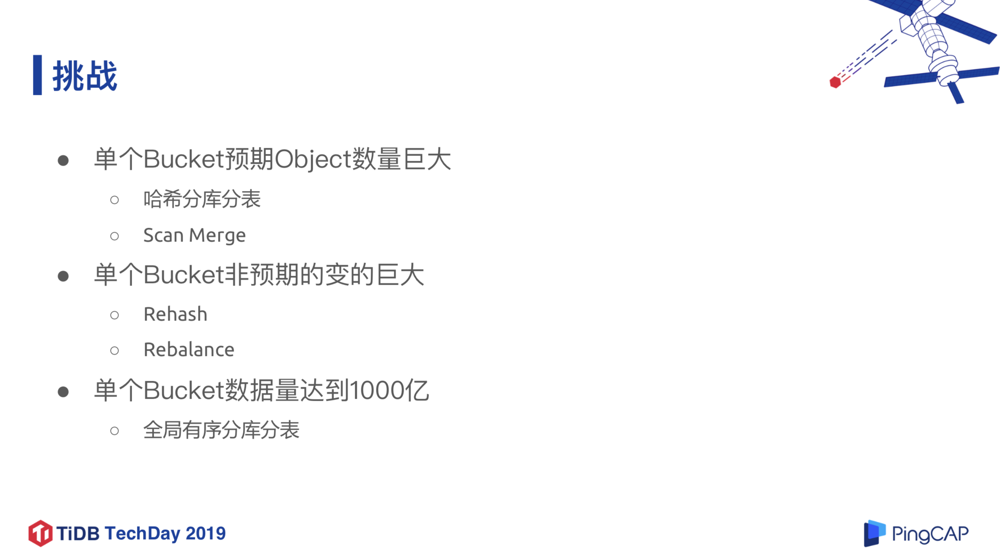
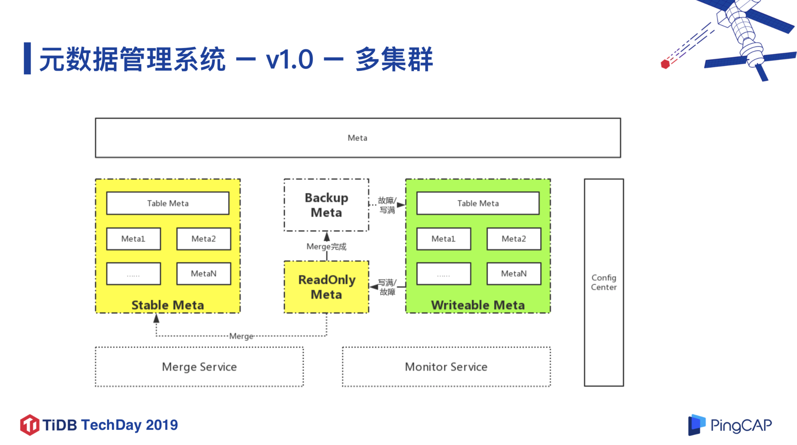
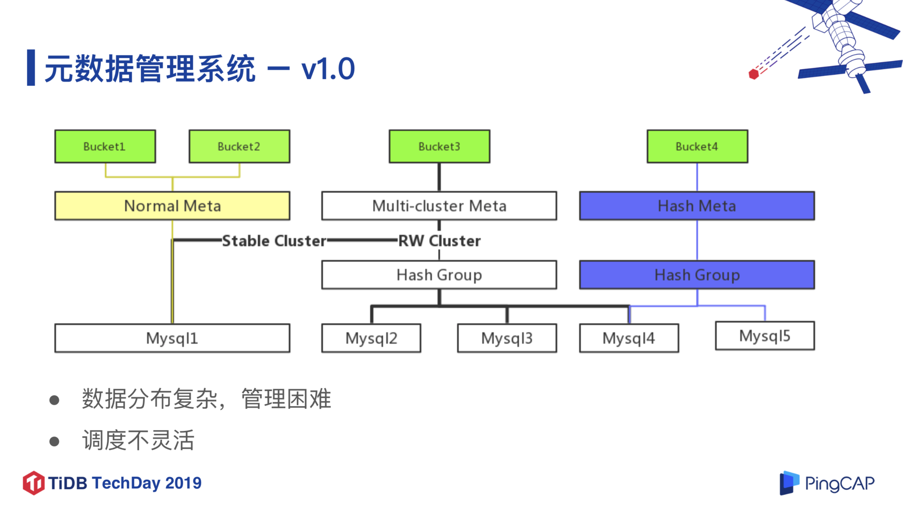
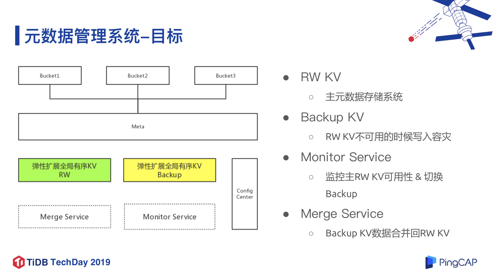
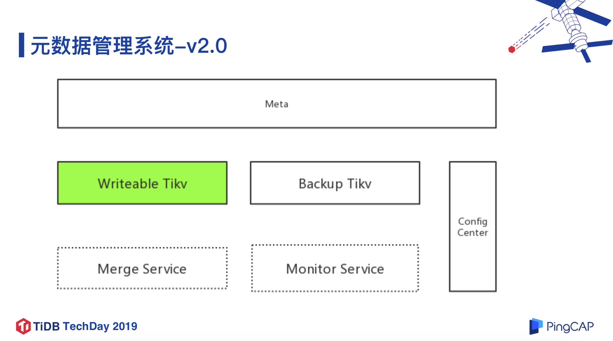
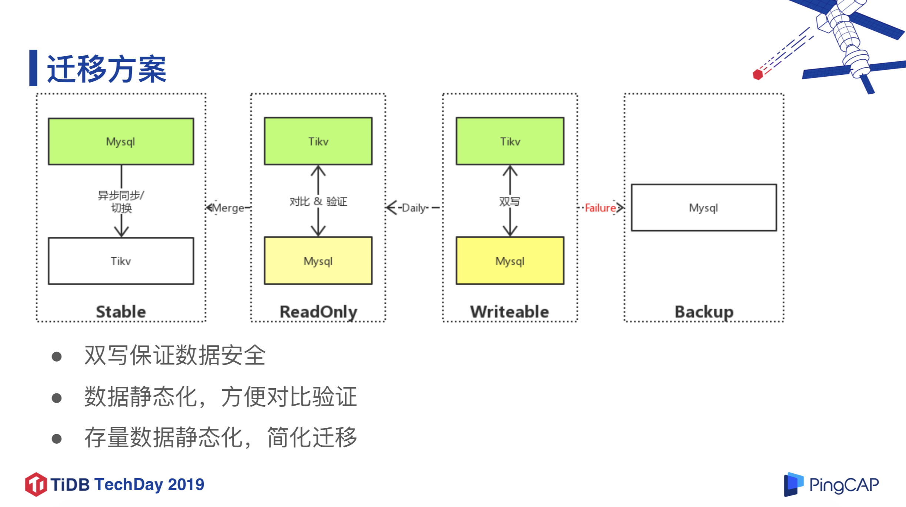

>作者介绍：崔灿，京东智联云产品研发部专家架构师，目前主要负责京东智联云对象存储产品的工作。

京东智联云对象存储是在 2016 年作为公有云对外公开的，主要特点是可靠、安全、海量、低成本，应用于包括一些常用的业务场景，比如面向京东智联云公有云外部的开发者的服务，和面向政府、企业的私有云服务，甚至混合云服务。

本文将介绍京东智联云对象存储服务的架构演进，以及迁移到 TiKV 的经验。

## 一、对象存储简介

图 1 什么是“对象”

首先举例说明一下这里的“对象 (Object)”概念。比如我们把一张照片当作一个“对象”，除了照片本身的二进制数据，它还应该包含一些元信息（照片数据长度、上次修改时间等）、涉及用户的数据（拍摄者、拍摄设备数据等）。对象存储的特点是这些数据不会频繁地修改。

如果是数量比较少的图片存储，我们可能会用类似 LVM 之类的东西，把一个节点上的多个磁盘使用起来，这种方法一般适用于数量级在 1M ~ 10M 的图片。随着业务的增长，图片会越来越多甚至有视频存储，因此我们采用分布式文件系统来存储，这种方法是基于 DFS 的架构（如下图所示）。 

图 2 如何存储对象（数据量 1B）

这种方法的前提是单机容量受限，必须把数据放在多台机器上存储，并且用一个或多个独立的 node 存储元数据，并且元数据会维持树状目录的结构，拆分比较困难。但是这个架构一般适合存储到 10 亿级别的对象，同时存在两个比较大的问题：

* 数据分布式存储在不同的节点上，如果存在一个中心的 master 节点的数据是相对有限的，那么这个机器就不太可能无限扩张下去。

* 元数据管理是树状结构，它本身并不适合做分布式存储，并且目录结构需要多次访问，不适合把它放到 SSD 上，而更适合放在内存里，然后一般授权一个 master 节点 list。HDFS 基本也是这样。

图 3 如何存储对象（数据量 100B）

那么如果要求做千亿级的对象存储，如何实现呢？最容易想到的办法是将元数据分布式存储，不再像文件系统中那样存储在单独的机器上，是一个树状结构，而是变成一个平坦结构。

## 二、对象存储元数据管理系统

回到上面的举例，针对一个图片对象我们主要有四类操作：上传（Put）、下载（Get）、删除（Delete），Scan。Scan 操作相对比较传统 ，比如查看当前有多少图片对象，获取所有图片名称。

### 1. 元数据管理系统 v1.0

图 4 元数据管理系统 v1.0（1/4）

上面是一个最简单、原始的方案，这里 Bucket 相当于名字空间（Namespace）。很多人最开始设计的结构也就是这样的，但后期数据量增长很快的时候会遇到一些问题，如下图。

图 5 元数据管理系统 v1.0（2/4）

第一个问题是，在初期数据量比较小的时候，可能只分了 4 个 Bucket 存储，随着业务增长，需要重新拆分到 400 个 Bucket 中，数据迁移是一个 Rehash 过程，这是一件非常复杂且麻烦的事情。所以，我们在思考对象存储连续的、跨数量级的无限扩展要怎么做呢？下图是一个相对复杂的解决方案，核心思想是把绝大部分数据做静态处理，因为静态的存储，无论是做迁移还是做拆分，都比较简单。比如每天都把前一天写入的数据静态化，合到历史数据中去。

图 6 元数据管理系统 v1.0（3/4）

针对第二个问题，如果单个 Bucket 数据量很大，那么在往 Stable Meta（上图中黄色部分）做静态化迁移时需要做深度拆分，单个 Bucket 的对象的数量非常多，在一个数据库里面存储不下来，需要存储在多个数据库里面，再建立一层索引，存储每个数据库里面存储那个区间的数据。同时，我们在运行的时候其实也会出现一个 Bucket 数量变多的情况，这种是属于非预期的变多，这种情况下我们的做法是弄了一大堆外部的监控程序，监控 Bucket 的量，在 Bucket 量过大的时候，会主动去触发表分裂、迁移等一系列流程。

图 7 元数据管理系统 v1.0（4/4）

**这个解决方案有两个明显的问题，第一数据分布复杂，管理困难；第二，调度不灵活，给后期维护带来很大的困难。**

图 8 元数据管理系统改进目标

**所以，我们思考了这个事情本质其实是做一个全局有序 KV，并且需要“足够大”，能够弹性扩张。这样系统架构就会变得非常简单（如上图所示）。当然最终我们找到了分布式 KV 数据库—— TiKV。**

### 2. 基于 TiKV 的元数据管理系统

我们前期调研了很多产品，最终选择 TiKV 主要原因有以下四点：

* 全局有序 KV，可轻松⽔平扩展，功能上完全能够满⾜对象存储元数据管理的需求。

* 经过一些测试，性能上很好，能够满足要求。

* 社区活跃，文档和工具相对比较完善。这一点也很重要，TiKV 目前已经是 CNCF（云原生计算基金会）的孵化项目，很多功能可以快速开发，产品迭代也很迅速。

* 相对于 TiDB Server 而言，TiKV 的代码更加简单，而且我们后续可以在 TiKV 的基础上做更多开发工作。

在上线之前，我们主要进行了以下几方面的测试：                       

* 功能测试：测试 TiKV 的基本功能是否满足业务需求。

* 性能测试：测试了常规的 QPS、Latency (Avg, TP90, TP99) 等指标。

* 异常测试：其实我们做数据存储的同学往往最关注的是各种异常故障的情况，性能倒是其次，而且分布式存储相比单机存储更为复杂。所以我们测试了各种机器/磁盘/网络故障，业务异常情况。更进一步的，我们将这些异常情况随机组合，并在系统内触发，再验证系统的正确性。  

* 预发布环境验证：在大规模上线之前，我们会在相对不太重要的、实际业务上跑一段时间，收集一些问题和可优化的部分，包括运维上的调优等。

通过上面的测试我们认为 TiKV 无论是从性能还是系统安全性的角度，都能很好的满足要求，于是我们在 TiKV 基础之上，实现了对象元数据管理系统 v2.0，如下图所示。

图 9 元数据管理系统 v2.0

**将 v1.0 中一堆复杂的数据库和逻辑结构用 TiKV 替代之后，整个系统变得非常简洁。**

## 三、业务迁移

很多用户可能直接将 MySQL 迁移到 TiDB 上，这个迁移过程已经非常成熟，但是由于迁移到 TiKV 前人的经验比较少，所以我们在迁移过程中也做了很多探索性的工作。

### 1. 迁移方案

图 10 迁移方案

上图是我们设计的迁移方案，首先线上的数据都必须双写，保证数据安全。第二，我们将存量数据设置为只读之后迁移到 TiKV 中，同时迁移过程中的增量数据直接写入 TiKV，每天将前一日的增量数据做静态化处理，然后与 MySQL 中的数据对比，验证数据正确性。另外，如果双写失败，会启用 MySQL backup。

下面详细介绍实际操作过程中的相关细节。

### 2. 切换

在存量数据切换方面，我们首先将存量数据静态化，简化迁移、数据对比、回滚的流程；在增量数据切换方面，首先将增量数据双写 TiKV & MySQL，并且保证出现异常情况时快速回滚至 MySQL，不影响线上的业务。值得一提的是，由于 TiKV 在测试环境下的验证结果非常好，所以我们采用 TiKV 作为双写的 Primary。

整个切换 过程分为三个步骤：

* 存量数据切换到 TiKV，验证读。

* 增量数据切换到 TiKV，验证读写。

* 验证 TiKV 中的数据正确性之后，就下线 MySQL。

### 3. 验证

数据验证过程最大的困难在于增量数据的验证，因为增量数据是每天变化的，所以我们双写了 MySQL 和 TiKV，并且每天将增量数据进行静态化处理，用 MySQL 中的记录来验证 TiKV 的数据是否可靠（没有出现数据丢失和错误），如下图所示。

图 11 双写验证

因为同时双写 MySQL 和 TiKV 可能会出现一种情况是，写入 TiKV 就成功了，但是写入 MySQL 失败了，这两个写入不在同一个事务中，所以不能保证一定同时成功或者失败，尤其是在业务量比较大的情况下。对于这种不一致的情况，我们会通过业务层的操作记录，来判断是由于业务层的问题导致的，还是由 TiKV 导致的。

## 四、业务现状及后续优化工作

**目前 TiKV 在京东智联云对象存储业务上是 Primary 数据库，计划 2019 年年底会把原数据库下线。总共部署的集群数量为 10+，生产环境单集群 QPS 峰值 4 万（读写 1:1），最大的单集群数据量 200+亿，共有 50 余万个 Region，我们元数据管理业务对 Latency 要求比较高，目前 Latency 能保证在 10ms 左右。另外，我们正在测试 TiKV 3.0，预计 2019 年第四季度能够上线。**

针对目前的业务运行情况，我们后续还将做一些优化工作。

**第一点是灾备**，目前我们是在业务层做灾备，后续可能会直接在 TiKV 层做灾备，也很期待 TiKV 之后的版本中能够有这方面的功能。

**第二点是集群规模优化**，因为对象存储是存储密集型的业务，我们希望压缩硬件成本，比如可以用到 8T 、10T 的磁盘，或者用更廉价的磁盘，这点我们后续可能 PingCAP 研发同学们一起考虑怎么优化提升。

**第三点是 Region 调度优化**，目前 TiKV 的调度整体比较复杂，这对于存储密集型的业务来说就比较麻烦，尤其是数据量特别大的情况下，我们并不希望有一丝的波动就把数据迁移到其他机器上。

>本文整理自崔灿老师在 TiDB TechDay 2019 杭州站上的演讲。

