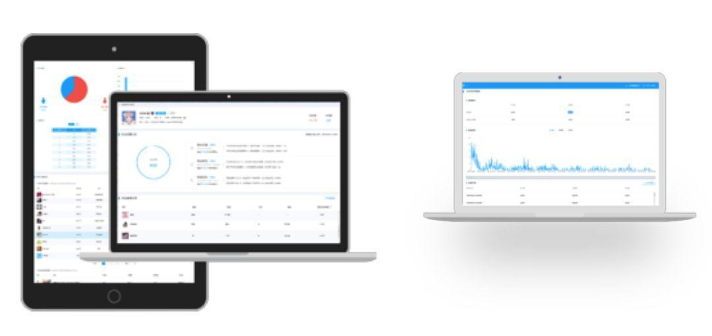
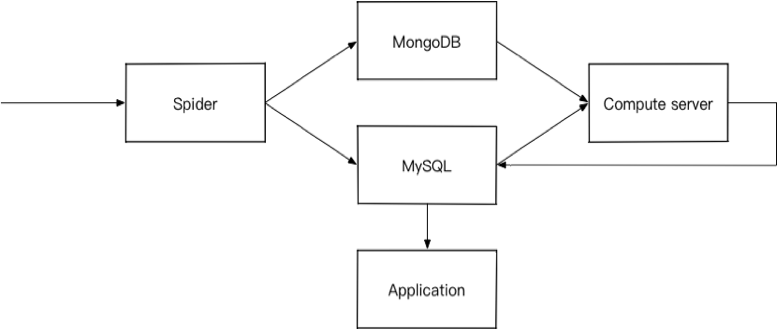
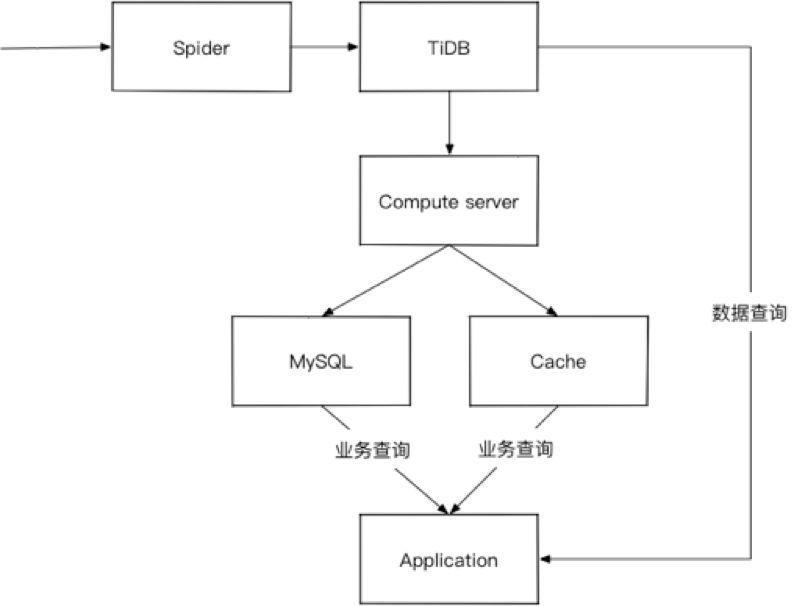

>作者：刘广信，火星文化技术经理

卡思数据是国内领先的视频全网数据开放平台，依托领先的数据挖掘与分析能力，为视频内容创作者在节目创作和用户运营方面提供数据支持，为广告主的广告投放提供数据参考和效果监测，为内容投资提供全面客观的价值评估。

图 1 卡思数据产品展示图

## 业务发展遇到的痛点

卡思数据首先通过分布式爬虫系统进行数据抓取，每天新增数据量在 50G - 80G 之间，并且入库时间要求比较短，因此对数据库写入性能要求很高，由于数据增长比较快，对数据库的扩展性也有很高的要求。数据抓取完成后，对数据进行清洗和计算，因为数据量比较大，单表 5 亿 + 条数据，所以对数据库的查询性能要求很高。

起初卡思数据采用的是多个 MySQL 实例和一个 MongoDB 集群，如图 2。

* MySQL 存储业务相关数据，直接面向用户，对事务的要求很高，但在海量数据存储方面偏弱，由于单行较大，单表数据超过千万或 10G 性能就会急剧下降。

* MongoDB 存储最小单元的数据，MongoDB 有更好的写入性能，保证了每天数据爬取存储速度；对海量数据存储上，MongoDB 内建的分片特性，可以很好的适应大数据量的需求。

图 2 起初卡思数据架构图

但是随着业务发展，暴露出一些问题：

* MySQL 在大数据量的场景下，查询性能难以满足要求，并且扩展能力偏弱，如果采用分库分表方式，需要对业务代码进行全面改造，成本非常高。

* MongoDB 对复杂事务的不支持，前台业务需要用到数据元及连表查询，当前架构支持的不太友好。

## 架构优化

### 1. 需求

针对我们遇到的问题，我们急需这样一款数据库：

* 兼容 MySQL 协议，数据迁移成本和代码改造成本低

* 插入性能强

* 大数据量下的实时查询性能强，无需分库分表

* 水平扩展能力强

* 稳定性强，产品最好有成熟的案例

### 2. 方案调研

未选择 TiDB 之前我们调研了几个数据库，Greenplum、HybirdDB for MySQL（PetaData）以及 PolarDB。Greenplum 由于插入性能比较差，并且跟 MySQL 协议有一些不兼容，首先被排除。

HybirdDB for MySQL 是阿里云推出的 HTAP 关系型数据库，我们在试用一段时间发现一些问题：

* 一是复杂语句导致计算引擎拥堵，阻塞所有业务，经常出现查询超时的情况。

* 二是连表查询性能低下，网络 I/O 出现瓶颈。举一个常见的关联查询，cd_video 表，2200 万数据，cd_program_video 表，节目和视频的关联表，4700 万数据，在关联字段上都建有索引，如下 SQL：

    select v.id,v.url,v.extra_id,v.title fromcd_video v join cd_program_video pv on v.id = pv.video_id where program_id =xxx；

    当相同查询并发超过一定数量时，就会频繁报数据库计算资源不可用的错误。

* 三是 DDL 操作比较慢，该字段等操作基本需要几分钟，下发至节点后易出现死锁。

PolarDB 是阿里云新推出新一代关系型数据库，主要思想是计算和存储分离架构，使用共享存储技术。由于写入还是单点写入，插入性能有上限，未来我们的数据采集规模还会进一步提升，这有可能成为一个瓶颈。另外由于只有一个只读实例，在对大表进行并发查询时性能表现一般。

### 3. 选择 TiDB

在经历了痛苦的传统解决方案的折磨以及大量调研及对比后，卡思数据最终选择了 TiDB 作为数据仓库及业务数据库。

**TiDB 结合了传统的 RDBMS 和 NoSQL 的最佳特性，高度兼容 MySQL，具备强一致性和高可用性，100% 支持标准的 ACID 事务。由于是 Cloud Native 数据库，可通过并行计算发挥机器性能，在大数量的查询下性能表现良好，并且支持无限的水平扩展，可以很方便的通过加机器解决性能和容量问题。另外提供了非常完善的运维工具，大大减轻数据库的运维工作。**

## 上线 TiDB

卡思数据目前配置了两个 32C64G 的 TiDB、三个 4C16G 的 PD、四个 32C128G 的 TiKV。数据量大约 60 亿条、4TB 左右，每天新增数据量大约 5000 万，单节点 QPS 峰值为 3000 左右。

由于数据迁移不能影响线上业务，卡思数据在保持继续使用原数据架构的前提下，使用 Mydumper、Loader 进行数据迁移，并在首轮数据迁移完成后使用 Syncer 进行增量同步。

卡思数据部署了数据库监控系统（Prometheus/Grafana）来实时监控服务状态，可以非常清晰的查看服务器问题。

**由于 TiDB 对 MySQL 的高度兼容性，在数据迁移完成后，几乎没有对代码做任何修改，平滑实现了无侵入升级。**

目前卡思数据的架构如图 3：

图 3 目前卡思数据架构图

查询性能，单表最小 1000 万，最大 8 亿，有比较复杂的连表查询，整体响应延时非常稳定，监控展示如图 4、图 5。

图 4 Duration 监控展示图

图 5 QPS 监控展示图

## 未来展望

目前的卡思数据已全部迁移至 TiDB，但对 TiDB 的使用还局限在数据存储上，可以说只实现了 OLTP。卡思数据准备深入了解 OLAP，将目前一些需要实时返回的复杂查询、数据分析下推至 TiDB。既减少计算服务的复杂性，又可增加数据的准确性。

## 感谢 PingCAP

非常感谢 PingCAP 小伙伴们在数据库上线过程中的大力支持，每次遇到困难都能及时、细心的给予指导，非常的专业和热心。相信 PingCAP 会越来越好，相信 TiDB 会越来越完善，引领 NewSQL 的发展。
