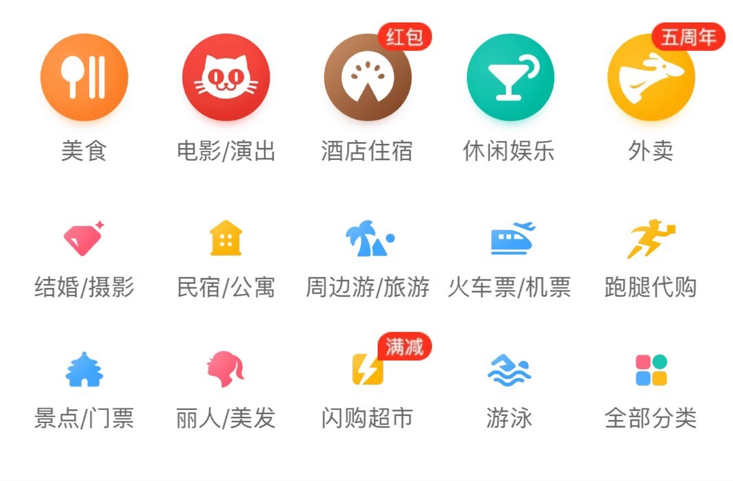
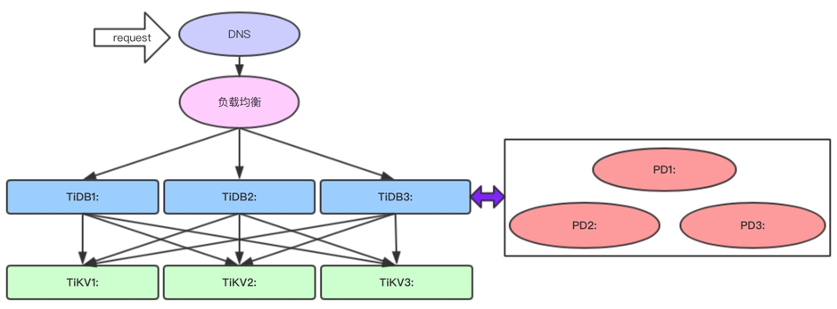
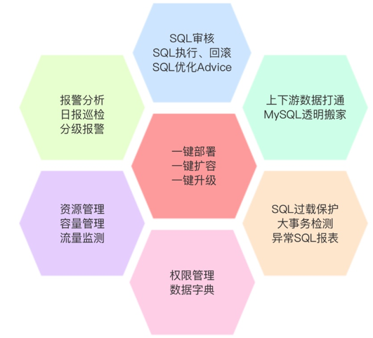
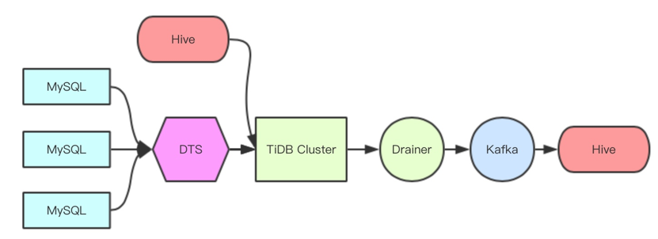
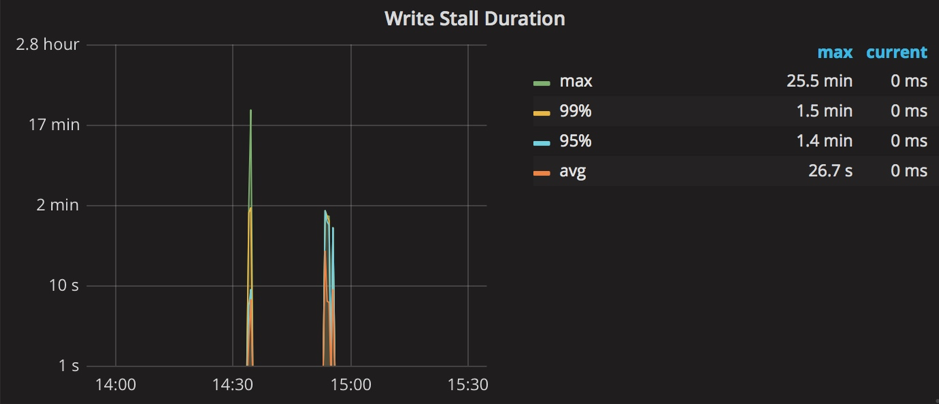
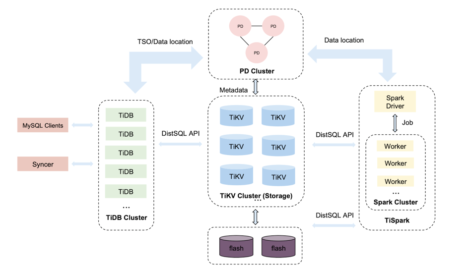

>**作者介绍**：**赵应钢**，美团点评研究员；**李坤**，美团点评数据库专家；**朴昌俊**，美团点评数据库专家。

## 一、背景和现状

在美团，基于 MySQL 构建的传统关系型数据库服务已经难于支撑公司业务的爆发式增长，促使我们去探索更合理的数据存储方案和实践新的运维方式。随着近一两年来分布式数据库大放异彩，美团 DBA 团队联合架构存储团队，于 2018 年初启动了分布式数据库项目。

图 1 美团点评产品展示图

立项之初，我们进行了大量解决方案的对比，深入了解了业界多种 scale-out、scale-up 方案，考虑到技术架构的前瞻性、发展潜力、社区活跃度、以及服务本身与 MySQL 的兼容性，最终敲定了基于 TiDB 数据库进行二次开发的整体方案，并与 PingCAP 官方和开源社区进行深入合作的开发模式。

**美团业务线众多，我们根据业务特点及重要程度逐步推进上线，到截稿为止，已经上线 10 个集群，近 200 个物理节点，大部分是 OLTP 类型的应用，除了上线初期遇到了一些小问题，目前均已稳定运行。初期上线的集群，已经分别服务于配送、出行、闪付、酒旅等业务。**

TiDB 架构分层清晰，服务平稳流畅，但在美团当前的数据量规模和已有稳定的存储体系的基础上，推广新的存储服务体系，需要对周边工具和系统进行一系列改造和适配，从初期探索到整合落地需要走很远的路。下面从几个方面分别介绍：

* 一是从 0 到 1 的突破，重点考虑做哪些事情；
* 二是如何规划实施不同业务场景的接入和已有业务的迁移；
* 三是上线后遇到的一些典型问题介绍；
* 四是后续规划和对未来的展望。

## 二、前期调研测试

### 2.1 对 TiDB 的定位

我们对于 TiDB 的定位，前期在于重点解决 MySQL 的单机性能和容量无法线性和灵活扩展的问题，与 MySQL 形成互补。业界分布式方案很多，我们为何选择了 TiDB 呢？考虑到公司业务规模的快速增长，以及公司内关系数据库以 MySQL 为主的现状，因此我们在调研阶段，对以下技术特性进行了重点考虑：

* 协议兼容 MySQL：这个是必要项。
* 可在线扩展：数据通常要有分片，分片要支持分裂和自动迁移，并且迁移过程要尽量对业务无感知。
* 强一致的分布式事务：事务可以跨分片、跨节点执行，并且强一致。
* 支持二级索引：为兼容 MySQL 的业务，这个是必须的。
* 性能：MySQL 的业务特性，高并发的 OLTP 性能必须满足。
* 跨机房服务：需要保证任何一个机房宕机，服务能自动切换。
* 跨机房双写：支持跨机房双写是数据库领域一大难题，是我们对分布式数据库的一个重要期待，也是美团下一阶段重要的需求。

业界的一些传统方案虽然支持分片，但无法自动分裂、迁移，不支持分布式事务，还有一些在传统 MySQL 上开发一致性协议的方案，但它无法实现线性扩展，最终我们选择了与我们的需求最为接近的 TiDB。与 MySQL 语法和特性高度兼容，具有灵活的在线扩容缩容特性，支持 ACID 的强一致性事务，可以跨机房部署实现跨机房容灾，支持多节点写入，对业务又能像单机 MySQL 一样使用。

### 2.2 测试

针对官方声称的以上优点，我们进行了大量的研究、测试和验证。

首先，我们需要知道扩容、Region 分裂转移的细节、Schema 到 kv 的映射、分布式事务的实现原理。而 TiDB 的方案，参考了较多的 Google 论文，我们进行了阅读，这有助于我们理解 TiDB 的存储结构、事务算法、安全性等，包括：

* Spanner: Google’s Globally-Distributed Database
* Large-scale Incremental Processing Using Distributed Transactions and Notifications
* In Search of an Understandable Consensus Algorithm
* Online, Asynchronous Schema Change in F1

我们也进行了常规的性能和功能测试，用来与 MySQL 的指标进行对比，其中一个比较特别的测试，是证明 3 副本跨机房部署，确实能保证每个机房分布一个副本，从而保证任何一个机房宕机不会导致丢失超过半数副本。从以下几个点进行测试：

* Raft 扩容时是否支持 learner 节点，从而保证单机房宕机不会丢失 2/3 的副本。
* TiKV 上的标签优先级是否可靠，保证当机房的机器不平均时，能否保证每个机房的副本数依然是绝对平均的。
* 实际测试，单机房宕机，TiDB 在高并发下，QPS、响应时间、报错数量，以及最终数据是否有丢失。
* 手动 Balance 一个 Region 到其他机房，是否会自动回来。

从测试结果来看，一切都符合预期。

## 三、存储生态建设

美团的产品线丰富，业务体量大，业务对在线存储的服务质量要求也非常高。因此，从早期做好服务体系的规划非常重要。下面从业务接入层、监控报警、服务部署，来分别介绍一下我们所做的工作。

### 3.1 业务接入层

当前 MySQL 的业务接入方式主要有两种，DNS 接入和 Zebra 客户端接入。在前期调研阶段，我们选择了 DNS + 负载均衡组件的接入方式，TiDB-Server 节点宕机，15s 可以被负载均衡识别到，简单有效。业务架构如图 2。

图 2 业务架构图

后面我们会逐渐过渡到当前大量使用的 Zebra 接入方式来访问 TiDB，从而保持与访问 MySQL 的方式一致，一方面减少业务改造的成本，另一方面尽量实现从 MySQL 到 TiDB 的透明迁移。

### 3.2 监控报警

美团目前使用 Mt-Falcon 平台负责监控报警，通过在 Mt-Falcon 上配置不同的插件，可以实现对多种组件的自定义监控。另外也会结合 Puppet 识别不同用户的权限、文件的下发。这样，只要我们编写好插件脚本、需要的文件，装机和权限控制就可以完成了。监控架构如图 3。

图 3 监控架构图

而 TiDB 有丰富的监控指标，使用流行的 Prometheus + Grafana，一套集群有 700+ 的 Metric。从官方的架构图可以看出，每个组件会推送自己的 Metric 给 PushGateWay，Prometheus 会直接到 PushGateWay 去抓数据。

由于我们需要组件收敛，原生的 TiDB 每个集群一套 Prometheus 的方式不利于监控的汇总、分析、配置，而报警已经在 Mt-Falcon 上实现的比较好了，在 AlertManager 上再造一个也没有必要。因此我们需要想办法把监控和报警汇总到 Mt-Falcon 上面，有如下几种方式：

* 方案一：修改源代码，将 Metric 直接推送到 Falcon，由于 Metric 散落在代码的不同位置，而且 TiDB 代码迭代太快，把精力消耗在不停调整监控埋点上不太合适。
* 方案二：在 PushGateWay 是汇总后的，可以直接抓取，但 PushGateWay 是个单点，不好维护。
* 方案三：通过各个组件（TiDB、PD、TiKV）的本地 API 直接抓取，优点是组件宕机不会影响其他组件，实现也比较简单。

我们最终选择了方案三。该方案的难点是需要把 Prometheus 的数据格式转化为 Mt-Falcon 可识别的格式，因为 Prometheus 支持 Counter、Gauge、Histogram、Summary 四种数据类型，而 Mt-Falcon 只支持基本的 Counter 和 Gauge，同时 Mt-Falcon 的计算表达式比较少，因此需要在监控脚本中进行转换和计算。

### 3.3 批量部署

TiDB 使用 Ansible 实现自动化部署。迭代快，是 TiDB 的一个特点，有问题快速解决，但也造成 Ansible 工程、TiDB 版本更新过快，我们对 Ansible 的改动，也只会增加新的代码，不会改动已有的代码。因此线上可能同时需要部署、维护多个版本的集群。如果每个集群一个 Ansible 目录，造成空间的浪费。我们采用的维护方式是，在中控机中，每个版本一个 Ansible 目录，每个版本中通过不同 inventory 文件来维护。这里需要跟 PingCAP 提出的是，Ansible 只考虑了单集群部署，大量部署会有些麻烦，像一些依赖的配置文件，都不能根据集群单独配置（咨询官方得知，PingCAP 目前正在基于 Cloud TiDB 打造一站式 HTAP 平台，会提供批量部署、多租户等功能，能比较好的解决这个问题）。

### 3.4 自动化运维平台

随着线上集群数量的增加，打造运维平台提上了日程，而美团对 TiDB 和 MySQL 的使用方式基本相同，因此 MySQL 平台上具有的大部分组件，TiDB 平台也需要建设。典型的底层组件和方案：SQL 审核模块、DTS、数据备份方案等。自动化运维平台展示如图 4。

图 4 自动化运维平台展示图

### 3.5 上下游异构数据同步

TiDB 是在线存储体系中的一环，它同时也需要融入到公司现有的数据流中，因此需要一些工具来做衔接。PingCAP 官方标配了相关的组件。

公司目前 MySQL 和 Hive 结合的比较重，而 TiDB 要代替 MySQL 的部分功能，需要解决 2 个问题：

* MySQL to TiDB
    * MySQL 到 TiDB 的迁移，需要解决数据迁移以及增量的实时同步，也就是 DTS，Mydumper + Loader 解决存量数据的同步，官方提供了 DM 工具可以很好的解决增量同步问题。
    * MySQL 大量使用了自增 ID 作为主键。分库分表 MySQL 合并到 TiDB 时，需要解决自增 ID 冲突的问题。这个通过在 TiDB 端去掉自增 ID 建立自己的唯一主键来解决。新版 DM 也提供分表合并过程主键自动处理的功能。

* Hive to TiDB & TiDB to Hive
    * Hive to TiDB 比较好解决，这体现了 TiDB 和 MySQL 高度兼容的好处，insert 语句可以不用调整，基于 Hive to MySQL 简单改造即可。
    * TiDB to Hive 则需要基于官方 Pump + Drainer 组件，Drainer 可以消费到 Kafka、MySQL、TiDB，我们初步考虑用下图 5 中的方案通过使用 Drainer 的 Kafka 输出模式同步到 Hive。

图 5 TiDB to Hive 方案图

## 四、线上使用磨合

对于初期上线的业务，我们比较谨慎，基本的原则是：离线业务 -> 非核心业务 -> 核心业务。TiDB 已经发布两年多，且前期经历了大量的测试，我们也深入了解了其它公司的测试和使用情况，可以预期的是 TiDB 上线会比较稳定，但依然遇到了一些小问题。总体来看，在安全性、数据一致性等关键点上没有出现问题。其他一些性能抖动问题，参数调优的问题，也都得到了快速妥善的解决。这里给 PingCAP 的同学点个大大的赞，问题响应速度非常快，与我们内部研发的合作也非常融洽。

### 4.1 写入量大、读 QPS 高的离线业务

我们上线的最大的一个业务，每天有数百 G 的写入量，前期遇到了较多的问题，我们重点说说。

业务场景：

* 稳定的写入，每个事务操作 100~200 行不等，每秒 6w 的数据写入。
* 每天的写入量超过 500G，以后会逐步提量到每天 3T。
* 每 15 分钟的定时读 job，5000 QPS（高频量小）。
* 不定时的查询（低频量大）。

之前使用 MySQL 作为存储，但 MySQL 到达了容量和性能瓶颈，而业务的容量未来会 10 倍的增长。初期调研测试了 ClickHouse，满足了容量的需求，测试发现运行低频 SQL 没有问题，但高频 SQL 的大并发查询无法满足需求，只在 ClickHouse 跑全量的低频 SQL 又会 overkill，最终选择使用 TiDB。

测试期间模拟写入了一天的真实数据，非常稳定，高频低频两种查询也都满足需求，定向优化后 OLAP 的 SQL 比 MySQL 性能提高四倍。但上线后，陆续发现了一些问题，典型的如下：

#### 4.1.1 TiKV 发生 Write Stall

TiKV 底层有 2 个 RocksDB 作为存储。新写的数据写入 L0 层，当 RocksDB 的 L0 层数量达到一定数量，就会发生减速，更高则发生 Stall，用来自我保护。TiKV 的默认配置：

* level0-slowdown-writes-trigger = 20
* level0-stop-writes-trigger = 36

遇到过的，发生 L0 文件过多可能的原因有 2 个：

* 写入量大，Compact 完不成。
* Snapshot 一直创建不完，导致堆积的副本一下释放，rocksdb-raft 创建大量的 L0 文件，监控展示如图 6。

图 6 TiKV 发生 Write Stall 监控展示图

我们通过以下措施，解决了 Write Stall 的问题：

* 减缓 Raft Log Compact 频率（增大 raft-log-gc-size-limit、raft-log-gc-count-limit）
* 加快 Snapshot 速度（整体性能、包括硬件性能）
* max-sub-compactions 调整为 3
* max-background-jobs 调整为 12
* level 0 的 3 个 Trigger 调整为 16、32、64

#### 4.1.2 Delete 大量数据，GC 跟不上

现在 TiDB 的 GC 对于每个 kv-instance 是单线程的，当业务删除数据的量非常大时，会导致 GC 速度较慢，很可能 GC 的速度跟不上写入。

目前可以通过增多 TiKV 个数来解决，长期需要靠 GC 改为多线程执行，官方对此已经实现，即将发布。

#### 4.1.3 Insert 响应时间越来越慢

业务上线初期，insert 的响应时间 80 线（Duration 80 By Instance）在 20ms 左右，随着运行时间增加，发现响应时间逐步增加到 200ms+。期间排查了多种可能原因，定位在由于 Region 数量快速上涨，Raftstore 里面要做的事情变多了，而它又是单线程工作，每个 Region 定期都要 heartbeat，带来了性能消耗。tikv-raft propose wait duration 指标持续增长。

解决问题的办法：

* 临时解决
    * 增加 Heartbeat 的周期，从 1s 改为 2s，效果比较明显，监控展示如图 7。

图 7 insert 响应时间优化前后对比图

* 彻底解决
    * 需要减少 Region 个数，Merge 掉空 Region，官方在 2.1 版本中已经实现了 Region Merge 功能，我们在升级到 2.1 后，得到了彻底解决。
    * 另外，等待 Raftstore 改为多线程，能进一步优化。（官方回复相关开发已基本接近尾声，将于 2.1 的下一个版本发布。）

#### 4.1.4 Truncate Table 空间无法完全回收

DBA Truncate 一张大表后，发现 2 个现象，一是空间回收较慢，二是最终也没有完全回收。

* 由于底层 RocksDB 的机制，很多数据落在 level 6 上，有可能清不掉。这个需要打开 cdynamic-level-bytes 会优化 Compaction 的策略，提高 Compact 回收空间的速度。
* 由于 Truncate 使用 delete_files_in_range 接口，发给 TiKV 去删 SST 文件，这里只删除不相交的部分，而之前判断是否相交的粒度是 Region，因此导致了大量 SST 无法及时删除掉。
    * 考虑 Region 独立 SST 可以解决交叉问题，但是随之带来的是磁盘占用问题和 Split 延时问题。
    * 考虑使用 RocksDB 的 DeleteRange 接口，但需要等该接口稳定。
    * 目前最新的 2.1 版本优化为直接使用 DeleteFilesInRange 接口删除整个表占用的空间，然后清理少量残留数据，已经解决。

#### 4.1.5 开启 Region Merge 功能

为了解决 region 过多的问题，我们在升级 2.1 版本后，开启了 region merge 功能，但是 TiDB 的响应时间 80 线（Duration 80 By Instance）依然没有恢复到当初，保持在 50ms 左右，排查发现 KV 层返回的响应时间还很快，和最初接近，那么就定位了问题出现在 TiDB 层。研发人员和 PingCAP 定位在产生执行计划时行为和 2.0 版本不一致了，目前已经优化。

### 4.2 在线 OLTP，对响应时间敏感的业务

除了分析查询量大的离线业务场景，美团还有很多分库分表的场景，虽然业界有很多分库分表的方案，解决了单机性能、存储瓶颈，但是对于业务还是有些不友好的地方：

* 业务无法友好的执行分布式事务。
* 跨库的查询，需要在中间层上组合，是比较重的方案。
* 单库如果容量不足，需要再次拆分，无论怎样做，都很痛苦。
* 业务需要关注数据分布的规则，即使用了中间层，业务心里还是没底。

因此很多分库分表的业务，以及即将无法在单机承载而正在设计分库分表方案的业务，主动找到了我们，这和我们对于 TiDB 的定位是相符的。这些业务的特点是 SQL 语句小而频繁，对一致性要求高，通常部分数据有时间属性。在测试及上线后也遇到了一些问题，不过目前基本都有了解决办法。

#### 4.2.1 SQL 执行超时后，JDBC 报错

业务偶尔报出 privilege check fail。

是由于业务在 JDBC 设置了 QueryTimeout，SQL 运行超过这个时间，会发行一个 “kill query” 命令，而 TiDB 执行这个命令需要 Super 权限，业务是没有权限的。

其实 kill 自己的查询，并不需要额外的权限，[目前已经解决了这个问题](https://github.com/pingcap/tidb/pull/7003)，不再需要 Super 权限，已在 2.0.5 上线。

#### 4.2.2 执行计划偶尔不准

TiDB 的物理优化阶段需要依靠统计信息。在 2.0 版本统计信息的收集从手动执行，优化为在达到一定条件时可以自动触发：

* 数据修改比例达到 tidb_auto_analyze_ratio
* 表一分钟没有变更（目前版本已经去掉这个条件）

但是在没有达到这些条件之前统计信息是不准的，这样就会导致物理优化出现偏差，在测试阶段（2.0 版本）就出现了这样一个案例：业务数据是有时间属性的，业务的查询有 2 个条件，比如：时间+商家 ID，但每天上午统计信息可能不准，当天的数据已经有了，但统计信息认为没有。这时优化器就会建议使用时间列的索引，但实际上商家 ID 列的索引更优化。这个问题可以通过增加 Hint 解决。

**在 2.1 版本对统计信息和执行计划的计算做了大量的优化，也稳定了基于 Query Feedback 更新统计信息，也用于更新直方图和 Count-Min Sketch，非常期待 2.1 的 GA。**

## 五、总结展望

经过前期的测试、各方的沟通协调，以及近半年对 TiDB 的使用，我们看好 TiDB 的发展，也对未来基于 TiDB 的合作充满信心。

接下来，我们会加速推进 TiDB 在更多业务系统中的使用，同时也将 TiDB 纳入了美团新一代数据库的战略选型中。当前，我们已经全职投入了 3 位 DBA 同学和多位存储计算专家，从底层的存储，中间层的计算，业务层的接入，到存储方案的选型和布道，进行全方位和更深入的合作。

长期来看，结合美团不断增长的业务规模，我们将与 PingCAP 官方合作打造更强大的生态体系：

+ **Titan**：Titan 是 TiDB 下一步比较大的动作，也是我们非常期待的下一代存储引擎，它对大 Value 支持会更友好，将解决我们单行大小受限，单机 TiKV 最大支持存储容量的问题，大大提升大规模部署的性价比。

+ **Cloud TiDB（based on Docker & K8s）**：云计算大势所趋，PingCAP 在这块也布局比较早，今年 8 月份开源了 TiDB Operator，Cloud TiDB 不仅实现了数据库的高度自动化运维，而且基于 Docker 硬件隔离，实现了数据库比较完美的多租户架构。和官方同学沟通，目前他们的私有云方案在国内也有重要体量的 POC，这也是美团看重的一个方向。

+ **TiDB HTAP Platform**：PingCAP 在原有 TiDB Server 计算引擎的基础上，还构建 TiSpark 计算引擎，和他们官方沟通，他们在研发了一个基于列的存储引擎，这样就形成了下层行、列两个存储引擎、上层两个计算引擎的完整混合数据库（HTAP），这个架构不仅大大的节省了核心业务数据在整个公司业务周期里的副本数量，还通过收敛技术栈，节省了大量的人力成本、技术成本、机器成本，同时还解决了困扰多年的 OLAP 的实效性。后面我们也会考虑将一些有实时、准实时的分析查询系统接入 TiDB。

图 8 TiDB HTAP Platform 整体架构图

后续的物理备份方案，跨机房多写等也是我们接下来逐步推进的场景，总之我们坚信未来 TiDB 在美团的使用场景会越来越多，发展也会越来越好。

TiDB 在业务层面、技术合作层面都已经在美团扬帆起航，美团点评将携手 PingCAP 开启新一代数据库深度实践、探索之旅。后续，还有美团点评架构存储团队针对 TiDB 源码研究和改进的系列文章，敬请期待！

