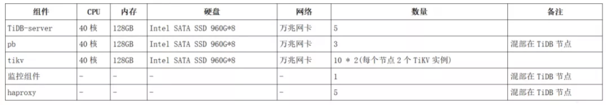
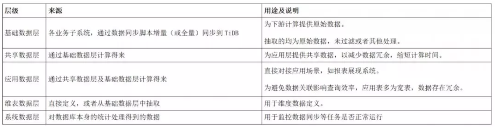
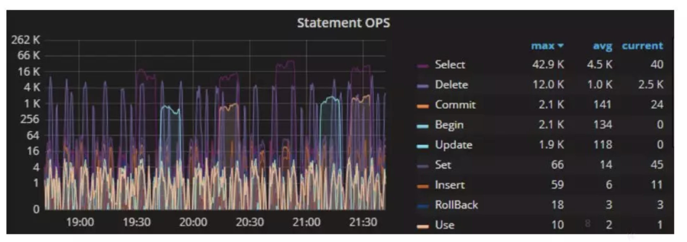
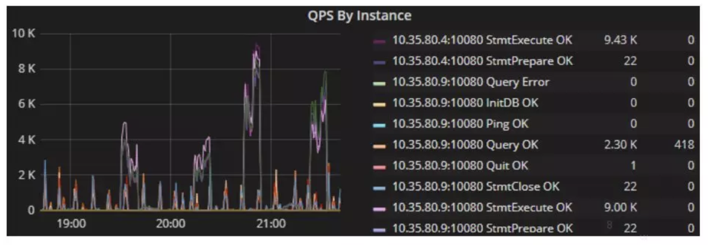
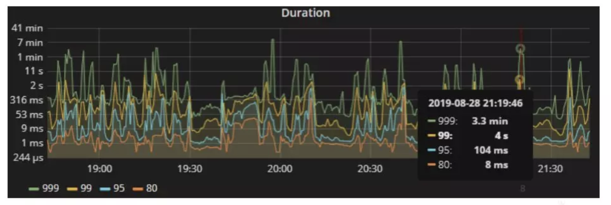
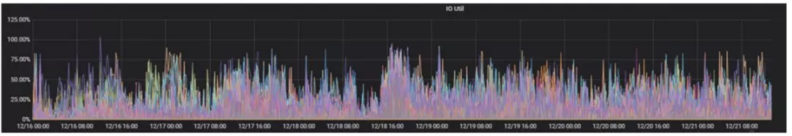
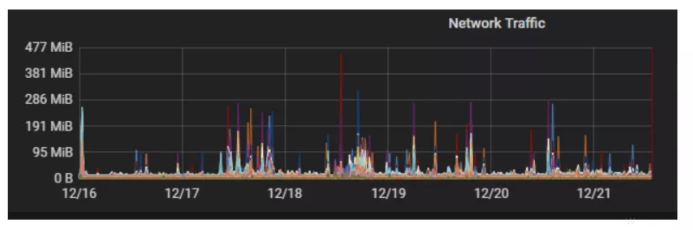
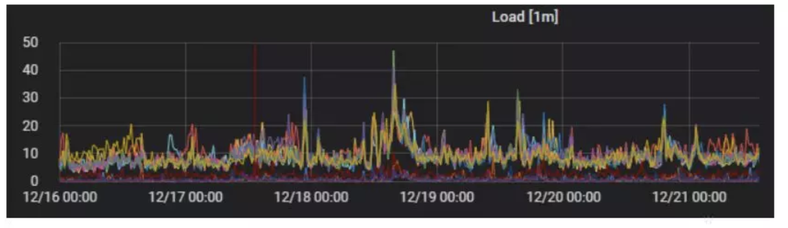
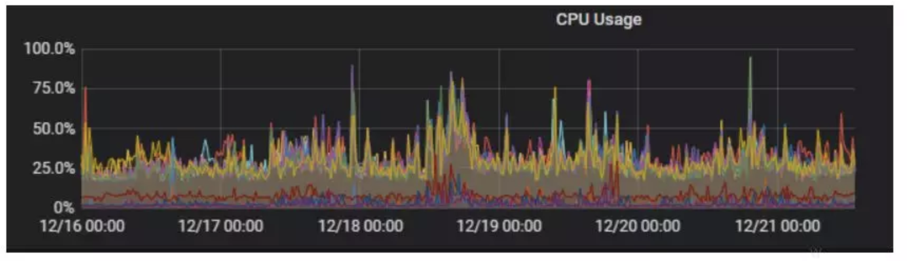
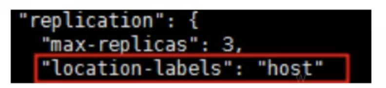

>本文转载自微信公众号“[OPPO大数据](https://mp.weixin.qq.com/s/BYsUOCCU6W9bIQ-fK8ESDw?scene=25#wechat_redirect)”。
>
>**作者介绍**：OPPO 数据分析与解决方案团队主要负责 OPPO 全集团的大数据分析和解决方案提供，团队成员多来自一线互联网公司及著名高校，在 OPPO 众多场景的大数据应用方面有很深经验，极大的支撑了业务迅速发展。
>
>文章具体作者：羊欢，代凯，柳青，陈英乐。

OPPO 大数据中心在 2019 年初承接了接入某业务线核心数据的重要任务：一期目标是建立一个能提供准实时大数据查询服务的数据仓库。我们选用了之前从未在公司大规模正式使用过的 TiDB 作为核心数据库引擎。本文记录这次吃螃蟹的一些经验和教训，供大家参考。

## 前期工作

### 核心挑战

经过需求调研阶段，我们发现面临以下核心的挑战：

1. **大数据能力支持**。从业务数据量看，当前虽然尚在 TB 级别，但增长速度非常快，业务本身有进行全量整合分析查询的需求。

2. **数据接入困难**。数据分散且多样，跨国，多种 DB 类型，多网络环境，接入难度较大。

3. **数据变动频繁**。核心数据存在生命周期，在生命周期内变动频繁，这与互联网的核心数据一旦生成就不再变化有较大不同。

4. **服务实时性较高**。数据整合的速度和查询结果越实时，对业务价值就越大。

### 现有技术架构体系

**公司数据中心目前承载着公司各业务系统积累的数据。**

数据仓库方面的技术体系：

- 离线数据的存储和应用架构是主流的 Hadoop+Hive/Spark/Presto。

- 实时数据服务则基于 Kafka/Flink/SparkStreaming 等流行的框架。

离线数据平台可以提供 T+1 及小时级别的数据计算服务；而实时数据服务主要适用于互联网应用场景，即大多行为数据生成后不再发生变化。这也是业界非常典型的基础技术架构。

### 技术选型考量

一开始我们打算采用业界常用的办法，即利用数据中心现有的基础设施开发出离线和实时两套体系的数据并进行整合后提供给报表查询接口。但其实这个方案其实有一个最致命的问题：大部分此业务数据在完整的生命周期里是经常发生变动的。而项目里一个重要的需求是要能近实时（最多半个小时）的查询出结果。离线任务运行后的结果很可能很快就失效了，需要重新计算。而离线计算耗时较长，根本无法满足准实时需求；如果把大部分计算交给实时引擎，也要进行较为复杂的代码设计和框架的修改适配。

事实上我们已经做好了服务降级的打算。我们面临困境的实质是接入频繁变动的行业数据对于主要源自互联网的大数据技术体系是一种新的挑战。因此我们继续不断的寻找更好的方案。我们的目标是找到具有以下特点的体系：

1. 能近实时的对所有层级的数据进行更新（主要是原始数据和各层聚合数据）。

2. 秒级的查询性能。

3. 不再有实时和离线的界限，只需要同一套代码。

4. 方便的存储扩展，支持大数据。

5. 较低的技术栈要求。

在这种背景下，我们关注到了已经在 OPPO 内部进行着少量测试（作为备份从库等）的 TiDB。它的主要特点及带来的好处是：

1. **完全兼容 MySQL 协议**。低技术栈，在合理的索引设计下，查询性能优异到秒级出结果；对小批量的数据的更新和写入也相对优秀。

2. **水平弹性扩展**。能支持大数据存储，扩容成本仅为机器成本。

3. **支持大数据情况下的复杂查询（TiSpark 组件可使用 Spark 引擎）。**

4. **可用性高**。Raft 协议保证数据强一致且在不丢失大多数副本的前提下能自动恢复。

5. **完全开源，社区活跃**。开源约 4 年，GitHub Star 数 2 万，Fork 数 3 千。根据官方数据：截止 19 年 8 月，已经有约 3 千家企业建立了规模不一的测试集群，500 家企业有线上集群，其中包括数家银行（北京银行，微众银行）的核心交易系统。网络上也能看到众多一线互联网公司的案例分享。

6. **作为 HTAP，未来将可以方便的对接 TP 类系统**。当前离线架构的数据经常需要再次出库到诸如 MySQL 库里以便 TP 系统快速读取，无疑增加了系统复杂度。HTAP 将交易和分析系统的界限消除，交易数据生成即可用于分析，而分析结果生成后即可以用于交易，没有了 ETL 过程，非常便利，而且让 IT 架构逻辑更近似业务逻辑。

对于这次的项目来说，我们最看重的三点是：

1. 可以很方便的支持数据频繁更新。

2. 优秀的查询响应速度。

3. 支持方便的无限扩容。

由于并不可见的重大缺陷，且阅读了许多比此次项目数据量级大得多的成功案例，我们正式开始了吃螃蟹的征程。

## 实践过程

### 项目架构和实施

项目一期的架构和实施相对简单。主要是集群建设+数据同步+模型建设+任务调度。下面简要介绍一下。

#### 集群建设

TiDB集群的架构图及部署文档参考官方网站即可，不再赘述，以下是项目配置供参考：



关于存储官方推荐采用 NVME SSD，这样能最大发挥 TiKV 的 IO 能力 。目前由于某些原因，暂时退而求其次采用 SATA SSD，通过把磁盘分成 2 组 TiKV 数据盘，每一组 3 块盘做 RAID0，最后剩余 2 块盘做 RAID1 作为系统盘，将磁盘 IO 能力提升。然后每组数据磁盘上部署一个 TiKV 节点。TiDB 的部署采用官网推荐的 TiDB Ansible 部署方式，这里不再赘述，大家可以去 PingCAP 官网查看。

#### 数据同步

项目采用了定期（每 10 分钟，可调整）调度 Python 脚本以实现增量抽取数据。源数据库是 Oracle/SQLServer，目标数据库是 TiDB 集群。数据同步脚本是自研的，代码简洁但非常强大，核心是采用 pyodbc 开源库，并具有以下特点：

1. 支持多种数据目标/源 DB，丰富的自定义 DDL 支持（包括自动建表，添加字段注释，自定义字段处理），自定义抽取 SQL（既可以完整同步数据，亦可以同步前就进行一些预处理，灵活性强）。

2. 便捷的读写并发量控制（读写依赖数据队列沟通，还可以平衡数据源并发查询压力及目标库的写压力，以及历史数据同步）。

同步脚本要求有增量抽取的控制字段，比如 update_time 等，一般规范的表设计均能满足，但项目中确实遇到一些因历史原因导致我们不得不进行全表覆盖同步，部分表还存在“硬删除”的情况 。最后通过开发新的删除服务以记录删除的主键，进行同步删除同步。

对于普通的一次增量同步，比如同步最近 10 分钟的数据。我们是定义好同步脚本，传入时间周期及合理的并发数，发起查询请求，并将返回的数据返回到临时队列中；写进程则按 5 千条一次读队列中的数据，按主键先删后插，实现了增量的数据新增或者更新。

另外，出于项目周期及成本等考虑，项目并未采用读取 Oracle Redo Log 的方式。**这种方式的优点是最小化地减少读写操作；缺点是需要付费组件支持，需要单独开发，以及日志容量问题导致的系统运维难度高等。**

数据同步看起来简单，但实际上还是遇到了以下困难并进行了相应的解决：

1. 由于是多进程同步，部分异常捕获在初期被忽略了，在后来验证的过程中一一补齐，最后保证了只要任务正常完成，同步即无误。

2. 数据并发写压力较大（初始化时数据同步量非常大）的情况下，会出现 TiDB 承压，存在 TiKV 写失败的情况，需要控制并发量，并在实践中得到最佳的配置。

3. 连接频繁失败问题，用 Proxy 解决，以及高可用方案。由于 TiDB 在遇到超大 SQL 请求时，会一直申请内存直到 OOM，最后 TiDB 重启，最后采用 HAPROXY 来解决 TiDB 的高可用性。这样一个节点重启尽量不影响其他 SQL 的运行。另外 HAPROXY 本身也需要保证高可用，最后是借助运维的 OGW 集群来负责HAPROXY的高可用。

4. 联合索引设置不合理，导致索引浪费，未来需要进行索引优化。

5. 国外数据库与国内网络连接不稳定，主从库同步延迟导致无法完整同步数据。最后采取了实时监控主从同步延迟及获取数据业务时间最大值等双重措施保证数据同步的准确性和及时性。

6. 数据同步缺少监控机制，对同数据同步过程中是否有数据丢失，或者说怎么保证两边数据库是一致的，时间久了会不会出现不一致的情况，怎么快速修复等，目前是通过脚本定期统计两边表记录数的方式进行监控。

#### 模型建设

一期项目主要目标是将分散的数据统一存储起来，以及进行一些大量数据明细表之间的关联查询。当时面临两种选择：

**方案一：**

仅对源数据进行基础性的处理，然后使用复杂的 SQL 完成业务模型的定义（OPPO 自研报表平台 InnerEye 支持按 SQL 语句自定义查询接口），每次用户查询的时候，都通过这个模型 SQL 即时的运算并返回结果（可设置缓存时间）。这个做法的好处是几乎没有任何的中间甚至结果数据的开发工作；坏处是对算力的极大浪费，而且后期并发度变大后，性能将是瓶颈。

**方案二：**

进行常规的分层模型开发，按周期更新数据。由于一期项目较少聚合类报表，多是明细级数据查询，我们仅仅将模型主要分为共享层和应用层。查询接口直接使用应用层单表查询，可以通过优化索引实现秒查数据；共享层则是为各个应用层的结果表提供一些公共的基础数据支持。这种做法将面临的挑战将是：如何在 10 分钟内，将所有的数据模型都完成相应的增量更新或者插入。

评估方案一的时候，使用了 TiSpark 进行了验证，然而结果并不是很好，响应时间达数分钟，当然原因可能是集群算力不够，也可能是 SQL 不够优化。最终考虑到未来并发的压力，很快把这个偷懒的方案最终否决了。

在实施方案二的过程中发现，有良好的索引的情况下，只要遵循增量更新的原则，完全能满足性能需求。模型建设的输出是一系列的 SQL 计算脚本。

最后，根据此业务系统目前的数据情况将数据模型设计为三层设计，基础数据，共享数据，应用数据。另外有独立的维表数据层及系统数据层。



以上各层的数据，没有进行分库分表（在 TiDB 的技术框架中，不需要进行分库分表来提升性能），数据生成后的一段时间（一般最长一个月）内都会发生变更。

由于采用的是增量更新，因此能很快的完成。唯一的缺点是：**在系统初始化或者要修复很长时间段的数据时，由于索引的存在导致写入速度较慢（相对无索引的文件表），但依然可以通过一定技术方案来规避。**

#### 任务调度

目前 OPPO 的分布式调度系统是基于 airflow 开源项目搭建。同步任务与计算任务分属独立的 DAG，这样虽然会多一些体力活（建立跨 DAG 依赖任务），但减少了不同类型/国家的任务的耦合度，方便了运维，提高了数据服务的可用性。

调度系统的使用过程中，需要注意的点主要有：

1. 队列数量。合理设置任务队列的总数，保证任务执行的及时性及机器负载的平衡。

2. 多机器。由于系统的准实时性，至少准备两台计算和同步的物理服务器，以保证数据服务不中断。

3. 优化 airfow 本身。由于 airflow 本身存在一些问题，因此需要建立独立于 airflow 的运行监控机制。比如通过对其 db 表的查询来监控其是否出现任务长时间阻塞等异常情况；另外需要定时清除历史运行记录，以提升 airflow 的 web 服务体验。

4. 时差问题。由于各国家地区数据库存在时差问题，最后采用了脚本共用、调度分离的方式，减少耦合带来的调度堵塞问题。

### 遇到的问题

从最开始的 2.x 版本，到现在稳定运行的 2.1.13，主要遇到了以下几个重要的问题：

#### 1. 提交事务大小限制问题

TiDB 本身是 TP 系统，因此出于对事务稳定性的考虑，对每次提交事务涉及的数据量大小有所限制。但由于项目本身每个任务涉及的数量有可能高达千万行，因此需要打开TiDB的允许批量插入/删除设置项。

TiDB 特意对事务大小设置了一些限制以减少这种影响：

- 单个事务包含的 SQL 语句不超过 5000 条（默认）。

- 每个键值对不超过 6MB。

- 键值对的总数不超过 300,000。

- 键值对的总大小不超过 100MB。

为了避免在运行中出现过大事务，在项目中采取以下配置：

```
SET SESSION TiDB_batch_insert = 1;
SET SESSION TiDB_batch_delete = 1;set autocommit=1;
```

同时由于索引的存在，在进行数据的写入过程中，过多的索引会加大事务的开销，可以通过减少批次大小来降低单次事务（默认是 20000）：

```
set @@session.TiDB_dml_batch_size = 5000;
```

#### 2. Proxy 连接失败的问题

项目运行过程中多次应用端出现 connect timeout 的情况，除去 TiDB Server 本来实例重启的问题，haproxy 的连接超时时间设置过短，导致执行时间稍长的 SQL 就会被断开连接，这个时候需要调整 haproxy 的超时参数：

```
timeout queue 30m
timeout connect 30m
timeout client 30m
timeout server 30m
```

#### 3. TiDB Server 服务重启问题

在项目过程中曾出现了多次 TiDB Server 服务重启的现象，主要原因及措施如下：

- TiDB Server 节点出现了 OOM。由于前期负载较低，将 TiSpark 服务直接部署在了 TiDB Server 节点，导致有大查询时经常出现 OOM 情况。后面将 TiSpark 服务和 TiDB Server 服务进行了分开部署，并调整 OOM 相关配置为：oom-action: "cancel"。

- 机器故障问题。更换相关硬件设施。

#### 4. 无法锁表问题

为了解决“硬删除”问题，对小表同步的时候采取了覆盖更新的模型，即先删除全表再写入新数据。但由于目前 TiDB 没有锁表的功能（锁写或者读），导致这个小小的空档如果被其他任务读取就会造成数据错误。虽然由于有任务依赖关系的存在，这种情况非常少发生，但在数据修复或者人工运行任务的时候，还是会造成问题。

目前的解决方案是手工实现简单的锁表机制；另外就是可以使用临时表然后 replace into 来解决。至于 TiDB 的系统级别的锁表功能已经在规划中了。

#### 5. 与 Hadoop 数据湖的打通

项目受到了上级的一个重大的挑战：在 TiDB 中的数据无法与现有数据（主要以 hive 表形式存储于 Hadoop 集群中）形成协同作用，项目价值会因此大打折扣。 

针对这个挑战，最开始打算再同步一份数据到 Hadoop 集群中，但这样做其实是存储的极大浪费，但在当时似乎是唯一的办法。在项目快接近尾声的时候，发现可以通过在 TiSpark 集群上通过 thriftServer（最后进化到使用 Livy 服务）的方式，打通两个体系的数据，实现 hdfs 和 TiKV 两个数据源的混合查询。最后也确实取得了成功并已经服务了数个需求。相关的技术细节未来将以另外的文章进行说明和分享。


#### 6. 脏数据处理

假设要插入 20 万条数据，但由于事务限制，系统只能 5000 行条提交一次，一共需要提交 40 次。

现在的问题是这 40 次可能在任一一次提交中失败，这样先前提交的数据就成了脏数据，因此在重试的时候需要删除这些数据后再做。因为数仓任务经常有重跑的需求，而目前 TiDB 体系下没有分区覆盖，因此这是一个需要注意的点。

### 运行性能

目前系统上线约三个月，暂未出现任何较大的技术问题，运行非常平稳。以下是抽取的一些日常运行数据或压测数据供参考。

#### 1. 集群 OPS 和 QPS




**在现有环境上，集群 OPS 最大可达到 61K，QPS 最大可达到 12.11K，查询性能比较稳定。**

#### 2. 高可用

主要基于 TiDB Server 之上负载均衡组件 Haproxy 和 TiKV 的多副本机制实现。

#### 3. 查询稳定性



上图中，除了有部分整机信息聚合查询外耗时较长(主要使用 TiSpark 组件)外，可以看到 99% 的查询在 4S 内进行了返回，而 95% 的查询在 104ms 内返回，可以说性能是非常不错。**目前表的数据行量主要处于百万到百亿行级别，而且索引数量并不多，因此能获得当前的性能可以说超出预期。**

### 升级 3.0.5

由于 2.X 版本在达到 250 万个 region 左右出现了一些性能问题，IO/CPU 负载接近满负荷。跟官方沟通后，我们决定升级到 3.0.5 这一稳定版本。**升级后，在没有任何硬件变更的情况下，性能有了接近翻倍的提升，目前系统的核心资源都出现大幅空闲。**






### TiDB 技术体系的限制

项目结束后，现在回过头来看 TiDB，我们认为有以下一些比较重要的点需要注意：

1. **TiDB 首先是一个 TP 系统**。即：目前来看 TiDB 主要是为了 TP 系统设计的，AP 方面的功能有待加强。事实上 PingCAP 已经认识到了 AP 的重要性，在 3.x 中，AP 的功能将会通过引入 TiFlash 组件而大大加强，从而成为真正的 HTAP。

2. **TiDB 存储成本相对 Hadoop 集群来说较高**。目前至少要求是 SSD；加上未来 TiFlash 的引入，1 份数据将会存 4 份，存储成本相对更大。

3. **TiDB 目前（截止 2019 年 9 月）尚未有 PB 级别的生产集群**。因此可能直接应用于海量数据的互联网数据应用可能会遇到其他一些问题。

### 其他经验教训

#### 1. 不要在一个可能包含很长字符串的列上创建索引

在 TiDB 建立索引可以极大提高查询性能，但要避免在一个可能包含很长字符串的列建索引，否则在创建和使用索引时，都会花费较大的代价。而且当大小超过默认的 3072 byte 时，TiDB 会报错。


#### 2. 确保开启位置标签机制

当一个机器部署多个 TiKV 实例，未提高系统稳定性和可用性，一定要确保开启了位置标签机制。前期部署集群服务时，虽然在 inventory.ini 文件中设置了以下内容 `location_labels = ["host"]`，但是后来发现并没有生效，导致一个机器 down 了以后，集群中某些数据查询出现了严重问题:


究其原因是因为位置标签机制没有生效，导致同一个节点上存在同一个 region 的两个副本(一共 3 副本)，导致不能再正常对外提供相关服务了。

可以通过 pd-ctl 确认位置标签机制生效，如 config show all 的时候有如下内容，代表已生效：



如果没有生效，可通过以下方式使得生效：

```
config set location-labels "host"
```

**总结：一台机器部署多个 TiKV 实例的场景，要充分利用 location_labels 机制，将副本部署到不同的机器上，以增强系统的稳定性。**

#### 3. 不支持三段式查询

目前 TiSpark 还不支持如下的三段式查询。

```
dbname.tablename.columnname
```

如以下 sql 会执行失败：

```
select dbname.tablename.columnname from dbname.tablename
```

可以通过别名的方式加以解决：

```
select A.columnname from dbname.tablename  as A
```

#### 4. 主键变更

目前在 TiDB 上进行变更主键（增加或者删除字段）是不被支持的，唯一的办法只有重建表。这在某些场景会成为一个较为痛苦的经历。因此在表设计阶段需要非常的小心，争取一次做对。

## 总结

项目以极小的人力投入较为成功的实现了预定目标，也陆续服务到了许多其他部门和项目，产生了良好的数据协同效应。

从此次实践中，我们认为：**随着 AP 能力的加强，TiDB 几乎可以做为大多数亚 PB 级别数据应用的存储引擎。** 因为它的 HTAP 优雅架构能大大简化运维和开发人员的工作，让他们集中到业务逻辑表达和处理上。

当前的主流大数据技术主要源于互联网平台，大多在某些方面有妥协，因而需要相互补充，导致系统整体架构越来越复杂，最终让运维及开发门槛也越来越高，这也是目前没有更好办法的办法。但最优的数据系统架构应该是将业务逻辑无关的技术工作尽可能掩藏起来，交给数据库引擎来打理。在这个话题上我看一篇非常不错的文章大家可以参阅：[《从大数据到数据库》](https://pingcap.com/blog-cn/from-big-data-to-databases/)。

事实上，随着越来越多的非互联网业务越来越信息化，其系统数据增长虽然尚达不到互联网动辄就PB级，但也很轻易的达到TB级别；这个级别的TP/AP系统技术选型其实还是一个较大的空白。目前看TiDB是该领域的一个非常好的选择。

项目中 PingCAP 团队给予了大量的直接帮助，在此致谢！


