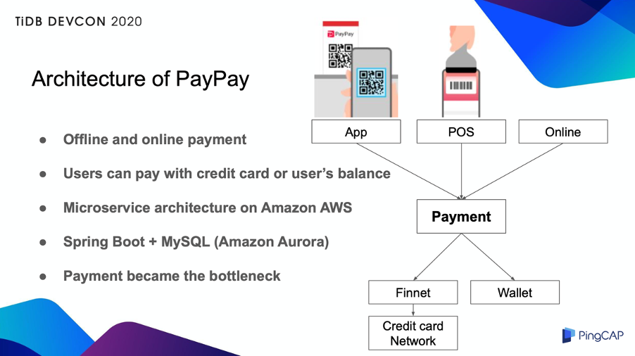
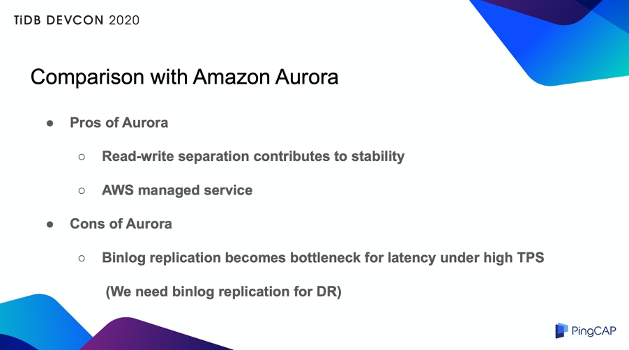
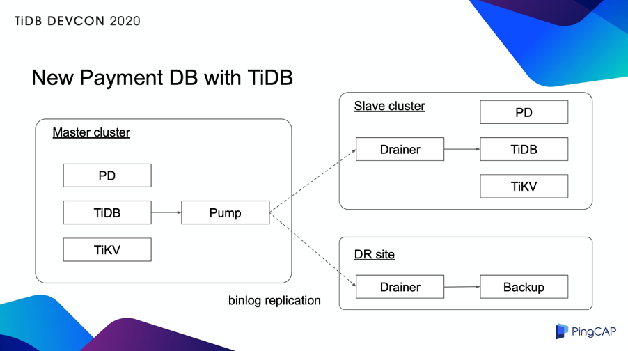
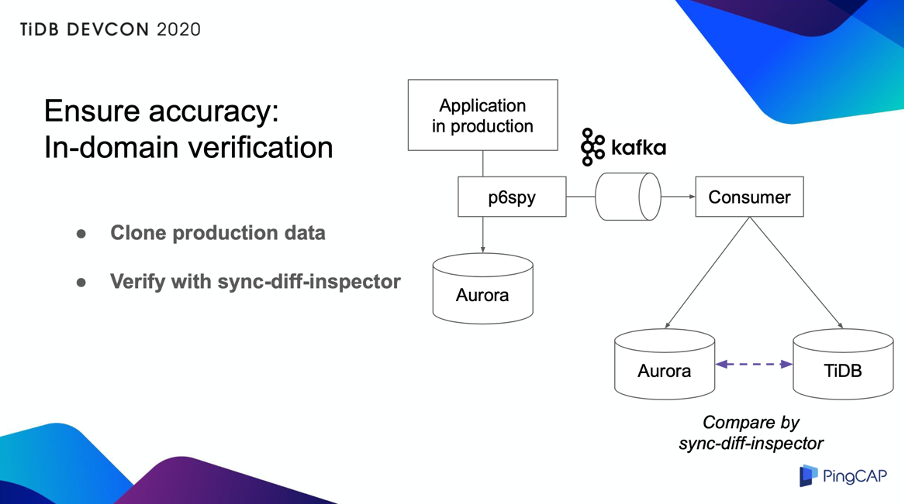
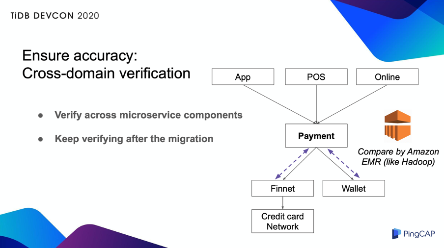
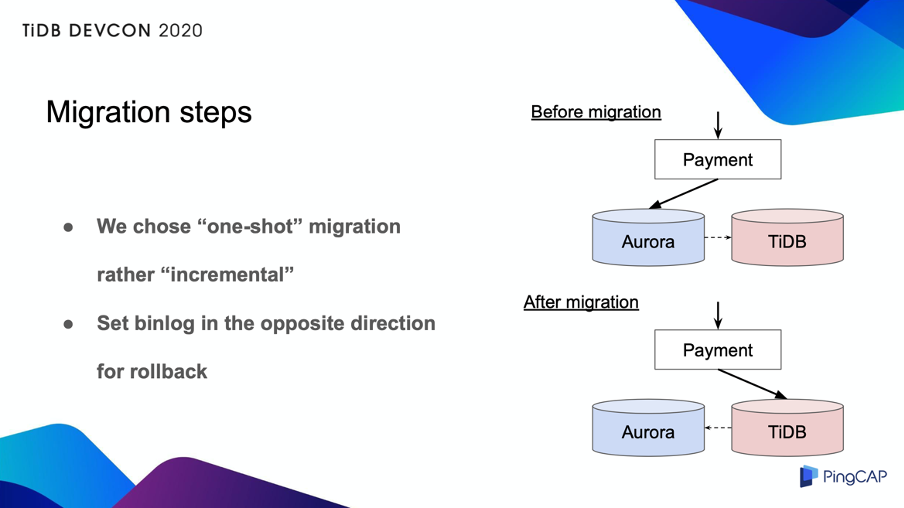

>作者简介：Munenori Hirakawa，PayPay Senior Manager at Product Tech Division。

PayPay 成立于 2018 年 10 月，由软银集团、日本雅虎和印度移动支付公司 Paytm 共同投资成立，是日本排名第一的移动支付公司。日本现在仍然较多使用现金，但经过大规模的营销活动，以及政府推动无现金社会的政策支持下，我们的业务正迅速扩张。目前日本大约有 1 亿人口，其中有 2900 万用户和 200 万商家在使用 PayPay，近期交易量已达到 10 亿。此外，PayPay 和支付宝关联，支付宝可以扫描 PayPay 的二维码并支付。如果你们到日本旅游，可以试试扫 PayPay 的二维码。

去年我们的业务增速极快，由于诸多时间限制，我们不得不在三个月内完成迁移，将最关键核心数据库迁移到 TiDB，该数据库管理着付款交易。下面我将分享我们为什么选择 TiDB 以及迁移实践经验。

## 项目背景

PayPay 可以用于线上和线下支付，我们支持多种支付方式，用户使用手机 APP 扫描商户的二维码，商家使用 POS 机来扫描手机上的条形码，电商网站上也可以用 PayPay 在线支付。用户既可以用注册的信用卡来付款，也可以用预存的钱包余额来支付。

PayPay 使用亚马逊 AWS 作为基础架构，并在此基础之上，搭建了微服务架构。

我们有大约 80 个组件，几乎所有组件都使用 Java、Spring Boot、Amazon Aurora 作为数据库架构。所有的支付交易都传输到 Payment 组件进行管理。发生支付交易时，交易数据写入到 Payment 数据库中，该笔交易的状态也随之更新。因此，Payment 数据库的写入操作很频繁。再加上业务量不断增长，Payment 数据库就成为了瓶颈，所以我们决定要迁移到扩展性更好的数据库。

## 为什么选择 TiDB？

选择 TiDB 作为新的数据库，有以下几个原因：

首先，TiDB 兼容 MySQL，几乎不需要修改业务代码。由于 TiDB 是分布式架构，我们必须注意自增列的行为，但这种修改也很少。

第二，TiDB 支持水平扩展，可以轻松应对未来的数据增长。此外，TiDB 集群由多个实例组成，能做到高可用。PayPay 的云原生架构也与 TiDB 非常契合。

第三，开发人员不需要在应用层进行分库分表，我们可以保持应用层的简单。当数据库成为瓶颈时，我们通常会以用户 ID 为 sharding key 来分库分表，把数据分开存储在多个数据库里。但这种方式下，应用需要处理分库分表逻辑，应用变得更为复杂。如果我们使用 TiDB，就无需担心这种问题。

第四个原因则是，有很多公司已经把 TiDB 用在生产环境中。特别是在金融领域，TiDB 有丰富的经验，让我们对这项新技术更有信心。这也是对决策层最有说服力的一点。

另外，我们也将 Amazon Aurora 和 TiDB 进行了对比。

Aurora 的优点在于，它默认使用一个只读的 slave 节点，一个写入的 master 节点。主从间的同步延迟非常小，即使 slave 上发生慢查询，也不会影响 master 上的写入性能。恰当地使用这两个节点，可以有效确保稳定性，而且 Aurora 是 AWS 托管服务，管理成本较低。但是，当 Aurora 遇到许多写入请求时，binlog 同步会成为瓶颈。在提交过程中，Aurora 等待同步目标返回 ACK，因此当同步数量增加时，提交延迟也会增加。为了容灾，我们必须进行同步，所以这个问题日益严重。当我们进行 TiDB 的 POC 时，我们没有遇到这个问题，TiDB 可以轻松处理比 Aurora 多 3 倍的交易量。公平地说，我想强调一下 Aurora 是一个很好的数据库。但替换掉 Aurora，不仅是因为我们的 binlog 同步需求。

以上就是为什么我们决定迁移到 TiDB。

## New Payment DB with TiDB

上图展示了我们使用 TiDB 后的新架构。一个 TiDB 集群由 PD、TiDB 和 TiKV 组件组成，每个组件都有多个实例。另外，Pump 和 Drainer 用来设置同步 binlog 到 slave 集群和灾备站。多个实例位于不同的 AWS 可用区（即独立的数据中心）中。因此，现在我们同时实现了很高的容灾能力。

## 迁移实践

我们花了一个月的时间来验证和讨论是否要迁移到 TiDB 上。在接下来的两个月中，我们又做了详细的验证。

### 1. 数据完整性测试

第一个测试是数据完整性。我们已经确认，TiDB 与我们的应用程序集成后，可以按预期工作。为了保证这一点，我们引入了两种验证，即域内验证和跨域验证。

#### 域内验证

当然，我们是在测试环境中进行的测试，但是我们想通过实际生产数据来确认行为，因此，我们将实际生产流量克隆到另一个 Aurora 和 TiDB，查看数据是否完全相同。我们在这里引入了一个称为 p6spy 的框架。

P6spy 抓取了通过 JDBC 连接发送的数据，将其发布到 Kafka 消息队列。用户应用程序在 Aurora 和 TiDB 上执行了通过 Kafka 消息发送的数据库操作。然后，我们使用 TiDB 提供的 sync-diff-inspector 比较了两组数据。结果我们确认两个数据库的数据完全相同。这种方法的优势在于，可以在不对生产数据库造成任何额外负担的情况下完成测试。

#### 跨域验证

由于我们的系统是微服务，因此我们还在 Payment 和其他相邻组件之间添加了一致性检查。我们使用了Amazon EMR，一种类似 Hadoop 的架构，如下图所示：

我们每隔几分钟从每个数据库中提取一次数据，将其提供给 EMR，并不断检查这些组件的一致性。该检查在迁移前后都会一直进行，因为我们希望这个系统在迁移后也可以检测到未知问题。

### 2. 性能和可用性测试

我们已经有能力处理 Aurora 无法处理的高 TPS，因此我们优化了应用程序以提高性能，比如增加连接池大小，删除不必要的索引。TiDB 可以轻松处理比 Aurora 多 3 倍的 TPS，而支付交易延迟不到1秒。

对于故障案例测试，我们模拟了 30 多种场景，例如实例故障、集群故障和可用区故障。我们定了恢复点目标（RPO）、恢复时间目标（RTO）等指标。多亏了 TiDB Binlog 工具进行同步，我们可以将 RPO 降低到趋近于零，但是由于数据量的原因，RTO 仍然很高。为了避免将来发生大规模故障，我们需要缩短恢复时间。

### 3. 迁移流程

在实际迁移中，为了降低风险，我们考虑使用增量的方法来逐步增加流量。如果是只读数据库，我们可以轻松控制流量。但是对于写入的数据库，实现非常复杂。因此，我们选择了一次性的方法。

这种方法很简单，但一旦出现问题就会有风险，因为会影响到所有用户。因此，它必须能够立即回滚。我们在首次数据迁移中进行 binlog 同步，但在迁移过程中，我们将同步设置为相反的方向。 现在我们把 Aurora 作为备份，这样即使出现问题，也可以立即回滚。

同样，在迁移之前，我们进行了多次演习，包括销售成员和 CS 成员。实际迁移在 2 小时内就完成了，包括验证时间在内，没有出现任何问题，服务停机时间降至最低。

迁移到现在已经三个月，到目前为止，我们获得了预期的性能。在过去的三个月中，没有发生任何问题，TiDB 很赞，非常可靠。此外，我还想感谢 PingCAP 的支持，他们提供了许多帮助，让我们建立起对 TiDB 的信任。借此机会，我想再次表达感谢。

## 未来规划

实际上，我们目前选择的是 TiDB 2.x 版本，因为我们的数据库涉及关键业务，2.x 版本有丰富的经验。在上半年，我们将按现有状态运行，保持信心。在这之后，我们将尽快升级到 3.x 或更高版本，因为我们可以使用许多高版本的优秀特性，例如更有效地使用 TiKV Region Merge、更好的备份功能。如果有需要，我们还想迁移除 Payment 以外的其他数据库。最后，我们希望通过分享我们的知识和经验，为 TiDB 社区做出贡献。

希望 TiDB 在未来越来越好。

