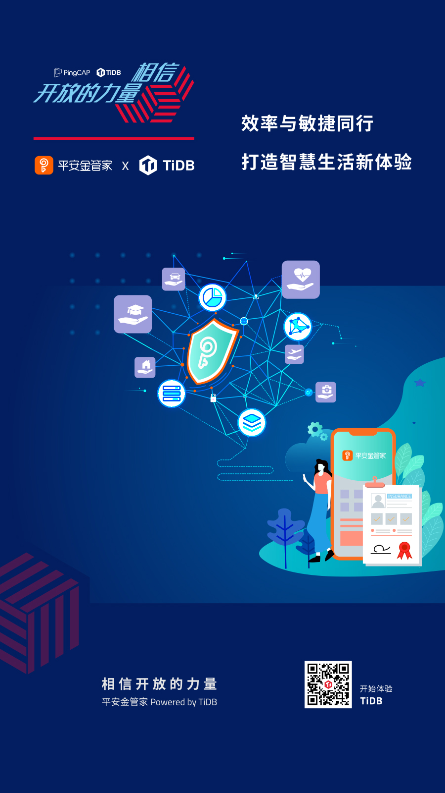
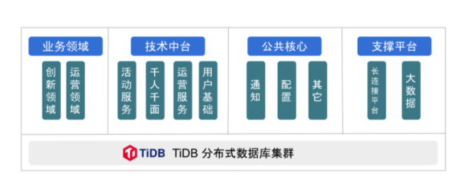

**「我们已经用起来了」**，是我们最喜欢听到的话，简简单单几个字的背后代表着沉甸甸的信任和托付。从今天开始，我们将通过 **「相信开放的力量」** 系列深度案例分享，从业务的角度，看看一个数据库为各行业用户带来的业务价值。 **在双十一来临之际，PingCAP 走访了平安金管家开发团队总经理毛小波及其团队同事，结合分布式数据库技术的应用和前瞻实践，分享他们在数字创新的思考和见解，希望可以给大家一些启发。**

>效率与敏捷同行
>
>打造智慧生活新体验

一场突如其来的疫情带来保险业线上服务的革新，使用手机 APP 办理保单缴费、报案理赔、保单贷款等各种业务成为刚需。在数字化创新技术的支撑下，保险行业开启了一场颠覆性变革。现在，通过平安人寿金管家 APP 在线报案，上传提交理赔资料，在短时间内（从之前以周为单位缩短到以小时为单位）即可收到理赔款，为大众带来更加高效便捷保险服务的同时，提升用户体验。

中国平安人寿保险股份有限公司成立于 2002 年，是中国平安保险（集团）股份有限公司旗下的重要成员。平安金管家 APP （简称：金管家）是平安人寿为客户提供涵盖保单服务、生活助手、健康管理等多场景服务的一站式移动平台。作为平安人寿践行“科技+”战略、迈向全面数据化经营的核心平台，金管家在数据化服务、客户经营、科技开发等方面持续创新，成为保险理财 APP 领域的领航风向标。

## 成功护航 “1.08 财神节”

“1.08 财神节” 是中国平安综合性年度线上金融狂欢节，类似电商消费狂欢节“双 11”。消费者登陆金管家 APP 即可参与一系列秒杀、抽奖、红包等互动活动。**对于这类偏向互联网的敏态业务，通常特点是：时间紧，玩法新，可参考经验少，加上金融业务的严谨性要求及金管家庞大的用户基数，给业务团队带来很大的挑战。**

另外，此类业务场景对数据库高并发及响应延迟要求极高，由于 TPS 存在不确定性，数据库还需具备按需快速弹性伸缩的能力，同时还需要支持金融级别的一致性以及实时在线分析能力，方便运营人员快速查看。

**2019 年 “1.08 财神节” 当天成交额超过 1000 亿，在单日交易额破千亿背后是几百个 TiDB 数据库实例在提供运营保障：**

- 基于 TiDB 搭建高可靠、低延迟、可快速扩展的分布式数据平台；

- 支持标准 SQL ，大大降低敏态应用开发复杂度，加快应用上线速度；

- 在线弹性扩缩容，支持在线添加和删除节点，满足不确定的业务需求；

- 降低了运维复杂度，无需运维 NoSQL + Hadoop 复杂技术体系，支持二级索引，为复杂业务提供查询支持，让运营人员通过 SQL 实时分析和实时运营成为可能。

## 敏态运营向“开发效率”发起挑战

金管家业务模块整体分为平台、业务、产品三个大的模块，过去后台系统由小型机与 Oracle 提供服务。近三年来，金管家用户增长了 6 倍，注册用户超 2 亿 ，日活高峰也达到近千万级，数据库逐渐成为 IT 基础设施链条里面最大的瓶颈，特别是在应对一些创新业务的场景，例如红包秒杀等场景的时候，Oracle 性能瓶颈凸显。业务需求的实现需要昂贵的小型机硬件成本，以维持 Oracle 的正常运行，在特定业务场景还需要进行复杂的逻辑表拆分，带来成本和运维的压力。

在大规模数据量下，如果使用 MySQL 就意味着读写分离、分库分表，分布式事务的实现需要在应用层实现，在开发效率上大打折扣，这对于敏态业务要求的快速上线，快速迭代的原则是很大的挑战。平安人寿开始谨慎思考数据库的重新选型，把目光转向了分布式 NewSQL 数据库，在综合考量开源技术生态、企业级应用场景以及专业服务支持等多个维度因素之后，平安人寿引入 TiDB 为金管家的核心应用及多数敏态应用提供服务。

## 破局关键是向分布式 NewSQL 转型

平安人寿根据实际业务情况以及后续发展的需要，构建起一套支持高并发、高可用、可横向扩展的 TiDB 分布式数据库集群，实现了活动类、运营类、创新类等多种应用系统生产数据的实时写入，同时满足金融级的同城与异地容灾要求。

整个部署架构有多套 TiDB 集群组成，涵盖生产库、同城灾备、异地灾备库，通过 OGG 将 Oracle 数据同步数据到 MySQL，使用 TiDB DM 工具实时同步数据到 TiDB 生产库，不同城市之间的容灾库和开发库通过 TiDB Binlog 进行数据流转。TiDB 在保障核心业务高效支撑同时，给上层应用提供了标准化的 API 接口，同时给业务运营人员提供了灵活的查询界面，满足了实时、便捷、准确的查询服务请求。

金管家业务逻辑架构图

作为一款分布式 NewSQL 数据库，TiDB 具备水平弹性扩容能力，并且在水平扩展的过程中保证数据的强一致性，支持跨行事务的水平扩展。TiDB 提供跨数据中心的多活方案，任何一个数据中心宕机，整个集群可以自动实现业务无感知的切换与恢复。此外，TiDB 匹配云的架构和演进方向 ，打通与各类云原生数据生态的连接，避免出现数据孤岛。

>NewSQL 的优势在于可以无缝地弹性伸缩，整个系统的性能可以动态满足各类不确定的业务需求，海量结构化数据的存储和查询将不再是令人头疼的问题，大幅提升了业务的开发效率。TiDB 可以很好地满足稳态业务场景，在敏态业务场景下，TiDB 也是理想的选择。   ——平安金管家开发团队

**目前，金管家应用到 TiDB 上的数据规模超过 30T ，迁移工作还在持续进行中，预计整体应用规模将达到百 T 级别。**

## 为什么选择 TiDB?

TiDB 分布式数据库方案完美匹配金管家新一代分布式核心应用，消除对专有硬件的依赖，大幅节省 IT 开支，为核心业务提供了高吞吐、持续可弹性扩展的数据库支撑平台，同时有效提升了敏态业务的开发效率，为后续业务的大规模扩展奠定可靠的基石。平安金管家作为整个平安人寿下迁 Oracle 的排头兵，为保险业的科技创新提供了一套领先的借鉴模式，在提升持续高可用、为客户提供极致服务体验方面具有深远影响。

- 成本角度：相对 Oracle 数据的**硬件成本节省 30% 以上**，兼容 MySQL 协议使得人员学习与开发等隐性成本也显著降低；

- 性能方面：通过弹性的水平拓展，使得数据库集群的性能有了量级的提升，互联网保险业务可以**抗住每秒几千单的压力**；

- 运维层面：PingCAP 提供专业的支持服务，把复杂的数据处理工作交给 TiDB，技术团队可以把精力都投入到核心业务的开发。

金融 + 科技，已经成为平安人寿的新名⽚，依靠大数据、人工智能、生物识别、区块链等领域的金融科技核心技术，将前沿科技全面运用于产品创新、客户服务、业务运营和风险控制等经营管理的各个领域。平安人寿携手 TiDB，将不断提升数据基础设施的服务能力，打造极致的服务体验，为用户提供更有温度的智慧服务。

## 与客户同行，相信开放的力量

每次数据库架构改善与落地，无论是 TB 级还是 PB 级，都需要付出努力，但这也值得每一个企业去实践。在当下这个时代，不管企业的规模如何，都要学会借助开源的力量，避免去重复的造轮子。

每一个看似轻松的背后都有不为人知的努力，每一个看似光鲜亮丽的背后，都有不为人知的付出。分布式数据库建设之路道阻且长，TiDB 愿与平安金管家及每个客户一起，携手并肩把事情做好。
