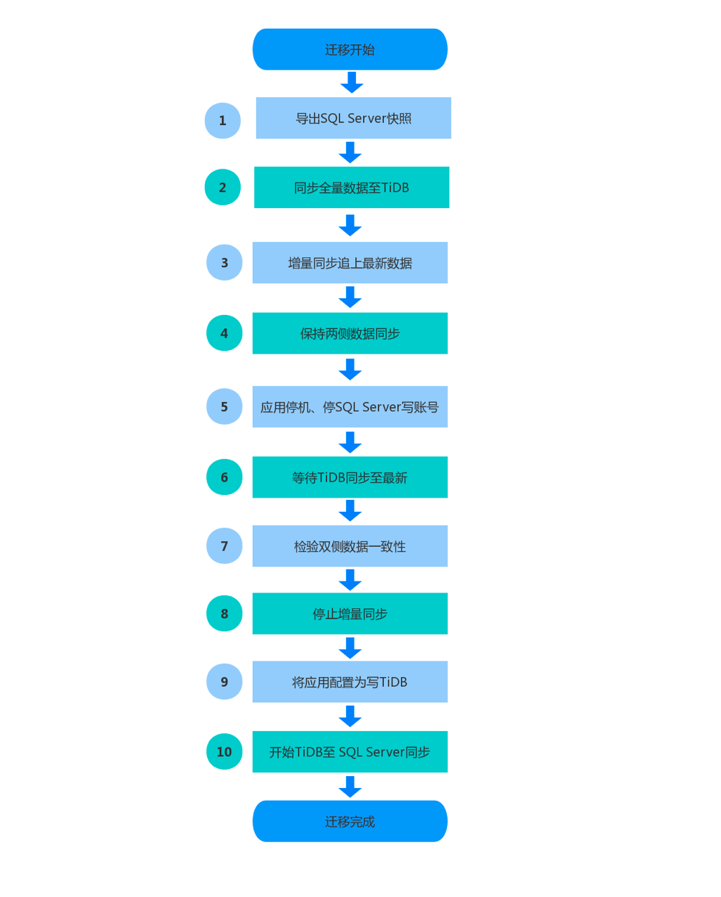
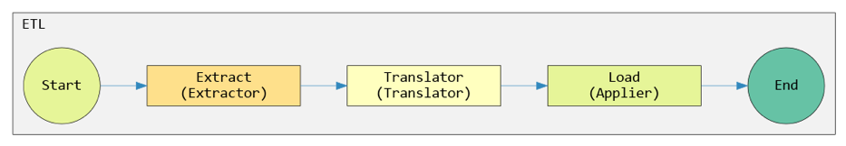

SQL Server + .Net 是很多早期互联网企业的标配技术栈，虽然 TiDB 是兼容 MySQL 协议和生态的数据库，但是 TiDB 适用的业务场景是通用的。在开源新技术大行其道的今天，如何从 SQL Server 无缝迁移至 TiDB，汽车之家做了一个创新的示范。

本文将从业务背景、迁移方案、同步、业务改造、上线效果、周边建设等多个角度，详细介绍了如何从 SQL Server 数据库迁移至 TiDB 数据库。相信无论你是架构师、业务开发、还是 DBA，都会有不同层面的收获。

## 一、项目背景

汽车之家社区于 2005 年上线，作为汽车之家最老的业务之一，十四年来沉淀了亿级帖子、十亿级回复数据，目前每天有千万级 DAU、亿级的访问量，接口日均调用量 10 亿+ 次 。期间经历过架构升级重构、技术栈升级等，但其数据始终存放在  SQL Server 中。随着数据的不断递增，我们在使用 SQL Server 数据库方面遇到了很多瓶颈，以至于我们不得不寻找一个新的数据库替换方案。

## 二、使用 SQL Server 遇到的瓶颈

随着业务的不断扩大，汽车之家社区的访问量和发表量不断上涨，遇到的数据库问题也越来越多，下面列举两个必须很快解决掉的问题：

1.  历史上，汽车之家社区回复库采用了分库分表的设计，用以解决 SQL Server 单表过大时性能下降等问题。时至今日，回复库有 100+ 个库、1000+ 张表（根据帖子 ID 分库分表）。这本身并没有问题，代码写好了，数据该写哪里写哪里，该读哪里读哪里。但是随着应用的发展、需求的变化，我们发现在实现某些需求时，分库分表的结构难以满足。我们需要数据逻辑上在一张表里。

2.  近些年来，随着业务加速成长，数据量突飞猛进，而硬盘容量是有限的，每台服务器上能扩展的硬盘数量也是有限的，致使每隔一段时间都要增加更大容量的存储服务器来应对。而且这个事情一开始是很复杂的，涉及到很多关联项目，即便到现在我们轻车熟路了，每次换服务器的时候依然需要关注它，并且大容量数据库服务器价格昂贵。我们需要让扩容对应用来说，无感知。

## 三、分布式数据库调研

### 3.1 确定方向

在 2018 年底的时候，公司专门成立了虚拟架构组来调研新的数据库来解决汽车之家社区遇到的问题。经过各种分析和测试，今年年初确定方向为分布式数据库，一共调研了三款当前比较火的分布式数据库：TiDB(PingCAP)，Ignite(ASF-TLP) 和 CockroachDB。经过无数次测试我们最终选择了 TiDB，主要有以下几个原因：

1.  兼容 MySQL 协议与生态，上手门槛低；

2.  跟 TiDB 官方一直保持比较好的技术沟通；

3.  TiDB 公司在北京，有问题可以当面解决；

4.  TiDB 的设计架构更加优秀；

5.  官方社区比较活跃，文档丰富；

6.  官方的技术人员经常到公司进行交流。


<center>TiDB 的研发同学到之家进行技术交流</center>


<center>我们去 TiDB 进行系统的课程培训</center>


下面引用 TiDB 官方的一段描述：

>TiDB 是一款定位于在线事务处理、在线分析处理（HTAP: Hybrid Transactional/Analytical Processing）的融合型数据库产品，实现了一键水平伸缩，强一致性的多副本数据安全，分布式事务，实时 OLAP 等重要特性。同时兼容 MySQL 协议和生态，迁移便捷，运维成本极低。

从中我们不难发现，TiDB 切实解决了我们在应用 SQL Server 时候的痛点：

*   水平伸缩：在当前集群内可以随时加节点，更换节点也轻而易举。
*   海量数据支持：基于其特性以及业内使用的经验，十亿乃至百亿级别的数据量轻松搞定。
*   高可用：相较 SQL Server 的主从模式，TiDB 基于 Raft 协议，可以实现 100% 的数据强一致性，并且多数副本可用的情况下，可实现自动故障恢复。
*   HTAP：TiDB 自身就支持一定程度的 OLAP 场景，更复杂的 OLAP 分析可以通过 TiSpark 项目来完成。对于更深度的 OLAP 应用，我们也已经在实践的路上。

### 3.2 实践出真知

基于以上理论的支持，我们进行了大量的功能测试、性能测试、异常测试、业务接入测试等。

1.  OLTP 测试：2000 万数据，500 并发线程测试，在 OLTP 场景测试下 TiDB 的响应时间 99% 在 16ms 以内，满足业务需求。且在数据量级越来越大的情况下，TiDB 会体现出更大的优势，后续还可以通过添加 TiDB/PD/TiKV 节点来提高读写性能，如下图所示：

	

2.  OLAP 测试：50G TPC-H 测试，TiDB 相较 MySQL 有很大的速度优势：

	

	>TPC Benchmark™H（TPC-H） 是决策支持基准。 它由一套面向业务的临时查询和并发数据修改组成。 选择查询和填充数据库的数据具有广泛的行业范围相关性。 该基准测试说明了决策支持系统，该系统可检查大量数据，高度复杂地执行查询并为关键业务问题提供答案。

3.  异常测试：我们测试了 PD、TiKV 异常宕机情况下的表现，对业务影响很小，可实现自动故障恢复。

## 四、迁移方案

### 4.1 迁移前需要解决的问题

在真正的数据迁移之前，我们还有一些实际问题需要解决：

*   SQL Server 和 TiDB 的部分字段类型是不一样的。通过查阅相关文档，将不同的字段一一对应后再在 TiDB 中建表，例如 DATETIME 的精度问题。

*   同步时将分库分表的数据合并到一个表里。值得庆幸的是原有设计中，我们除了自增主键 ID，还有一份业务 ID，其在各个表中均不重复，这样省了不少事情。

*   一次性导入十亿级数据以及后续增量同步的过程中，如何保证数据的一致性。

*   如果 TiDB 在生产时出现了不可预估的问题，一时无法解决，那我们必须立刻切换到 SQL Server，保证业务不受影响。换句话说，在 TiDB 中产生的数据需要实时同步回 SQL Server。

*   因为访问量比较大，切换时间必须控制在秒级。

*   因为 SQL Server 是商业数据库，跟开源数据库进行数据同步的方案较少，所以同步方案、架构设计、研发、测试必须我们自己解决。

### 4.2 整体迁移架构图

下图是我们整个迁移过程的架构图，包含 SQL Server 到 TiDB 的全量同步、增量同步，以及 TiDB 到 SQL Server 的反向同步过程。


现在，需要确定的是整个项目的迁移流程，有了大的方向，在实施中目标会更明确一些。

以汽车之家社区的业务形态以及数据量级来看，动辄十多个小时的离线迁移是完全不可能接受的，我们只能在凌晨 1:00-3:00 这个时间窗口来完成迁移，且时间越短越好。

所以我们选择在线迁移的方案，在线迁移稍微复杂一些，流程上有准备全量数据，然后实时同步增量数据，在数据同步跟上（延迟秒级别）之后，采用滚动升级的方式将应用的读流量切换到 TiDB 上。

观察应用正常运行，进行短暂停机和关停 SQL Server 写权限，确保没有数据再写入 SQL Server， 就可以将写流量指向 TiDB，至此迁移完毕。

整个迁移流程中，应用的读数据场景不受影响，写入场景受影响周期为停机（关写权限）到写流量指向 TiDB。

下图是我们梳理出来的流程图，我们在整个迁移的过程中必须严格按这些流程执行。



下面我们来详细介绍全量和增量同步的实施方案。

## 五、全量同步

首先我们要感谢以下两个开源项目，站在巨人的肩膀上使我们节约了很多时间。

* [https://github.com/alibaba/yugong](https://github.com/alibaba/yugong) 

* [https://github.com/alswl/yugong](https://github.com/alswl/yugong)

愚公是阿里巴巴推出的一款 Oracle 数据迁移同步工具，而作者 alswl 在此基础上实现了 SQL Server 数据源的支持。在此愚公的使用方法我们不再赘述，感兴趣的同学请自行查看。

在认真拜读了大神的项目，并进行了相关测试后，发现它并不能 100% 满足我们的需求。



Yugong 数据流是标准 ETL 流程，分别有 Extractor、 Translator、Applier 这三个大类来实现 ETL 过程。

首先讲 Extractor，愚公原有的配置方式是将需要导出的库表写在配置文件当中，这对于 1000+ 张表来说，太不现实了。这里我们增了一个新特性，在不配置需要导出的表名的情况下，将数据库中所有的用户表读出来，并通过一个新增的配置项进行正则匹配，以此决定哪些表需要进行数据同步。

```
#查询表
SELECT name FROM sys.databases WITH (nolock) WHERE state_desc = 'ONLINE'

#查询开启CDC的表
SELECT name FROM %s.sys.tables t WITH (nolock) JOIN %s.[cdc].[change_tables] ct WITH (nolock) ON t.object_id = ct.source_object_id

```

其次，合库合表后，原有 SQL Server 中各个表的自增主键 ID 冲突，所以新增实现 RowDataMergeTranslator，其功能是，读取内存中的 RowData 然后进行转换，将从 SQL Server 中读取的行数据，丢弃其原有的主键列，转而使用 TiDB 生成。并根据配置文件决定哪些表需要实现这一特性。

```
record.removeColumnByName(config.getDiscardKey());
```

最后的 Applier 并未做改动，处理好的数据直接写入 TiDB。

自此合库合表的事情我们解决了。

## 六、增量同步与实时校验

在实现这部分需求的时候，我们应用了 SQL Server 的 CDC，并在增量同步的基础上增加了延迟验证数据正确性的功能。更多关于 CDC 的内容，这里不再赘诉，你只需要知道它能获取到增量数据，参考 [CDC官方文档](https://docs.microsoft.com/en-us/sql/relational-databases/track-changes/about-change-data-capture-sql-server?view=sql-server-ver15)。

需要注意的是，CDC 开启的时机需要在全量同步之前，保证 CDC 记录可以覆盖全量同步过程中产生的增量数据。


根据以上的流程图可以看到，Producer 从 SQL Server 中读取 CDC 日志，并将其转化成一条包含表信息、列信息和行数据的消息，投递到 Kafka 中。下游的消费者在拉取到消息之后，把数据转化成兼容 MySQL 的 SQL 语句在 TiDB 中执行（这里也实现了合库合表），从而实现整个数据增量同步的过程。

这里还有另一个消费者实现数据校验功能，它会延迟五秒消费同一队列，并通过提取主键（或索引）的方式从 TiDB 中查出该条已经写入的数据，将两侧的整行数据做比较（本实践中去除主键后比较），如果有问题会进行尝试重新写入，如出现异常则向相关人员发送报警。

在实现了这些并进入到测试阶段后，我们发现了一个问题，1000+ 回复表，对应 1000+ CDC 日志表，一个 Producer 就需要开启 1000+ 线程。以设计的 5s 间隔去轮询这些表时，服务器 CPU 直接就跑满了，产生了大量线程等待，轮询 CDC 日志的及时性无法保证。通过分析业务和 DBA 查询得知，其实汽车之家社区每天产生的回复有 95% 都集中在最新的 5% 的帖子当中。换言之，我们只有几十张表需要如此高频的去检索 CDC 日志，其他的表我们通过增加轮询间隔、分批部署等方式，将这个问题解决了。

细心的同学读到这里会发现，校验功能其实逻辑上并不严谨，如果说在五秒钟内上游数据产生了变更，就有可能会产生拿着新数据去校验老数据的问题。这里有两个解决方案：

*   采用单 partition 的 topic 和单个消费程序，保证增量同步和校验的顺序严格一致，但此种方案性能相对较低，可用性无法保证。

*   我们将 SQL Server 中的表行加入上版本戳（rowversion），将版本戳一并同步到 TiDB 中。校验时比较该值，如不一致则放弃本次校验。本方案会损失一定的校验样本，但可通过增加 Partition 和消费者提高性能和可用性。

## 七、回滚方案

之前我们提到了，当项目切换到 TiDB 以后，需要预防其出现不可预估的问题，能够随时切回 SQL Server 才能保障万无一失。


[TiDB Binlog](https://pingcap.com/blog-cn/tidb-ecosystem-tools-1/) 使得这件事情轻而易举。我们使用官方提供的 Pump 和 Drainer 将 Binlog 抽取到 Kafka 之中，解析数据变更的内容，根据业务 ID 计算出数据在 SQL Server 中原本属于哪个库哪个表，然后进行数据同步。


<center>解析 Binlog (Protobuf 协议)</center>


<center>通过业务 ID 决定数据写到哪个库表</center>


## 八、汽车之家社区业务 TiDB 迁移改造

就业务的改造这一环节，因历史积淀，需修改的地方很多，分布于各个项目之中，我们采取通过接口查找实现、搜索代码、DBA 帮助抓取 SQL 的方式，保证涵盖了 100% 的相关业务，只有这样才能保障上线后无故障。

*   数据访问层增加对 MySQL 语法的支持。

*   去掉 SQL Server 中的存储过程。

*   SQL Server 和 TiDB（MySQL）的语句和函数支持不尽相同，逐个改造、测试并优化。

*   根据 TiDB 索引的原理以及梳理出来的 SQL 语句，重新建索引。

与此同时，我们针对每一条改造后的 SQL 都进行了优化，使可以精确的命中最优的索引，从而实现了在十亿级数据量下，TP 业务 99% 的响应时间在 12ms，99.9% 的响应时间在 62ms。 


<center>通过业务 ID 决定数据写到哪个库表</center>

## 九、TiDB 周边体系建设

除以上迁移流程所涉及到的功能点以外，我们还制定了一些开发规范和一些实用工具的研发，用以保障 TiDB 在汽车之家更好的应用。

*   我们建立了完善的 TiDB 开发规范、运维规范、上线规范，并在公司内部对开发同学进行相关的培训。

*   开发了实时慢 SQL 分析工具——TiSlowSQL，该工具可以提供实时、多维度、全视角的 SQL 报告，帮助我们快速定位慢 SQL 导致的集群级故障。

*   为解决监控单点问题，我们自己开发了一套监控工具，对 TiDB 核心组件进行监控，后续会将监控系统统一迁移到之家云平台。

*   定期在汽车之家大学举行技术培训，定期在组内进行技术分享，经验总结。


>TiSlowSQL 也是汽车之家运维组参加 Hackathon 项目，具体内容敬请期待后续文章！

## 十、总结与展望

汽车之家社区已于 9 月底正式上线分布式数据库 TiDB，目前运行稳定。在其他业务迁移完成之后，汽车之家社区的 SQL Server 服务会逐步下线。对于本次迁移的过程我们做了以下几点总结：

*   通过不断的优化 SQL，目前线上 TP99 稳定，与迁移之前并无太大差别，跟测试效果相符。对用户和业务都无感知。

*   随着业务的不断扩大，可以更好的应对数据的暴增，再扩容集群就不需要找昂贵的大存储机器，而且可以在线不停业务随时扩容。

*   本次迁移我们积累了 SQL Server 转 TiDB 的很多经验，可以为其他团队使用分布式数据库 TiDB 提供技术支持，让其他团队在迁移过程中节省时间。

*   目前正在与 TiDB 官方沟通，准备把迁移方案和与业务无关的迁移逻辑放到开源社区。

**由 SQL Server 迁移至 TiDB，从传统关系型到分布式 HTAP，从商业授权到开源社区，是汽车之家社区历史上一次重大的技术方向转型。**

汽车之家有很多海量数据的应用场景，这一次从 SQL Server 到分布式数据库 TiDB 的迁移，为我们以后其他业务迁移至 TiDB 打下了良好的基础，也与 TiDB 官方建立了良好的定期沟通机制。希望 TiDB 官方一如既往的快速迭代，我们也会和 TiDB 官方合作开发一些比较实用的功能。


