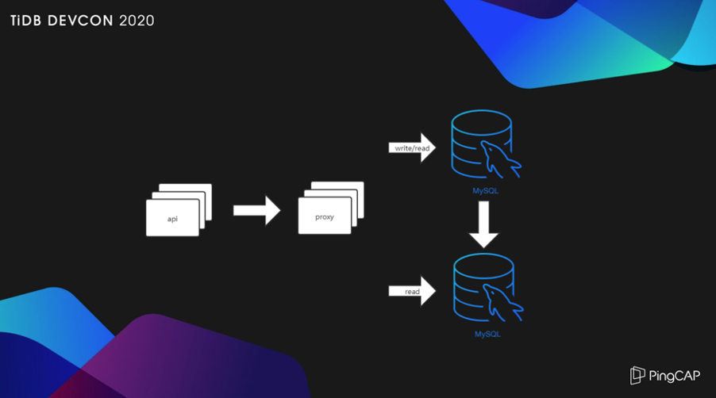
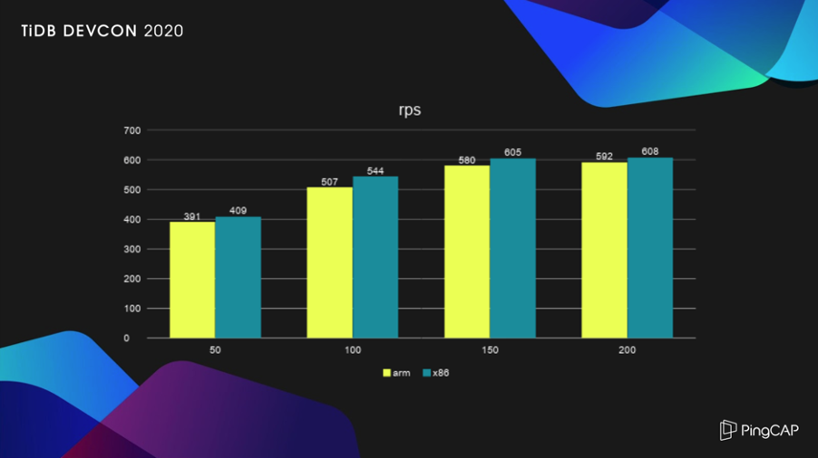
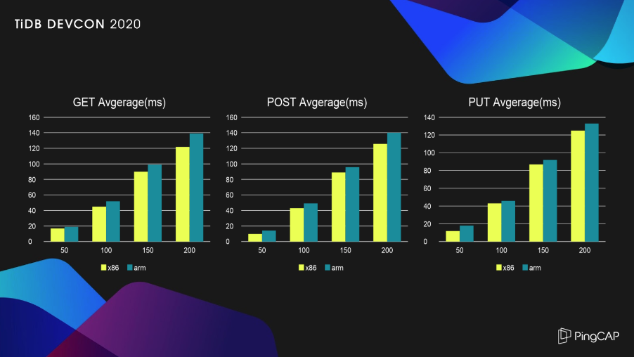
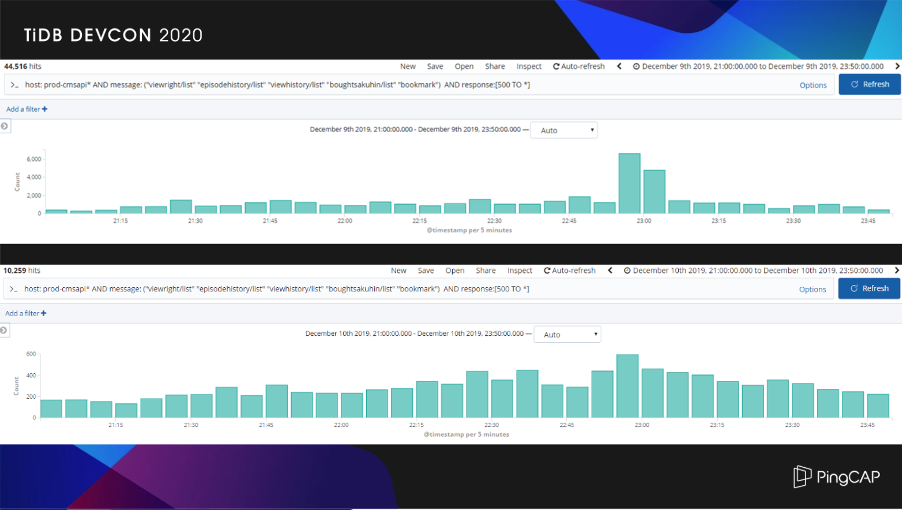
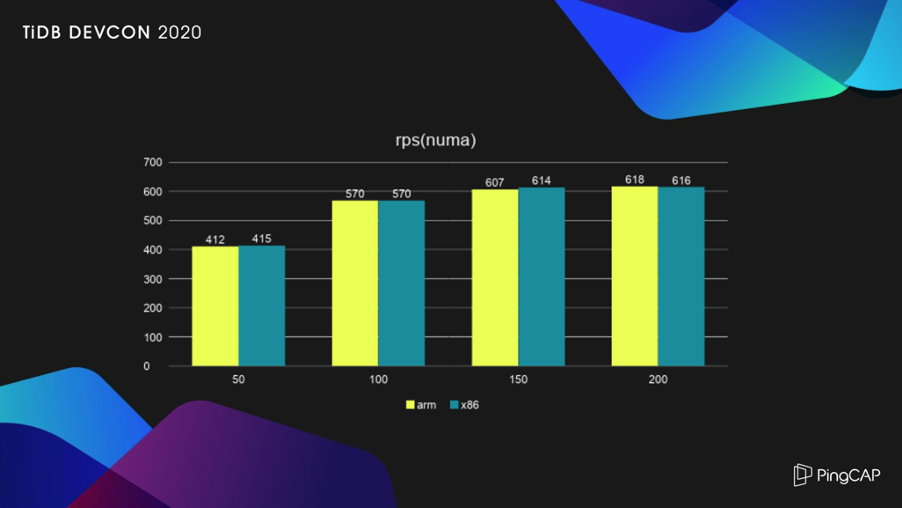

>作者介绍：黄必荣，U-Next Senior Engineer。

U-Next 是日本领先的视频点播服务公司，类似于国内的爱奇艺、国外的 Netflix。近几年 U-Next 的整体业务保持高速成长的势头，原先的基础架构已经无法应对业务的高速增长，对IT 基础架构的改造迫在眉睫。

## 为什么选择 TiDB

上图是大部分场景采用的架构，属于典型的 MySQL 读写分离方案，采用一个几年前 360 基于 MySQL-Proxy 修改的开源中间件服务 Atlas，从 2015 年使用至今，一直很稳定，也很容易上手，但是这个开源项目已经好久没有人维护了，如果后续的新业务继续采用这个方案，肯定要自己踩这个大坑。这个方案随着服务器并发增大延迟会升高，虽然可以水平扩展读写，但是后端的 MySQL 很容易达到单机的性能瓶颈，一旦达到瓶颈，扩容起来非常痛苦，所以需要寻找一个新的方案来解决。

我们需要一个什么样的数据库？这里简单列一下需求：

- **首先不能有显而易见的性能瓶颈**。我们有一个表存放用户所有的点播历史，进入 2019 年后，每个月以 1 亿行的速度增长。登录用户首页就要调用这个表，某些用户看的视频越多，就会发现打开首页的速度越来越慢。临时的方法，只能是把一些老数据转存到别的数据库，给这个表给瘦身，但是不能持续下去。所以，我们希望有一个没有瓶颈，可以任意水平扩展的方案。

- **高可用性**。如何实现在线扩容升级？更换服务器的话，数据迁移、同步、切割，环节一多，容错率就低。这次更换了服务器，以后还是会发生同样的问题。另外一方面，传统的主从架构，因为是异步复制，在发生故障迁移的时候，Binlog 同步不及时造成数据库不一致，这又会是另外一个很麻烦的事情，因此分布式数据库的强一致性会是最理想的一个解决方案。

- **社区活跃和商业支持**。常用开源的小伙伴可能会比较清楚，有的产品用着用着就没有人去维护了。作为一个小体量的用户，一出问题 IT 人员没有精力也没有能力解决，所以，长久可持续获得的技术支持至关重要，社区的活跃程度，是否有商业公司的服务支持，都成为我们衡量的标准。

- **迁移的成本**。这个主要就是现有业务的代码在对接新的数据库系统时产生的额外开发成本。在不完全改动当前代码情况下做迁移是最理想的，不过，现实总是很残酷，我们希望尽可能减少业务代码的改动。

综上几点，比较了市面上主流的几款 SQL 产品之后，TiDB 成为我们最好的选择。

## 为什么选择 ARM

x86 它不香吗？x86 是挺香的，但我们主要考虑的还是三点，成本、兼容性和运维。

ARM 平台的成本相较于 x86 会有一部分优势，对于小体量的用户来说是一个不错的选择。兼容性方面，TiDB 官方也有对 ARM 做过测试和验证，运行起来没有任何问题。运维层面，ARM 的可靠性到底如何？可能没有用过的用户，会担心宕机和崩溃，作为一个视频点播公司，U-Next 的分布式存储平台早在几年前已经全部替换成 ARM 平台，目前为止运行都比较稳定。

当然在和 ARM 磨合的过程中，也遇到过问题，硬件厂商都及时帮助解决了。现在大部分在非必须使用 x86 的情况下，我们都会尝试着使用 ARM，鉴于以往的这些经历，我们决定选用 ARM 来上线核心生产的数据库系统。

## TiDB 在 ARM 与 x86 平台的性能测试对比

基于两种架构的服务器平台，我们进行了一次 TiDB 的性能对比测试。

- CPU 配置方面，ARM 平台是 2 core 32 核心（华为鲲鹏 920），x86 平台是 2 core 12 核心（Intel 2650V4），Intel 有着超线能技术，所以它等于有  48 核心。

- Numa 方面，x86 有 2 个节点，ARM 有 4 个节点，这也是一个影响性能很关键的因素。
 
- 内存都是 128G，但是内存处理方式上面两者有着很大的不同，ARM 采用的是 load-store 微架构，由于 ARM CPU 并不直接处理内存中的数据，这个指令体系就担起了在寄存器和内存之间交换数据的重要媒介。它要比 x86 的内存访问机制复杂一些。

- 硬盘和网络都相同，两个 SSD 系统盘，一个 NVMe 数据盘，采用相同品牌的服务器。

TiDB 官方已有这两个平台的性能测试对比，采用了 Sysbench 这个工具，具有很重要的参考意义。我们从自身业务出发，使用 locus 模拟访问线上业务，一个客户端每秒发送一次请求，单表 3 亿行的测试数据，进行先 Get、再 Post、最后 Put 为一次的操作，总共对 API 请求 20 万次。

上图是 RPS 的结果，客户端数量在 50、100、150、200 的情况下，ARM 的表现略逊于 x86，在可接受的范围。从这个业务的需求来看，RPS 50 就已经满足了。

从响应时间来看，单个 API 服务器的瓶颈出现在 150 个客户端附近，再增加客户端数量，RPS 也提升不了多少，反而响应时间变得更大。测试也许有不太严谨的地方，我们通过测试看到了基于业务模型， ARM 和 x86 在 TiDB 上的性能差距并不明显。

前面提到的有一个 10 亿行表的数据库，经常被访问，性能已经跟不上业务发展，庆幸的是 TiDB 完全兼容这个业务使用的 MySQL 方法，在 ARM 平台的性能表现也很好，于是我们采用了 TiDB 替换了原来的数据库。

我们在 2019 年 12 月 10 日凌晨做了数据库的迁移，来看看替换前和替换后的效果对比：上面一张截图是替换前 9 号晚上高峰响应时间超过 500 毫秒请求的数量，下面一张截图是更换后 10 号晚上高峰时间超过 500 毫秒请求的数量。我们可以看一下，Y 轴会有惊喜，上图是四位数，下图是三位数，提升了一个数量级。

我们还做了数据中心的迁移，迁移 TiDB 后，API 和 TiDB 在不同的数据中心，通过专线互连，在网络延迟比迁移前多 1-2 ms 的情况下，依靠 TiDB 优异的性能提升了服务品质，这个太令人兴奋了。

## 基于 ARM 的优化

关于 ARM 的优化，需要特别感谢 PingCAP 的研发同事，帮我找出了 THP 的差异。我们在测试导入数据的时候，发现大概在 100G 数据的时候，x86 没有关闭 THP 的情况下，所有的状态也都正常。在 ARM 平台上没有关闭 THP 的状态下，TiKV 很容易造成负载过重 OOM。所以使用 ARM 的话，强烈建议一定要关闭 THP。

关于 Numa 的绑定，我们使用的平台中 ARM 有四个 Numa 节点，而 x86 只有两个，ARM 的内存处理需要 CPU 去参与，默认在不绑定内核的情况下，Numa 的节点越多，内部延迟就会越大。所以建议把进程绑定到相应 Numa 节点的内核上，网卡对应也得做绑定，会减少延迟。TiDB 非常优秀，除了海量数据场景以外，甚至可以不考虑如何去调优。上图是 Numa 调整后的测试结果，可以看到在 ARM 和 x86 平台运行 TiDB ，几乎不存在差异。

以上就是我今天的分享，谢谢大家。

>本文整理自黄必荣在 [TiDB DevCon 2020](https://pingcap.com/community-cn/devcon2020/) 上的演讲。
