>作者介绍：许超，VIPKID 资深 DBA 工程师。

本文主要分享 TiDB 4.0 版本在 VIPKID 的一个应用实践。主要涉及两个部分，第一部分是现在 TiDB 在 VIPKID 的一些应用场景，第二部分是介绍一下 TiDB 4.0 给我们带来哪些惊喜和收益。

## TiDB 在 VIPKID 的应用场景

首先简单介绍一下 VIPKID，VIPKID 是一家在线少儿英语教育公司，专注于服务 4-15 岁的青少儿和他们家长们，主要提供北美外教一对一授课服务，目前已经有超过 70 万的付费用户。

### 场景一：大数据量及高并发写入

回归主题， TiDB 在 VIPKID 的第一个应用场景是一些大数据量和高并发写入的场景，如下图所示：

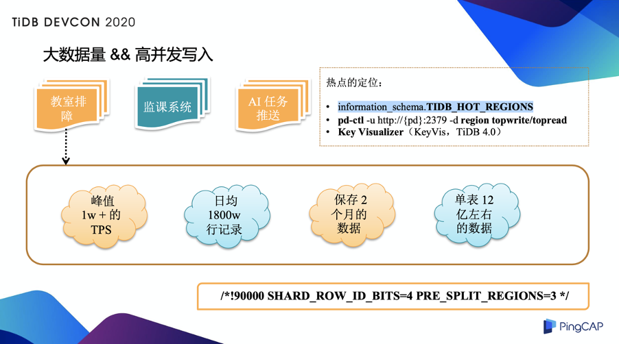

举其中一个例子，我们现在有一套教室排障的系统，这套系统会实时收集教室内的一些事件信息，比如进出教室还有教室内服务初始化的信息，这些信息是通过家长端还有教师端统一上报的，业务同学可以根据这些信息快速定位到教室内的故障，并且做一些排障手段，比如说切换线路之类的来保证一些上课质量。

这套系统目前 TPS 峰值在 1 万左右，每天的新增数据量大概有 1800 万，这张表只保留最近两个月的数据，目前单表有 12 亿左右，数据量其实相对来说已经比较大了，这种数据量如果现在放在 MySQL 里维护成本比较高，所以我们把这套系统的数据整个迁移到 TiDB。

在迁移过程我们做了一些小的变动，在原有表的基础上把原来的自增 ID 去掉了，在建表的时候通过指定配置做一下预先打散，避免高写入量的时候出现写热点问题。关于热点定位，其实 TiDB 本身之前就提供了很多方式了，比如 3.0 版本其实通 `information_schema.TIDB_HOT_REGIONS` 这张表就可以定位，或者直接可以在 PD 里获取相应的热点 Region 信息，但是通过这种方式拿到的其实只是一个 Region ID，还需要调用具体的 TiDB server 的 API 来获取定位到具体的表或者索引。在 4.0 里，TiDB Dashboard 让热点直观地呈现在我们面前，我们可以直接看到热点写入量、读取量等等热点信息。

### 场景二：核心模块分库分表后的多维度查询

第二个场景是现在我们的很多核心业务在早期就已经做了分库分表，比如约课表。对分库分表比较了解的同学其实知道，一般分库分表的情况下只会以一个业务列作为 Sharding Key 做拆分，但是约课表这种情况下可能涉及到的维度比较多，既有教室、老师、学生还有课程；另外可能其他端也会访问这部分数据，比如教师端来访问这部分数据的时候他可能会以教师的维度来访问，如果做拆分的时候是以学生的维度拆分的，那么教师的访问请求会广播到所有分片上，这在线上是并不允许的。针对这个问题，我们最开始有两种解决方案，一种是我们把所有的数据汇聚完放在 ES，还有一种方式是业务双写，写两套集群，两套集群以各自的维度拆分。无论哪种方案，不论是对 RD 来说还是对我们 DBA 来说维护成本都比较高。

所以我们就借助 [DM](https://pingcap.com/blog-cn/dm-1.0-ga/)，通过 DM 将上游所有分片的表实时同步到下游，并且合并成一张全局表，所有的跨维度的查询，无论是管理端运营平台，还是业务指标监控的系统都走 TiDB 这套系统，查这张全局表，如下图所示：

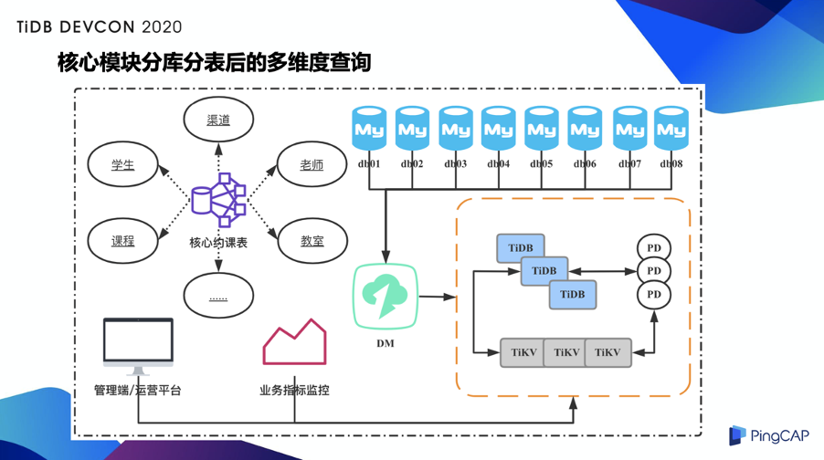

再简单介绍一下 DM 分库分表的逻辑，其实逻辑相对比较简单，DM 其实会拉取线上所有分片的 Binlog 日志，然后根据黑白名单过滤匹配出需要同步的那部分 binlog event，再去匹配制定的路由规则，通过改写然后应用到下游的全局表里，这里也区分两种情况：一种情况是上游的分库分表包含全局 ID，这种情况其实天然的避免了合并之后的主键冲突的问题。还有一种是没有全局 ID 的情况，这种情况之前官方提供了一个解决方案是通过 Column mapping 的方式，其实就相当于对 ID 列在同步之前做一些预处理，处理之后相当于在底层同步的时候就不会有主键冲突的问题了。但是我们和 PingCAP 同学沟通了一下，其实他们现在已经不建议用这种方式了。所以我们换了另外一种方式，因为我们的业务对于这种自增 ID、主键 ID 是没有业务依赖的，所以在下游 TiDB 这块我其实提前建了下图所示的这样一张表，然后把对应 ID 的主键属性和自增属性去掉，并且将这个 ID 加入我原先仅有的一个联合的唯一索引里就解决这个问题了：

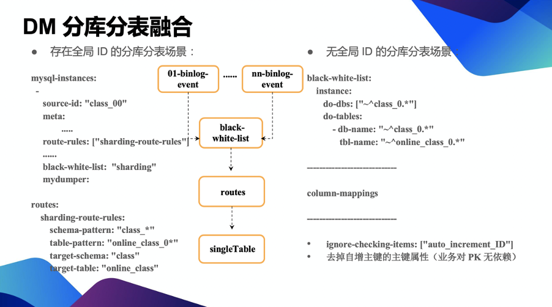

在 DM 这块我们简单地做了两件事。第一是 DM 的延迟监控，其实 DM 本身支持延迟监控，也是通过写心跳的方式去做的，但在我们线上把 DM 并不是挂在 MySQL 集群的主节点下，而是挂在一个只读存库上，所以我们不太允许 DM 直接去写存库的心跳。我们线上有一套心跳机制来监控延迟，所以在实际 DM 这块延迟监控实际复用的是线上的那套心跳表，相当于把线上的那套心跳直接同步下来，也是通过路由规则匹配一下，然后改写。这样的话虽然在 TiDB 里可能涉及到多个集群，但其实每个集群对应单独的一个心跳表，这样就可以做 DM 的延迟监控。在下图里大家可以看到，大部分情况下分库分表合并的场景同步延迟基本都在 200 毫秒以内：

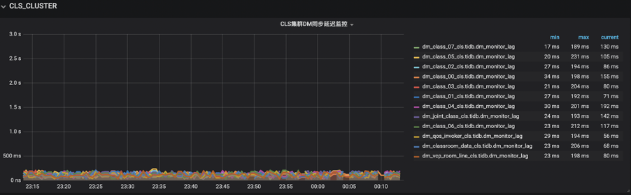

第二件事就是解决 DM 高可用问题，由于 DM 本身并不具有高可用性，可能一个 DM worker down 的时候能够支持自动拉起，但如果出现整个节点 down 的情况下其实是束手无策的。如下图所示，我们做了一个简单的尝试：

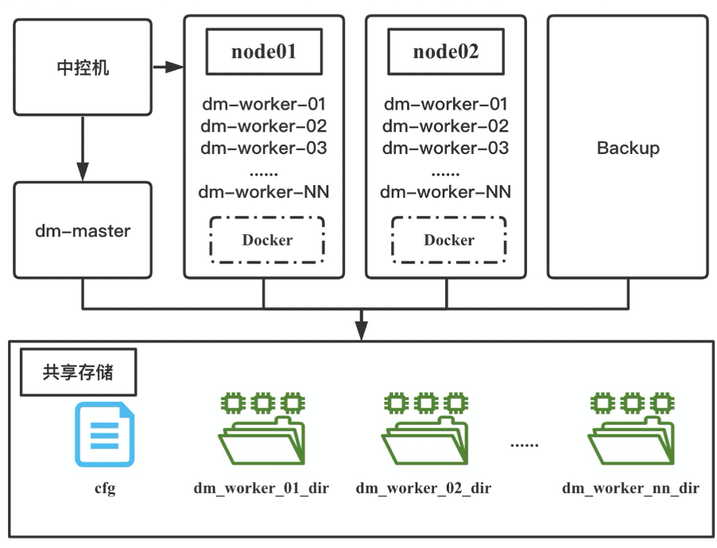

相当于把 DM-master、DM-worker 的所有的持久化的数据全放在共享存储上，DM-worker 是通过容器启动的，如果发生节点宕机的情况下，只需要在备用机上把对应的 worker 提起来，并且关联到自己指定的 DM-worker 的共享存储上 DM 的路径就行。这里有一个问题是 IP 是固化不了的，所以在这个过程中还需要去变更 DM-master 的配置文件，之后做一次 Rolling Update。

### 场景三：数据生命周期管理

TiDB 在 VIPKID 的第三个场景其实就是在数据生命周期管理。如果用过 MySQL 的都知道，其实大表在 MySQL 里维护起来成本是比较高的，所以一般很多公司会做逐级的数据归档。我们现在是根据具体业务，按照读写情况将数据划分成多个等级，并把其中温数据、冷数据，其实还有线上读流量的放在 TiDB 里。

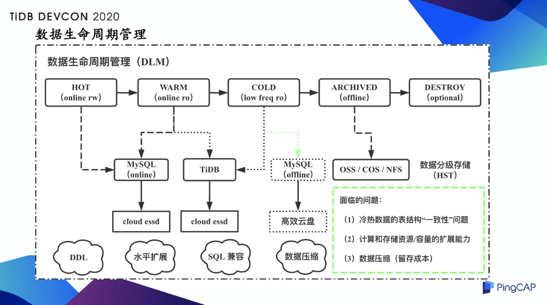

这个场景里引入 TiDB 的考虑是要把数据的流转、运转起来的一个前提要保证冷热数据的表结构一致，但实际情况是，冷数据大部分情况下比热数据体量大很多，比如线上热数据做了一次表结构变更，比如加一列，同时如果冷数据同样要做这个操作，成本其实是很高的，可能是热表的十几倍或者几十倍都有可能，因此我们想借助 TiDB 来做这个事情。本身一方面 TiDB 的 DDL 有一些特性，加字段、减字段都是秒级的，另一方面就是借助 TiDB 本身的水平扩展的能力，我们可以每个业务端复用一套 TiDB 归档集群。下面再简单总结一下我们在使用 TiDB DDL 的相关经验，如下图所示：

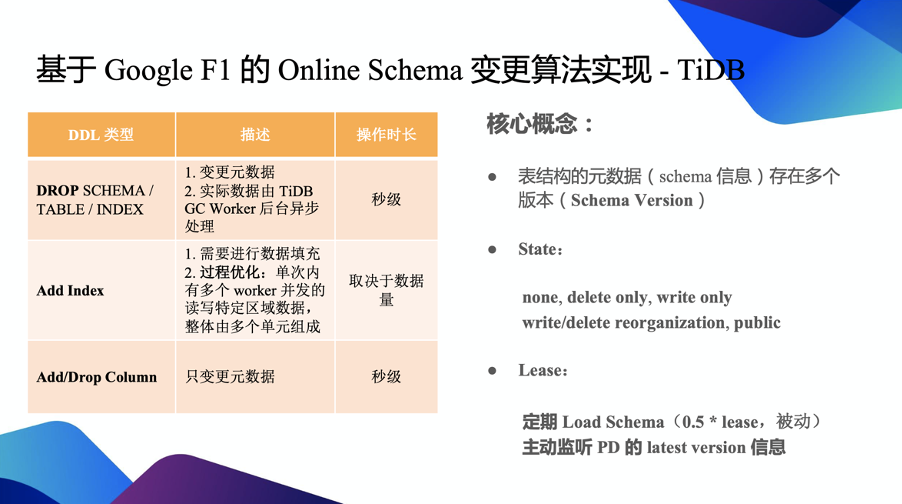

左半部分我列了几个相对比较常见的 DDL 操作，比如删表、删索引，其实在 TiDB 里分了两步做，第一步只变更元数据，这时候就已经秒级返回给用户了，剩下实际数据的清理，是放在后台通过 GC 异步来处理的。而添加索引操作因为涉及到数据的填充和重组，所以这个操作的时间是依赖于数据量，但是并不会阻塞线上业务，我之前看了一下官方的介绍，TiDB 中数据填充的过程被拆分为多个单元，每个单元内部并发进行读写操作。线上更常见的是删列和减列，在 TiDB 里跟 MySQL 的实现就不一样了，也只是变更元数据就行了，并不需要做底层的数据的 rebuild，比如增加一个列，并不需要对原始数据再做一个回填，这里分两种情况，一种是默认值是空的，一种是有一个指定的默认值，其实只需要把这个默认值记录到 TiKV 里跟表结构记录在一块，当你查询这个数据对列值做 decode 的时候，如果是空的，直接返回空；如果是有指定的默认值的，直接返回指定默认值，并不需要对历史数据做变更。

### 场景四：实时数据分析的场景

还有一个场景就是做实时数据分析的场景，下图其实是最早 TiDB 在 VIPKID 引入的一个场景：

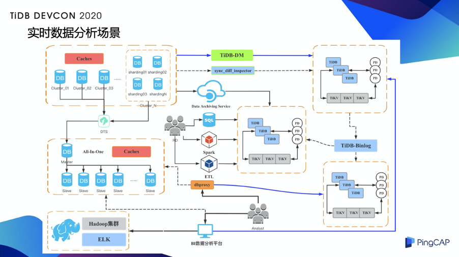

这个场景主要是 BI 分析师还有一些 BI 平台在用，架构上，相当于通过 DM 把线上的数据全部同步到 TiDB 里，借助 TiDB 的水平扩展能力，还有一些计算下推的能力，做一些实时数据分析。

## TiDB 4.0 给我们带来哪些惊喜和收益？

### TiFlash 列式存储引擎

TiFlash是一个列式存储引擎，相对来说对 AP 场景更友好一些，并且他本身自己有计算能力，支持一些算子下推、计算加速。另外，TiFlash 可以实时复制 TiKV 中的数据，并且没有打破之前 TiKV 的运行模式，它把自己作为一个 Learner 角色加入之前的 Raft Group 里可以支持表粒度的同步；还有一个就是智能选择，TiFlash 可以自动选择使用 TiFlash 列存或者 TiKV 行存，甚至在同一查询内混合使用以提供最佳查询速度，它已经不仅仅是单纯的一个 SQL 选择哪种存储引擎，粒度可以细化到同一个 SQL 里具体某个算子，比如一个 SQL 打过来，一部分可以走索引的其实走行存更快，还有一部分涉及到全表扫描的走列存，通过这种方式整体提高 SQL 查询速度。最后，TiFlash 支持独立部署，可以跟 TiKV 独立分开，某种程度上做到了硬件资源的隔离。

**下面谈谈 TiFlash 给我们带来的收益。**

首先是性能提升，我这里做了一个简单测试，测试环境现在是有五个 TiKV 节点，一个 TiFlash 节点，有一个单表 2.5 亿数据，然后我对这个单表做 count，在 TiKV 里走了索引的情况下跑了 40 多秒。而在单个 TiFlash 场景下 10 秒就跑出来了，这只是单个 TiFlash 节点，如果我再新添一些 TiFlash 节点，这个速度应该还可以进一步提高。

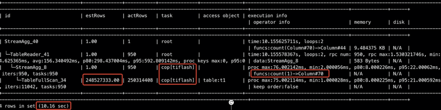

TiFlash

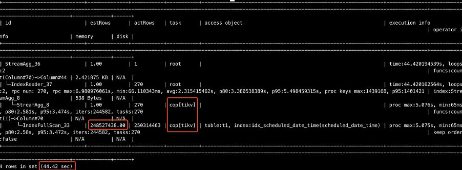

TiKV

第二是成本的下降，我们原来有一套给 BI 用的集群，现在用新的 TiDB 4.0 的集群替换了，可以看一下下图左边的表格是新的 4.0 的集群各个组件资源分配比例，左边是新、老集群同样负载情况下的资源分配情况。可以看到，部署新集群让我们整体成本下降了 35%。

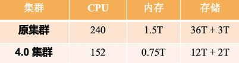

第三 TiFlash 上线解决了一些稳定性的问题。之前在 TiKV 这一层如果跑了一些 TP 业务，这时候有一个  SQL  涉及到一个全表扫描，整个 TiKV 的集群负载就会变大，可能导致 TP 查询整体响应时间变长。现在我可以加入一个 TiFlash 节点，把对应集群里的大表自动添加一个 TiFlash 的副本，在这种情况下如果有一些类似的情况，可以优先会走 TiFlash，而保证 TiKV 尽量不受影响。

再说两点我们在使用 TiFlash 过程中遇到的一些“限制”。

第一，如果你的 SQL 中涉及到一些 TiFlash 还没有实现的函数，其实是无法做到计算下推的，只是利用到了 TiFlash 本身作为列存的一个加速能力（注：如果有尚未实现的下推需求，可以与 PingCAP 官方联系技术支持，添加微信号 ilovesoup2000，备注“TiFlash 技术咨询”即可）。

第二，现在 TiFlash 对大表和大表之间的 JOIN 场景其实覆盖的还不够好，只针对小表和大表之间的 Join 做了一些优化（当然后来我们通过 PingCAP 同学了解到他们 7 月会发布一个优化大小表 JOIN 的功能，可以让若干小表 JOIN 大表比现有方案数量级提升的优化，并且他们今年也会开始陆续优化剩下的 JOIN 场景）。如果大家对 Spark 比较了解的话，可能知道 Hash Join 其实有几种算法，其中一种相当于把一张小表广播到各个数据节点，然后在数据节点本地做 Hash Join 操作，可以看到下图左边的截图，是我们一个教师招募相关的一个大屏统计：

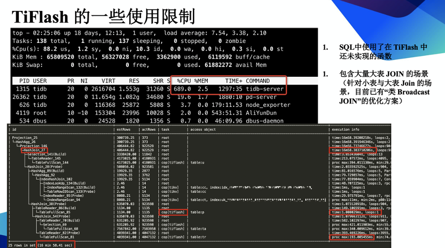

这个查询执行了大概 17 分钟，实际过程中也访问了 TiFlash，但整体的时间其实都耗费在 Hash Join 了，在 TiFlash 上消耗的时候并不多，图上可以看到 TiDB server 这一侧整体负载很高，所以瓶颈是在 TiDB server 这块。

因此我们就考虑怎么把 Hash Join  这块打散，然后我们引入了 TiSpark。如下图所示：

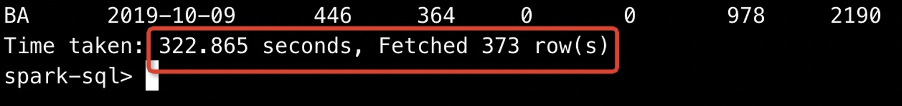

经过对比测试（单个 TiDB server 是 8C 64G 的），分配同样的计算资源给一个小的 TiSpark 集群跑了一个同样的查询，耗时差不多是原来的大概三分之一。下图是改造后给 BI 用的一个 TiDB server 的集群：

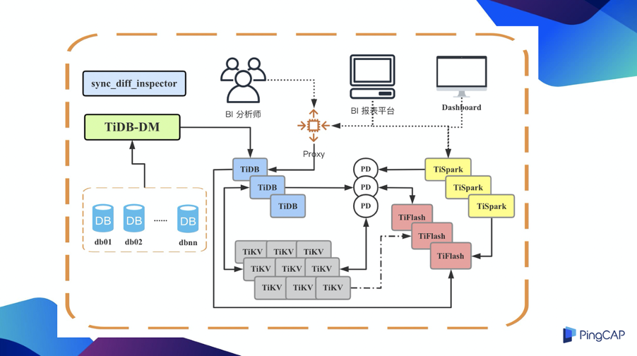

这里主要添加了 TiSpark 的组件和 TiFlash 的组件，由于大屏展示 SQL 可以明确，所以很多直接走了 TiSpark，而 BI 分析师和 BI 平台的查询统计，直接走 TiDB，然后智能选择让它走 TiKV 还是 TiFlash。

### TiDB Dashboard

**TiDB 4.0 中内置的 Dashboard 在我的理解里，其实是 TiDB 在产品易用性、“开箱即用”层面做了一次很大的提升。**

在 3.0 版本像热点的问题也是有方式可以查的，但是相对来说可能有一定的学习成本，另外可信息比较零散。现在 4.0 版本把这些都放在了 Dashboard 里，以一个更直观的方式展现给用户。然后就是 Dashboard 里比如说像日志搜集还有慢日志这块，这块其实跟刚才的逻辑一样其实就是为了让用户可以更简单的使用 TiDB，如果没有这些东西的话，用户集群小的话可以去具体节点上去查，如果集群规模比较大，可能用户要自己准备一套日志提取、日志上报的东西，其实是存在一定的落地成本的。还有一块是在集群诊断这一块，集群诊断这块像我们的业务其实每周有一个定期的活动，有时候研发会说我这周和上周的量并没有明显的变化，但其实感觉到下边的响应时间变长了，其实可以生成指定的诊断报告，里边我可以明确一个基准的区间做对比：

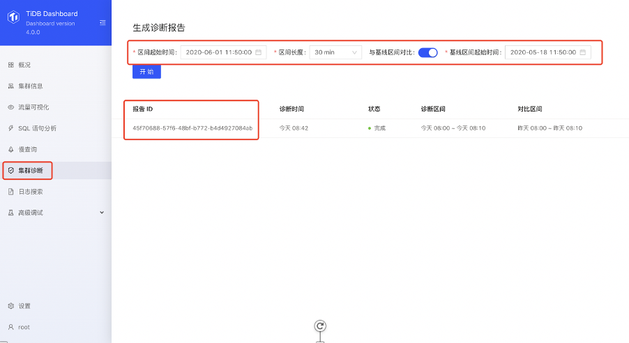

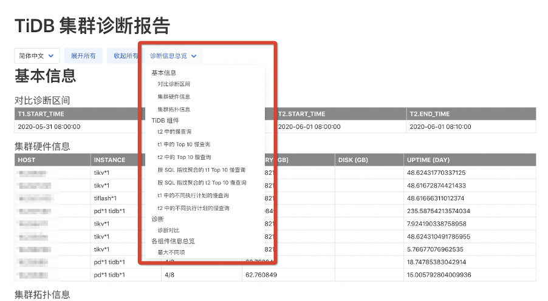

### Backup & Restore 

之前 TiDB 在备份这块相对来说相对空白了一点，只支持逻辑备份，但说大数据量的情况下逻辑备份效率是很低的，所以现在 4.0 中的 BR 工具偏物理备份，还是让人很受鼓舞的。

BR 本身的程序去跟 PD 通信，来获取当前的时间戳，还有目前 TiKV 的分布情况，并且 BR 自己在内部启动一个临时的 TiDB 实例，去构建一个备份相关的请求信息，并且将请求信息发给各个 TiKV 节点，所以这个过程中备份其实是一个分布式的备份，指定的 TiKV 节点会只备份自己当前实例上的主节点，做类似于物理备份，当他把  Region Leader 备份完了之后会把对应的元数据返回给 BR，BR 会把这些元数据保存在一个单独的文件里，然后待恢复的时候使用。

我们简单试用了一下，如下图所示：

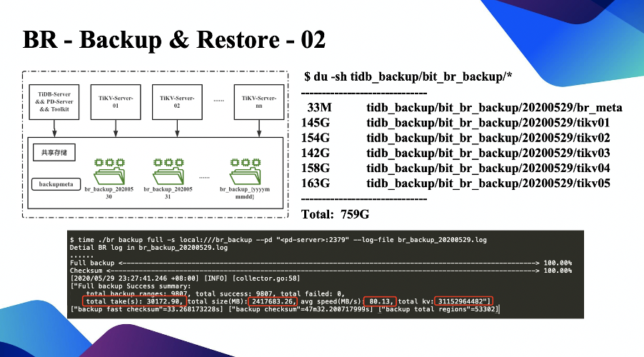

我们按官方的建议，以共享存储的方式来做备份，相当于在 BR 那台机器还有所有 TiKV 的机器上都挂了相同的共享存储做了一次备份，一个 2.4T 左右的 TiDB 实例备份了大概几个小时，这个时间还可以进一步优化的，因为我看平均速度才 80 多兆，可能是受限于现在 SAS 盘带宽的问题，后期做一下调整会更快。大家从上图也能看到 BR 备份的各个目录的大小，整体备份大小可以看到大概有 700 多 G。

以上就是全部分享，谢谢大家。

>本文整理自许超在 [TiDB DevCon 2020](https://pingcap.com/community-cn/devcon2020/) 上的演讲。
