>作者介绍：李文杰，网易互娱计费组，高级数据库管理工程师，TiDB User Group Ambassador。

## 一、业务架构简介

计费组是为网易互娱产品提供统一登录和支付高效解决方案的公共支持部门，对内是互娱的各个游戏工作室，对外是国内外数百个渠道。由于业务场景的特殊性，我们为各个游戏产品部署了不同的应用服务，其中大产品环境独立，小产品集中部署。

随着部门业务量的激增，单机 MySQL 在容量、性能、扩展性等方面都遇到了瓶颈，我们开始对其他数据库产品进行调研选型。本文详细介绍了网易互娱计费组针对自己场景的数据库选型对比方案，以及使用 TiDB 后解决的问题，并分享了使用 TiDB 过程中集群管理、监控和数据迁移等方面的最佳实践，以供大家参考并和业界交流。

### 1.1 MySQL 使用架构

网易互娱计费组线上 MySQL 的基本使用架构，如下图所示，其中箭头方向表示数据或请求的指向。

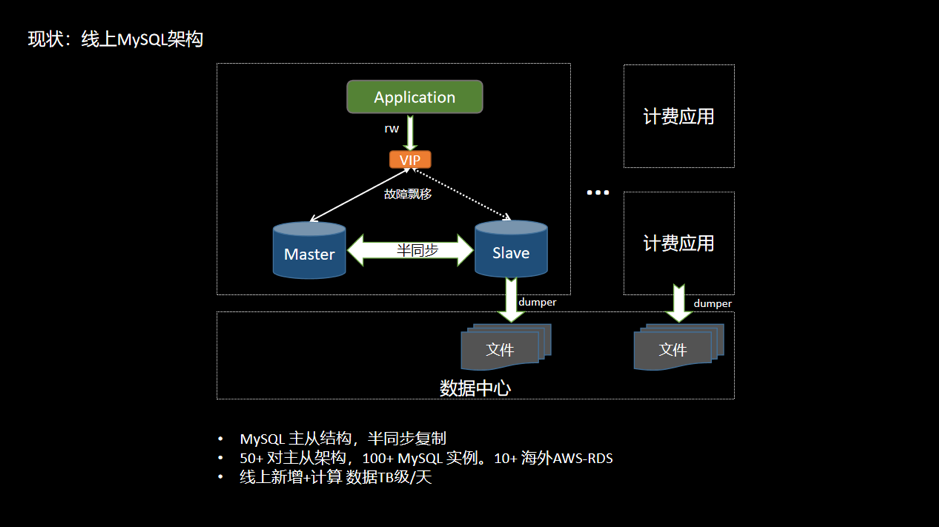 

<center>图 1 网易互娱计费组线上 MySQL 使用架构</center>

* 线上应用 Application 通过 Keepalive + 多机部署，流量经过负载均衡，可以有效保障应用服务的高可用；
* 数据库层架构是 Keepalive + 主从结构，利用半同步复制特性可以有效解决延迟和数据一致性的问题；
* Application 通过 VIP 访问后端数据库，在数据库主节点宕机后通过 VIP 飘移到从节点，保证服务正常对外提供；
* 通过 Slave 节点进行数据备份和线上数据采集，经过全量和增量同步方式导出数据到数据中心，然后进行在线和离线计算任务；
* 类似这样的架构组合线上大概有 50+ 套，涉及服务器 200~400 台，日均新增数据 TB 级。

### 1.2 MySQL 使用的现状与问题

随着业务的发展，部门内各应用服务产生的数据量也在快速增长。业务落地数据量不断激增，导致单机 MySQL 不可避免地会出现性能瓶颈。主要体现在以下几个方面：

+ 容量
    - 单机 MySQL 实例存储空间有限，想要维持现有架构就得删除和轮转旧数据，达到释放空间的目的；
    - 网易互娱某些场景单表容量达到 700GB 以上，订单数据需永久保存，同时也需要保持在线实时查询，按照之前的存储设计会出现明显的瓶颈。

+ 性能
    - 最大单表 15 亿行，行数过大，导致读写性能受到影响。

+ 扩展性
    - MySQL 无法在线灵活扩展，无法解决存储瓶颈。

+ SQL 复杂
    - 大表轮转后出现多个分表，联合查询时需要 join 多个分表，SQL 非常复杂并难以维护；
    - 单机 MySQL 缺乏大规模数据分析的能力。

+ 数据壁垒
    - 不同产品的数据库独立部署；
    - 数据不互通，导致数据相关隔离，形成数据壁垒；
    - 当进行跨产品计算时，需要维护多个异构数据源，访问方式复杂。数据分散在不同的数据孤岛上会增加数据分析难度，不利于共性价值的挖掘。如下图：
    
    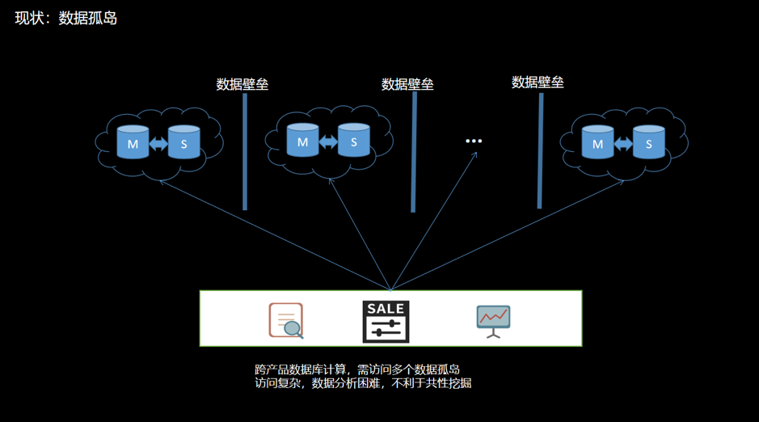 
    
    <center>图 2 现状数据孤岛</center>


## 二、数据库选型

### 2.1 调研目标

针对目前存储架构存在的问题，有需要使用其他存储方案的可能。考虑到目前的业务与MySQL 高度耦合，对数据库选型的主要要求有：

+ 必须兼容 MySQL 协议；
+ 支持事务，保证任务以事务为维度来执行或遇错回滚；
+ 支持索引，尤其是二级索引；
+ 扩展性：支持灵活在线扩展能力，包括性能扩展和容量扩展。

其他要求：

+ 稳定性和可靠性；
+ 备份和恢复；
+ 容灾等。

### 2.2 可选方案

| 序号 | 方案 | 说明 |
|:--- |:------------|:-----------------------|
| 1 | MySQL 分库分表 | 基于 MySQL |
| 2 | MySQL Cluster  | 基于 MySQL |
| 3 | MySQL + Vitess| 基于 MySQL |
| 4 | MySQL + MyCAT | 基于 MySQL |
| 5 | CockroachDB（简称 CRDB） | 兼容 PostgreSQL 协议，不兼容 MySQL 协议 |
| 6 | TiDB | 兼容 MySQL 协议 |

### 2.3 测试

#### 2.3.1 基于 MySQL 的解决方案

一开始仍然是倾向使用基于 MySQL 的解决方案，比如 MySQL InnoDB Cluster 或 MySQL + 中间件的方案。

我们测试了 MySQL 集群 5.7.25 版本对比 8.0.12 版本，在 128 并发写各 1000 万行的 10 个表，比较单节点、3 节点和 5 节点下的情况，如下图所示：

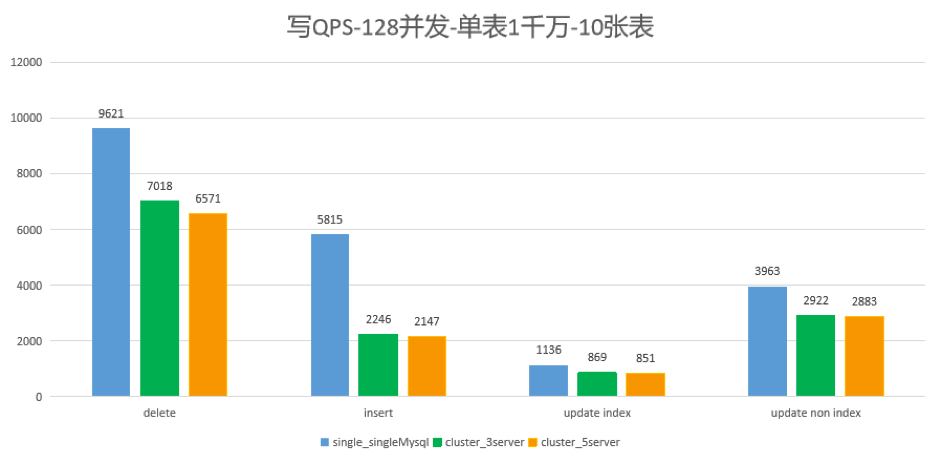 
    
<center>图 3 对比结果</center>

在测试中发现，使用 MySQL InnoDB 集群的方案写性能比单机 MySQL 差约 30%，其他的读写测试结果也不甚满意。之后陆续测试 MySQL InnoDB Cluster 或 MySQL + 中间件的方案，不是测试结果性能不达要求，就是需要修改大量代码。

因此我们得出了基于 MySQL InnoDB Cluster 或 MySQL + 中间件的方案的不满足我们的业务场景的结论。总结来说，我们不使用 MySQL 分库分表、中间件或 MySQL 集群，原因主要是以下两点：

+ 方案过于复杂
+ 需要改业务代码

**仔细分析来看，其实基于 MySQL InnoDB Cluster 或 MySQL + 中间件的方案，本质上是 MySQL 主从结构的延伸，并非真正的分布式拓展，像是以打“补丁”的方式来实现横向扩展，很多功能特性自然也难以让人满意。**

#### 2.3.2 CockroachDB VS TiDB

在开源的分布式 NewSQL 领域，知名的有 TiDB 和 CockroachDB（简称 CRDB），二者都是基于 Google Spanner 论文的开源实现。我们对这两种数据库的功能和性能做了大量的调研和测试。

+ TiDB 天然兼容 MySQL 协议，而 CRDB 兼容 PostgreSQL ；
+ 如果业务以 MySQL 为主，那 TiDB 可能是比较好的选择；如果是 PostgreSQL，那CRDB 可能是优先的选择。

测试方面，我们也进行了全面地对比和测试。这里说其中一个测试案例：10 台机器 5 存储节点，160 并发访问单表 2 亿行，我们于 2018 年 7 月，对 CRDB-v2.1.0 版本和 TiDB-v2.0.5 版本进行了读写测试（CRDB 和 TiDB 集群均使用默认配置，未进行调优）。

**集群拓扑**

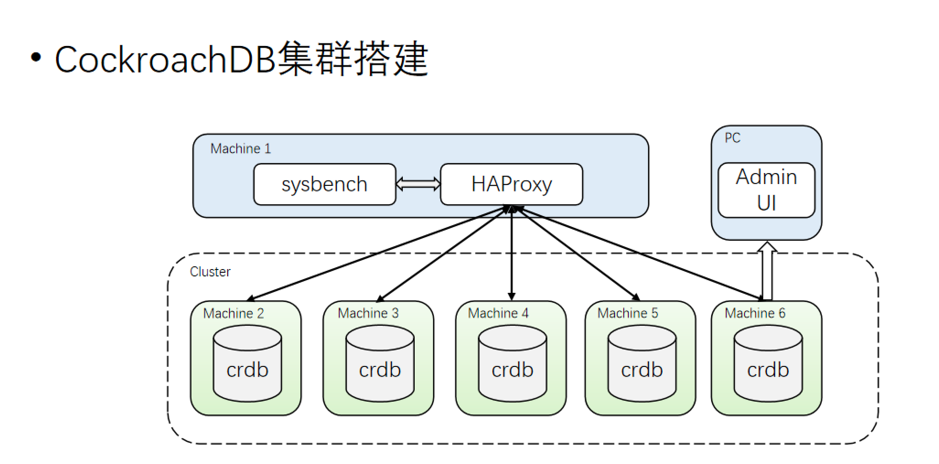 
    
<center>图 4 CockroachDB 测试集群搭建</center>

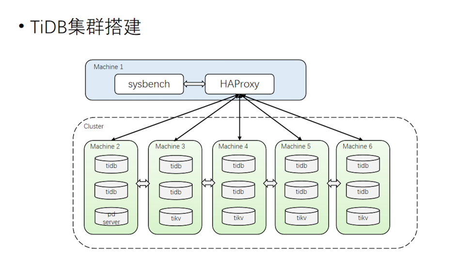 
    
<center>图 5 TiDB 测试集群搭建</center>

**测试语句**

+ 范围查询：

	```
	SELECT c FROM sbtest%u WHERE id BETWEEN ? AND ?
	SELECT SUM(k) FROM sbtest%u WHERE id BETWEEN ? AND ?
	SELECT c FROM sbtest WHERE id BETWEEN ? AND ? ORDER BY c
	SELECT DISTINCT c FROM sbtest%u WHERE id BETWEEN ? AND ? ORDER BY c
	```

+ 随机IN查询：

	```
	SELECT id, k, c, pad FROM sbtest1 WHERE k IN (?)
	```

+ 随机范围查询：

	```
	SELECT count(k) FROM sbtest1 WHERE k BETWEEN ? AND ? OR k BETWEEN ? AND ?
	```

+ 更新索引列：
	
	```
	UPDATE sbtest%u SET k=k+1 WHERE id=?
	```

+ 更新非索引列：

	```
	UPDATE sbtest%u SET c=? WHERE id=?
	```

+ 读写混合：范围查询+更删改混合

其中一个重要的测试结果如下：

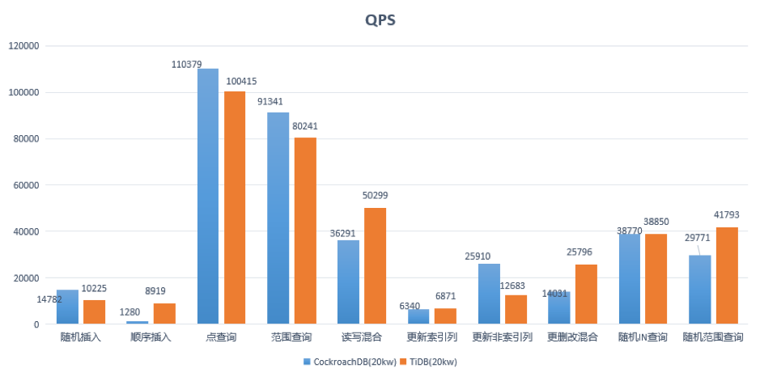 
    
<center>图 6 一个重要的测试结果</center>

结论：

1. CRDB 和 TiDB 在性能表现上不相上下；

	>注：上面是 2018 年 7 月的基于 TiDB 2.0.5 版本的测试结果，现在 [TiDB 已发布 3.0 GA 版本，在性能上有了质的提升](https://pingcap.com/docs-cn/v3.0/releases/3.0-ga/)，我们在近期进行了补充测试，大多数场景下 3.0 版本 较 2.1 版本有数倍的性能提升，最新的测试结果图如下：
	>
	>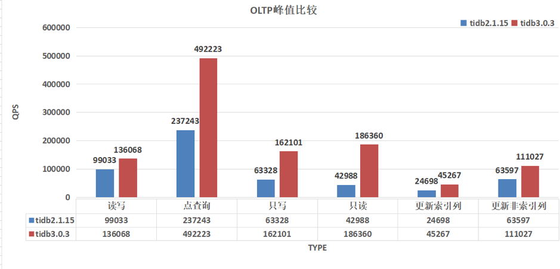 
	>
	><center>图 7 TiDB 2.1.15 vs 3.0.3：OLTP 峰值比较</center>
	>
	>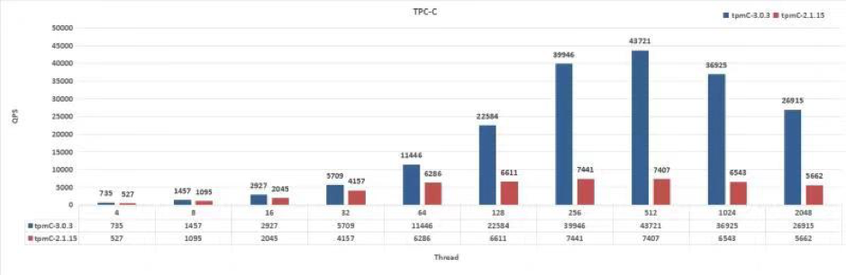 
	>
	><center>图 8 TiDB 2.1.15 vs 3.0.3：TPC-C</center>

2. CRDB 兼容 PostgreSQL，如果需要迁移则需要转协议，需 MySQL → PostgreSQL  → CRDB。迁移过程复杂，成本高；

3. TiDB 兼容 MySQL，代码修改量不多，迁移成本低。

#### 2.3.3 最终选型

综合对比结果如下表：

| 数据库 | 扩展 | TP | AP | 文档程度 | 社区活跃度 |
|:------|:------|:------|:------|:------|:------|
| MySQL | 否  | 是  | 否  | 丰富 | 高 |
| PostgreSQL  | 否  | 是 | 是 | 丰富 | 高 |
| MySQL InnoDB Cluster | 否 | 是 | 否 | 少  | 低 |
| MysQL + 中间件 Vitess | 是 | 是  | 否 | 丰富 | 中 |
| CRDB | 是 | 是  | 是  | 少 | 低 |
| TiDB | 是  | 是  | 是 | 丰富 | 高 |

经过谨慎的考量，我们选择了 TiDB。

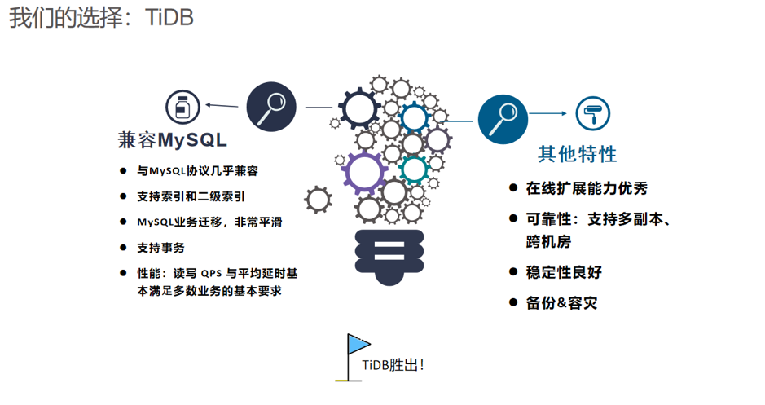 

<center>图 9 选择 TiDB 的重要理由</center>

## 三、TiDB 在网易互娱计费组的使用

### 3.1 TiDB 使用架构

网易互娱使用 TiDB 的架构设计如下：

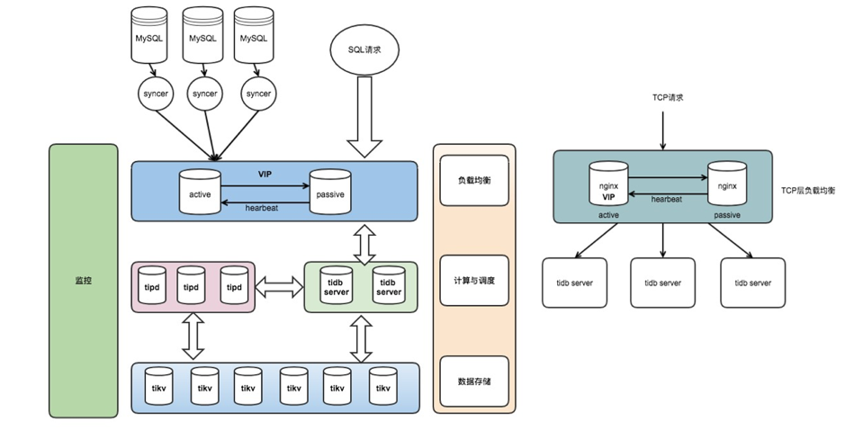 

<center>图 10 基于 TiDB 的架构设计</center>

+ 整个集群分为 TiDB、TiKV 和 PD 3 个模块分层部署；
+ 使用 Nginx 作为前端负载均衡。

### 3.2 TiDB 解决了哪些需求

| 需求 | 解决方案 |
|:---------|:-----------------------------|
| 大容量存储 | TiDB 在线实时伸缩，无需停机和频繁清理数据  |
| 性能需求 | TiDB 支持多点读写，QPS 随节点数量增加而增长，理论上无限制 |
| 高可用需求 | TiDB 强一致性多副本存储，节点宕机不影响服务 |
| 数据备份和容灾 | 数据多副本；支持跨机房、跨地域部署；Mydumper + Loader 多线程并发导出和恢复 |
| 分库分表 | 无需分库分表，天然支持超大表的高效读写 |
| 打破数据壁垒 | 支持 |

### 3.3 TiDB 使用现状

+ 业务
    - TiDB 作为线上 MySQL 数据镜像，负责线上数据的收集和集中管理，形成数据湖泊；
    - 应用于数据平台服务，包括报表、监控、运营、用户画像、大数据计算等场景；
    - HTAP：OLTP + OLAP。

+ 集群
    - 测试集群：v2.1.15，用于功能测试、特性尝鲜；
    - 线上集群：v2.1.15，80% 离线大数据计算任务 + 20% 线上业务。

+ 规模
    - 41 台服务器，88 个实例节点，38 个 Syncer 实时同步流（将升级为 DM）；
    - 存储：20 TB/总 50 TB，230 万个 Region；
    - QPS 均值 4 k/s，高峰期万级 QPS，读写比约 1:5；
    - 延迟时间：80% 在 8ms 以内，95% 在 125ms 以下，99.9% 在 500ms 以下。

## 四、最佳实践分享

### 4.1 集群管理

+  Ansible（推荐）
    - 一键部署
    - 弹性伸缩，可在线灵活扩缩容
    - 升级：单节点轮转平滑升级
    - 集群启停和下线
    - Prometheus 监控

+ Docker
+ K8s
    - 使用 [TiDB Operator](https://github.com/pingcap/tidb-operator) 可以在私有云和公有云上一键管理

### 4.2 运维实践

#### 4.2.1 Prometheus 监控

官方集成了 Prometheus + Grafana 的实时监控平台，从集群的各个方面进行了完善的监控，包括：

+ 服务器基础资源的监控：内存、CPU、存储空间、IO 等；
+ 集群组件的监控：TiDB、PD、TiKV 等；
+ 数据监控：实时同步流、上下游数据一致性检验等。

PD 监控示意图如下，集群管理员可以很方便地掌握集群的最新状态，包括集群的空间 Region 等所有情况。

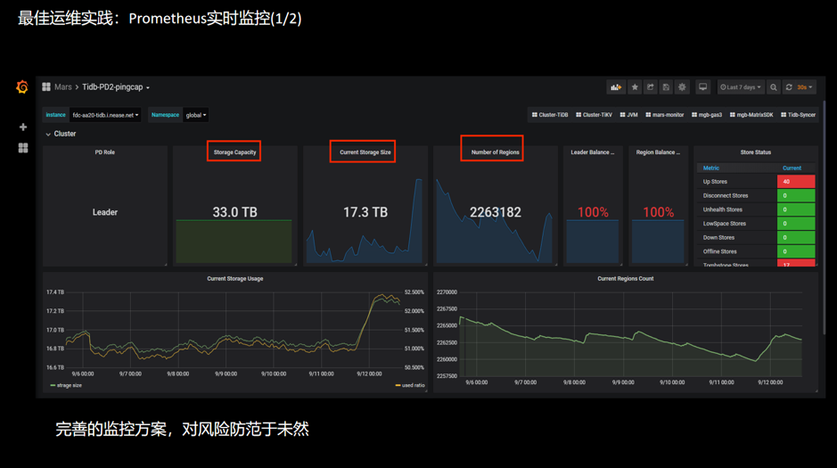 

<center>图 11 最佳运维实践：Prometheus 实时监控</center>

如果集群运行过程出错，在监控面板上很容易就发现，下图是使用过程中的一个案例：

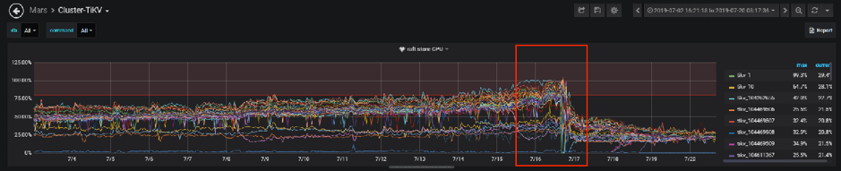 

<center>图 12 最佳运维实践案例</center>

应用访问 TiDB 写入数据时发现特别慢，读请求正常。排查后，根据 TiKV 面板发现 Raft Store CPU 这项指标异常。深入了解原因是因为数据库副本复制是单线程操作，目前已经到了集群的瓶颈。解决办法有以下两点：

+ Region 数量过多，Raft Store 还要处理 heartbeat message。
    - 解决方法：删除过期数据。

+ Raft Store 单线程处理速度跟不上集群写入速度。
    - 解决方法：从 2.1.5 升级到 2.1.15，开启自动 Region Merge 功能。

#### 4.2.2 部分运维问题及解决方案

| 问题 | 问题版本 | 原因及解决方案 |
|:----------------|:------------|:-------------------------|
| 大表建索引时对业务有影响 | 2.0 | 官方建议在业务低峰期操作，在 2.1 版本中已经增加了操作优先级以及并发读的控制，情况有改善。 |
| 上下游表结构不一致，同步异常 | 2.1 | TiDB 下游表比上游 MySQL 多增加几列时，DM 同步异常，其无法按指定列同步(insert into A (a,b,c) values ...)。官方表示已经在增加该功能，预计 2019 年 Q4 推出支持上下游表结构不一致的版本。|
| 在一个 DDL 里不能对多个列或者多个索引做操作 | 2.1 | ADD/DROP INDEX/COLUMN 操作不支持同时创建或删除多个索引或列，需要拆分单独执行，官方表示 3.0 版本有计划改进。 |
| 重启 PD 节点，业务报 PD server timeout   | 2.1 | 重启 Leader 节点前需手动切换 Leader。官方建议通过重启前做 Leader 迁移来减缓，后续也会对通讯相关参数进行优化。 |
| 建表语句执行速度相比 MySQL 较慢。| 2.0 & 2.1 | 多实例 TiDB 部署时，DDL Owner 和接收Create 语句的 Server 不是同一个时间，可能比 MySQL慢一些，耗时约 0.5s，官方表示会再完善。 |
| Delete 大量数据，GC 跟不上 | 2.1 | GC 是单线程的，当删除数据量非常大时会导致 GC 速度较慢，很可能 GC 的速度跟不上写入，可通过扩容和缩短 GC 周期间隔解决，长期需要实现分布式 GC，官方表示对此已经在 3.0 版本实现。 |
| 存储空间放大  | 2.1 & 2.0 | 该问题属于 RocksDB。RocksDB 的空间放大系数最理想的值为 1.111。官方建议在合适场景下通过 TiKV 开启 RocksDB 的 dynamic-level-bytes 以减少空间放大。 |
| Truncate Table 空间无法完全回收 | 2.0 | Truncate 一张大表后，发现 2 个现象：一是空间回收较慢，二是最终也没有完全回收。目前 2.1 版本优化底层 RocksDB 的机制，使用 DeleteFilesInRange 接口删除整个表占用的空间，然后清理少量残留数据，已经解决。 |

### 4.4 全网数据库遍历

以前部分业务遍历全网数据库获取所需数据，需要维护多个源，而且是异构源，非常复杂和繁琐。使用 TiDB 很好地解决了这个问题，只需要访问一个源就可以获取到所有想要的数据。

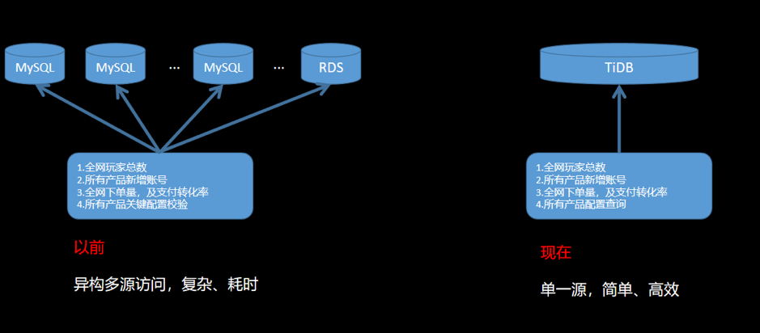 

<center>图 13 全网数据库遍历</center>

### 4.5 数据迁移

#### 4.5.1 MySQL 到 TiDB

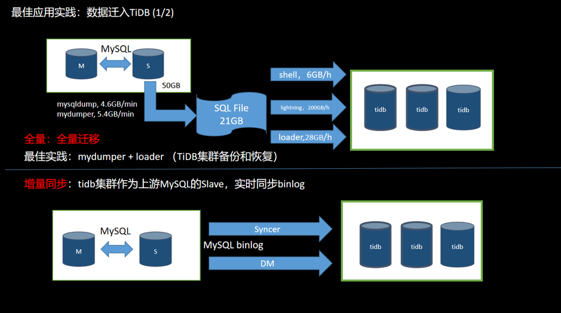 

<center>图 14 数据从 MySQL 迁移到 TiDB</center>

MySQL 数据库迁移到 TiDB 分为两个部分：全量和增量。

+ 全量
    - 使用工具 （Mydumper 或 MySQL Dump等）从 MySQL 导出数据，并且记录当前数据的 binlog 位置；
    - 使用工具（Loader 或 Lightning 等）将数据导入到 TiDB 集群；
    - 可以用作数据的备份和恢复操作。

+ 增量
    - TiDB 伪装成为上游 MySQL 的一个 Slave，通过工具（Syncer 或 DM）实时同步 binlog 到 TiDB 集群；
    - 通常情况上游一旦有数据更新，下游就会实时同步过来。同步速度受网络和数据量大小的影响。

#### 4.5.2 数据迁出 TiDB

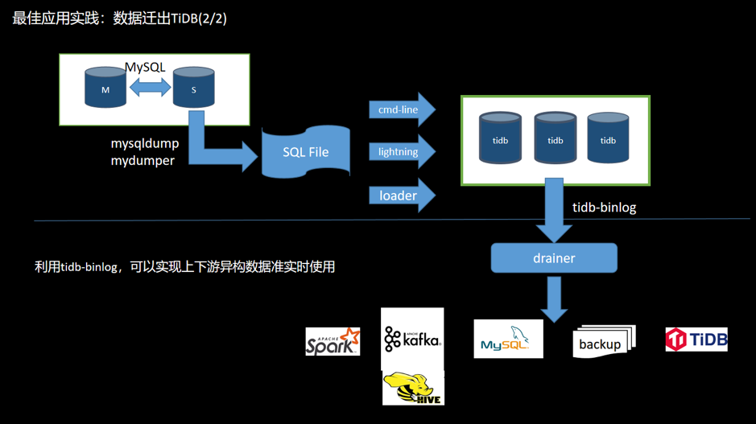 

<center>图 15 数据迁出 TiDB</center>

如果数据需要反向导入或同步，可以利用 [TiDB Binlog](https://pingcap.com/blog-cn/tidb-ecosystem-tools-1/) 工具将 TiDB 集群的 binlog 同步到 MySQL。TiDB Binlog 支持以下功能场景：

+ **数据同步**：同步 TiDB 集群数据到其他数据库；
+ **实时备份和恢复**：备份 TiDB 集群数据，同时可以用于 TiDB 集群故障时恢复。

导入的方式：

+ 全量：TiDB 兼容 MySQL 协议，在 MySQL 容量足够大的情况下，也可用工具将数据从 TiDB 导出后再导入 MySQL。
+ 增量：打开 TiDB 的 binlog 开关，部署 binlog 收集组件（Pump+Drainer），可以将 binlog 数据同步到下游存储架构（MySQL、TiDB、Kafka、S3等）。

### 4.6 优雅地「去分库分表」

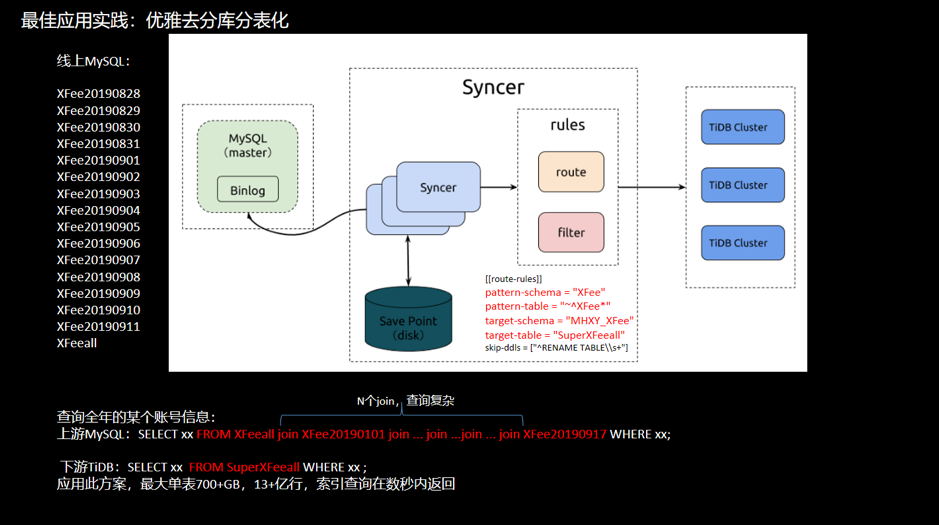 

<center>图 16 去分库分表举例</center>

举例：一个超级大表按天分表，现在打算查询某个账号一年间的信息。

+ 上游 MySQL

	```
	SELECT xx FROM HFeeall join HFee20190101 join ... join ...join ... join HFee20190917 WHERE xx;
	```
	
	需要连接 N 个 join 条件，查询需要等待较长时间。

+ 下游 TiDB

	```
	SELECT xx  FROM SuperHfeeall WHERE xx ;
	```
	
	应用此方案，最大单表 700+GB，13+ 亿行，索引查询秒返回。

### 4.7  业务迁移

**目标**：利用 TiDB 的水平扩展特性，解决容量瓶颈和系统吞吐量瓶颈。

**迁移原则**：

+ 数据完整和准确：数据很重要，保证数据不错、不丢；
+ 迁移平滑和迅速：服务敏感度高，停服时间要短；
+ 可回滚：遇到问题可随时切回到 MySQL。

**1）数据同步**

使用 DM 或者 Syncer 将上游 MySQL 的数据同步到 TiDB 集群。同步流搭建后注意需要检查上下游数据一致性。

观察一段时间，同步无误后，可以根据业务需要迁移部分读流量到 TiDB 集群。

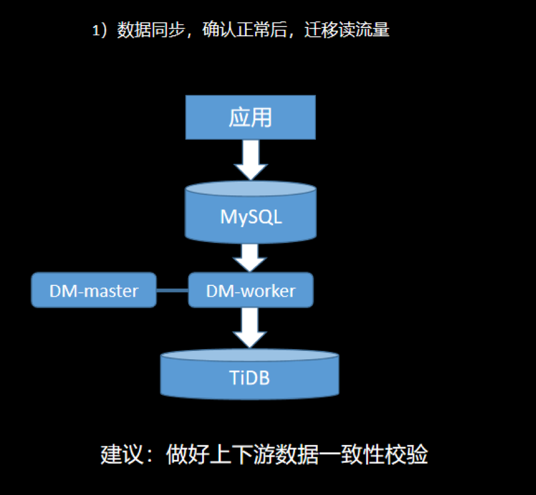 

<center>图 17 业务迁移之数据同步</center>

**2）读写验证**

这一阶段是验证应用访问 MySQL 和访问 TiDB 可以得到相同的结果，验证业务访问的准确性问题。

停止数据同步，使用流量复制工具将线上流量完全拷贝出来，同时读写 MySQL 和 TiDB。将两边的访问结果进行对比，核查 TiDB 是否可靠和可信。根据需要，这个阶段可以测试较长时间。

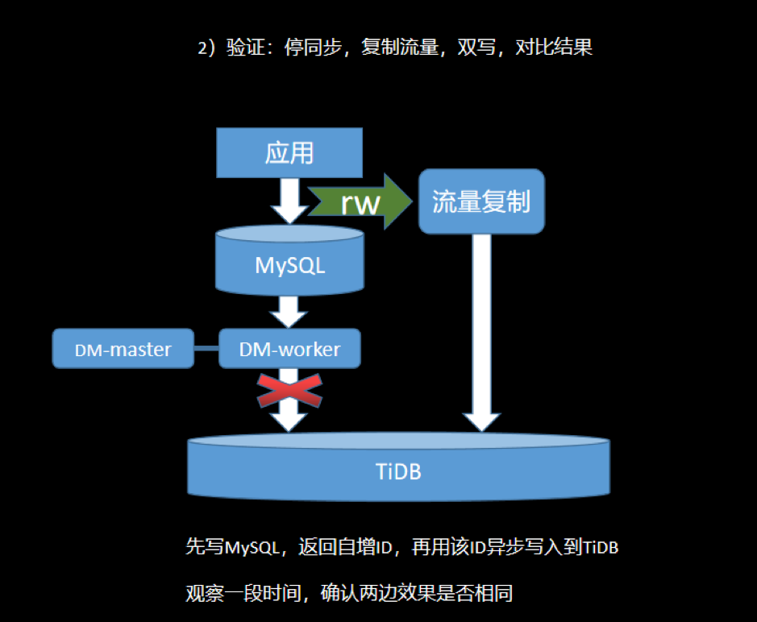 

<center>图 18 业务迁移之读写验证</center>

**3）灰度切换**

将步骤 2 的双写停止，即关双写，同时拉起上游的 DM 同步。

把访问部分非核心业务的库表写操作迁移到 TiDB，打开 TiDB 的 Binlog 开关对线上 MySQL 进行反向同步。这个操作，保证只写 MySQL 的数据同步到 TiDB ，只写 TiDB 的数据也可以反向同步到 MySQL，保证出了问题，随时可以回滚。当业务长时间访问正常，可以增加切换流量，进行灰度切换。建议观察一段时间，至少一个月。

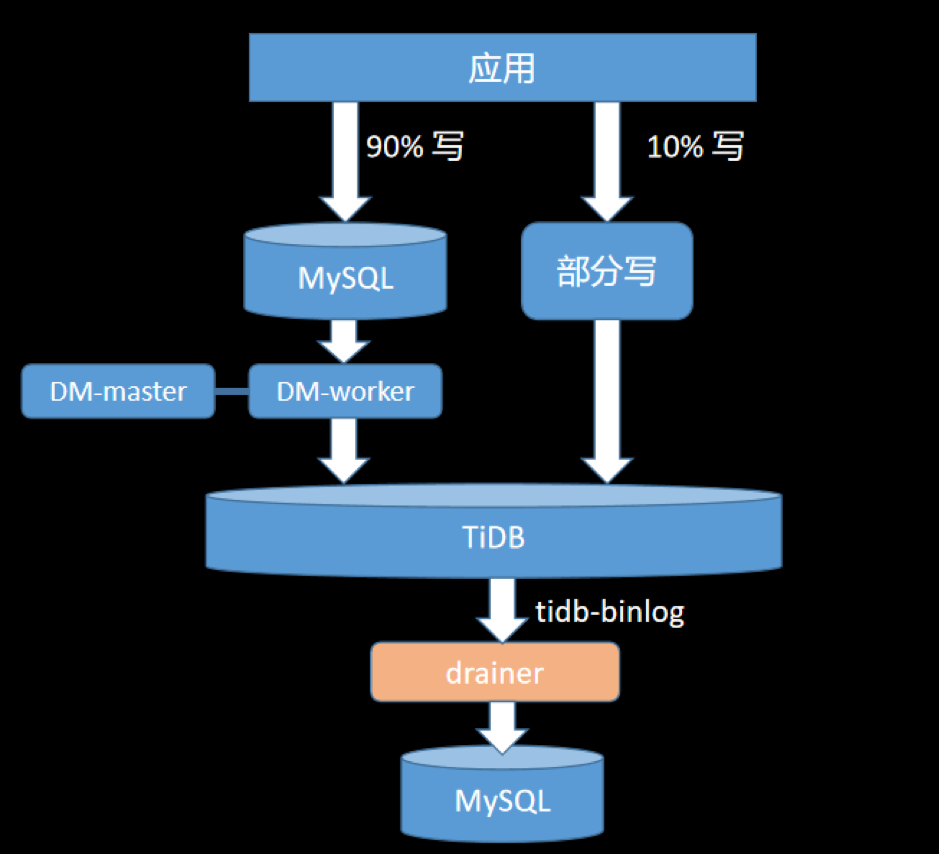 

<center>图 19 业务迁移之灰度切换</center>

**4）迁移完成**

当流量完全迁移完成，保持 TiDB 反同步到 MySQL 过程，继续观察一段时间，确认无误后，断开反向同步，100% 迁移完成。

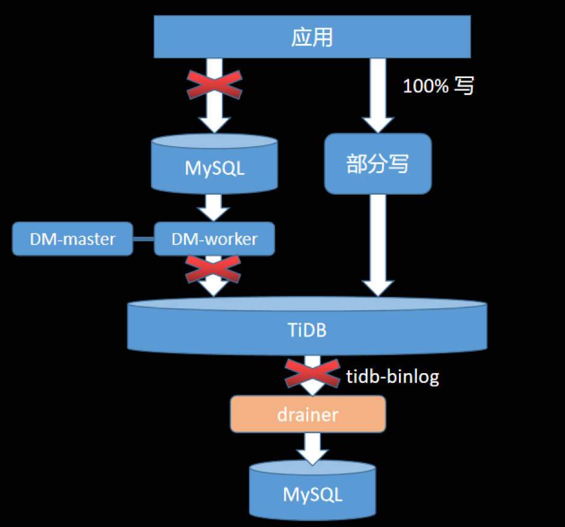 

<center>图 20 完成迁移</center>

## 五、总结与展望

TiDB 兼容 MySQL 协议，支持 TP/AP 事务且扩展性好，能很好地解决网易互娱计费组业务大容量、高可用等问题。目前我们的业务在不断深入和扩大规模使用 TiDB，因为看好它，所以这里提出一些使用中的问题以帮助原厂持续打磨产品：

+ 集群数据备份：希望提供集群更高效地备份和恢复 SST 文件的方式；
+ 事务限制：希望可以放宽大事务的限制，现在仍需要人工切分大事务，比较复杂；
+ 同步：希望 DM 支持上下游表结构不一致的同步；
+ 数据热点问题：建议加强自动检测和清除热点功能；
+ 客户端重试：目前客户端代码需要封装重试逻辑，对用户不友好，希望可以改进。

最后，根据网易互娱计费组已有的使用情况，我们计划继续加大、加深 TiDB 的使用场景，丰富业务类型和使用规模，期待 TiDB 给我们的业务带来更多便利。
