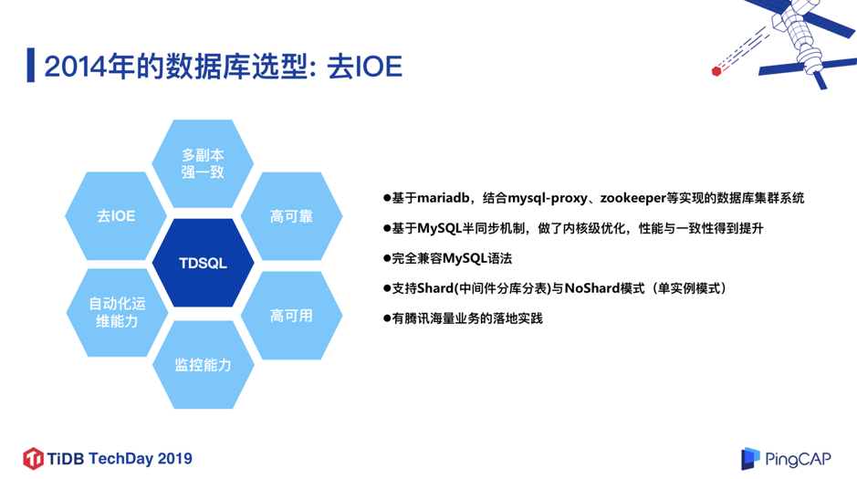
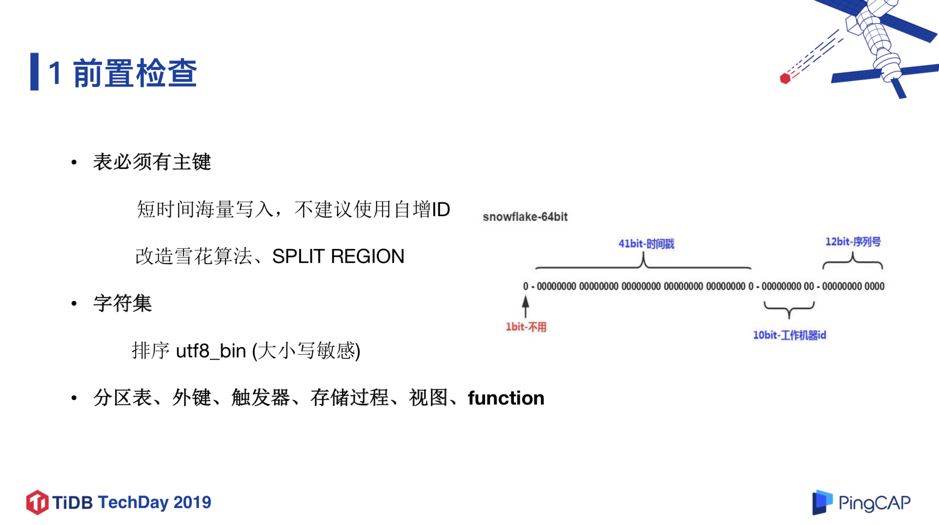

>作者介绍：
>
>**胡盼盼**，微众银行数据平台室室经理。硕士毕业于华中科技大学，毕业后加入腾讯，任高级工程师，从事分布式存储与云数据库相关的研发与运营工作；2014 年加入微众银行，负责微众银行的数据库平台的建设与运营。
>
>**黄蔚**，微众银行数据库平台室高级 DBA。2011 年加入腾讯互动娱乐运营部，担任英雄联盟在内的多款海量用户产品的数据库运维工作。2015 年加入微众银行担任高级 DBA，负责监控优化、性能优化以及新技术预研，目前致力于行内 NewSQL 的推广与生态建设。

本文将介绍微众银行的数据库架构演进过程，并分享 TiDB 在微众银行实践经验和部分业务案例。

## 一、微众银行数据库架构演进

2014 年微众银行成立之时，就非常有前瞻性的确立了微众银行的 IT 基础架构的方向：去 IOE，走互联网模式的分布式架构。IOE 即 IBM、Oracle、EMC，代表了传统基础架构领域的服务器、商业数据库和存储产品体系，众所周知传统银行 IT 架构体系非常依赖于 IOE，每年也需要巨大的 IT 费用去维护和升级 。从数据库角度来看，当时除了 Oracle，能满足金融级银行场景的数据库产品并不多，微众银行基础架构团队经过多轮的评估和测试，最终确定使用腾讯主推的一款金融级别数据库 TDSQL。

图 1

TDSQL 是基于 MariaDB 内核 ，结合  mysql-proxy、ZooKeeper 等开源组件实现的数据库集群系统，并且基于 MySQL 半同步的机制，在内核层面做了大量优化，在性能和数据一致性方面都有大幅的提升，同时完全兼容 MySQL 语法，支持 Shard 模式（中间件分库分表）和 NoShard 模式（单机实例），同时还集成了管控平台，智能运维等功能模块。2014 年，TDSQL 已经支撑了腾讯内部的海量的计费业务，由于计费业务的场景和银行的场景有所类似，对数据库的可靠性和可用性要求也相近，所以我们当时选择了 TDSQL 作为微众银行的核心数据库。

### 1. 基于 DCN 的分布式架构

图 2

确定了数据库的选型之后， 下一步就是架构设计。我们设计了基于 DCN（Data Center Node）的分布式架构。DCN 可以认为是一个“自包含单位”，它会包含应用层、接入层、数据库层，每个 DCN 承载规定数据量的用户，通俗的理解，每个 DCN，就相当于微众银行的一个小的分行；基于 DCN 可以实现集群规模的水平扩展。这种架构对于数据库来说，其实是比较友好的，因为每个 DCN 的用户规模是确定的，那么对数据库的容量和性能要求也是可确定的，因此我们不必再采用复杂的中间件分库分表的方式构建数据库，而只用单实例模式承载，极大简化了数据库架构，也降低了业务开发成本。

如图 2 所示，为了实现 DCN 架构，这里有两个关键组件：RMB 和 GNS。RMB 负责各个模块以及各个 DCN 之间的消息通信；GNS 负责全局的 DCN 路由，即某个用户保存在哪个 DCN。另外这里有一个比较特殊的地方就是 ADM 管理区，它是一个统一的管理区，保存着无法进行 DCN 拆分的全局业务数据，和通过各 DCN 进行汇总的数据。后来 ADM 区成为了一个 TDSQL 的瓶颈，这是我们引入 TiDB 的动机之一。

### 2. IDC 架构

图 3

接下来看一下我们的 IDC 的架构。目前我们是两地六中心的架构，深圳的 5 个 IDC 是生产中心，而位于上海的跨城 IDC 是容灾中心。同城的任意两个 IDC 之前的距离控制在 10~50 公里以内，并通过多条专线互联，以此保证两个 IDC 之间的平均网络延迟可以控制在 2ms 左右，并保证网络的稳定性。

### 3. 数据库部署架构

图 4

基于以上的 DCN 架构和 IDC 架构，我们设计了数据库的基础架构，如图 4 所示：我们采用同城 3 副本+跨城 2 副本的 3+2 部署模式，同城 3 副本为 1 主 2 备，跨 3 个同城 IDC 部署，副本之间采用 TDSQL 强同步，保证同城 3 IDC 之间的 RPO=0，RTO 秒级，跨城的 2 副本通过同城的一个 slave 进行异步复制，实现跨城的数据容灾。基于以上架构，我们在同城可以做到应用多活，即同城的业务流量，可以同时从 3 个 IDC 进来，任何一个 IDC 宕机，可以保证数据 0 丢失，同时在秒级内可以恢复数据库服务。这个架构在微众银行内部运行了四年多，当前已有 1500 多个实例在运行，数据量达到 PB 级，承载了银行数百个核心系统，整体上来说还比较稳定的。但同时也遇到一些瓶颈。因为我们采用的是单实例的部署模式，对于有些无法通过 DCN 拆分进行扩展的业务场景，单实例的性能和容量就很容易到达瓶颈。

当然，TDSQL 也提供了 TDSQL-Shard 模式，也就是通过中间件分库分表的方式把一个表 Shard 之后再处理，但我们当时评估之后认为该模式对应用的侵入性比较大，比如所有的表必须定义 shard-key，有些语法可能不太兼容，有些分布式事务的场景可能会有瓶颈，进而导致业务迁移的成本会比较高。

所以在这个背景下，我们开始寻求其它的解决方案，大约在 2018 年，NewSQL 的概念逐渐被提了出来，同时也有一些商业和开源的 NewSQL 数据库出现。我们很惊喜的发现，NewSQL 数据库的特性，可以较好的解决我们当时面临的问题。NewSQL 比较通用的定义是：一个能兼容类似 MySQL 的传统单机数据库、可水平扩展、数据强一致性同步、支持分布式事务、存储与计算分离的关系型数据库。经过大量的调研，对比与分析，我们最终决定重点考察开源 NewSQL 数据库产品  TiDB。

## 二、微众银行 TiDB 数据库实践

### 1. Why TiDB ?

图 5

**除了 TiDB 的 NewSQL 特性之外，我们选择 TiDB 的另一个主要原因，就是 TiDB 是一个开源的项目，而且社区很活跃，版本迭代快速，我们觉得这是一个很好的模式，而且微众本身也是非常拥抱开源的**。

图 6

这里展示了 TiDB 的基本架构模型，非常简洁优雅的架构，相信稍微了解 TiDB 的同学，对这个架构都比较熟悉了，在这里就不再赘述。当然，现在 TiDB 3.0 版本有了新的特性以及模块加入，比如 Titan 引擎， 针对 RocksDB 大 Value 写放大问题做了很大的优化和性能提升，再比如列式存储引擎 TiFlash ，为实现真正的 HTAP 奠定了基础。

### 2. 对 TiDB 的评估与测试

图 7

我们对 TiDB 做了一些评估和测试，对语法和 DDL、负载均衡、一致性、扩容等特性都做了很多测试。下面重点介绍以下 3 点：

* **支持在线 DDL，不锁表，对业务无影响**。
    
	这个特性对我们来说，有很大的好处。因为在 MySQL 里面做 DDL，是风险比较大或者说比较重的一个操作，特别是一些超大的表的 DDL；但在 TiDB 里，这个操作变得轻量而安全。
	
* **TiDB 采用乐观锁事务模型**。
	
	这和 MySQL 的悲观锁模型是不太一样的，这个特性对于某些业务场景的兼容性可能会有问题。
	**TiDB 3.0 版本中已经试验性支持了悲观锁，并且在今年下半年有望成为一个正式功能，这是一个很好的消息。在金融场景里面悲观锁应用还是比较广泛的**。
	
* **支持同城 IDC 部署与切换，通过了真实的 IDC 隔离故障演练**。

	我们将 TiDB，TiKV，PD 节点跨 3 个同城机房部署，然后把其中一个机房的网络全部隔离，来测试 TiDB 的可用性，包括 Raft Group 的 Leader 的切换等等，测试结果整体符合预期。

### 3. TiDB 在微众的部署模型

图 8

图 8 是 TiDB 在微众银行的部署模型，从一开始就选择了同城三机房部署，也就是位于最底层的存储层 TiKV 跨 3 个机房，3 个副本分布在 3 个机房，并且每个机房有 1 套独立的 TiDB Server  集群负责接入与计算；PD 模块也是跨 3 个机房部署。另外，针对比较重要的业务，我们会在容灾 IDC 挂一个容灾 TiDB 集群，这个容灾 TiDB 集群会通过 TiDB Binlog 工具从生产集群实时同步数据。

## 三、微众银行 TiDB 业务实践

**TiDB 在微众银行的应用场景包括 OLAP、OLTP 及部分混合场景，大部分场景在 TB 级别的业务数据规模。下面详细介绍贷款核心批量系统在测试 TiDB 过程中的实践和优化，以及数据存证系统 TiDB 迁移实践**。

### 1. 贷款核心批量场景下的 TiDB 实践

图 9

这个业务场景的特殊性在于每天晚上 0 点之后，需要通过线上数据库生成数亿级别的批量数据，并进行一系列相关计算，然后 ETL 到大数据平台去，其中涉及大量的增删查改操作，并且对总时效要求很高，必须在两个小时内跑完，不能出现任何问题。

**存在的问题**：

* 跑批的时间过长，接近 2 小时，而且业务规模还在扩大。
* 分散于各个 DCN 跑批，然后进行数据汇总，架构比较复杂。
* 受限于 MySQL 主备复制的性能，无法再增加并发，跑批的时间没有办法再缩短，否则会影响联机系统可用性。

所以我们尝试通过 TiDB 来承载这个批量场景，把每天的批量数据，汇总到一个大的 TiDB 集群中，再进行跑批，最后再 ETL 到大数据平台中去做处理。整个流程如图 9 右半部分所示，其中 “DM 工具”即 TiDB DM（TiDB Data Migration），是由 PingCAP 开发的一体化数据同步任务管理平台，支持从 MySQL 或 MariaDB 到 TiDB 的全量数据迁移和增量数据同步。

**我们对应用侧和 TiDB 2.1 版本进行了一系列的调优，整体的优化效果达到预期，批量的耗时缩短了 45% 左右。我们同时也测试了 3.0 beta 版本，3.0 相对于 2.1 版本，整体批量耗时又缩短了 30% 左右。整体来看，TiDB 让我们的贷款核心批量场景下效率得到大幅度的提升**。

在整个业务测试的过程中。我们在应用侧和数据库侧，都做了大量优化，也踩了不少坑，这里也分享几点。

#### a. 数据导入过程 Region 热点集中

图 10

该业务对批量数据导入的时间很敏感，但我们测试时发现虽然底层有 6 个 TiKV 节点，但每次数据开始导入时有 3 个 TiKV 节点负载特别高，另外 3 个节点负载很低，同时写入也有瓶颈。通过排查发现这个问题的原因在于，对于快速的超大表的数据写入，TiKV 的热点调度并不及时，没有办法做到负载均衡，进而导致热点。

我们和 PingCAP 伙伴们讨论解决方案后，增加了 Region 预打散的功能。就是在建表时，就对表进行 Region 打散操作 ，相当于一个空表就分散成多个 Region 分布在 6 个 TiKV 节点上，当数据导入的时候就直接写入各个 Region。从图 10 可以看到增加预打散功能后，6 台 TiKV 的负载非常均衡，并且耗时也变短了。

#### b. 无效 Region 过多导致系统变慢

图 11

另外一个遇到问题就是无效 Region 过多的问题。前面提到，该业务数据在每天跑批完成之后需要删掉，第二天全部数据需要重新生成，所以该场景下每天都有大量的数据表删除和重建，会累积大量无效 Region，导致 PD 元数据管理压力过大，Region 副本之间的心跳也会大量增加 grpc 调用，导致整个系统运行比较慢。所以我们后来灰度上线了 Region merge 功能，这个功能在 TiDB 2.1.8 以后的版本中（含 3.0 GA）引入，

**从 图 11 可以看到上线 Region merge 功能之后，Region 数量直线下降， 这个功能让系统性能的提升提升了 30% 左右**。

### 2. 数据存证系统 TiDB 迁移实践

数据存证系统是微众银行非常重要的系统，存储了具有法律效力的证据类数据，这些数据对客户来说是非常重要的。

图 12

随着越来越多的业务系统的接入，该场景的数据增长速度非常快，比如每一次转帐都需要生成一个证据，并且不是简单的一条记录，而是发生纠纷时法院认可的证据，所以也决定了这些数据不能删除。这些数据划分在 ADM 区，没办法做横向扩展，遇到了很大的瓶颈。基于这些场景特点，微众选择了 TiDB 的解决方案。我们有几个基本的迁移原则：1）数据不能错、不能丢；2）服务敏感度非常高，需要尽量无缝切换到 TiDB 架构上；3）因为是比较严肃的金融场景，如果在迁移过程中有任何困难，我们期望能够随时回切到 MySQL。  

图 13

迁移整体方案如图 13，步骤流程比较长，但会更加安全。接下来介绍每个步骤中我们碰到的困难和解决方案。第一个步骤是前置检查。首先表必须有主键，如果是短时间海量连续写入，不建议用自增 ID，可以把自增 ID 改成由雪花算法生成，再把雪花算法的时间戳后几位提到最前面，这样可以保证主键足够随机 ，然后使用我们之前提到的 Split Region 的功能，提前把 Region 切分，并打散到所有的 TiKV 节点里，这样可以在写入的时候实现负载均衡，解决短时大量写入瓶颈问题。

图 14

触发器、存储过程、视图、function 这些特性在我们行内是禁止使用的，所以对我们是没有影响的。整体来看，前置检查这一步我们重点关注的是性能问题，尤其是保证写的性能，该场景是大批量数据，短时间的数亿数据写入性能的瓶颈问题还是值得关注并解决的。

图 15

前置检查完成后，接下来就是将数据同步到 TiDB，PingCAP 提供了实时同步工具 TiDB DM，在简单配置之后可以“一键式”将 MySQL 中的数据导入 TiDB，让数据迁移变得非常便捷。当然，我们也遇到了几点问题：

* DM 不能保证高可用的问题。
 
    我们和 PingCAP 研发同学们讨论之后，临时解决方案是部署两个 dm-worker（冗余部署），一旦某个 dm-worker 发生问题，就启动另外一个 dm-worker，从下游记录的 pos 点继续同步数据。另外，我们非常期待未来 DM 整合到 TiDB 的 K8s 部署生态工具链中， 再配合云盘（比如 ceph）做状态信息的存档 ，这样会更加完善 DM 的高可用性，我们也深度参与了 PingCAP 研发同学们关于 DM 高可用方案的设计讨论。
    
* 上游故障需要人工切换的问题。

    因为目前“一主多备”架构下，我们把 DM 挂载在其中一台备机，如果这台备机由于服务器故障原因导致宕机，就需要人工把 DM 挂载其他正常的备机，处理时效上会没那么及时；非常期待未来 DM 能够把这个切换操作做成自动化。
* 从 DM 角度看， 表必须要有主键。
    
    一方面，DM 回放 binlog 时需要做并发处理，但是处理之前会做冲突检测，如果没有主键就做不了冲突检测，也就不能做并发回放，导致同步效率比较差。另一方面，幂等操作，比如 DM task 重启或者恢复，会从下游记录的 pos 点继续同步数据，但因为 pos 点不是实时记录，所以会导致重复回放 binlog，如果没有主键，比如重跑两次 insert，数据就重复写入了。因此就要求表必须有主键，DM task 重启或者恢复的时候，DM 内部做一个幂等转换，比如把 Insert 转换成 replace ，把 update 转换成 delete+replace，这样的话就算重跑很多次，它的结果是不会受影响的。

图 16

作为一个金融场景，尤其是异构的数据同步，数据校验是一个非常严肃的确认过程。熟悉 MySQL 的同学应该了解过 pt-table-checksum 工具，它的原理和 PingCAP 提供的数据校验功能类似，将这个数据切片之后，对数据切片进行 checksum 计算，然后比对上下游所有切片的 checksum 值是否一样来判断数据一致性；但是它当前还做不到类似 pt-table-checksum 的在线校验，如果上游 MySQL 的数据一直在变，就没办法做校验了。另外，Chunk 切分偶尔不准、上下游排序规则不一致，这两个问题已经在新版本有了优化。

图 17

接下来是灰度切读流量的过程。基于安全性考虑，我们先把非关键的读流量灰度切换到 TiDB 中去，观察一段时间，再把关键的读流量也逐渐切换到 TiDB。当时遇到了执行计划不准的问题，导致把读流量切换到 TiDB 后发现，有些 SQL 查询变慢了，这个问题在新版本中已经解决了，包括 TiDB 3.0 中也有执行计划绑定（Plan Management）、增量统计信息更新等优化。

实际上，执行计划不准的问题在 MySQL 等一些数据库产品中比较普遍，因为统计信息不能 100% 实时更新。以前使用 MySQL 产品时，用户可能需要强制指定某个索引 Index，这个操作对业务侵入性很大，而基于上面两个功能，TiDB 在这点上对业务的侵入是很少的。

图 18

在读流量切换到 TiDB 没有出现什么问题之后，我们再把写流量切换到 TiDB，但也不是一次性切换，我们选择先双写 TiDB 和 MySQL：先写 MySQL 返回自增 ID，再用该 ID 加上业务数据异步写入到 TiDB；上下游的 ID 保存一致方便我们进行数据校验。在双写改造完成后，架构如图 18 所示。应用准备发版时，为了保证业务暂停的时间足够短，我们临时调大了消息队列 MQ 的长度，因为在整个应用关闭之后，消息队列仍在存储消息，可能会把消息队列存满。调大消息队列长度之后，再逐个关闭应用，等到所有应用都停掉后，在确认 DM 的数据同步已经追平后，就可以把 DM 断开，接下来就可以逐个启动新版本的应用了。**业务停止时间（最后一个应用关闭到新版本第一个应用启动的时间间隔）控制在 1 分钟以内，对应用的影响非常小**。

到这一步骤为止，其实整个服务读写都采用了 TiDB，但为了保证数据出现问题时能够及时回迁，于是我们把灰度上线的的周期拉长，使用 TiDB Binlog 把 TiDB 中的数据反向同步到 MySQL，如下图所示。

图 19

我们观察到 Drainer 与同城 IDC 的下游 MySQL 部署在一起，RPC 延迟会更短，性能会更好。在几个月之后，我们最终把反向同步关闭了，完全由 TiDB 提供服务。

图 20

如图 20 所示，我们还会做例行的数据备份的操作，包括使用 mysqldump 每周全量备份，使用 drainer pb 每 5 分钟备份增量 binlog，另外数据备份最好使用单独的 tidb-server 节点，对联机的请求影响最小。

**在观察一段时间之后，观察到各方面的性能指标都非常稳定，然后决定将反向同步 MySQL 断掉，也就意味着数据存证系统这样一个非常重要的系统，完全跑在了 TiDB 上，回顾整个迁移过程，还是比较流畅且顺利的**。

## 四、总结

TiDB 是一个很优秀的分布式关系型数据库产品。对银行场景来说，灰度和上线的节奏没有互联网行业那么快，随着 TiDB 产品的日趋成熟，我们正在更多适合的场景试用 TiDB，也会有更多的经验和大家分享。

>本文根据胡盼盼、黄蔚在 TiDB TechDay 2019 北京站及深圳站上的演讲整理。

