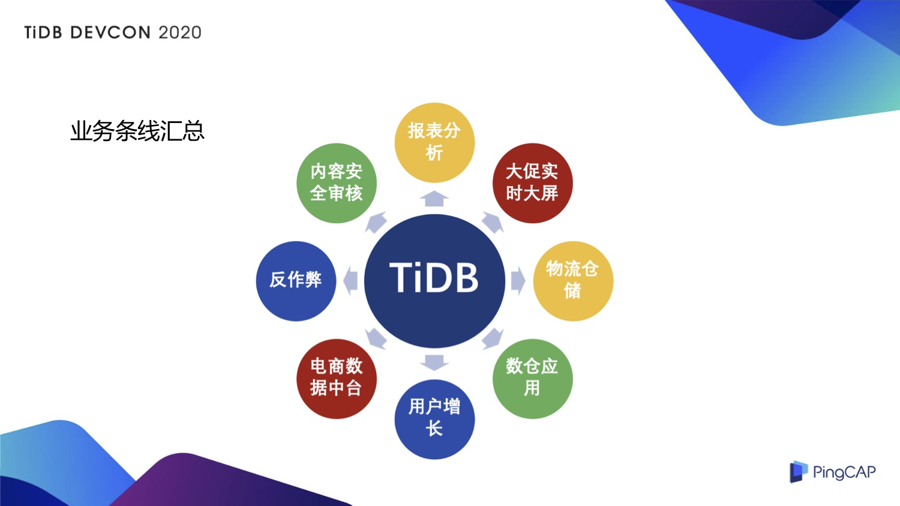
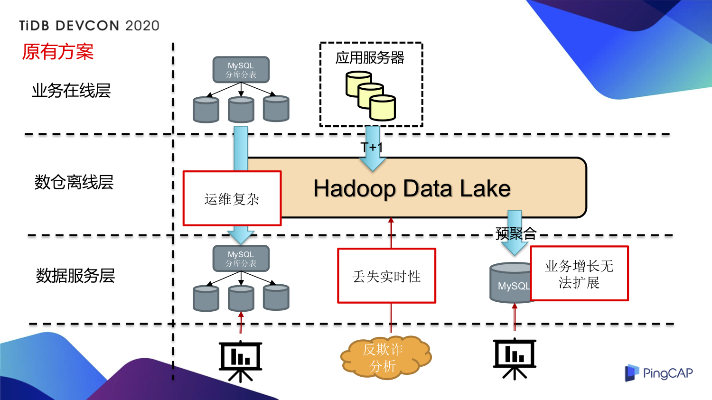
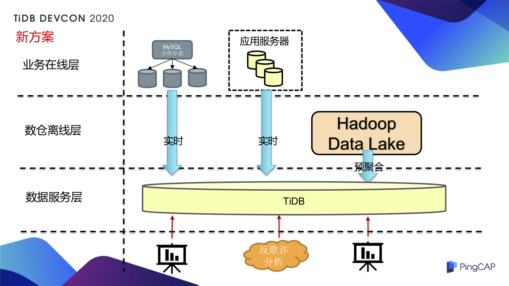
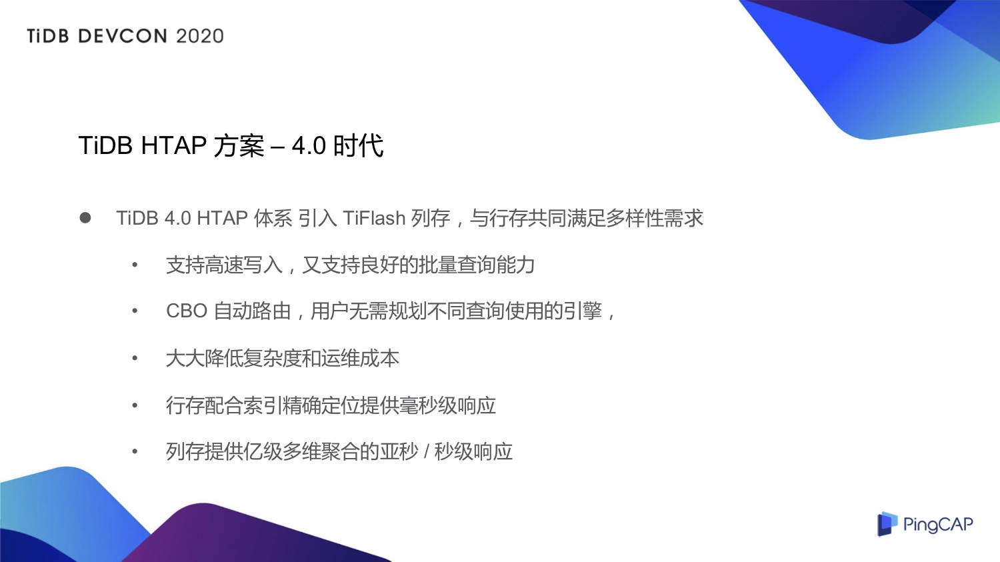
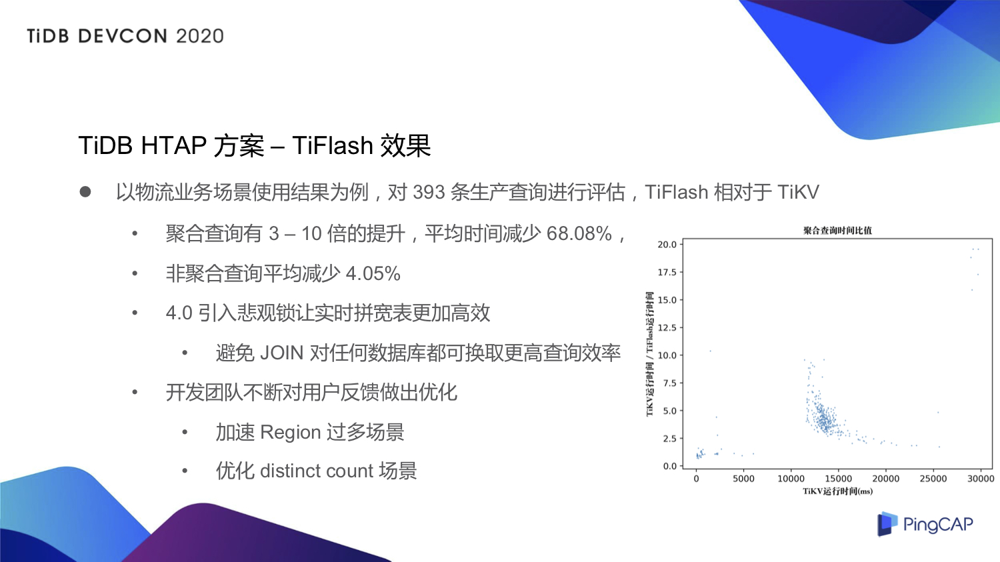

>作者介绍：张亿皓，小红书基础技术部资深开发工程师，负责数据库相关的研发和落地工作。

## TiDB 在小红书业务场景的应用简介

2017 年，小红书已经开始在生产业务中使用 TiDB ，真正成体系的去做 TiDB 的落地是在 2018 年，为什么要选择使用 TiDB ？

当今很多公司的业务都是数据驱动，面对小红书 APP 每天数以亿计的数据，我们希望有一个数据库能够提供以下特性：

**第一，数据使用的多样性**，有时候需要在数据库做一个 TP 的短查询，做一些很高的写入，有时候又希望做一些聚合分析，能够展现汇总统计的结果， TiDB 的 HTAP 架构正好满足了多样性的需求。

**第二，更高的时效性**，我们知道有很多数据分析的引擎虽然计算很快，但是对于实时分析的支持能力比较弱，TiDB 可以提供更高的时效性。

**第三，TiDB 基于 Raft 的扩展性**，小红书 APP 每天的数据都是上亿级别，单点的集群总有一天会被打满，会被打爆，我们就期望能有一个扩展性极佳且扩容方便的数据库，TiDB 非常契合，所以我们选择了 TiDB。

TiDB 目前在小红书的应用涵盖报表分析、大促实时大屏、物流仓储、数仓应用、电商数据中台、内容安全审核等多个业务场景。6 月 6 日是小红书的周年庆大促，需要展现一些实时的销量、店家成交总额排名、总销量等信息，这个实时大屏的应用后面连接的就是 TiDB。

TiDB 在这些业务当中给我们解决了哪些问题？我从这些业务中挑选了三个非常典型的应用场景来跟大家分享。

- 数据报表：数据报表其实很好理解，分析师经常需要看一些数据，比如这周的走势，看一些销量情况，看一些用户增长情况，看同比与环比数据。

- 线上业务库的实时查询：比如 300 亿行的一个表，MySQL 肯定存不下，需要走分库分表的逻辑，而且希望在做查询或者分析的时候不能对在线业务产生影响，解决线上分库分表 MySQL 的查询问题。

- 反欺诈数据分析：所谓反欺诈举个例子像黄牛薅羊毛，小红书的电商平台定期会发一些优惠券，黄牛就最喜欢薅这些优惠券，我们能否在短时间内抓到这些黑产行为，将他们捕捉下来进行分析和阻拦。

## 传统 MySQL 与数仓方案的局限

在没有 TiDB 的时候，我们怎么做？如上图所示，从业务逻辑上来划分，从上到下是业务在线层、数仓离线层和数据服务层。

首先在数据报表场景，采用 Hadoop 数仓对数据做一些预聚合，然后把这些高维度的数据简单聚合一下放到 MySQL 里面再做查询。对于数据报表，会把 Hadoop 里面的数据通过 Hive 以 T+1 的形式每天做一些预聚合放到 MySQL 里面，再搭建一些 BI 系统进行图形展示化的报表查询，分析师就可以看到他们定制化的一些报表。但是随着业务的快速增长，报表的形式变得更加多种多样，MySQL 的扩展性也是一个比较头疼的问题，如果单纯地增加一些 MySQL 的节点，到最后就会变成我们如何管理那么多 MySQL 节点的问题，搞过运维的同学都知道，这是一件比较烦琐的事情。

再来看在线的 MySQL 分库分表场景，我们要在上面做数据查询，又不能影响线上库，所以只能去查从库，这个从库当然也是一个分库分表的场景。这里产生了一系列问题：首先还是运维的问题，分库分表 MySQL 那么多节点怎么管？怎么扩容？分片是不是要重新去做 Sharding？如何保证一致性？缩容怎么缩？元信息怎么管理？这是运维上面的复杂度。除此之外，我觉得有必要提的一点，比如说线上的一个分库分表 MySQL，我在上面想做一个事务，分库分表的中间件方便做吗？如果我还想做一个 JOIN，甚至我还想做一个 Group by 聚合查询，分库分表中间件方便做吗？可能可以做，但都不会很简单，所以我们需要有一个能够方便地做比较复杂分布式查询的方案。

第三在反欺诈数据分析场景，我们比较关注时效性。在 TiDB 之前对于后端的一些打点数据，我们这些数据写到数仓里面，等到 T+1 第二天的时候，业务方才能查到上面的数据，这样 T+1 的时效性就比较差了。黄牛薅羊毛是一个很快的事情，到第二天可能直接薅完了你也没办法，所以非常希望最好能在半分钟、十秒钟，甚至秒级别，就能看到发出优惠券的详细使用情况。

## 引入 TiDB HTAP 方案，提升全场景数据服务能力

基于以上场景的种种挑战，我们引入了 TiDB 3.0 HTAP 方案，来看看新的业务架构，如下图，我们看到数据服务层采用 TiDB 就可以提供业务所需的全部数据服务。

我们重新梳理一下引入 TiDB 之后的三个业务场景。

在数据报表场景，直接用 TiDB 直接替换 MySQL ，解决了随着业务增长 MySQL 扩容复杂的问题。我觉得能实现无缝切换最重要的原因是 TiDB 一开始就支持 MySQL 协议，这是我觉得 TiDB 设计上非常牛的一点，很聪明的一点。前端的 BI 工具不用再开发一个所谓的 TiDB 驱动，直接用 MySQL 驱动就可以。在扩容层面，这是 TiDB 最擅长的事情，可以直接加个节点，数据自动做好重新均衡，非常方便。

在分库分表的 MySQL 场景，分库分表怎么做查询？我们造了一条实时流，把 MySQL 的数据通过 Binlog 实时写到 TiDB 里面，同步的延迟在一秒钟以内。实时流不仅仅是一个简单的数据同步，还做了一个事情就是合库，什么叫合库？原来线上分了一万个表，分表是因为 MySQL 存不下，现在一个 TiDB 集群是能够存下的，就没有必要分表了。实时流写到 TiDB 里面的同时，还把这一万张分表合成了一张大表，合的过程中可能还要处理一些特殊问题，比如说原来的自增主键怎么搞？自增主键合起来的时候是不是有问题？可能要做一些数据转换，有一些数据要做格式或者映射之类的数据处理，总之在实时流里面都把这些事情处理好，最后我们看到一张大表，就没有分库分表这件事情。在 TiDB 上面再做一些查询，不影响主库，TiDB 实际上作为一个 MySQL 的大从库，如果想做一个事务，也没问题，TiDB 支持事务，想做一个 JOIN，想做一个聚合，TiDB 都能够支持这类操作，最后就是一张大表呈现在 TiDB 里面。

最后看看反欺诈数据分析场景，应用了 TiDB 之后我们把 T+1 的提交改成了由 Flink 的 SQL 实时来写入，打点数据产生的速率很高，峰值的 QPS 大概能达到三四万，单表一天大概写入 5 亿左右的数据，如果我们保存 10 天的数据大概会达到 50 亿单表的量级。写进来之后，怎么做查询呢？主要是一些 Ad - Hoc 查询，如果分析师想看这次优惠券发下去的使用情况是怎么样的，分发情况是怎么样的，希望能在分钟级别就能够看到，每次 SQL 都可能有变化，我们直接绕过 Hadoop 数仓，通过 TiDB 来提供更加实时的查询。

## TiDB 4.0 HTAP 方案的应用效果

通过引入 TiDB，我们在以上三个典型业务场景上解决了遇到的各种问题。这个方案有没有不足？其实也是有的，如果 3.0 没有不足的话，可能就不会诞生今天的 4.0 。我们使用下来的感受主要是 TiDB 3.0 在 OLAP 分析这一块能力稍有些不足，TiKV 是一个基于行存的数据库，去跟一些专门做分析的列存引擎去比较，其实是没有可比性的。TiDB 如何解决这个问题？是不是 TiDB 引入一个列存引擎就可以？到了 4.0 的时候，TiDB 带着 TiFlash 这么一个列存引擎来到了我们面前。

TiFlash 的设计有几点我觉得非常棒：首先，作为一个列存引擎 TiFlash 能够与 TiKV 共存，不是说只能选列存，只能选行存，两个可以同时存在，既然能同时存在，中间这个行存到列存数据的复制和转换怎么做？是不是需要再搭一条复制流去做？不用，TiDB 都帮我们做好了，通过 Raft Learner 复制机制直接采用一个较低延迟的方式把数据全部同步到 TiFlash 里面。从查询端来看，是否需要做一些特殊的处理让 TiFlash 走列存引擎呢？答案是都不需要，TiDB 有一个 CBO 执行计划的自动路由，可以知道这条 SQL 是 TiFlash 扫全表比较好还是走 TiKV 的索引查询比较快，可以帮我规划好。引入 TiFlash 的运维成本是非常低的，我要做的事情就是申请机器把 TiFlash 部署上去，然后就结束了，数据自动同步过去，查询自动路由过去，什么事情都不用管。

我们也对 TiFlash 做了测试，拿物流场景作为例子，我们对其中的 393 条生产查询进行评估，上图的纵轴是 TiFlash 的性能提升，**从聚合查询来看，类似于 Group by、SUM 这些聚合查询，大概有三到十倍的性能提升，平均时间减少 68% 左右。如果是非聚合查询，平均时间减少 4% 左右，非聚合查询基本上都命中了 TiKV 的索引，没有走 TiFlash 的列存。**

TiDB  4.0 还给我们带来悲观锁，在物流场景很多表需要 JOIN ，JOIN 其实是代价比较高的一件事情。为了避免 JOIN，我们会把这些要 JOIN 的表提前给拼成一张大宽表。举个例子，我把三张表拼成一张大宽表，那就有三个流就会同时更新大宽表，更新同一行，原来的 TiDB 3.0 是乐观锁的机制，就会产生事务冲突，对于客户端的重试来说是不太友好。TiDB  4.0 有了悲观锁，很好地解决了这个问题。

我们平时和 PingCAP 的 TiFlash 团队也有比较多的交流，我们也会经常提出一些新的需求，例如最早的时候， TiFlash 是不支持 ditinct count 这一类场景的，效率很低，开发团队在了解我们的需求后很快做出了优化，支持了 ditinct count 场景。

## TiFlash 与 ClickHouse 怎么选？

最后说一下 TiFlash 跟其他方案的对比，拿大家比较熟悉的 ClickHouse 列存引擎做个比较，ClickHouse 其实单从计算性能来说，确实是比 TiFlash 要快一点。为什么某一些场景我们还是选择 TiFlash 呢？因为 ClickHouse 有一些问题，比如说 ClickHouse 的集群模式运维起来比较复杂，对数据更新的支持也比较弱，因为很多业务是事务型的，有很多更新需求，而 ClickHouse 更新的性能比较差，如果要改成 Append、Insert 这个逻辑，业务侧就要做大量的改动，例如数据要做去重之类的事情，很多场景下为了支持高频率的更新我们就选择了 TiFlash。

>本文整理自张亿皓在 [TiDB DevCon 2020](https://pingcap.com/community-cn/devcon2020/) 上的演讲。
