> 作者介绍：**张俊骏**，小红书数据库与中间件团队负责人

小红书使用 TiDB 历史可以追溯到 2017 年甚至更早，那时在物流、仓库等对新技术比较感兴趣的场景下应用，在 2018 年 5 月之后，我们就开始逐步铺开，延展到其他适合 TiDB 的场景中去。**截止目前，小红书使用的 TiDB 节点数在 200+ 个，未来也有更大扩展空间。**

本文根据近两年 TiDB 在小红书的落地过程，和大家一起探讨一下，小红书在新数据库选型的考虑因素、以及 TiDB 从场景分类的角度是如何考量及逐步推广使用的。具体包括以下内容：

1. 目前小红书数据服务整体架构，以及从数据流角度如何对不同数据库服务进行定义和划分。

2. 从基本功能、数据同步、部署管理、运维、二次开发及优化、安全等多个维度解读小红书在数据库选型的考虑因素及思考。

3. TiDB 的适用场景，以及在小红书如何进行场景选择、如何逐步进行上线规划。

## 一、小红书数据服务整体架构

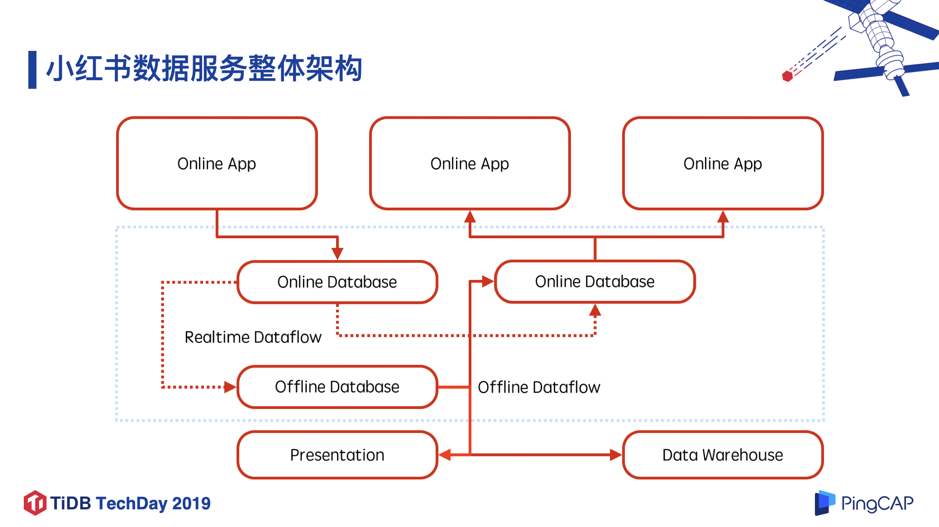

图 1

如图 1 所示，小红书数据服务整体架构最上层是在线应用层（online app），应用层往下肯定会依赖一些离线（offline）或者在线（online）的 database（其实它更多的意义应该算存储，比如 Redis 也被我们理解为 database，所以称之为“数据服务”可能会更好），这些在线数据服务（online database）会有两条线：

- 通过实时数据流（dataflow）将数据导入到离线数据库（offline database）支撑离线分析以及实时展示的场景，也就是图 1 最下层的展示类服务（presentation）和数仓（data warehouse）。

- 这些数据还可能会回灌到线上其他 database 上，有些是离线，有些是实时。

图 1 蓝框中的部分基本上都由我们团队负责。我们首先需要保证在线数据库（online database） 的稳定性、安全性以及性能优化等，其次我们的多种数据库数据同步服务（database to database replication） 有点像阿里提出的 data replication center 这个概念，这部分也基本上由我们团队全权负责。

## 二、小红书数据服务组件选型 RoadMap

对于一个新的数据库或数据服务组件选型（如 TiDB），我们该从哪些方面去入手搞清楚它的特性？下面分享一下我们的经验。

### 1. 产品的基本功能

第一步，我们需要考察该数据服务/组件的基本功能，首先，我们要了解它的读写场景，包括点查、批量获取（batch get）、范围扫描（range scan）、过滤查询（filter query）、聚合查询（aggregation）等等。然后我们看看它是否符合响应时间（latency） 以及带宽（bandwidth，即能承接多少并发）的要求。最后我们会关注可扩展性，比如 TiDB 可能最大的特点就是扩展性非常好。这几点是大家都会想到的最基本的要求，这里我就一笔略过。

### 2. 数据同步与处理相关解决方案

第二部分是数据同步与处理相关解决方案。这里我们有以下 4 点考虑：

- 首先考虑这个数据服务组件的数据同步是同构或异构的场景，同构的同步比如 Redis to Redis、MongoDB to MongoDB，异构的同步比如 TiDB 到 Kafka 等等。这个情况基本上大家也会遇到，因为一个数据服务很难同时支持两种或更多的场景，不同的数据服务之间的数据要保持一致，就会产生数据同步的问题。

- 接下来考察离线导出，比如如果我们依赖 Hive、 Spark 做离线分析，那么可能要放在 HDFS、S3 等对象存储上，就需要离线导出，一般是每天导出一次。

- 第三点是实时导出，即在实时场景下可能需要导出到消息中间件，比如 Kafka、RocketMQ 等。

- 第四点是离线导入，导入的场景一般是在离线的引擎计算的结果，作为评估的指标再写入线上的 database 提供数据服务。

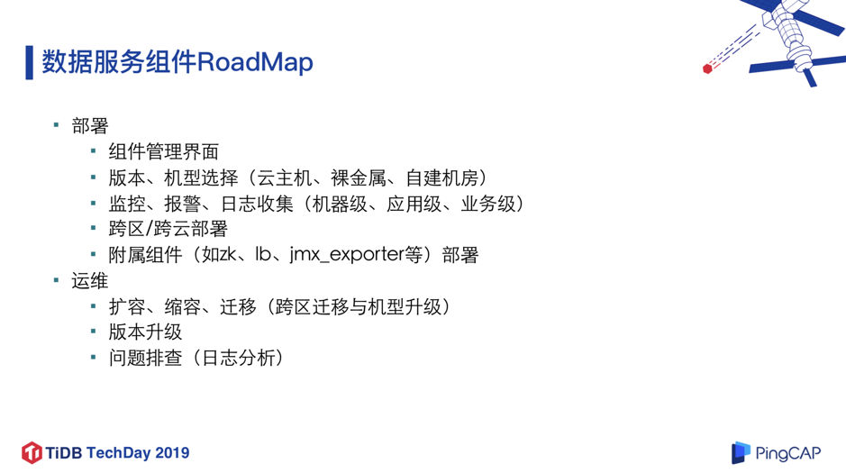

图 2

### 3. 产品的部署及管理

部署其实非常重要，它涵盖以下 5 个方面。

- **第一点是组件管理界面**。当集群多到一定程度时，如果你没有一个很好的管理界面，会连自己用的是什么集群都记不清楚。所以管理界面非常必要，而且最初可能是 1 个集群 1 个管理界面，然后是 100 个集群 1 个管理界面。

- **第二点是选版本和机型**。在版本选择方面，不同版本提供的功能不一样，同时也要考虑版本升级的成本。在机型的选择方面，无论是自建机房、用云主机，还是使用最近推出来的新概念“Bare-Metal”（裸金属），机型选择都是非常痛苦的事情，但同时机型选择对存储来说至关重要。我们目前绝大多数都是部署在腾讯云和 AWS 上，并且开始慢慢尝试在 Bare-Metal 上的应用。

- **第三点是监控、报警、日志收集**。我将这个问题分为三个级别：机器级、应用级和业务级。机器级指机器主机上的问题，包括如何做监控、报警、日志收集，虽然这点与该数据服务组件没有太大关系，但是我们仍然需要关注；应用级指该数据服务组件的报警、监控、日志收集具体是怎么做的；业务级指特定的业务有特定的报警需求，例如一个订单表突然有几十万的 QPS 写入，在平时属于异常的情况，这种异常是需要自定义的，甚至需要我们在某些特定位置埋点并输出结论，因为如果不关注这些异常情况，就很可能导致这三件事用三种不同架构，最后部署的集群极其复杂繁琐，三个级别用了三个不同的监控工具，看到三个不同的监控界面，导致运维成本增加。

- **第四点是跨区/跨云部署**。这一点可能是互联网公司的比较大的需求。在遇到跨区/跨云的部署的时候，需要考察该数据服务组件是否天生支持跨区/跨云。如果不支持，需要再考虑是否需要再启动数据同步。

- **第五点是考察附属组件**，也就是与该数据服务组件强绑定的其他组件，比如 zk、lb、jmx_exporter 等等，这些组件的部署成本也需要考虑。我们需要减少 OPS 成本，或者说，一个好的整体架构设计能够防止业务疯狂上线时很多意外的出现。

### 4. 运维的易用性

运维包括扩容、缩容、迁移，其中迁移可能要考虑跨区迁移、机型升级迁移等。在使用维护某个组件的时候会产出“XX 组件的运维手册”，这样下次遇到问题的时候，可以先去看看运维手册里它是否是一个已知问题，有没有现成的解决方案。在公司人员变动比较频繁或者业务方直接介入到这个场景的时候，如果没有运维手册，有些项目很难落地。

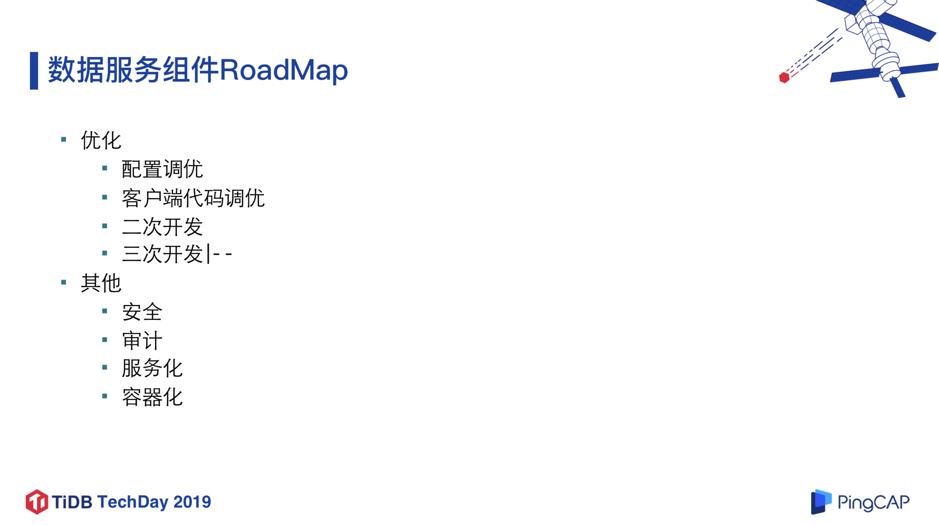

图 3

### 5. 产品可优化的空间

优化部分基本上分为配置调优、客户端代码调优、二次开发、三次开发。其中二次开发就是在现有的开源产品上再开发，修复 bug 或者自己实现某些新增功能/工具，未来可能还会贡献给社区；而三次开发则是自己写一个和某些组件类似的东西，直接替换掉。在小红书内部，二次开发是比较主流的，三次开发很少，毕竟从零开始自研一个组件到适应特定业务场景，其实是跟不上我们的业务上线节奏的，所以三次开发至少眼下不适合作为我们主要的攻坚方向。

### 6. 其他考虑因素

未来在小红书数据服务组件系统，我们会做很多完善工作，比如安全、审计、服务化、容器化等方面的事情。譬如我们目前在部署一个组件的时候，容器化还没有在讨论范围之内，也就是需要用容器部署就容器部署，需要在虚拟机上部署就在虚拟机上部署，并没有一个明确的结论倾向。当然，我个人认为未来容器化是一个主流趋势。

以上就是小红书的数据服务组件选型的 RoadMap，看起来跟接下来要讲的“TiDB 在小红书多场景下的应用”没有太大的关系，但我认为在做应用之前应该先把上面列举的这些方向思考清楚，这样会对未来落地工作的投入产出比产生非常大的影响，比如我们最近按照上面的方向调研 Tidis 和 TiFlash 的时候速度就快很多。

## 三、TiDB 在小红书多场景下的应用

### 场景 1：展示类业务

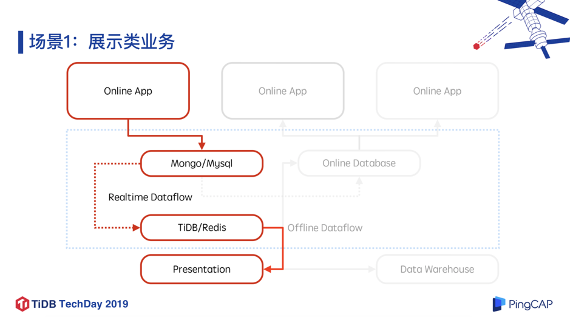

图 4

TiDB 在小红书的第一个应用场景是展示类业务，它的 pipeline 如图 4 中红色部分所示，线上一般是 MongoDB 或者 MySQL，通过一条实时数据流（realtime dataflow） 连接 Redis 或者 TiDB，最后实现 presentation 功能。接下来介绍这类场景下的两个具体项目。

#### 项目 1：大促实时看板

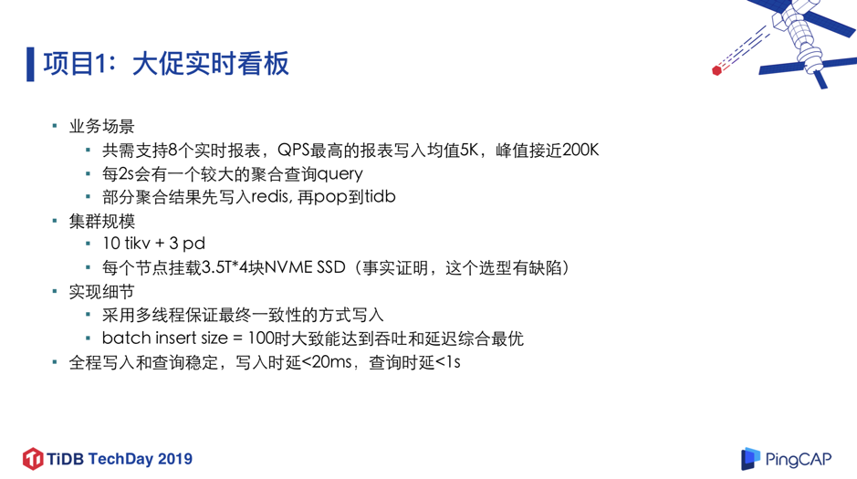

图 5

第一个项目是大促实时看板，在去年双十一期间上线，当时我们的节奏也比较快，7、8 月开始调研，11 月就上大促业务。

当时该项目下一共有 8 个实时报表，QPS 写入均值 5K，大促活动开始时 QPS 峰值接近 200K/秒，每过 2s 会有较大的聚合查询 query，聚合结果还需要写入 Redis 再 pop 到 TiDB，集群规模方面只用了 10 个 TiKV 和 3 个 PD。还有一点值得提一下，当时每个节点挂了 3.5T * 4 块的 NVME SSD，但是后来事实证明这个选型是有问题的，因为大促的时候我们人人都在盯着，磁盘坏了会立刻得到解决，所以即使把四块盘做了 raid0，然后上线了，根本无法确定 NVME 盘出问题的概率是多少，后来差不多每个月会出现一两次类似的故障，故障率很高，虽然我相信未来 NVME 会做得更好，但这样高的故障率从设计角度来看，这个选型就未必是最合适的。

在实现上，我们遇到的第一个问题是保证最终一致性的写入。我们做了多线程写入，每个线程写入特定的记录，保证线程之间不会冲突。除此之外，我们还做了一些调优工作，**我们发现每一个事务的 batch insert size 设置为 100 时能达到吞吐、延迟综合最优的要求**。最初业务侧设置的 batch size 非常大，后来发现事务之间冲突的概率、响应的时间等等都会出现一些问题，但 batch size 设置为 1，那么并发又会成为一个问题。所以经过了一段时间的调优，最后得到了前面的结论。这个参数大家可以根据需求自己调整，用二分法/折纸法试验就可以得到。

**这个项目最终全程写入和查询在大促期间保持稳定，写入时延小于 20ms，查询时延小于 1s**，因为我们需要 2s 做一次查询，这个响应时间是能满足要求的。

#### 项目 2：实时业务数据展示

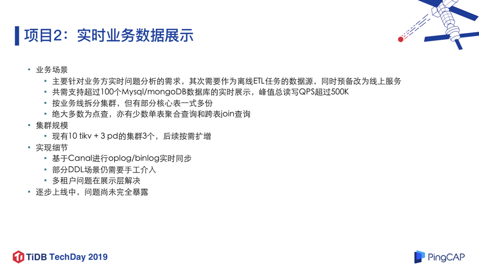

图 6

这个项目背景有两点：

- 第一，我们业务方有实时分析的需求，需要实时观测线上库写入内容，可能是针对某个用户做一些查询，还可能是一个非常大的 query，比如需要快速看到新上线功能的效果，尤其是在实验以及风控等项目上响应时间要求非常高。

- 其次需要作为离线 ETL 任务的数据源，同时需要预备改为线上服务。盘算一下业务量，总共支持需要超过一百个 MongoDB 或 MySQL 数据库的实时展示，峰值总读写 QPS 超过 500K，现在的业务需求大概这个量级，未来可能会更高。

我们当前考虑是按业务线去拆分集群，部分核心表一式多份。比如用户表可能有多个业务依赖，比如社区业务、订单物流业务等等，但如果按照业务线拆分集群之后，就无法做 Join 了，这也是我们不能接受的，所以对核心表会以一式多份的形式存在。实际使用场景下，大部分都是点查，比如查特定用户、特定订单的线上状态，同时有少量的单表聚合查询和跨表 Join 查询。换句话说，可以认为是一个实时的数据仓库，但又不做复杂 ETL，更多依赖线上真实数据。

我们的设计方案是把 TiDB 作为一个 MySQL/MongoDB 的从库，但对于 MongoDB 来说可能还要做一点同步任务的数据改造工作。现在规模是 10 节点 TiKV + 3 节点 PD 的集群总共有 3 个，后面可能会按需求扩增。

在实践细节上，首先我们会基于 Canal 去做 oplog/binlog 的实时同步。其次，目前我们对加列之外的 DDL 支持得不够好，这部分还需要 DBA 手工介入，但在未来会有一些改进。最后是多租户问题，比如判断某个部门的同事是否有权限访问另一个部门的数据库，这件事在线上会非常头疼，现在在接入层解决这个问题，我们内部有一个叫 venus 的展示平台，将上层全链控制、认证等事情去掉，所以我们就不用关注这件事了，至少眼下不用关注。这个项目已经开始逐步上线，基本上架构已经确定。

### 场景 2：分析类业务

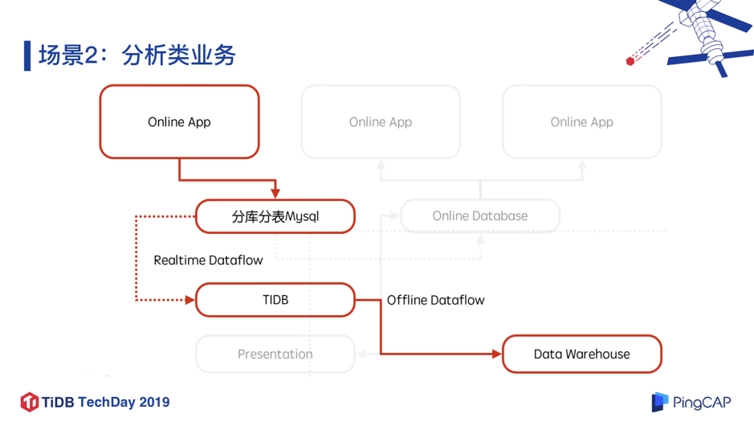

图 7

分析类业务的 pipeline 如图 7 所示，最后的 data warehouse 构建在 AWS 上。

#### 项目 3：分库分表 MySQL ETL

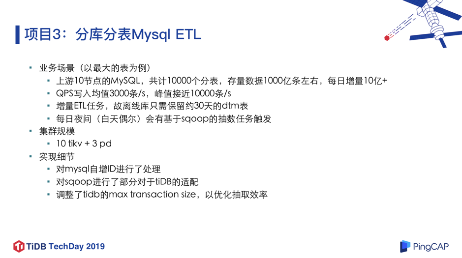

图 8

这个场景下的第一个项目是做分库分表的 MySQL ETL。以最大的表为例，上游 10 节点的MySQL，共计 10000 个分表，存量数据 1000 亿条左右，每日增量 10 亿+，QPS 写入均值 3000 条/s，峰值接近 10000 条/s，平台促销活动对这部分影响也不大，甚至反而会降低，因为活动主要是电商部门在做，社区的查询需求反而变少。我们在 TiDB 离线库保留了大约 30 天增量监控数据，全量数据存在 S3 上，每日夜间（白天偶尔）会有基于 sqoop 的抽数任务触发。集群规模方面，目前使用 10 节点 TiKV + 3 节点 PD。

在实践细节方面，首先我们对 MySQL 自增 ID 进行了处理，然后对 sqoop 进行了一些基于 TiDB 的细节上适配，最后调整 TiDB 的 max transaction size 以优化抽取率。**除此之外，还有一个值得一提的事情，因为实体数据（用户/笔记/订单数据等）不宜硬删除，但是在 MySQL 关系表做软删除是非常可怕的事情，最后可能会因为数据量太过于庞大造成雪崩。但 TiDB 不一样，我们把线上的硬删除变成了 TiDB 的软删除，这对于数仓来说是非常有价值的事情**。对于每天全量抽数的表来说，无论软硬删除，第二天数仓里的数据总是对的。但是对于大数量的场景，全量抽数代价过高，就会采取增量抽取的方式，即设置一个条件，一般是 update_time 为今天。这时候硬删除就存在问题了：上面的 query 条件无法判断一条记录究竟是被删除了，还是在当天没有被更新。而前面又提到，关系表上是不适合做软删除的。所以我们在做 ETL 的时候，线上做 delete 的操作，我们在 TiDB 上会新增一个 is_deleted 字段，并将其设置为 true。这个时候有一个小细节，删除这个操作的时间戳怎么设置。删除这个操作时的时间戳是跟普通写入的时间戳不一样的。普通的写入，时间戳就是线上库的 update time，但是删除的时候是不会带上线上的 update_time 的，所以因为这条记录被硬删除了，时间戳都找不到了，这时我们只能用收到这条消息的 update_time 去做它的时间戳，这时就会有些小问题，当然这个问题我们还没有完全解决掉，假设大家有类似的需求的话，我们可以私下交流讨论。目前这个项目已经上线，运行稳定。

#### 项目 4：MySQL 归档

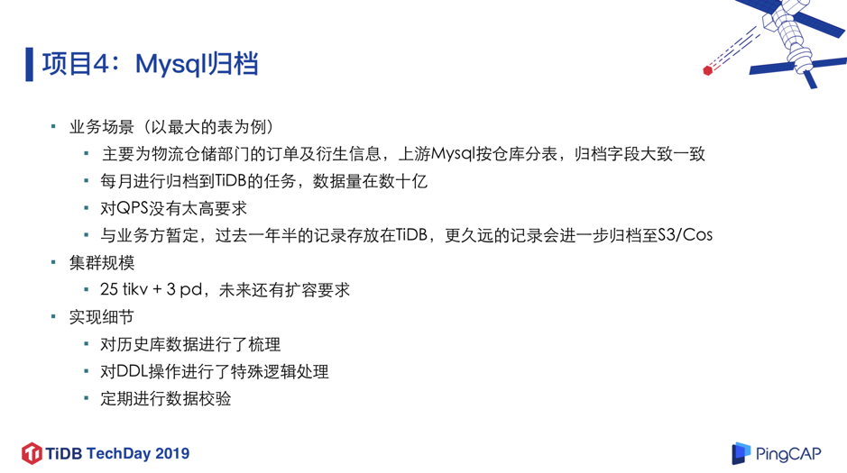

图 9

项目 4 MySQL 归档是基于项目 3 的演进。业务背景方面，以最大的表为例，主要为物流仓储部门的订单及衍生信息，存量非常非常大，每月进行归档到 TiDB 的数据有数十亿，但对 QPS 要求不是很高，与业务方讨论之后暂定，过去一年半的记录存放在 TiDB 供业务方查询，更久远的记录归档到 S3/Cos 上。

项目 4 与项目 3 代码相比处理的场景更复杂一些，因为它之前 MySQL 的分库分表逻辑不像项目 3 那些清晰，集群规模也会相对大一些，目前是 25 个 TiKV 节点 + 3 个 PD 节点，未来可有扩容的需求。实现细节上，项目 4 和项目 3 类似，这里就不赘述了。

### 场景 3：线上服务

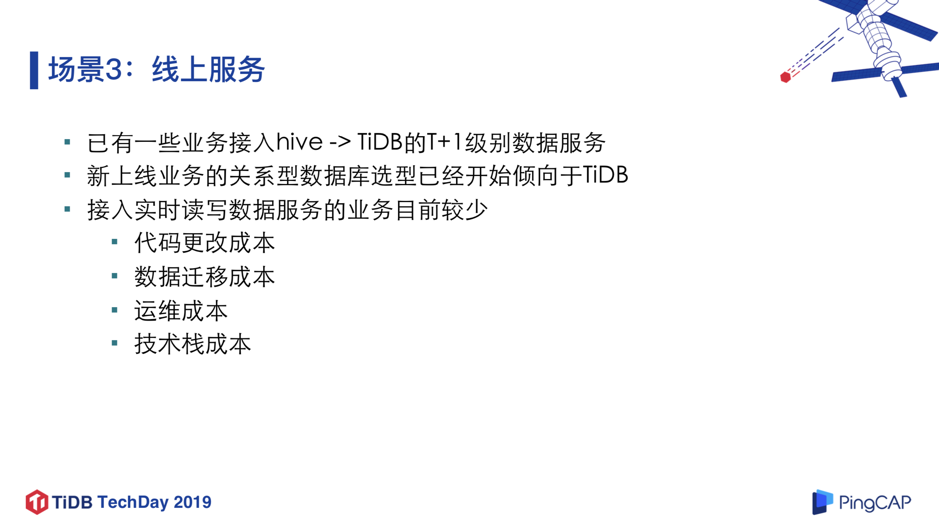

图 10

TiDB 接入实时数据写入服务的业务有以下四个考虑：

- 第一点是代码更改成本，这一项成本已经比较低了，因为基本上都是 jdbc 连接，但多多少少会有一些变更。

- 第二点是数据迁移成本，对于已经上线的业务来说，迁移数据都是一件非常费劲的事情，尤其是我们还要求不停服务进行热迁移的话。

- 第三点是运维成本，从原本的 MySQL 切换到我们自己维护 TiDB ，其实无形中增加了运维成本，尤其是在挂盘率比较高的场景下。

- 第四点是技术栈成本，因为有些人对 TiDB 不熟悉，会比较害怕接触和使用，绝大部分人更愿意用自己熟悉的东西，所以需要有一个知识学习的过程，这也是一个成本。

**现在我们已经有一部分线上业务从 Hive 离线导入到 TiDB 做 T+1 级别数据服务，而且我们新上线业务的关系型数据库选型已经开始倾向于 TiDB，主要是因为它的扩展性为我们节省了很大的时间成本，尤其是业务增长比较快的情况下，选择 MySQL 分库分表其实是一件代价极其大的事情。**

**我记得之前有同事问了一个问题，说这个场景用别的东西也可以做，为什么一定要用 TiDB 呢？为什么要用牛刀来杀一只鸡呢？我回答他：有种情况是你找不到一只牛来杀，只能先“杀鸡”成功了，未来才有“杀牛”的机会，但是大家不要认为“杀鸡用牛刀”是一件很蠢事情，这可以理解为一个鉴定或者测试的过程。**

## 四、未来 TiDB 在小红书的接入计划

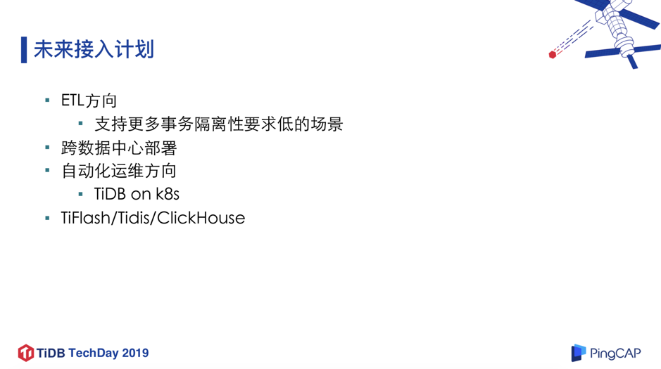

图 11

最后分享一下 TiDB 未来在小红书的接入方向。

- 首先在 ETL 方面，TiDB 的事务隔离性对某些场景来说有点高，我们希望能自定义事务隔离需求，比如两个事务有冲突，但我们实际的写入需求只要最终一致性。但是从目前 TiDB 的设计来说，这个需求可能比较困难，但是也不排除将这个事情 raise 起来的可能性。

- 第二个很重要的事情是跨数据中心的部署，这是我们未来会重点关注的方向，可能最终会得到一个通用的解决方案，目前的规划还不是特别明晰，因为未来业务可能在不同的云会有不同的形态，我们也希望能找到成本相对更低的解决方案。

- 第三点是自动化运维，目前是往 TiDB + K8s 的方向推动，更好的解决集群部署问题，因为在虚机上部署还是比较痛苦的。

- 最后，我们已经有同事负责调研 TiFlash、Tidis，但目前还没有线上应用在依赖。同时我们也在做 CK 和 TiFlash 的对比调研，目前 CK 已经在线上提供服务，未来如果 TiFlash 的调研结论是比较优秀的，肯定也会有计划替换。

>本文根据张俊骏老师在 TiDB TechDay 2019 上海站上的演讲整理。

