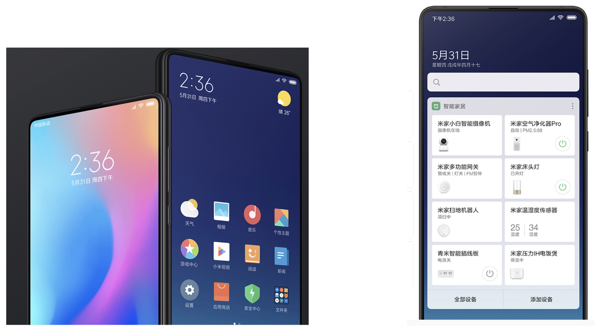
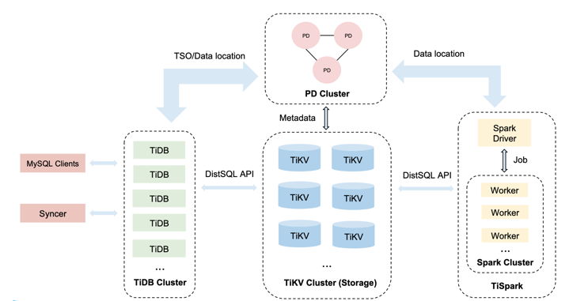
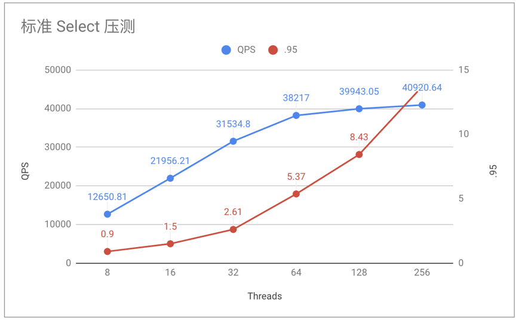
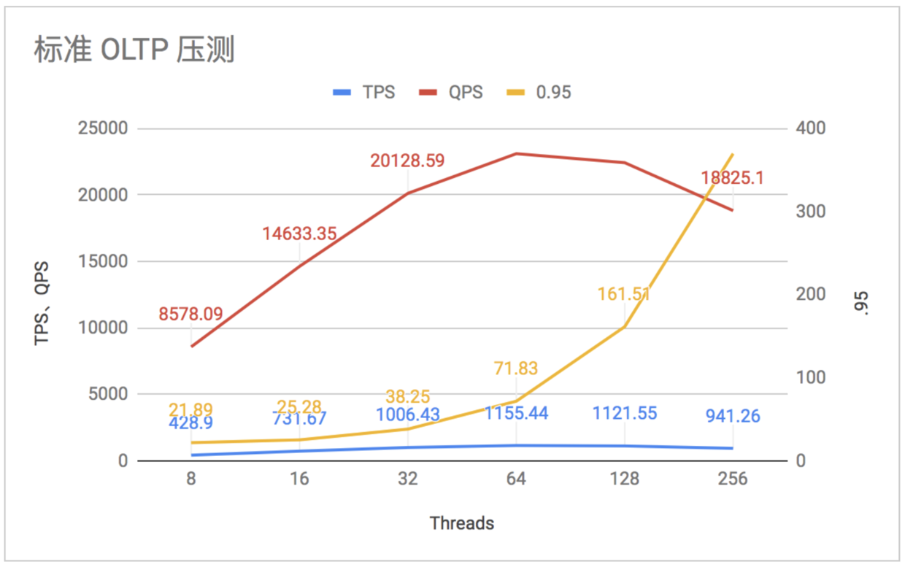
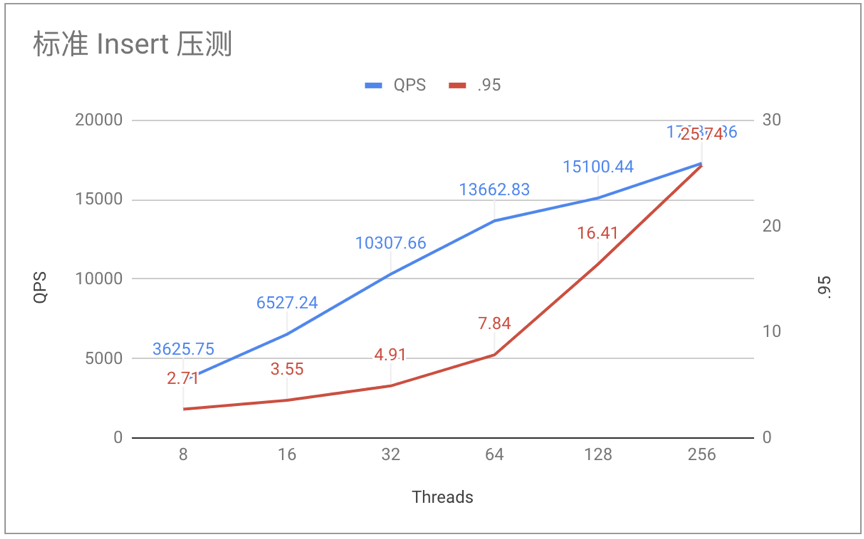
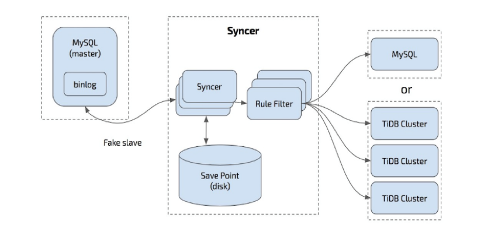
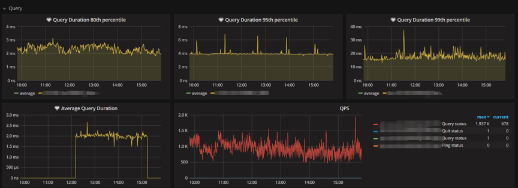

>作者：**张良**，小米 DBA 负责人；**潘友飞**，小米 DBA；**王必文**，小米开发工程师。

## 一、应用场景介绍

MIUI 是小米公司旗下基于 Android 系统深度优化、定制、开发的第三方手机操作系统，也是小米的第一个产品。MIUI 在 Android 系统基础上，针对中国用户进行了深度定制，在此之上孕育出了一系列的应用，比如主题商店、小米音乐、应用商店、小米阅读等。 

图 1  MIUI Android 系统界面图

目前 TiDB 主要应用在：

* 小米手机桌面负一屏的快递业务
* 商业广告交易平台素材抽审平台

**这两个业务场景每天读写量均达到上亿级，上线之后，整个服务稳定运行；接下来我们计划逐步上线更多的业务场景，小米阅读目前正在积极的针对订单系统做迁移测试。**

## 二、TiDB 特点

TiDB 结合了传统的 RDBMS 和 NoSQL 的最佳特性，兼容 MySQL 协议，支持无限的水平扩展，具备强一致性和高可用性。

具有如下的特性：

* 高度兼容 MySQL，大多数情况下无需修改代码即可从 MySQL 轻松迁移至 TiDB，即使已经分库分表的 MySQL 集群亦可通过 TiDB 提供的迁移工具进行实时迁移。

* 水平弹性扩展，通过简单地增加新节点即可实现 TiDB 的水平扩展，按需扩展吞吐或存储，轻松应对高并发、海量数据场景。

* 分布式事务，TiDB 100% 支持标准的 ACID 事务。

* 真正金融级高可用，相比于传统主从（M-S）复制方案，基于 Raft 的多数派选举协议可以提供金融级的 100% 数据强一致性保证，且在不丢失大多数副本的前提下，可以实现故障的自动恢复（auto-failover），无需人工介入。

TiDB 的架构及原理在 [官网](https://pingcap.com/) 里有详细介绍，这里不再赘述。

图 2  TiDB 基础架构图

## 三、背景

跟绝大数互联网公司一样，小米关系型存储数据库首选 MySQL，单机 2.6T 磁盘。由于小米手机销量的快速上升和 MIUI 负一屏用户量的快速增加，导致负一屏快递业务数据的数据量增长非常快， **每天的读写量级均分别达到上亿级别，数据快速增长导致单机出现瓶颈，比如性能明显下降、可用存储空间不断降低、大表 DDL 无法执行等，不得不面临数据库扩展的问题。** 比如，我们有一个业务场景（智能终端），需要定时从几千万级的智能终端高频的向数据库写入各种监控及采集数据，MySQL 基于 Binlog 的单线程复制模式，很容易造成从库延迟，并且堆积越来越严重。

**对于 MySQL 来讲，最直接的方案就是采用分库分表的水平扩展方式，综合来看并不是最优的方案，比如对于业务来讲，对业务代码的侵入性较大；对于 DBA 来讲提升管理成本，后续需要不断的拆分扩容，即使有中间件也有一定的局限性。** 同样是上面的智能终端业务场景，从业务需求看，需要从多个业务维度进行查询，并且业务维度可能随时进行扩展，分表的方案基本不能满足业务的需求。

了解到 TiDB 特点之后，DBA 与业务开发沟通确认当前 MySQL 的使用方式，并与 TiDB 的兼容性做了详细对比，经过业务压测之后，根据压测的结果，决定尝试将数据存储从 MySQL 迁移到 TiDB。经过几个月的线上考验，TiDB 的表现达到预期。

## 四、兼容性对比

**TiDB 支持包括跨行事务、JOIN、子查询在内的绝大多数 MySQL 的语法，可以直接使用 MySQL 客户端连接；对于已用 MySQL 的业务来讲，基本可以无缝切换到 TiDB。**

二者简单对比如下几方面：

+ 功能支持
    - TiDB 尚不支持如下几项：
        - 增加、删除主键
        - 非 UTF8 字符集
        - 视图（即将支持）、存储过程、触发器、部分内置函数
        - Event
        - 全文索引、空间索引
+ 默认设置
    - 字符集、排序规则、sql_mode、lower_case_table_names 几项默认值不同。

+ 事务
    - TiDB 使用乐观事务模型，提交后注意检查返回值。
    - TiDB 限制单个事务大小，保持事务尽可能的小。
+ TiDB 支持绝大多数的 Online DDL。
+ 另，一些 MySQL 语法在 TiDB 中可以解析通过，不会产生任何作用，例如： create table 语句中 engine、partition 选项都是在解析后忽略。
+ 详细信息可以访问官网：[与 MySQL 兼容性对比](https://pingcap.com/docs-cn/v3.0/reference/mysql-compatibility/)。

## 五、压测

### 5.1 目的

通过压测 TiDB 了解一下其 OLTP 性能，看是否满足业务要求。

### 5.2 机器配置

|组件|实例数量|CPU 型号|内存|磁盘|版本|操作系统|
|:---|:---|:---------------|:-----|:------------|:---------|:-------------|
| TiDB | 3 | Intel(R) Xeon(R) CPU E5-2620 v3 @ 2.40GHz | 128G | SSD Raid 5 | 2.0.3 | CentOS Linux release 7.3.1611|
| PD | 3 | Intel(R) Xeon(R) CPU E5-2620 v3 @ 2.40GHz | 128G | SSD Raid 5 | 2.0.3 | CentOS Linux release 7.3.1611 |
| TiKV | 4 | Intel(R) Xeon(R) CPU E5-2620 v3 @ 2.40GHz | 128G | SSD Raid 5 | 2.0.3 | CentOS Linux release 7.3.1611 |

### 5.3 压测内容以及结果

#### 5.3.1 标准 Select 压测

| Threads | QPS | Latency (avg / .95 / max) |
|:---|:---|:---------------|
| 8 | 12650.81 | 0.63  / 0.90 / 15.62 |
| 16 | 21956.21 | 0.73 / 1.50 / 15.71 |
| 32 | 31534.8 | 1.01 / 2.61 / 25.16 |
| 64 | 38217 | 1.67 / 5.37 / 49.80 |
| 128 | 39943.05 | 3.20 / 8.43 / 58.60 |
| 256 | 40920.64 | 6.25 / 13.70 / 95.13 |

图 3  标准 Select 压测图

#### 5.3.2 标准 OLTP 压测

| Threads | TPS | QPS | Latency (avg / .95 / max) |
|:---|:---|:---------------|:----------------------|
| 8 | 428.9 | 8578.09 | 18.65 / 21.89 / 116.06 |
| 16 | 731.67 | 14633.35 | 21.86 / 25.28 / 120.59 |
| 32 | 1006.43 | 20128.59 | 31.79 / 38.25 / 334.92 |
| 64 | 1155.44 | 23108.9 | 55.38 / 71.83 / 367.53 |
| 128 | 1121.55 | 22431 | 114.12 / 161.51 / 459.03 | 
| 256 | 941.26 | 18825.1 | 271.94 / 369.77 / 572.88 |

图 4  标准 OLTP  压测图

#### 5.3.3 标准 Insert 压测

| Threads | QPS | Latency (avg / .95 / max) |
|:---|:---|:---------------|
| 8 | 3625.75 | 2.20 / 2.71 / 337.94 |
| 16 | 6527.24 | 2.45 / 3.55 / 160.84 |
| 32 | 10307.66 | 3.10 / 4.91 / 332.41 |
| 64 | 13662.83 | 4.68 / 7.84 / 467.56 |
| 128 | 15100.44 | 8.47 / 16.41 / 278.23 |
| 256 | 17286.86 | 14.81 / 25.74 / 3146.52 |

图 5  标准 Insert 压测图

通过压测发现 TiDB 稳定性上与预期稍有差别，不过压测的 Load 会明显高于生产中的业务 Load，参考低 Threads 时 TiDB 的表现，基本可以满足业务对 DB 的性能要求，决定灰度一部分 MySQL 从库读流量体验一下实际效果。

## 六、迁移过程

整个迁移分为 2 大块：数据迁移、流量迁移。

### 6.1 数据迁移

数据迁移分为增量数据、存量数据两部分。

* 对于存量数据，可以使用逻辑备份、导入的方式，除了传统的逻辑导入外，官方还提供一款物理导入的工具 TiDB Lightning。

* 对于增量备份可以使用 TiDB 提供的 Syncer （新版已经更名为 DM - Data Migration）来保证数据同步。

Syncer 结构如图 6，主要依靠各种 Rule 来实现不同的过滤、合并效果，一个同步源对应一个 Syncer 进程，同步 Sharding 数据时则要多个 Syncer 进程。

图 6  Syncer 结构图

使用 Syncer 需要注意：

* 做好同步前检查，包含 server-id、log_bin、binlog_format 是否为 ROW、binlog_row_image 是否为 FULL、同步相关用户权限、Binlog 信息等。

* 使用严格数据检查模式，数据不合法则会停止。数据迁移之前最好针对数据、表结构做检查。

* 做好监控，TiDB 提供现成的监控方案。

* 对于已经分片的表同步到同一个 TiDB 集群，要做好预先检查。确认同步场景是否可以用 route-rules 表达，检查分表的唯一键、主键在数据合并后是否冲突等。

### 6.2 流量迁移

流量切换到 TiDB 分为两部分：读、写流量迁移。每次切换保证灰度过程，观察周期为 1~2 周，做好回滚措施。 

* 读流量切换到 TiDB，这个过程中回滚比较简单，灰度无问题，则全量切换。

* 再将写入切换到 TiDB，需要考虑好数据回滚方案或者采用双写的方式（需要断掉 Syncer）。

## 七、集群状况

### 7.1 配置

集群配置采用官方推荐的 7 节点配置，3 个 TiDB 节点，3 个 PD 节点，4 个 TiKV 节点，其中每个 TiDB 与 PD 为一组，共用一台物理机。后续随着业务增长或者新业务接入，再按需添加 TiKV 节点。

### 7.2 监控

监控采用了 TiDB 的提供的监控方案，并且也接入了公司开源的 Falcon，目前整个集群运行比较稳定，监控如图 7。     

 

图 7  监控图

## 八、遇到的问题、原因及解决办法

| 问题 | 原因及解决办法 |
|:-------------------------|:-------------------------------------------|
| 在一个 DDL 里不能对多个列或者多个索引做操作。| ADD/DROP INDEX/COLUMN 操作目前不支持同时创建或删除多个索引或列，需要拆分单独执行，官方表示 3.0 版本有计划改进。|
| 部分操作符查询优化器支持不够好，比如 or 操作符会使用 TableScan，改写成 union all 可避免。| 官方表示目前使用 or 操作符确实在执行计划上有可能不准确，已经在改进计划中，后续 3.0 版本会有优化。|
| 重启一个 PD 节点的时候，业务能捕捉到 PD 不可用的异常，会报 PD server timeout 。| 因为重启的是 Leader 节点，所以重启之前需要手动切换 Leader，然后进行重启。官方建议这里可以通过重启前做 Leader 迁移来减缓，另外后续 TiDB 也会对网络通讯相关参数进行梳理和优化。|
| 建表语句执行速度相比 MySQL 较慢| 多台 TiDB 的时候，Owner 和接收 create table 语句的 TiDB Server 不在一台 Server 上时，可能比 MySQL 慢一些，每次操作耗时在 0.5s 左右，官方表示会在后续的版本中不断完善。|
| pd-ctl 命令行参数解析严格，多一个空格会提示语法错误。| 官方表示低版本中可能会有这个问题，在 2.0.8 及以上版本已经改进。|
| tikv-ctl 命令手动 compact region 失败。| 在低版本中通常是因为 tikv-ctl 与集群版本不一致导致的，需要更换版本一致的 tikv-ctl，官方表示在 2.1 中已经修复。|
| 大表建索引时对业务有影响| 官方建议在业务低峰期操作，在 2.1 版本中已经增加了操作优先级以及并发读的控制，情况有改善。|
| 存储空间放大问题| 该问题属于 RocksDB，RocksDB 的空间放大系数最理想的值为 1.111，官方建议在某些场景下通过 TiKV 开启 RocksDB 的 dynamic-level-bytes 以减少空间放大。|

## 九、后续和展望

目前 TiDB 在小米主要提供 OLTP 服务，小米手机负一屏快递业务为使用 TiDB 做了一个良好的开端，而后商业广告也有接入，2 个业务均已上线数月，TiDB 的稳定性经受住了考验，带来了很棒的体验，对于后续大体的规划如下：

* MIUI 生态业务中存在大量的类似场景的业务，后续将会与业务开发积极沟通，从 MySQL 迁移到 TiDB。

* 针对某些业务场景，以资源合理利用为目标，推出归档集群，利用 Syncer 实现数据归档的功能。

* 数据分析，结合 TiDB 提供的工具，将支持离线、实时数据分析支持。

* 将 TiDB 的监控融合到小米公司开源的监控系统 Falcon 中。

## 十、致谢

非常感谢 TiDB 官方在迁移及业务上线期间给予我们的支持，为每一个 TiDB 人专业的精神、及时负责的响应点赞。
