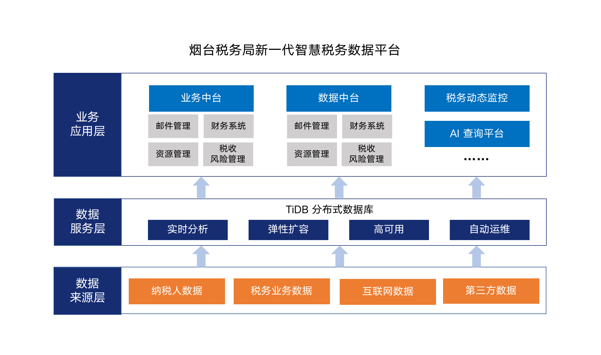

智慧税务建设的关键环节就是在合适的业务场景中，综合运用人工智能、分布式等领先技术，释放大数据的智慧，实现“**以数治税**”。**烟台市税务局基于 TiDB 分布式数据库构建新一代智慧税务平台，满足海量、实时的数据服务需求**，打造智能的分析与决策能力，走出一条税务大数据创新应用的示范之路。

## 集中式无法跨越的鸿沟

税收大数据是智慧税务的重要基础，近年来烟台市税务局（以下简称：烟台税务）加强数据资源的深度挖掘、智能分析与融合共享，充分运用人工智能和大数据技术，提升税收治理水平。随着业务数据的海量增长，多个业务大表的数据均已突破亿条规模，原先基于 Oracle RAC 的数据库架构横向扩展能力不足，大表之间关联分析通常需要花费 1-2 个小时，性能表现达不到近实时分析的业务需求。

烟台税务的开发团队围绕税务大数据体系构建一系列智慧办税、管税与决策应用，例如纳税人画像、风险识别、过程监控等。业务开发侧本着快速上线、快速迭代的原则，除了数据库的内核能力，希望数据库可以融合原有 Hadoop 大数据栈，易开发和易运维。

## 数据驱动的实时化场景成为趋势

经过多轮对比测试与应用兼容验证后，烟台税务引入 **TiDB 分布式数据库构建新一代智慧税务数据平台，用来承载业务中台、数据中台、税务动态监控大屏、AI 查询平台等多个核心业务系统。**

烟台税务开发了前置程序，实现将省局 Oracle 生产库的数据实时同步到 TiDB，为业务中台、数据中台和各类业务应用提供统一、实时的智能数据服务。实际场景下，发票信息和货物信息是分开的大表，每张表的数据量均在亿条以上，如果按照发票号或者开票日期进行关联，原先需要 1-2 小时才能完成，使用 TiDB 分布式数据库之后可以在秒级得到分析计算结果，服务效率呈指数级提升。

从烟台税务基于 TiDB 分布式数据库的应用可见，以数据驱动的实时化场景成为税务行业的流行趋势，海量数据下多表的关联查询与实时结果的呈现已经成为释放大数据智慧的重要手段。事实上，对于海量数据的实时处理，相比传统的大数据技术栈和集中式数据库，分布式的 HTAP 数据库是更好的选择。目前，烟台市税务局基于 TiDB 分布式数据库建立了将近 300 个业务报表和分析模型，大幅提高了各级税务管理机关在预警、风险分析和管控的业务能力和水平，第一时间发现异常，极大程度地降低了涉税案件的发生，提升了工作效率和服务企业的能力。

## 用 AI 加持分布式数据库

烟台税务集结 AI 专家、税收业务专家和数据库专家创新性地开发了万维查询平台，利用 AI 语义分析进行 SQL 语句转换和建模，凭借 TiDB 分布式数据库强大的实时分析能力，实现了税务关键业务指标的可视化呈现。

只要在万维查询的搜索框输入文字，例如“本年度增值税入库情况”，即可展示该项指标的实时图形化报表和分析结果。万维查询平台为业务部门的人员屏蔽了数据库使用的门槛，不用懂 SQL，不需要敲任何代码，税务工作人员直接输入文字，在秒级时间即可返回业务的实时统计报表，为全市税务工作人员实时掌握税收动态提供了科学的数据支持。

未来，烟台税务将进一步加强人工智能与分布式数据库的深层次应用，结合智慧税务数据平台，实现精准涉税分析、动态信用评估、涉税风险预警等领域丰富的决策支持与应用创新。

## TiDB 的应用价值

### 创新架构打造大数据坚实底座

TiDB 采用计算存储分离的分布式架构设计，**通过简单的增加新节点即可按需扩展吞吐或存储，完美地解决了传统数据库的单点性能瓶颈问题**。TiDB 提供金融级高可用保障，可实现故障的自动恢复。

### 开放生态简化大数据栈

TiDB 用一个数据平台满足实时交易与实时分析的场景需求，并且可以与 Hadoop、Flink、Spark、Kafka 等大数据生态融合，为上层业务提供统一数据服务，在简化各类数据栈的同时大幅节省人力与维护成本。

### 智能运维无后顾之忧

TiDB 支持标准 SQL，大大降低敏态应用开发复杂度，加快应用上线速度。此外，TiDB 为运维人员提供了灵活的可视化查询界面，让运营人员通过 SQL 实时分析和实时运营成为可能。

现在，TiDB 的 HTAP 能力除了在互联网、金融、零售、物流等高科技场景下得到了应用，也正在帮助政务这样的公共服务行业进行架构创新，完成数字化转型。