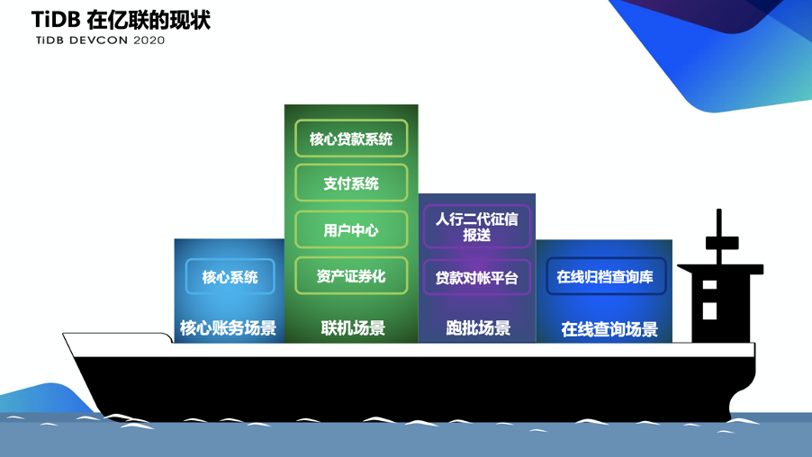
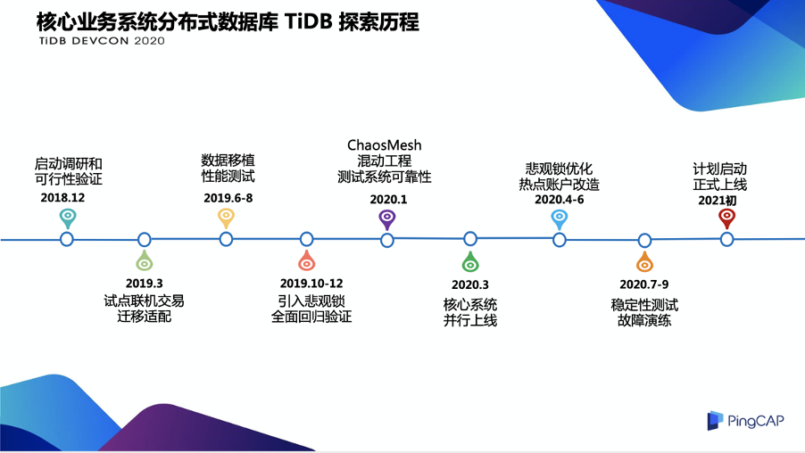
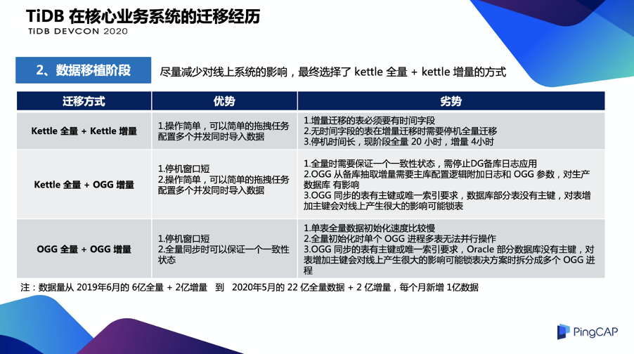
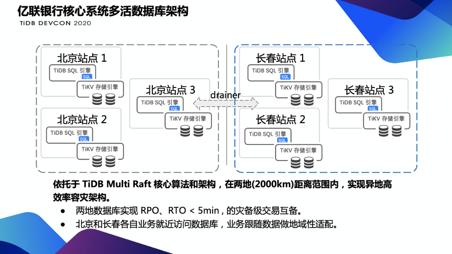
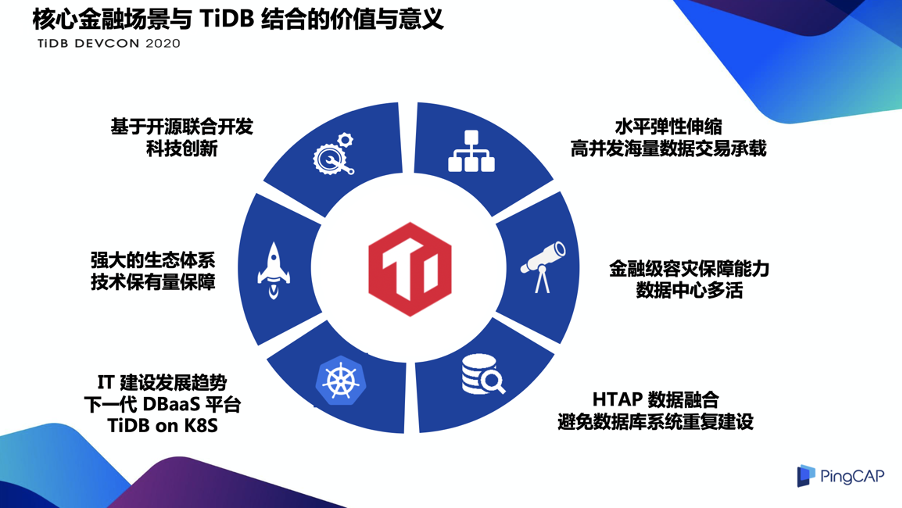

>作者介绍：卢秀红， 亿联银行科技运维部副总经理，主要负责基础架构的规划建设工作。开源技术爱好者。

本文主要想将亿联银行核心系统使用 TiDB 过程中遇到的一些问题和处理的方法分享给大家，希望对大家以后的工作提供一些借鉴和帮助。下文内容将分为四个部分：第一个部分是亿联银行数据库的建设方法和建设的历程；第二个部分是 TiDB 数据库在亿联银行生产环境落地的应用情况；第三是亿联银行核心系统 TiDB 建设的一些历程；第四是我们做这件事情的价值和意义。

## 亿联银行数据库的建设方法及历程

### 建设方法

亿联银行数据库的建设思路分为“一上一下”。

“一上”是将我们数据库的一些处理工作上升到应用层面去解决，在数据库层面禁用存储过程、触发器、视图等功能，让我们数据库变得轻量化和简单化。这样做有两个好处：第一是减少我们数据库的压力，让数据库变得更好地满足业务的需求；第二点是让数据库应用层跟数据库层技术进行解耦，让上层的应用不依赖于底层的技术。我认为去 IOE 真正意义是在于通过解耦来减少技术的依赖。

“一下”是我们将数据库的一些分库分表的功能给下放到底层分布式数据库层面来解决，减少一些研发的成本和工作量，让我们研发人员更专注于代码功能的实现，加快项目的上线效率。

### 建设历程

我们在成立之初就使用了 MariaDB 的数据库技术，我们当时也是考虑数据库的一些开放性和开源性。作为一家银行，我们的数据安全也是用户的资金安全，所以我们采用了 MariaDB Galera 的强同步机制，并且我们同步制定了严格的技术标准和配置规范，对一些存储过程统一使用 MySQL 协议，还限制一些事务大小，还有我们通过限制组件的使用等等进行数据库标准化的工作。

但是随着业务发展，对数据库带来了性能和容量的挑战，这时候我们需要采用分库分表技术来解决性能的问题，但是分库分表的架构又带来了新的问题，因为他的代码改造工作量，还有全局一致性的问题需要消耗我们的开发成本去解决。在扩容这部分也是非常复杂的，因为分库分表的数据库的扩容是一个庞大的工作量。还有我们运维的复杂度，对一些 DDL 的操作是需要有一些变更的工作在后半夜进行。

我们在 2018 年的时候就开始考虑采用分布式数据库技术来解决以上的问题，我们进行了大量的 POC 工作，当时测试了市面上大部分的 NewSQL 产品，之后我们选定了 TiDB 架构，为什么？主要有以下考虑：

首先，TiDB 是支持 MySQL 协议的，对我们应用适配改造的成本较小。

第二，TiDB 本身是存储引擎分布式的，对我们研发的分库分表的工作量有所减少。

第三，它的扩容非常方便，它可以**通过增加服务器达到线性的能力提升**。

第四，也是最重要的是支持在线 DDL 的操作，这会减少我们研发和运维人员的工作量，我们计划通过在后续采用数据库的 SQL 审核平台，以及自动化执行平台对接 DevOps，来实现数据库的自动变更操作。

最后，就是它强大的高可用架构，TiDB 本身是采用 Raft 多数派协议，根据不同的部署位置可以实现同城的多活或者异地的灾备，还可以支持同 MySQL 其实数据库进行一些复制，所以说 TiDB 的高可用架构还是很强大和灵活的。

但是技术真的没有银弹，我们在使用 TiDB 过程中又碰到了一些问题。我归纳为两类问题。第一个问题是 TiDB 本身的一些问题：锁机制；事务隔离级别跟我们现有应用的兼容性；它的一些数据热点问题带来的一些性能问题；还有资源隔离性问题造成大量的服务器浪费。因为 TiDB 本身是硬件起步比较高的，每个集群在我们生产环境部署的服务器数量至少六到九台，并且它的隔离性造成了我们的应用只能在一个集群部署一套。还有一类问题更严重，就是应用适配问题。因为我们银行大部分的应用都是采用传统的关系型数据库来做的机制，他采用了很多超长的事务和串行的处理机制，不适合数据库的架构。还有一点是我们研发人员和应用设计人员对分布式数据库的原理不是很了解，在代码实现过程中没有考虑分布式数据库的一些特性，没有把分布式的优势发挥出来。

**那我们是通过什么方式解决以上问题呢？**

首先在应用适配问题这块，我们制定一个针对分布式数据库的规范。比如在应用架构设计的时候尽量采用一些并行的机制来执行，还有我们数据架构设计的时候可能禁用一些类似自增主键这些功能。

在 [4.0 这个版本](https://pingcap.com/blog-cn/tidb-4.0-the-leading-real-time-htap-database-is-ready-for-cloud/) 中 TiDB 本身的问题已经得到了很好的解决，**比如它支持了悲观锁，还有他的事务隔离级别是支持 RC 了**，还有一些数据热点问题的可视化，通过容器化部署还可以解决资源隔离性的问题，让我们通过容器的隔离性来解决数据库多实例的征用，我相信 TiDB 4.0 将是一个成熟的版本，期待它在亿联银行有广泛的应用，也更期待它后续给我们带来的挑战。

## 亿联银行分布式数据库在生产环境的落地

下图是我们亿联银行分布式数据库在生产环境落地的情况。

我们在 2018 年年初的时候遇到了在线支付查询场景的性能问题。当时我们通过建一套 TiDB 的归档库，将一些查询类的交易迁移到 TiDB 的归档库进行解决。
在 2018 年年中的时候我们又遇到了一个批量的问题，因为我们是互联网业务，很多业务特性是高频、量多、金额少，所以每天批量场景的数据量是很庞大的，在 2018 年年中的时候我们每天的日批将近四千万条，这就造成了我们批量的时间过长，已经达到了 12 个小时，影响了我们监管上报的时效性。所以我们通过 TiDB 进行了数据的迁移，将这些场景通过 TiDB 的一些高并发特性进行了解决。

**在 2019 年的 10 月份我们上线了第一个关键的联机场景，就是核心贷款系统**。核心贷款系统也是亿联银行一个重要的业务，主要对接一些三方的平台进行个人贷款的场景，所以它的并发量是非常大的，它是一个典型的 ACID 的场景，我们当时是采用了 MySQL 和 TiDB 使用 TiDB DM 工具来进行的迁移。

当时迁移的时候还出现了一个小插曲，就是在 TiDB 场景运行的时候，造成了联机执行时间过长的情况，这是应用适配性问题造成的。我们之前的贷款系统是用采用单机关系型数据库的，所以说使用了很多的串行处理机制，通过 TiDB 我们进行了一些应用的改造，当时我们回退回 MySQL 的时候也是分钟级就完成了，因为我们是通过 DM 进行实时同步的，这个方式大家以后可以借鉴。我们的核心系统是今年 3 月份进行了并行上线，具体的上线架构下文会有详细的介绍。

## 亿联核心业务系统在 TiDB 上实践

我们在 2018 年 12 月份就启动了调研和可行性验证，在 2019 年 3 月，进行了联机交易的应用的适配，我们在三个月的周期里就将应用完整地迁移到了 TiDB 里，因为我们在应用层进行了之前的一些标准，所以数据库层没有使用存储过程触发器之类的。到 6 月，我们进行了全量的数据迁移和性能测试，在 2019 年 10 月份的时候我们引入了悲观锁的场景进行了全面的验证。在今年 1 月份，TiDB 有个测试平台叫系统可靠性平台 [Chaos Mesh®](https://pingcap.com/blog-cn/chaos-mesh/)，来给我们核心系统进行了全方面的可靠性的验证。3 月份我们系统进行了并行上线，在 4 月份启动了悲观锁的优化，主要是针对热点账户场景的改造，这一点下文会有介绍。我们计划 7 月份进行稳定性测试，预计明年上半年进行正式的上线。

### TiDB 在核心业务系统的迁移经历

#### 1. 应用适配阶段

在整个迁移过程中，第一个阶段，是应用适配阶段。该阶段主要有三个部分：

*   第一个部分是语法改造，这个比较简单，主要是我们将一些日期格式还有函数进行转换，还有一些伪列的处理。
*   第二部分是触发器改造，主要是用 Java 重写了触发器，将触发器替换掉了。
*   最难的是第三部分，锁机制的适配，因为 TiDB 当时版本只有乐观锁，我们在转帐场景中有热点账户，这个场景我们成功率只有 90% 不到，而且它的 TPS 是个位数，当时我们决定要采用悲观锁的模式实现。

在这介绍一下什么是热点账户场景吧，因为后面有很多问题也是热点账户问题造成的。热点账户场景在我们业务层面来说是多个大量的动账操作同一个账户余额，并且这个账户余额要实时更新，不允许透支，在数据库层面怎么理解呢？就是，大量的操作同一行数据，并且我们 Select 操作还是会加 for update 这种独占模式的，这势必会造成大量行级的争抢，但是 TiDB 乐观锁是通过版本号来控制提交的，我们在这种场景下可能会有大量无效的提交和大量的回写，所以不适合我们这种高并发的 ACID 场景。

#### 2. 数据移植阶段

第二阶段是数据移植阶段。数据移植阶段当时我们出具了三种方式：第一种方式是全量加 Kettle 增量，这种方式的缺点就是它需要在增量的时候有 4 小时的停机窗口，但是它有一个好处就是对应用是没有侵入的。第二种方式和第三种方式我们都采用了 OGG 的方式，OGG 在我们这有一个大的问题，就是它必须在生产库有一些应用的改造，比如它需要每个表都有唯一索引或主键。

**经过评估，出于对核心场景的稳定性考虑，我们放弃了后两种方式。最后是采用了用 Kettle 的方式来进行迁移，但这种方式的迁移当时评估的是两亿的增量数据，需要停机 4 个小时。**

#### 3. 性能评估阶段

第三是性能评估阶段，性能评估阶段我们当时测试了几个场景：第一个是账务类场景，主要是一些动账的查询和操作；第二是账户类场景，主要是开户和绑卡的操作。我们遇到了以下的问题：

**第一个问题是读热点。**

读热点分为大表热点和小表热点，在大表热点里我们通过 TiDB 的配置参数 shard row ID 的方式将我们热点数据打散到各个不同的 region 里进行了解决。但是小表热点在 TiDB 里没法解决的，因为在 Oracle 里我们知道，通过 in memory 的方式将表整个 load 到 cache 里就可以进行性能提升，但是 TiDB 本身是无状态的，所以 类似 load cache 的方式在 TiDB 这块是行不通的，我们后来是通过应用改造，将这些小表热点迁移到 redis 缓存里进行解决（TiDB 的最新版本中对于小表热点也有了更多的优化）。

**第二是交易执行时间过长。**

这也是应用适配性造成的。因为我们之前用的关系型的单机数据库，所以说它在部分场景交易链路很长，还有使用了串行的处理，我们为了适配 TiDB，将这些交易拆分成各个不同的原子类，之后进行了一些场景实现并发的一些处理的解决。

**第三是 RR 和 RC 隔离级别的问题。**

因为我们核心系统当时采用的是 RC 的隔离级别，在业务处理里有一些嵌套的事务处理，这些嵌套的事务处理在 TiDB 的 SI 隔离级别下是失效的，因为我们 TiDB 的提交是通过版本号来控制的，最后我们提交的时候，由于嵌套事务造成的版本号过旧，所以造成事务整个提交失败，我们后来通过将嵌套事务进行代码改造，把这些嵌套事务给消除掉进行解决的。

**第四个问题是联机跑批。**

我们把 TiDB 与之前的关系型数据库进行了对比，在 420 万账户和 500 万流水里，二者的执行时间都是近一小时。但是我们经过分析，这种场景的大部分操作都是事务的逻辑处理，**我们通过增加 TiDB 的节点可以线性的提升 TiDB 的跑批处理性能，来减少跑批的时间。**

#### 4. 关键指标验证

第四个阶段是关键指标验证。在悲观锁测试场景，主要是热点账户交易还有非热点账户的转帐交易，还有一些查询交易的测试场景。在这个阶段我们采用了支持悲观锁的 TiDB 版本，但是由于 TiDB 本身分布式数据库的二阶段提交，还有一些节点间延迟造成了单个事务比之前的生产库要高，我们通过提升并发处理机制也不能提升它的性能，因为我们之前介绍过，在热点账户场景中，在数据库层面有单行的一个行级争抢，它的瓶颈都在这个行级的处理上，所以说热点账户场景在这个阶段没有解决，我们放在后面再介绍。

在非热点账户场景的转帐交易，我们通过并发是能够解决的。因为他没有单个行级的争抢。查询交易当然也可以通过并发来提升性能，在冲正场景我们是验证 TiDB 的锁机制，这个锁机制当然是没问题的，我们杀死死锁的时候是可以进行一些回退操作的。

**下面一个重要的内容介绍是热点账户场景的改造思路：**

*  **在第一阶段我们优化了一些热点账户 SQL 逻辑，减少了事务持锁时间。**

  这部分有一些性能提升，但是根本解决不了我们的问题，因为我们的源头问题是没解决的。
  
* **第二个阶段是通过应用改造。**

   将贷款场景的核心联机的记账操作进行解耦，将贷款场景的联机记账改成批量记账，通过每天的日终汇总记账来消除贷款场景的热点账户问题。但是我们现在还有在存款和支付场景中热点账户问题是没有解决的。
   
* **第三个阶段是使用了必杀技，就是将我们热点账户场景进行改造，改造成多个子余额。**

  前面介绍了热点账户场景是有单行的争抢，我们通过子余额将这些行打散。可能建立 4 个子余额，在数据库里可能就是 4 行的争抢，建 8 个子余额就是 8 行的争抢。我们后来在生产环境通过 16 个子余额来进行了 TPS 测试，当时我们的 TPS 能跑到 300 左右，是原先生产库五倍到六倍的性能提升，从这开始我们把热点账户问题通过应用改造进行了解决。

### 核心系统并行上线

接下来介绍一下我们核心并行上线架构。因为亿联现在的核心在生产环境，新老核心都是在运行的。

我们通过在生产环境搭建了一套全新的核心的应用架构，并且使用 TiDB 数据库，我们通过网格计算 ESC-P 这个组件将我们其他渠道类系统还有支付系统发给核心的请求同步一份到新的核心架构，从应用到数据库全链路的进行了生产报文的全面验证，并且我们每天会对当天的交易进行日报的汇总，会分析每笔交易失败的原因是在我们应用层还是在数据库层。

### 亿联银行核心系统多活架构

最后说一下我们多活的系统架构。亿联的多活系统是部署在两个机房，北京数据中心和长春数据中心，并且进行了账户层面的跨片拆分：东北三省的用户都是将账户开在长春数据中心；其他省份的用户将账户开在北京数据中心。它本身的架构是在**同一个城市的多个数据中心多活**，因为我们引用一些多数派协议 Raft 或者 Redis 集群，还有 Zookeeper，这种同城多活现在难度并不高。第三个是我们的一个应用补偿机制，因为我们知道在北京的核心生产库，在长春有一个备库，长春的生产库在北京也有一个备库。

当时我们考虑到要是遇到一些区域性的灾难的话，这些用户可以切换到对方的数据中心进行运行，但是数据库的复制是有一些延迟的，因为北京和长春跨度是一千公里左右，我们的数据会有一些 RPO 的丢失，我们通过应用录放平台进行一些报文的回放，这样我们的 RPO 理论上是零丢失的。还有我们整个架构是跟厂商进行自主开发的，我们对整个架构的版权还有技术都是自主掌控的。我们的技术架构全部用的是开源技术，在高可用考虑上面都是从 PaaS 和 SaaS 层面去解决的，所以在 IaaS 层面的一些稳定性考虑不用太多。

上图是我们核心的详细架构。

北京数据中心和长春数据中心在上层是通过 F5 来进行区域用户分配的，我们可以按照省级运营商用户颗粒度进行数据中心位置的指派。我们将长春的用户指到长春数据中心，将北京的用户指到北京的数据中心，就是通过 F5 这个 GTM 功能来实现的。下面是一个 LRP 的数据路由平台，它会将用户分发到它对应的生产库里去。因为北京的用户可能去上长春去出差，有这种场景，他从长春访问来之后，发现他的账户开在北京，所以说会通过这个平台把这个请求再发回北京，他的位置信息是通过 GIP 里面用户的一些索引来定位的。还有 DRPS （就是我刚才介绍的数据路由平台），它是生产每一笔报文都会同步到 DRPS 进行录制，当出现灾难的时候，会通过回放来解决由于数据库复制造成的一些数据丢失。上图下半部分是有四套数据库，北京的生产库，长春的生产库，长春的备份库和北京的备份库。

上图是我们多活架构的数据库架构的介绍，我们在同城实现跨站点，通过 Raft 形成同城多活，在异地灾备这块的考虑是通过逻辑复制来实现的。

## 核心金融场景与 TiDB 结合的价值与意义

最后说一下亿联银行核心场景与 TiDB 结合的意义。

第一是基于开源联合开发的科技创新。因为 TiDB 的研发能力是非常强的，我们当时在核心场景遇到悲观锁的问题，我当时把这个问题提交给 TiDB，也就三个月左右就把悲观锁版本开发完成了，之后他还有很强大的生态系统，他有很多用户，国内有很多互联网用户在用，还有国外的，还有和银行这两年发展也很迅速，所以说这些新的版本会有大量的用户来帮我们验证缺陷，进行快速的修复。还有是 K8s 上部署，把数据库打包成一个 IT 服务进行快速交付。以及我们 HTAP 的融合的架构，这部分后续我们在生产环节也会进行一些考虑。

>本文整理自卢秀红在 [TiDB DevCon 2020](https://pingcap.com/community-cn/devcon2020/) 上的演讲。
