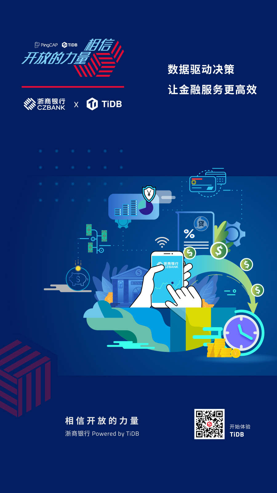
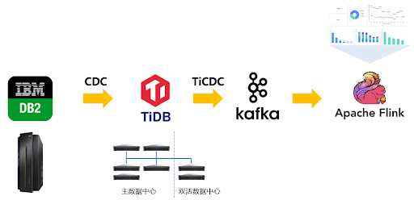

**「我们已经用起来了」**，是我们最喜欢听到的话，简简单单几个字的背后代表着沉甸甸的信任和托付。我们将通过 **「相信开放的力量」** 系列深度案例分享，从业务的角度，看看一个数据库为各行业用户带来的业务价值。 **本篇文章将介绍 TiDB 在扩展浙商银行数据架构体系能力版图的实践。**

>数据驱动决策
>
>让金融服务更高效

浙商银行股份有限公司（简称“浙商银行”）是 12 家全国性股份制商业银行之一，致力于打造平台化服务银行，为客户提供开放、高效、灵活、共享、极致的综合金融服务。在英国《银行家》(The Banker) 杂志“ 2020 年全球银行 1000 强”榜单中，按一级资本和总资产计，均位列第 97 位。截至 2020 年 6 月末，浙商银行在全国 19 个省（直辖市）及香港特别行政区设立了 260 家分支机构，实现了对长三角、环渤海、珠三角以及部分中西部地区的有效覆盖。

## 业务挑战

随着浙商银行业务的发展和数据量的激增，国外商业数据库的数据处理和存储能力短板逐渐暴露，原有的数据架构体系不能满足新业务场景的需求。在行业政策倡导下，借鉴金融同业的使用经验，浙商银行将目光转向互联网广泛使用的分布式数据库产品，启动专项选型工作。

浙商银行的目标是寻找一款能够承载海量数据的 OLTP 型数据库，支持完整的分布式事务，提供金融级的高性能、高并发、持续高可用能力；在架构上可以弹性水平扩展，平滑地应对各类业务流量；同时具备强大的生态体系，支持连接各类数据应用生态。**经过多轮竞品对比测试与应用兼容验证后，TiDB 数据库在扩展性、海量数据规模下的查询性能、事务完整性等考察项成绩领先，浙商银行选择 TiDB  分布式数据库扩展数据架构体系的能力版图。**

## TiDB 解决之道

面向远期两地三中心的建设考虑，浙商银行在杭州区域内双数据中心部署 TiDB 分布式数据库集群，使用数据五副本方式，未来可进一步扩展。目前已上线和投产三项应用：电信诈骗事件风险链查询（简称：电信反欺诈）、外汇交易管理和高管驾驶舱，并将逐步延伸到全行 ODS、互联网 C 端查询交易场景等业务领域。

### 电信诈骗风险事件查询系统

电信诈骗风险事件查询系统保存全国范围的电信反欺诈数据，包括交易的账户和交易金额等详细数据。系统支持对可疑的交易进行查询和监测，分析交易金额、笔数、类型、时间、频率和收付款方等特征，发现异常交易，需要及时采取交易暂停等措施或者通报公安机关。

电信反欺诈系统的单表数据规模已经超过 20 亿条，日新增数据百万条，原有的 OLAP 数据库从数据规模到业务查询性能上都无法达到业务预期。**TiDB 具备弹性伸缩的能力，只需简单增加节点，整个系统的性能和吞吐能力都可以得到线性提升，支持海量结构化数据的存储和查询，SQL 查询的返回时间从几十秒缩短到几十毫秒。利用 TiDB Lightning 数据导入工具，可实现单次下发数据文件内上百万条数据记录的快速导入，满足业务的操作窗口需求。**

### 外汇交易管理

基于外汇监管的要求，外汇交易管理系统需要完成外汇交易数据的采集、导入、存储、统计分析和数据挖掘等功能，相关数据要求长期保存，预计未来几年内数据规模将达到十亿级别。原先采用的 Oracle 数据库，需要使用分区表的方案，导致运维管理和开发成本的上升。

**TiDB 的分布式特性能满足数据规模的扩展需要，弹性扩容能力可以实现数据的自动再均衡，对于业务完全透明，不需要运维人员介入。同时，TiDB 的高可用机制提供异地多活的高可用能力，恢复过程不需要人工操作，集群能够自动地实现容灾和保证强一致的数据恢复，让运维人员没有后顾之忧。**

### 高管驾驶舱

高管驾驶舱是为行内管理层提供实时经营指标的分析系统，通过打破数据隔离，实时反映各类业务的运行状态，将采集的数据形象化、直观化、具体化，实现指标分析及决策场景落地。浙商银行利用数据同步工具实时地将上游 DB2 等异构数据库中的数据变化写入 TiDB，同时将 TiDB 中的实时变更数据同步到下游 Kafka ，Flink 从 Kafka 接受消息进行流式计算，**整个体系形成一个高效、易用的实时计算平台，实现银行各类业务经营状况的实时统计，并在可视化大屏进行展现。通过海量金融数据变化的在线捕获和实时分析，为银行各级管理人员提供业务决策依据，提升服务效率。**

### 未来场景探索

#### 分布式实时 ODS

TiDB 数据库具备大规模数据平台的服务能力，在数据层面实现 OLTP 系统与 OLAP 系统的闭环，集成 TiFlash 列式存储引擎之后，已经成为真正的 HTAP 数据库（在线事务处理 OLTP + 在线分析处理 OLAP），既可以作为数据源的业务数据库，进行业务查询的处理，又可以作为实时 OLAP 引擎，进行分析型场景的计算。

浙商银行内部有多个 OLTP 异构数据库，以 DB2 和 MySQL 为主，还有部分的 Oracle 和 SQL Server，各类异构数据库之间缺少高效的数据同步手段，逐渐形成了数据孤岛的状态。为应对各类业务对实时数据的需求，浙商银行计划在现有平台基础上进一步扩展，基于 TiDB 构建分布式实时 ODS（Operational Data Store，即时操作型的数据集合），实现异构数据库中各类数据的准实时同步。TiDB 的增量数据同步工具 TiCDC 可以为下游数据消费端提供实时、高吞吐、稳定的数据订阅服务，通过开放数据协议与 MySQL、Kafka、Pulsar、Flink、Canal 等多种异构生态对接，满足大数据场景中对各类数据的应用与分析需求。

#### 互联网查询交易

浙商银行面向政企用户提供代发工资业务，每个月需要集中处理几千万笔流水，原有的业务数据库难以满足更长的业务保存期限，一方面，查询速度慢影响客户体验，另一方面，无法与其他数据联动，后续浙商银行也将考虑选用 TiDB 进行试点和替代。

## 为什么选择 TiDB？

在功能层面，TiDB 支持完整的分布式事务，同时实现海量规模数据的在线事务处理与在线分析处理，提供金融级别的高可靠与高可用，任何一个数据中心宕机，整个集群可以自动实现业务无感知的切换与恢复。

在架构层面， 作为一款 NewSQL 分布式数据库, TiDB 采用存储计算分离的架构设计，能够更加高效地解决传统关系型数据库无法解决的数据扩容难题，具备更为广泛的场景适配能力。
在运维层面，TiDB 兼容 MySQL 协议使得人员学习与开发等隐性成本显著降低；为业务运营人员提供灵活的查询界面，易于监控与维护。

## 与客户同行，相信开放的力量

每次数据库架构改善与落地，无论是 TB 级还是 PB 级，都需要付出努力，但这也值得每一个企业去实践。在当下这个时代，不管企业的规模如何，都要学会借助开源的力量，避免去重复的造轮子。

每一个看似轻松的背后都有不为人知的努力，每一个看似光鲜亮丽的背后，都有不为人知的付出。分布式数据库建设之路道阻且长，TiDB 愿与浙商银行及每个客户一起，携手并肩把事情做好。
