>作者：孙晓光，知乎搜索后端负责人，目前承担知乎搜索后端架构设计以及工程团队的管理工作。曾多年从事私有云相关产品开发工作关注云原生技术，TiKV 项目 Committer。

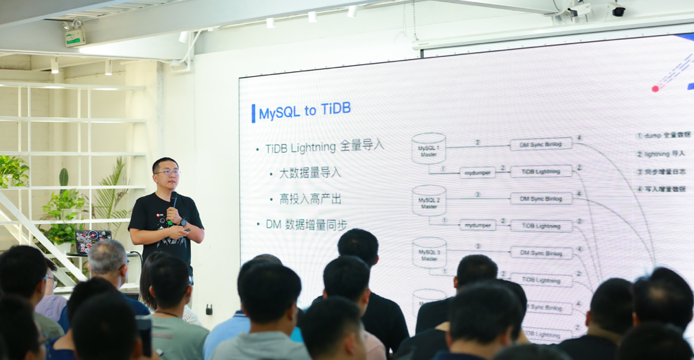

>本文根据孙晓光老师在 TiDB TechDay 2019 北京站上的演讲整理。

本次分享首先将从宏观的角度介绍知乎已读服务的业务场景中的挑战、架构设计思路，然后将从微观的角度介绍其中的关键组件的实现，最后分享在整个过程中 TiDB 帮助我们解决了什么样的问题，以及 TiDB 是如何帮助我们将庞大的系统全面云化，并推进到一个非常理想的状态的。

## 一、业务场景

知乎从问答起步，在过去的 8 年中逐步成长为一个大规模的综合性知识内容平台，目前，知乎上有多达 3000 万个问题，共收获了超过 1.3 亿个回答，同时知乎还沉淀了数量众多的文章、电子书以及其他付费内容，目前注册用户数是 2.2 亿，这几个数字还是蛮惊人的。我们有 1.3 亿个回答，还有更多的专栏文章，所以如何高效的把用户最感兴趣的优质内容分发他们，就是非常重要的问题。

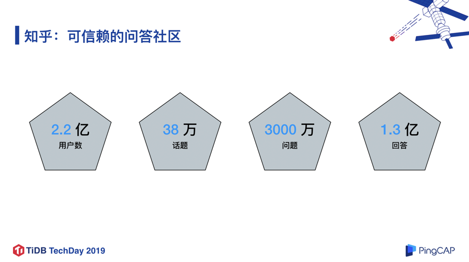

图 1

知乎首页是解决流量分发的一个关键的入口，而已读服务想要帮助知乎首页解决的问题是，如何在首页中给用户推荐感兴趣的内容，同时避免给用户推荐曾经看过的内容。已读服务会将所有知乎站上用户深入阅读或快速掠过的内容记录下来长期保存，并将这些数据应用于首页推荐信息流和个性化推送的已读过滤。图 2 是一个典型的流程：

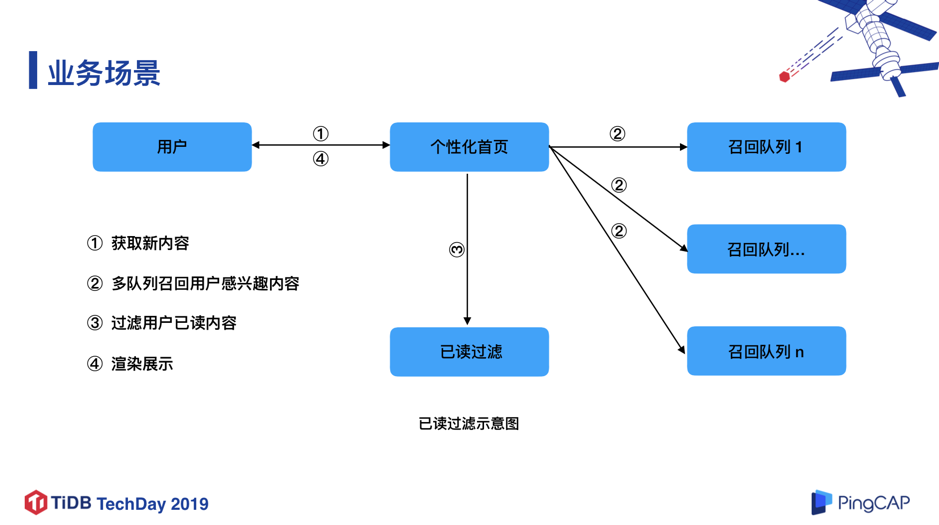

图 2

当用户打开知乎进入推荐页的时候，系统向首页服务发起请求拉取“用户感兴趣的新内容”，首页根据用户画像，去多个召回队列召回新的候选内容，这些召回的新内容中可能有部分是用户曾经看到过的，所以在分发给用户之前，首页会先把这些内容发给已读服务过滤，然后做进一步加工并最终返回给客户端，其实这个业务流程是非常简单的。

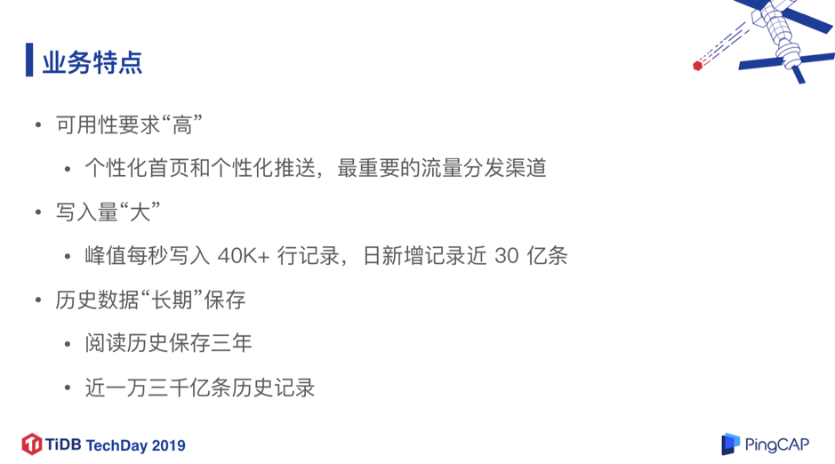

图 3

**这个业务第一个的特点是可用性要求非常高，因为首页可能是知乎最重要的流量分发渠道。第二个特点是写入量非常大，峰值每秒写入 40k+ 条记录，每日新增记录近 30 亿条。并且我们保存数据的时间比较长，按照现在产品设计需要保存三年。整个产品迭代到现在，已经保存了约一万三千亿条记录，按照每月近一千亿条的记录增长速度，大概两年之后，可能要膨胀到三万亿的数据规模。**

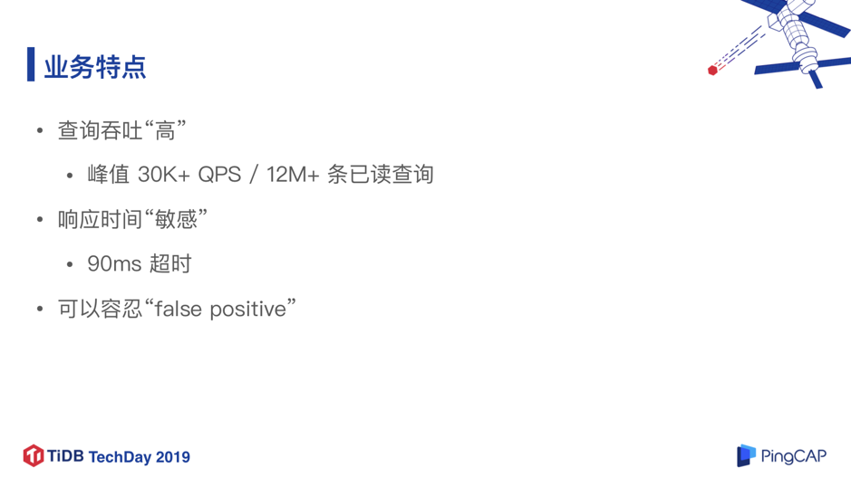

图 4

**这个业务的查询端要求也很高。首先，产品吞吐高。用户在线上每次刷新首页，至少要查一次，并且因为有多个召回源和并发的存在，查询吞吐量还可能放大。峰值时间首页每秒大概产生 3 万次独立的已读查询，每次查询平均要查 400 个文档，长尾部分大概 1000 个文档，也就是说，整个系统峰值平均每秒大概处理 1200 万份文档的已读查询。在这样一个吞吐量级下，要求的响应时间还比较严格，要求整个查询响应时间（端到端超时）是 90ms，也就意味着最慢的长尾查询都不能超过 90ms。还有一个特点是，它可以容忍 false positive，意味着有些内容被我们过滤掉了，但是系统仍然能为用户召回足够多的他们可能感兴趣的内容，只要 false positive rate 被控制在可接受的范围就可以了。**

## 二、架构设计

由于知乎首页的重要性，我们在设计这个系统的时候，考虑了三个设计目标：高可用、高性能、易扩展。首先，如果用户打开知乎首页刷到大量已经看过的内容，这肯定不可接受，所以对已读服务的第一个要求是「高可用」。第二个要求是「性能高」，因为业务吞吐高，并且对响应时间要求也非常高。第三点是这个系统在不断演进和发展，业务也在不断的更新迭代，所以系统的「扩展性」非常重要，不能说今天能支撑，明天就支撑不下来了，这是没法接受的。

接下来从这三个方面来介绍我们具体是如何设计系统架构的。

### 2.1 高可用

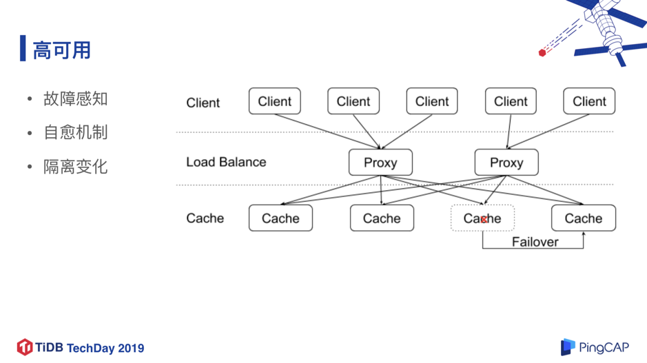

图 5

当我们讨论高可用的时候，也意味着我们已经意识到故障是无时无刻都在发生的，想让系统做到高可用，首先就要有系统化的故障探测机制，检测组件的健康状况，然后设计好每一个组件的自愈机制，让它们在故障发生之后可以自动恢复，无需人工干预。最后我们希望用一定的机制把这些故障所产生的变化隔离起来，让业务侧尽可能对故障的发生和恢复无感知。

### 2.2 高性能

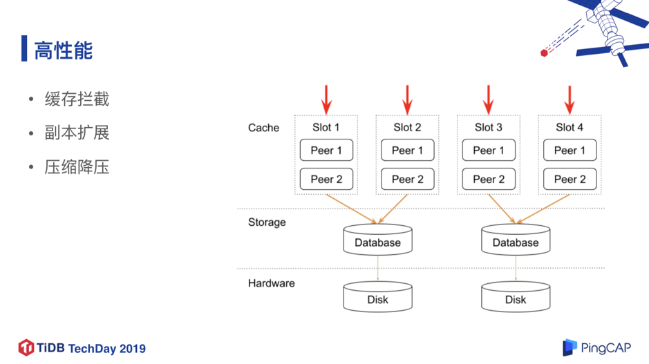

图 6

对常见的系统来说，越核心的组件往往状态越重扩展的代价也越大，层层拦截快速降低需要深入到核心组件的请求量对提高性能是非常有效的手段。首先我们通过缓冲分 Slot 的方式来扩展集群所能缓冲的数据规模。接着进一步在 Slot 内通过多副本的方式提升单个 Slot 缓冲数据集的读取吞吐，将大量的请求拦截在系统的缓冲层进行消化。如果请求不可避免的走到了最终的数据库组件上，我们还可以利用效率较高的压缩来继续降低落到物理设备上的 I/O 压力。

### 2.3 易扩展

图 7

提升系统扩展性的关键在于减少有状态组件的范围。在路由和服务发现组件的帮助下，系统中的无状态组件可以非常轻松的扩展扩容，所以通过扩大无状态服务的范围，收缩重状态服务的比例，可以显著的帮助我们提升整个系统的可扩展性。除此之外，如果我们能够设计一些可以从外部系统恢复状态的弱状态服务，部分替代重状态组件，这样可以压缩重状态组件的比例。随着弱状态组件的扩大和重状态组件的收缩，整个系统的可扩展性可以得到进一步的提升。

### 2.4 已读服务最终架构

在高可用、高性能和易扩展的设计理念下，我们设计实现了已读服务的架构，图 8 是已读服务的最终架构。

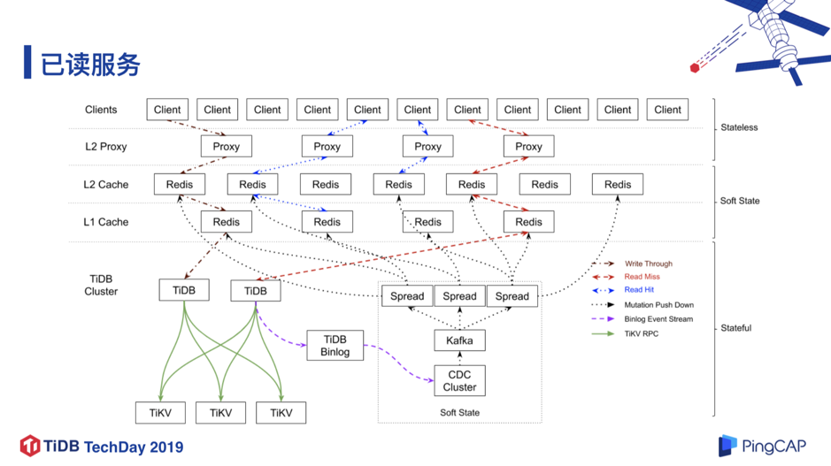

图 8

首先，上层的客户端 API 和 Proxy 是完全无状态可随时扩展的组件。最底层是存储全部状态数据的 TiDB，中间这些组件都是弱状态的组件，主体是分层的 Redis 缓冲。除了 Redis 缓冲之外，我们还有一些其他外部组件配合 Redis 保证 Cache 的一致性，这里面的细节会在下一章详述。

从整个系统来看，TiDB 这层自身已经拥有了高可用的能力，它是可以自愈的，系统中无状态的组件非常容易扩展，而有状态的组件中弱状态的部分可以通过 TiDB 中保存的数据恢复，出现故障时也是可以自愈的。此外系统中还有一些组件负责维护缓冲一致性，但它们自身是没有状态的。所以在系统所有组件拥有自愈能力和全局故障监测的前提下，我们使用 Kubernetes 来管理整个系统，从而在机制上确保整个服务的高可用。

## 三、关键组件

### 3.1 Proxy

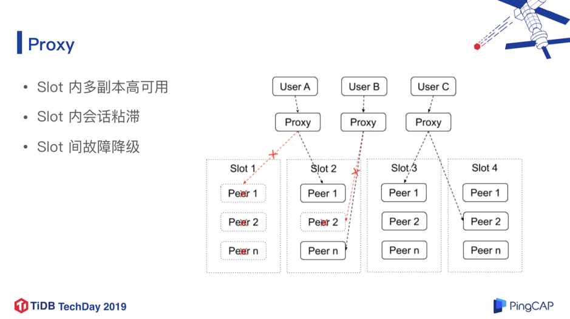

图 9

Proxy 层是无状态的，设计同常见的 Redis 代理相似，从实现角度看也非常简单。首先我们会基于用户纬度将缓冲拆分成若干 Slot，每个 Slot 里有多个 Cache 的副本，这些多副本一方面可以提升我们整个系统的可用性，另外一方面也可以分摊同一批数据的读取压力。**这里面也有一个问题，就是 Cache 的副本一致性的如何保证？我们在这里选择的是「会话一致性」，也就是一个用户在一段时间内从同一个入口进来，就会绑定在这一个 Slot 里面的某个副本上，只要没有发生故障，这个会话会维持在上面。**

如果一个 Slot 内的某个副本发生故障，Proxy 首先挑这个 Slot 内的其他的副本继续提供服务。更极端的情况下，比如这个 Slot 内所有副本都发生故障，Proxy 可以牺牲系统的性能，把请求打到另外一个完全不相干的一个 Slot 上，这个 Slot 上面没有当前请求对应数据的缓存，而且拿到结果后也不会缓存相应的结果。我们付出这样的性能代价获得的收益是系统可用性变得更高，即便 Slot 里的所有的副本同时发生故障，依旧不影响系统的可用性。

### 3.2 Cache

对于缓冲来说，非常重要的一点就是如何提升缓冲利用率。 

第一点是如何用同样的资源缓冲更大量的数据。在由「用户」和「内容类型」和「内容」所组成的空间中，由于「用户」维度和「内容」维度的基数非常高，都在数亿级别，即使记录数在万亿这样的数量级下，数据在整个三维空间内的分布依然非常稀疏。如图 10 左半部分所示。

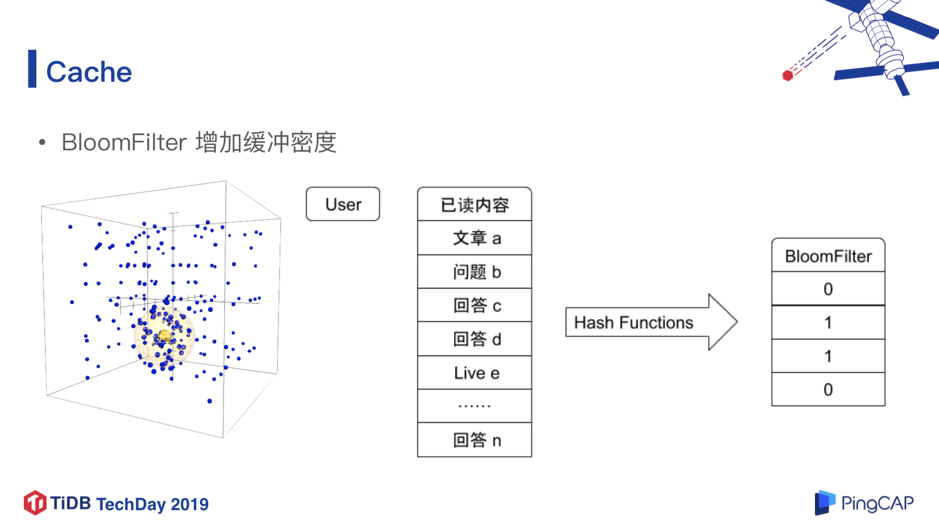

图 10

考虑到目前知乎站上沉淀的内容量级巨大，我们可以容忍 false positive 但依旧为用户召回到足够多可能会感兴趣的内容。基于这样的业务特点，我们将数据库中存储的原始数据转化为更加致密的 BloomFilter 缓冲起来，这极大的降低了内存的消耗在相同的资源状况下可以缓冲更多的数据，提高缓存的命中率。

提升缓存命中率的方式有很多种，除了前面提到的提升缓存数据密度增加可缓冲的数据量级之外，我们还可以通过避免不必要的缓存失效来进一步的提升缓存的效率。

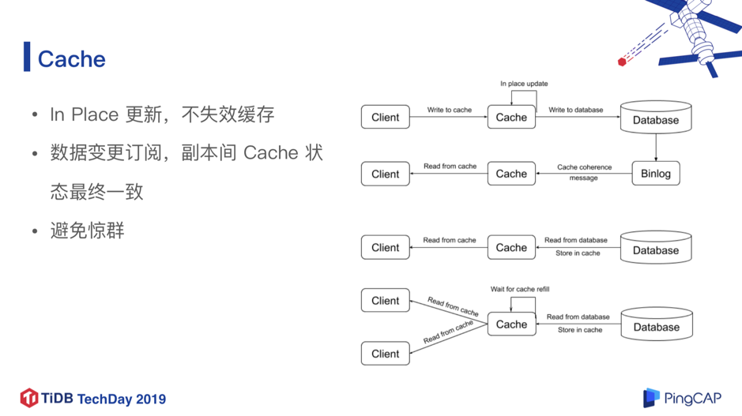

图 11

一方面我们将缓存设计为 write through cache 使用原地更新缓存的方式来避免 invalidate cache 操作，再配合数据变更订阅我们可以在不失效缓冲的情况下确保同一份数据的多个缓冲副本能在很短的时间内达成最终一致。

另一方面得益于 read through 的设计，我们可以将对同一份数据的多个并发查询请求转化成一次 cache miss 加多次缓冲读取（图 11 右半部分），进一步提升缓存的命中率降低穿透到底层数据库系统的压力。

接下来再分享一些不单纯和缓冲利用率相关的事情。众所周知，缓冲特别怕冷，一旦冷了， 大量的请求瞬间穿透回数据库，数据库很大概率都会挂掉。在系统扩容或者迭代的情况下，往往需要加入新的缓冲节点，那么如何把新的缓冲节点热起来呢？如果是类似扩容或者滚动升级这种可以控制速度的情况，我们可以控制开放流量的速度，让新的缓冲节点热起来，但当系统发生故障的时候，我们就希望这个节点非常快速的热起来。 所以在我们这个系统和其他的缓冲系统不大一样的是，当一个新节点启动起来，Cache 是冷的，它会马上从旁边的 Peer 那边 transfer 一份正在活跃的缓存状态过来，这样就可以非常快的速度热起来，以一个热身的状态去提供线上的服务（如图 12）。

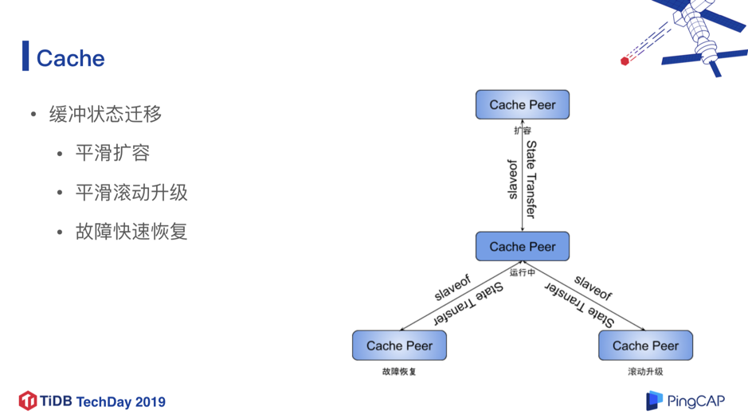

图 12

另外，我们可以设计分层的缓冲，每一层缓冲可以设计不同的策略，分别应对不同层面的问题，如图 13 所示，可以通过 L1 和 L2 分别去解决空间层面的数据热度问题和时间层面的热度问题，通过多层的 Cache 可以逐层的降低穿透到下一层请求的数量，尤其是当我们发生跨数据中心部署时，对带宽和时延要求非常高，如果有分层的设计，就可以在跨数据中心之间再放一层 Cache，减少在穿透到另外一个数据中心的请求数量。

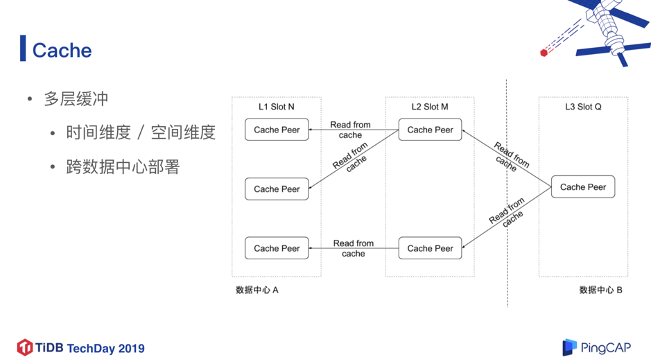

图 13

为了让业务之间不互相影响并且针对不同业务的数据访问特征选择不同的缓冲策略，我们还进一步提供了 Cache 标签隔离的机制来隔离离线写入和多个不同的业务租户的查询。刚刚说的知乎已读服务数据，在后期已经不只是给首页提供服务了，还同时为个性化推送提供服务。个性化推送是一个典型的离线任务，在推送内容前去过滤一下用户是否看过。虽然这两个业务访问的数据是一样的，但是它们的访问特征和热点是完全不一样的，相应的缓冲策略也不一样的。于是我们在做分组隔离机制（如图 14），缓冲节点以标签的方式做隔离，不同的业务使用不同的缓冲节点，不同缓冲节点搭配不同的缓冲策略，达到更高的投入产出比，同时也能隔离各个不同的租户，防止他们之间互相产生影响。

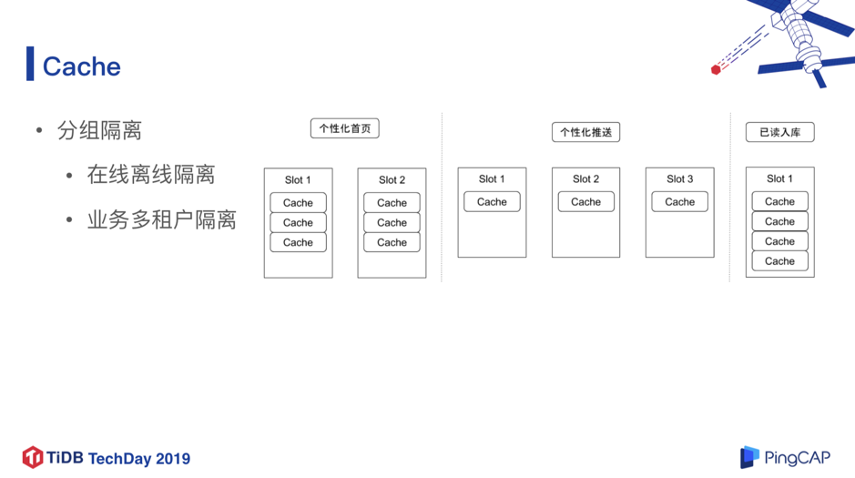

图 14

### 3.3 Storage 

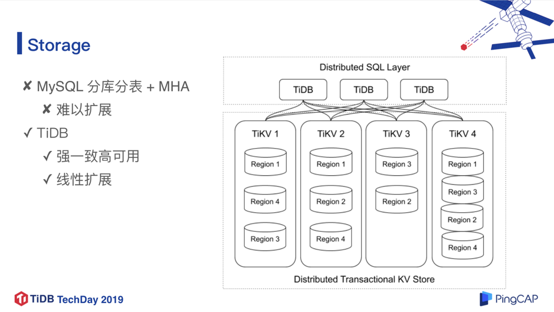

图 15

存储方面，我们最初用的是 MySQL，显然这么大量的数据单机是搞不定的，所以我们使用了分库分表 + MHA 机制来提升系统的性能并保障系统的高可用，在流量不太大的时候还能忍受，但是在当每月新增一千亿数据的情况下，我们心里的不安与日俱增，所以一直在思考怎样让系统可持续发展、可维护，并且开始选择替代方案。这时我们发现 TiDB 兼容了 MySQL，这对我们来说是非常好的一个特点，风险非常小，于是我们开始做迁移工作。迁移完成后，整个系统最弱的“扩展性”短板就被补齐了。

### 3.4 性能指标

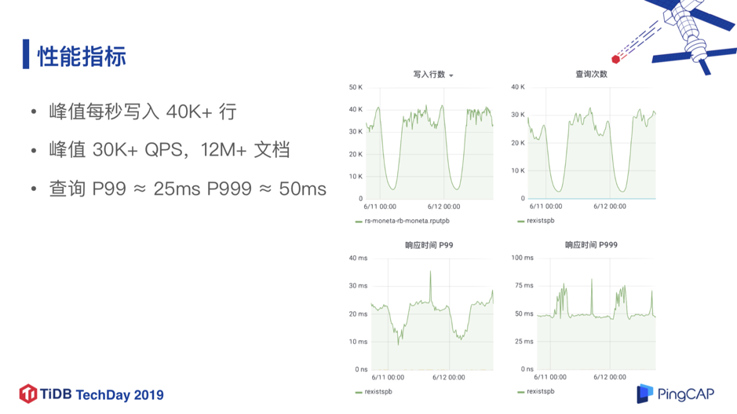

图 16

**现在整个系统都是高可用的，随时可以扩展，而且性能变得更好。图 16 是前两天我取出来的性能指标数据，目前已读服务的流量已达每秒 4 万行记录写入，3 万独立查询和 1200 万个文档判读，在这样的压力下已读服务响应时间的 P99 和 P999 仍然稳定的维持在 25ms 和 50ms，其实平均时间是远低于这个数据的。这个意义在于已读服务对长尾部分非常敏感，响应时间要非常稳定，因为不能牺牲任何一位用户的体验，对一位用户来说来说超时了就是超时了。**

## 四、All about TiDB 

最后分享一下我们从 MySQL 迁移到 TiDB 的过程中遇到的困难、如何去解决的，以及 TiDB 3.0 发布以后我们在这个快速迭代的产品上，收获了什么样的红利。

### 4.1 MySQL to TiDB

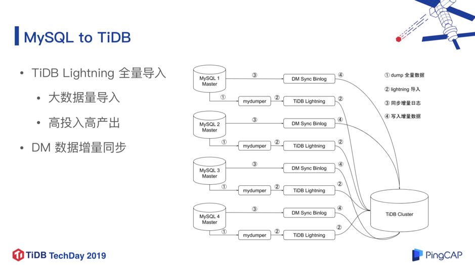)

图 17

现在其实整个 TiDB 的数据迁移的生态工具已经很完善，我们打开 TiDB DM 收集 MySQL 的增量 binlog 先存起来，接着用 TiDB Lightning 快速把历史数据导入到 TiDB 中，当时应该是一万一千亿左右的记录，导入总共用时四天。这个时间还是非常震撼的，因为如果用逻辑写入的方式至少要花一个月。当然四天也不是不可缩短，那时我们的硬件资源不是特别充足，选了一批机器，一批数据导完了再导下一批，如果硬件资源够的话，可以导入更快，也就是所谓“高投入高产出”，如果大家有更多的资源，那么应该可以达到更好的效果。在历史数据全部导入完成之后，就需要开启 TiDB DM 的增量同步机制，自动把刚才存下来的历史增量数据和实时增量数据同步到 TiDB 中，并近实时的维持 TiDB 和 MySQL 数据的一致。

在迁移完成之后，我们就开始小流量的读测试，刚上线的时候其实发现是有问题的，Latency 无法满足要求，刚才介绍了这个业务对 Latency 特别敏感，稍微慢一点就会超时。这时 PingCAP 伙伴们和我们一起不停去调优、适配，解决 Latency 上的问题。图 18 是我们总结的比较关键的经验。

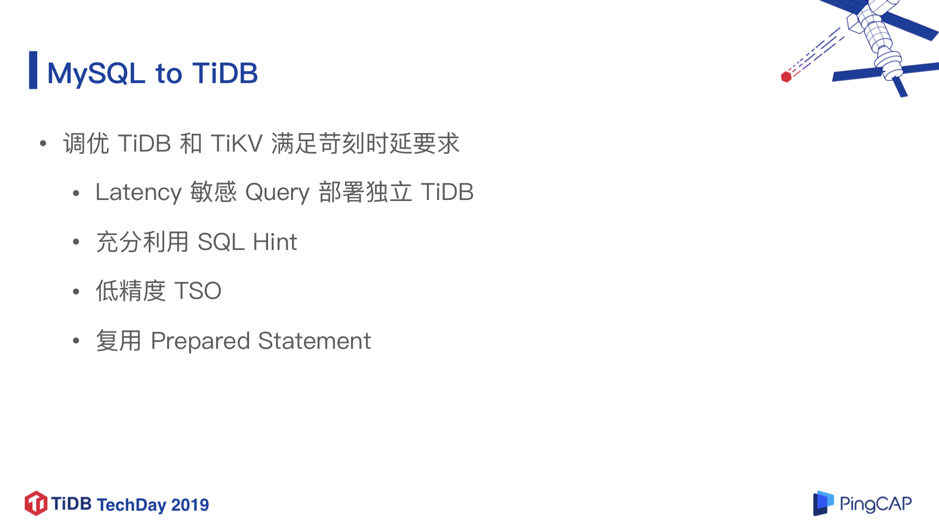

图 18

第一，我们把对 Latency 敏感的部分 Query 布了一个独立的 TiDB 隔离开，防止特别大的查询在同一个 TiDB 上影响那些对 Latency 敏感的的 Query。第二，有些 Query 的执行计划选择不是特别理想，我们也做了一些 SQL Hint，帮助执行引擎选择一个更加合理的执行计划。除此之外，我们还做了一些更微观的优化，比如说使用低精度的 TSO，还有包括复用 Prepared Statement 进一步减少网络上的 roundtrip，最后达到了很好的效果。

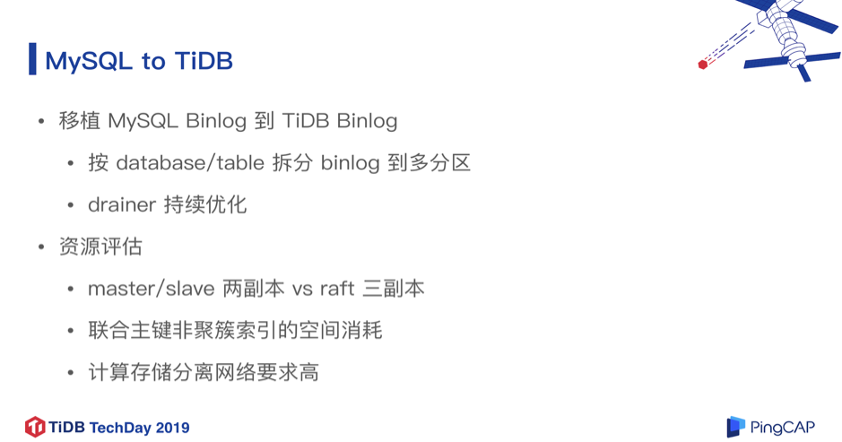

图 19

这个过程中我们还做了一些开发的工作，比如 binlog 之间的适配。因为这套系统是靠 binlog 变更下推来维持缓冲副本之间的一致性，所以 binlog 尤为重要。我们需要把原来 MySQL 的 binlog 改成 TiDB 的 binlog，但是过程中遇到了一些问题，因为 TiDB 作为一个数据库产品，它的 binlog 要维持全局的有序性的排列，然而在我们之前的业务中由于分库分表，我们不关心这个事情，所以我们做了些调整工作，把之前的 binlog 改成可以用 database 或者 table 来拆分的 binlog，减轻了全局有序的负担，binlog 的吞吐也能满足我们要求了。同时，PingCAP 伙伴们也做了很多 Drainer 上的优化，目前 Drainer 应该比一两个月前的状态好很多，不论是吞吐还是 Latency 都能满足我们现在线上的要求。

最后一点经验是关于资源评估，因为这一点可能是我们当时做得不是特别好的地方。最开始我们没有特别仔细地想到底要多少资源才能支撑同样的数据。最初用 MySQL 的时候，为了减少运维负担和成本，我们选择了“1 主 1 从”方式部署 ，而 TiDB 用的 Raft 协议要求至少三个副本，所以资源要做更大的准备，不能指望用同样的资源来支撑同样的业务，一定要提前准备好对应的机器资源。另外，我们的业务模式是一个非常大的联合主键，这个联合主键在 TiDB 上非聚簇索引，又会导致数据更加庞大，也需要对应准备出更多的机器资源。最后，因为 TiDB 是存储与计算分离的架构，所以网络环境一定要准备好。当这些资源准备好，最后的收益是非常明显的。

### 4.2 TiDB 3.0

在知乎内部采用与已读服务相同的技术架构我们还支撑了一套用于反作弊的风控类业务。与已读服务极端的历史数据规模不同，反作弊业务有着更加极端的写入吞吐但只需在线查询最近 48 小时入库的数据（详细对比见图 20）。

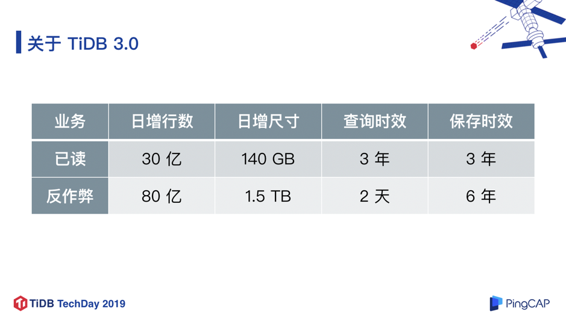

图 20

那么 TiDB 3.0 的发布为我们这两个业务，尤其是为反作弊这个业务，带来什么样的可能呢？

首先我们来看看已读服务。已读服务写读吞吐也不算小，大概 40k+，TiDB 3.0 的 gRPC Batch Message 和多线程 Raft store，能在这件事情上起到很大的帮助。另外，Latency 这块，我刚才提到了，就是我们写了非常多 SQL Hint 保证 Query 选到最优的执行计划，TiDB 3.0 有 Plan Management 之后，我们再遇到执行计划相关的问题就无需调整代码上线，直接利用 Plan Management 进行调整就可以生效了，这是一个非常好用的 feature。

刚才马晓宇老师详细介绍了 TiFlash，在 TiDB DevCon 2019 上第一次听到这个产品的时候就觉得特别震撼，大家可以想象一下，一万多亿条的数据能挖掘出多少价值， 但是在以往这种高吞吐的写入和庞大的全量数据规模用传统的 ETL 方式是难以在可行的成本下将数据每日同步到 Hadoop 上进行分析的。而当我们有 TiFlash，一切就变得有可能了。

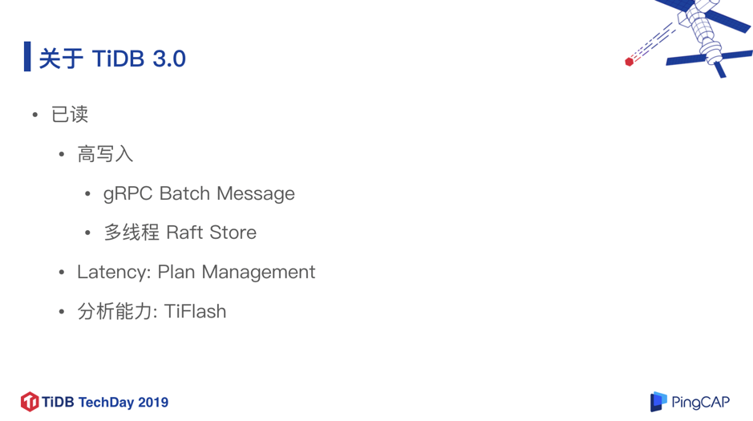

图 21

再来看看反作弊业务，它的写入更极端，这时 TiDB 3.0 的 Batch message 和多线程 Raft Store 两个特性可以让我们在更低的硬件配置情况下，达到之前同样的效果。**另外反作弊业务写的记录偏大，TiDB 3.0 中包含的新的存储引擎 Titan，就是来解决这个问题的，我们从 TiDB 3.0.0- rc1 开始就在反作弊业务上将 TiDB 3.0 引入到了生产环境，并在 rc2 发布不久之后开启了 Titan 存储引擎，下图右半部分可以看到 Titan 开启前后的写入/查询 Latency 对比，当时我们看到这个图的时候都非常非常震撼，这是一个质的变化。**

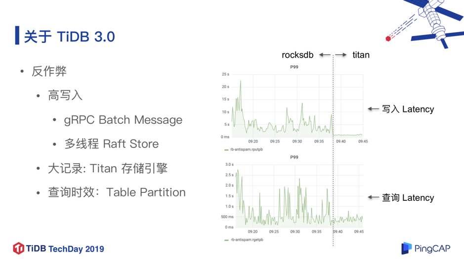

图 22

另外，我们也使用了 TiDB 3.0 中 Table Partition 这个特性。通过在时间维度拆分  Table Partition，可以控制查询落到最近的 Partition 上，这对查询的时效提升非常明显。

## 五、总结

最后简单总结一下我们开发这套系统以及在迁移到 TiDB 过程中的收获和思考。

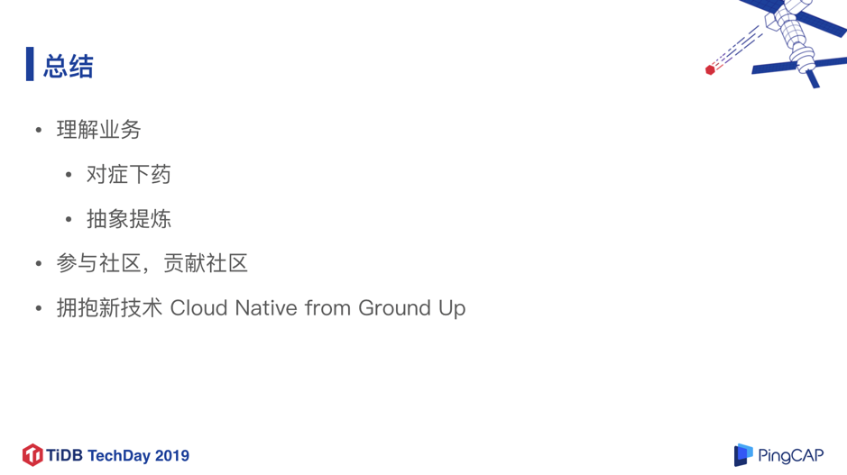

图 23

首先开发任何系统前一定先要理解这个业务特点，对应设计更好的可持续支撑的方案，同时希望这个架构具有普适性，就像已读服务的架构，除了支撑知乎首页，还可以同时支持反作弊的业务。

另外，我们大量应用了开源软件，不仅一直使用，还会参与一定程度的开发，在这个过程中我们也学到了很多东西。所以我们应该不仅以用户的身份参与社区，甚至还可以为社区做更多贡献，一起把 TiDB 做的更好、更强。

**最后一点，我们业务系统的设计可能看上去有点过于复杂，但站在今天 Cloud Native 的时代角度，即便是业务系统，我们也希望它能像 Cloud Native 产品一样，原生的支持高可用、高性能、易扩展，我们做业务系统也要以开放的心态去拥抱新技术，Cloud Native from Ground Up。**

