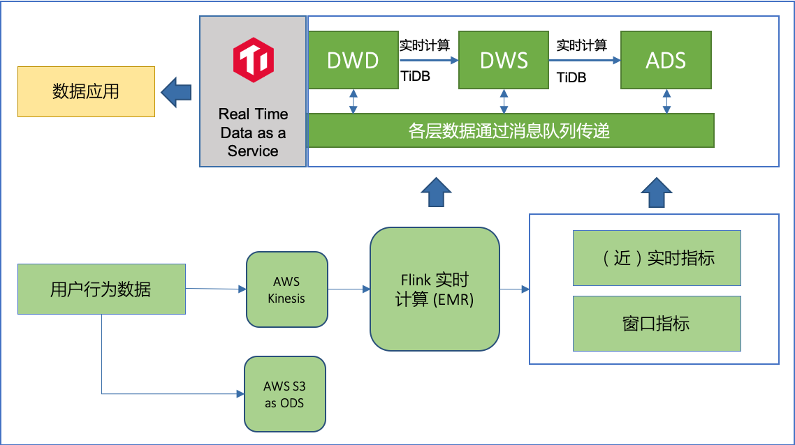

数字化转型的推进使得越来越多企业正面临前所未有的数据规模，随着商业竞争的日趋加剧，无论是外部的用户还是公司内部的决策已经无法依赖时效性不佳的离线数据分析，需要更实时的数据分析，甚至是对正在发生的交易数据进行分析，以支撑更加敏捷的商业决策。

## 成为主流趋势的 HTAP

由 Gartner 提出的 HTAP 数据库（混合事务 / 分析处理，Hybrid Transactional/Analytical Processing）成为希望。基于创新的计算存储框架，HTAP 数据库能够在一份数据上同时支撑OLTP 和 OLAP 场景，避免在传统架构中，在线与离线数据库之间大量的数据交互。

**HTAP 数据库基于分布式架构，支持弹性扩容，可按需扩展吞吐或存储，轻松应对高并发、海量数据场景。** 当下，由 HTAP 数据库提供的快速分析能力已经成为企业的核心竞争力之一。

## 业务挑战

智慧芽（PatSnap）是一家科技创新情报 SaaS（软件即服务）服务商，聚焦科技创新情报和知识产权信息化服务两大板块，为全球 50 多个国家超 10000 家科技公司、高校、科研与金融机构提供大数据情报服务。在数据源方面，智慧芽已存储了 1.5 亿多个全球专利数据、1.7 亿多个化学结构数据，以及千万级财务新闻、科技文献、市场报告、投资信息等海量数据。

随着业务场景的不断拓展和用户规模的迅速增长，业务运营过程中，智慧芽深度依赖对实时数据的分析和结果呈现，需要进行用户行为分析，提供实时大盘和特定场景的运营数据，对流量和服务的分析也不可或缺。

智慧芽原先采用 Segment 与 Redshift 的数据分析架构，仅构建出了ODS 层，数据写入的规则和 schema 不受控制，且需要针对 ODS 编写复杂的 ETL 来按照业务需求进行各类指标的计算来完成上层业务的数据请求。Redshift 中落库数据量大，计算慢（T+1时效），影响对外服务的效率。

## TiDB + Flink 实时数仓方案

经过多轮选型和对比测试，智慧芽选用 TiDB + Flink 实时数仓方案拓展数据分析架构体系的能力版图。

**TiDB HTAP 是一个可扩展的行存和列存整合的架构，在存储上是可以使用分离的不同的节点，可以确保 OLTP 和 OLAP 两边互相之间没有干扰，实时性、一致性、可延展性都能得到很好的保证。** Flink 是一个低延迟、高吞吐、流批统一的大数据计算引擎，被普遍用于高实时性场景下的实时计算，具有支持 exactly-once 等重要特性。

结合了 TiDB HTAP 与 Flink 两者的特性，Flink + TiDB 的方案优势显而易见：首先是速度有保障，两者都可以通过水平扩展节点来增加算力；其次，TiDB 深度兼容 MySQL 协议，Flink 提供 Flink SQL 和强大的连接器来编写和提交任务，学习和配置成本相对较低。

智慧芽实时数据分析平台架构示意图

替换为基于 Kinesis + Flink + TiDB 构建的实时数仓架构后，不再需要构建 ODS 层。Flink 作为前置计算单元，直接从业务出发构建出 Flink Job ETL，完全控制了落库规则并自定义schema，即仅把业务关注的指标进行清洗并写入 TiDB 来进行后续的分析查询，写入数据量大幅减少。

按用户/租户、地区、业务动作等关注的指标，结合分钟、小时、天等不同粒度的时间窗口等，在 TiDB 上构建出 DWD/DWS/ADS 层，直接服务业务上的统计、清单等需求，上层应用可直接使用构建好的数据，且获得了秒级的实时能力。

这套实时数据分析平台架构实现了真正意义的 Real Time Data as a Service，目前应用于慧芽用户行为分析和追踪、租户行为分析等实时分析场景，并为业务运营大盘提供实时数据支撑。

## 应用价值

在使用了新架构后，入库数据量、入库规则和计算复杂度都大大下降，数据在 Flink Job 中已经按照业务需求处理完成并写入 TiDB，无需基于 Redshift 的 全量 ODS 层进行 T+1 ETL。

基于 TiDB 构建的实时数仓，通过合理的数据分层，架构上获得了极大的精简，开发维护也变得更加简单，在数据查询、更新、写入性能上都获得大幅度提升。

在满足不同的 adhoc 分析需求时，不再需要等待类似 Redshift 预编译的过程，易于开发且扩容方便。
