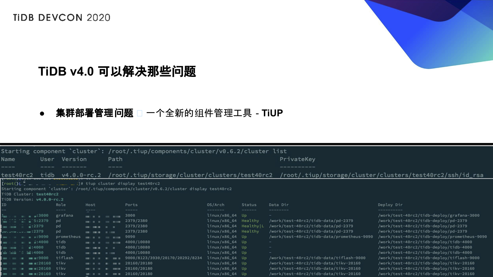
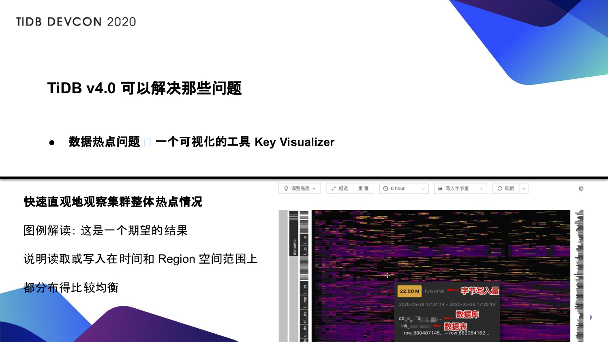
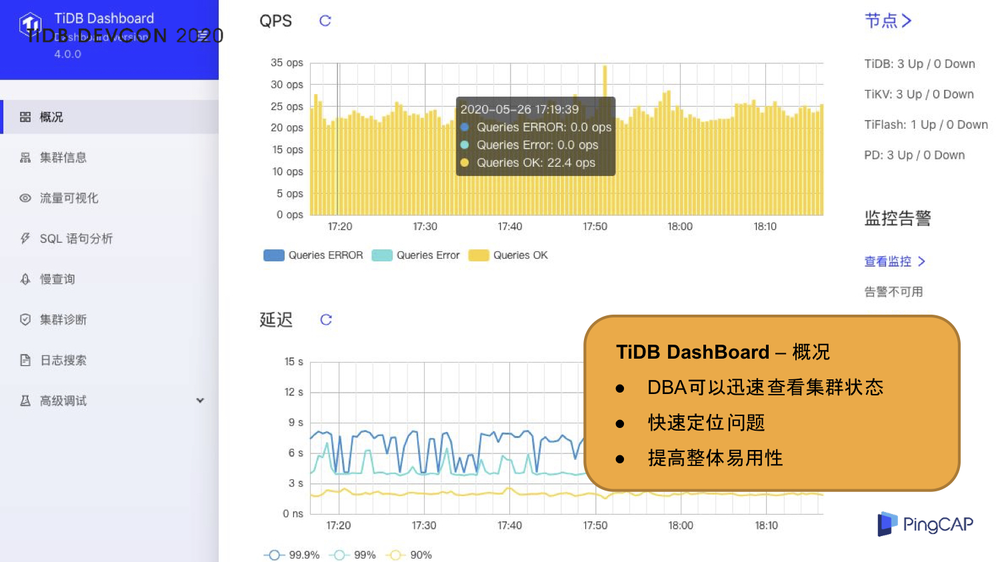
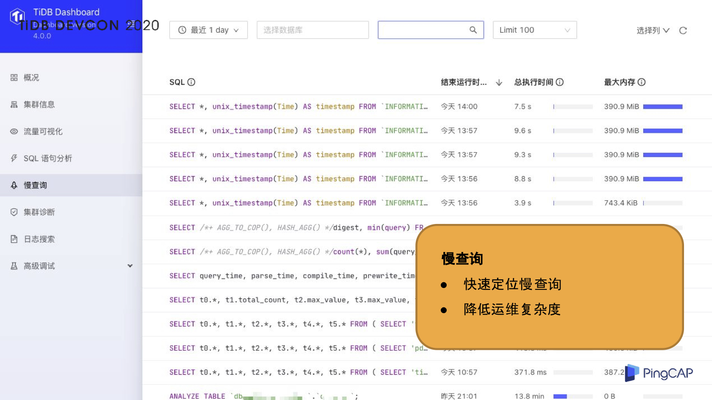
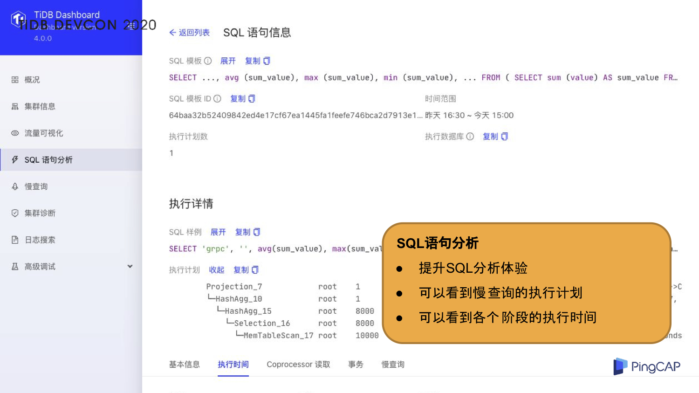
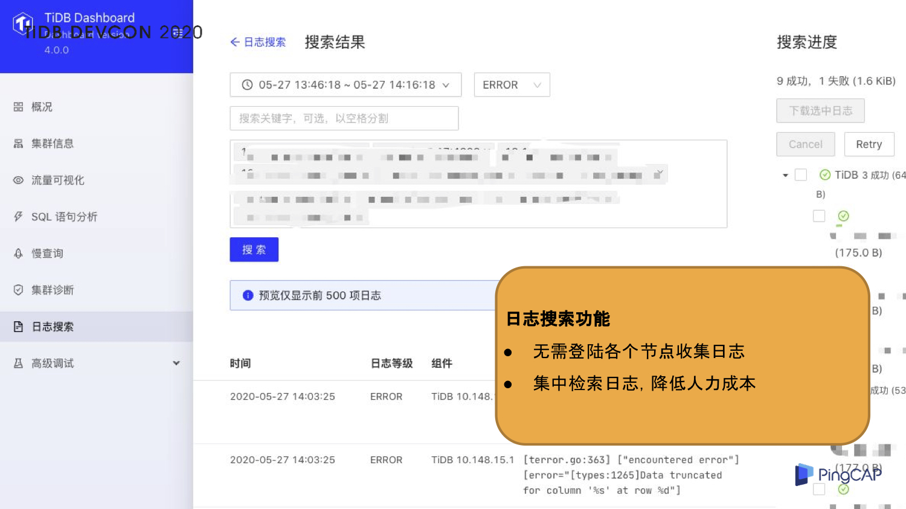
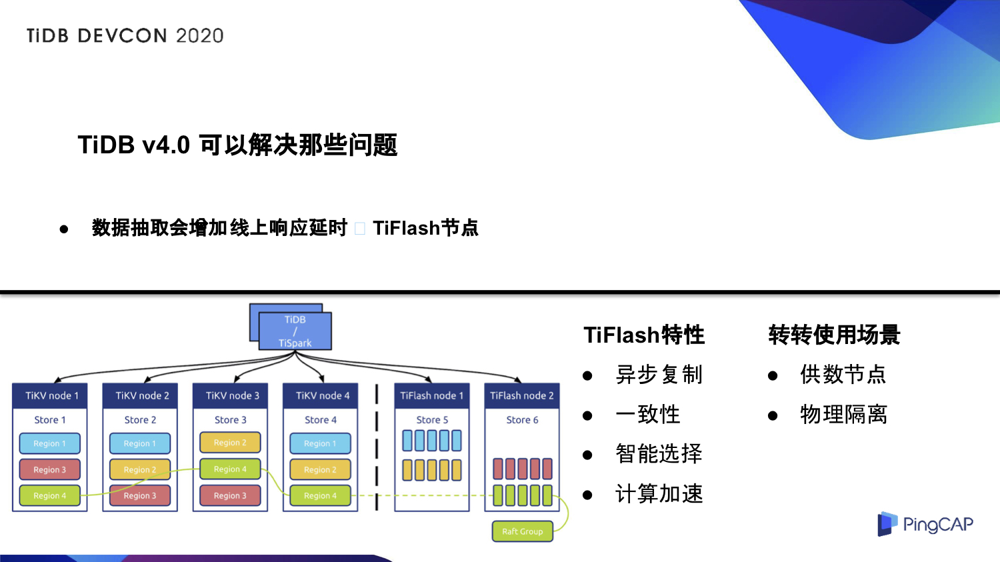
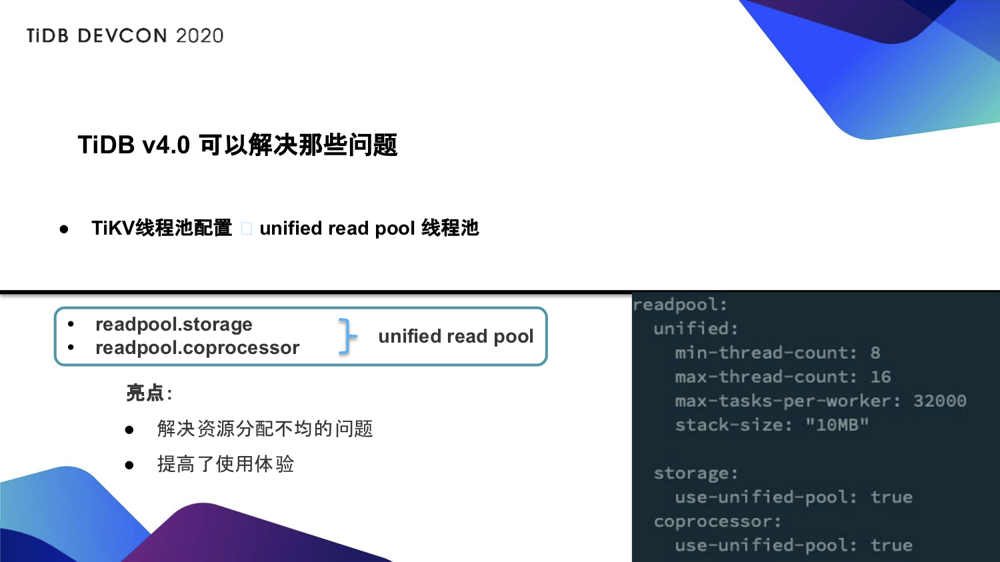

>作者介绍：冀浩东，转转公司数据库负责人，负责转转公司整体的数据库运营。

## 初引入 TiDB 解决了哪些问题？

转转使用 TiDB 主要解决了两个问题，一个是分库分表问题，另一个是运维复杂度。

分库分表是一个非常普遍的问题，会增加我们业务逻辑的复杂性，并且多维度的 mapping 可能导致我们整体性能的下降。有了 TiDB 我们可以不用再考虑分库分表，不再需要写那么多的复杂逻辑。

对于运维复杂度来说，TiDB 可以做到快速的水平扩展，无需 DBA 进行复杂的数据搬迁，也无需业务进行流量迁移，并且大表的 Online DDL，基本上对于业务感知力度不大。

## 产生的新问题

引入 TiDB 后，随之也带来了一些新的问题。

- **部署慢、管理难**。TiDB Ansible 在管理多个 TiDB 集群的时候，会有各种各样不同的异常，这会极大的增加我们的运维复杂度。

- **热点无法快速定位**。对于电商场景，数据热点是一个比较常见的问题。因为 TiDB 节点众多，无法快速定位热点 KEY，需要查询各个节点的日志， 逐步排查， 排查成本较高。

- **无法快速查看集群状态**。监控项太多，并且日志都比较分散，某一时间我们要确认集群状态，只能是一步一步来，慢慢的分析，无法迅速对集群异常进行定位。

- **数据抽取会增加线上响应延时**。这是一个非常常见的问题，因为数据抽取也影响我们 TiKV 的性能。

- **超大集群无法做到有效的备份**。对于超大集群的快速的备份和恢复，其实是一个亟待解决的问题。之前，我们在数据量规模非常大的情况下才会用到 TiDB，这个时候备份其实是非常迫切的。之前我们一直是逻辑备份，但是逻辑备份对于我们来讲有效性并不高。

- **TiKV 线程池的配置复杂及对业务的影响**。部署 TiKV 时会配置线程数量，需要配置 3 个优先级；对于不同业务的场景需要配置 readpool.storage / readpool.coprocessor 两个 readpool 线程池；。随着我们业务的发展与迭代，我们的 SQL 也都不一样，所以在使用 readpool 的时候，方式也不一样，并且如果调整线程配置，会不同程度的影响业务访问。

## TiDB 4.0 解决了哪些问题？

那我们接下来看一下 TiDB 4.0 版本可以解决哪些问题。

### 集群部署管理问题——TiUP

之前在使用 TiDB Ansible 管理的时候，其实是比较困难的，并且 TiDB Ansible 自身也存在一些问题。**TiDB 4.0 开发了一个全新的组件管理工具——TiUP，这个工具目前在体验上是非常好的，我们在一分钟内就可以部署完成 3 个 TiDB，3 个 PD， 3 个 TiKV 和 1 个 TiFlash，这个效果是非常惊艳的，而且 TiUP 也有大量的参数可以查看我们集群的状态**。我们要特别提醒一点，TiFlash 的端口管理非常复杂，有特别多的端口，大家在使用的时候一定要做好 TiFlash 端口管理。

### 数据热点问题——Key Visualizer

在早期，热点问题我们只能通过各种日志去排查，然后慢慢的分析，再找到它。**现在有一个新的可视化工具叫 Key Visualizer，它可以快速直观的观察我们整个集群的热点情况**。如上图所示，我们将线上集群，通过数据和流量的复制过来以后，把新的流量导过来。我们可以看到任意时间点集群的写入情况，例如我们可以看到当前情况下，字节写入量，哪个库，哪张表，以及它的 rowkey。在右图，通过集群的明亮程度这个判断指标，就可以看到我们整体 KEY 的一个繁忙程度，这张图整体来讲，这是一个比较符合预期的状态，写入整体比较均匀。如果是热点的话，可能会出现一条线，可以明显的看到我们的热点 KEY，有了一个工具，我们可以快速的找到热点 KEY。

### 快速查看集群状态问题——TiDB DashBoard

针对集群状态无法快速定位的问题，TiDB 4.0 有一个新的组件叫 TiDB DashBoard。**通过 TiDB DashBoard 以及 TiDB 的集群的诊断报告，我们可以快速拿到集群的基本信息、负载信息、组件信息、配置信息以及错误信息，这些信息其实已经非常的丰富了，对于我们来讲是非常有效的，可以稳准狠的找到我们的集群的异常。**

TiDB DashBoard 是 TiDB 4.0 特别有亮点的一个功能，它可以实时的获取到我们集群的信息。上图是 DashBoard 概况页面，里面包含了 QPS、响应延迟、节点的状态，以及告警相关的一些内容。通过概况， DBA 可以迅速的查到集群的状态，快速定位问题，提高了应用性，可以说 TiDB 4.0 整体的应用性已经非常高了。

慢查询可以说是里程碑的一个功能。之前一直在吐槽 TiDB 慢查询的问题，我们从 1.0 吐槽到 4.0，但是 4.0 有了 DashBoard 后，可以指定数据库，查看不同的慢查询，也可以快速的定位我们的慢查询。我们不再需要自己 ETL，也不需要自己再上机器，就可以快速的定位到慢查询，而且包含排序、执行时间等信息，这是对于即将要使用 TiDB 的公司来讲，一个非常利好的消息。

我们可以通过慢查询找到我们的慢查询的列表，有了列表之后，我们就可以知道具体的 SQL 语句。SQL 语句信息包含 SQL 语句的模板、指纹 ID、样例、执行计划，以及事物相关的一些指标，这个指标对我们来讲是非常难得的。在我们自己做 ETL 的时候，其实很多指标和信息是拿不到的，但是现在通过 SQL 语句分析，我们可以看到慢查询的各个执行阶段，也可以看到各个阶段的执行时间，提高了我们整体 SQL 分析的体验。

现在还添加了日志搜索功能。在早期我们做 ETL 的时候，需要检索各种各样的日志，然后再去分析，现在有了这个日志搜索这个功能，我们不再需要登陆机器了，也不再需要去做对应的系统来分析日志，这会极大的降低我们的人力成本和开发成本。有了这个工具以后，我们可以指定时间段，指定日志等级，还可以指定它的节点，通过节点可以检索到我们最新的一些日志，这个对我们来讲是非常友好的。

### 数据抽取增加线上响应延时问题——TiFlash 节点

现在我们启用了 TiFlash 节点来解决数据抽取会增加线上响应延时的问题。**TiFlash 的特性包括异步复制、一致性、智能选择和计算加速**，具体原理就不讲了，我们主要讲一下在转转的使用场景。在转转主要的使用场景是供数节点和物理隔离，相当于在新的机器上加了一个 TiKV 的节点，我们做了一个分离，不同的请求走不同的后端数据节点，这样在进行数据抽取的时候，它不会影响到整体的线上性能。并且这是智能选择的，可以根据我们业务、SQL 的复杂度，自己去判断该走 TiKV 还是走 TiFlash，线上的就走 TiKV，线下的就走 TiFlash，这个是强制的。

### 超大集群无法做到有效备份——Backup & Restore

分布式备份恢复工具 Backup & Restore 解决了超大集群无法做到有效备份的问题。**通过我们做的测试，在万兆网卡的环境下，300GB 的数据，限速 120MB/s 的情况下，备份到网络文件系统，耗时不到 10 分钟。在同样限速 120MB/s 的条件下，通过网络文件系统进行数据恢复，我们测试的结果是耗时约 12 分钟，可以说是极大的降低了我们备份恢复的时间**。并且还有一个关键因素，就是备份的速度完全取决于我们 TiKV 的多少，TiKV 越多，我们的备份速度越快，恢复的速度也越快。

### TiKV 线程池的配置问题——unified read pool

TiDB 4.0 的一个新的优化功能就是 unified  read pool 的线程池。在 4.0 之前，我们的 readpool storage 和 coprocessor 是需要自己配置的，调整的时候也是自己动态去调整，而且每次调整可能会影响到业务，这个是比较痛的一个点。**unified  read pool 将 storage 和 coprocessor 这两个进行了一个合并，合并到一个线程池里面**。我们使用 storage 还是 coprocessor 是由我们的 SQL 自己来判断，如果说我们需要用 storage，那我们就用 storage，需要 coprocessor，我们就用 coprocessor。**这不仅提高了我们的使用体验，也解决了我们资源分配不均匀的问题**。上图展示了我们如何开启 unified  read pool 的线程池的配置。

## 未来规划

TiDB 4.0 版本发布了很多实用性的功能，例如 TiDB Dashboard、TiFlash、unified 线程池等，提高了 TiDB 整体的易用性，转转未来将全面计划升级到 v4.0， 一定程度的释放人力资源，降低我们的运维复杂度。

>本文整理自冀浩东在 TiDB DevCon 2020 上的演讲，大会相关视频可以关注官方 Bilibli 账号主页（ID：TiDB_Robot）。
