## **浙商银行的数字化转型之路**

浙商银行是一家比较年轻的公司，是**十二家全国性股份制商业银行之一**。浙商银行成立于 2004 年，所以也是 00 后银行。2020 年，浙商银行在英国**《银行家》**杂志全球银行 1000 强榜单中排名**第 97 位**，目前已经在香港和上海两地上市。

 

浙商银行很早就开始全面推进数字化转型，2010 年浙商银行上线电子银行服务、手机银行业务，2017 年上线首个区块链服务平台，同年发布了直销银行品牌。2018 年浙商银行国标 A 级数据中心启用，并在 2020 年成立易企银金融科技子公司。

 

浙商银行在数字化转型过程中**强调三方面重点**：第一是**树立数字化的思维与理念**。在近期发布的浙商银行“四五”规划中，强调数字化能力建设为在竞争力之一，进一步确立金融科技的引领作用，指出坚持金融科技创新驱动发展，全方位赋能平台化服务战略下业务模式和经营管理的创新转型。

 

第二是**强化数据的积累和应用**。在数据方面，浙商银行目前已经积累了很多数据，一方面是促进内外部数据整合，不断积累和整合内外部数据，与政府、金融科技公司等外部机构合作，**引入工商、司法、海关等外部数据**，积极与**省大数据局，省综合金融服务平台**等对接。经过几年的建设浙商银行**已经累积 PB 级的数据，超万张数据表**。第二方面是**持续深化数据应用**，浙商银行建立了一套**覆盖全客户，涵盖全过程**的风控预警及决策模型，实现了**风险侦测、识别、处理、记录和共享**的全方位、立体式监测，满足**对公、零售、同业**等差异化、智能化的风险识别和管控。

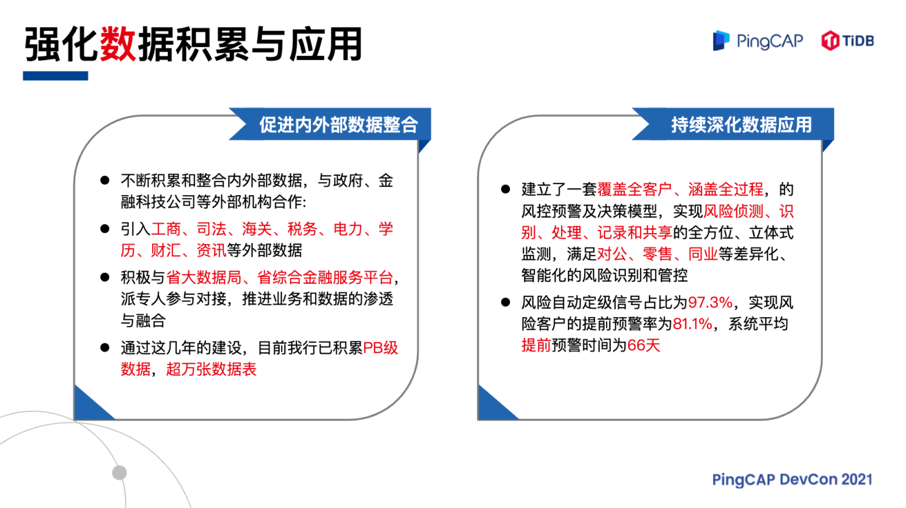

浙商银行的大数据风控平台融合了**大数据、知识图谱、云计算**等金融科技，实现**客户准入、关联关系、贷后管理、预警管理、财务分析、移动应用、客户画像**等功能，建立全流程风控防控和预警体系，打造全新授信风险管控平台。图中是大数据分控平台的主要架构，这个平台打通了**贷前授信审批和贷后管理**，实现了**预警信号全生命周期管理**。

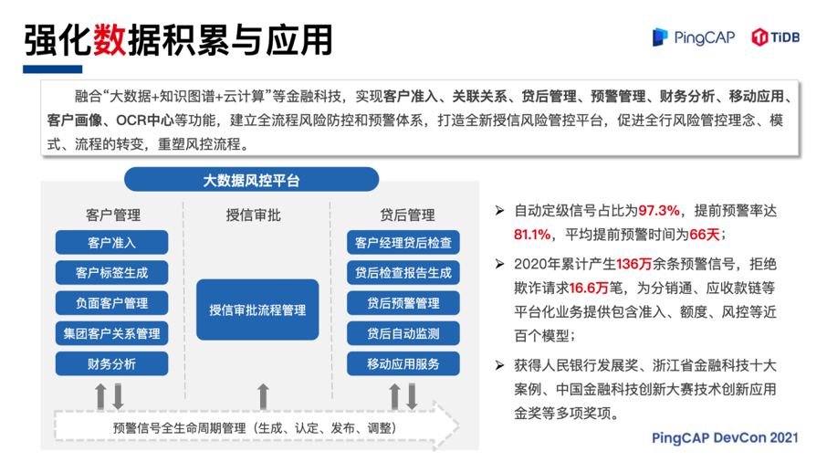

第三是**强化技术创新应用**。下图中是浙商银行的一款创新产品——**应收款链平台**。一般企业都有供应链，供应链里面有一些比较核心的客户，核心客户在供应链上下游结算中应收、应付账款较多。一方面，大量应收账款占压资金严重，导致核心客户流动性压力较大，亟需盘活应收账款，降低负债；另一方面，核心客户对上游供应商的应付账款较多，影响上游中小微客户资金周转。所以，浙商银行**推出了创新性的应收款链平台**，运用了区块链技术**去中心化、不可篡改的特性**，将客户间的应收帐款转化为在线流转、偿付、转让且高效安全的数字凭证。客户进入这个平台就可以办理应收账款的**签发、承兑、保兑、偿付、转让**等各种业务，**有效盘活**客户的应收账款，**降低**产业链的**整体财务成本**。

浙商银行以应收款链服务平台为基础，在创新系列场景应用业务模式之上，结合行业特点和客户区域痛点形成不同行业的综合金融服务方案，目前已在 20 多个行业内得到应用。

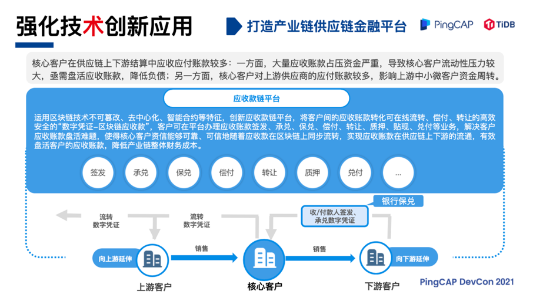

## **TiDB** **在浙商银行的应用**

浙商银行在整体上构建了一个**开放化、易扩展的 IT 架构**。基础设施基本上云，**除了 IaaS，还有私有云、托管云和专有云**。技术架构层由**企业级 SOA、自研的分布式微服务、分布式数据库、分布式大数据平台、区块链平台以及物联网平台**构成，用来支撑浙商银行的各类平台化业务、传统应用和互联网应用等，实现产品服务标准化、模块化和智能化。

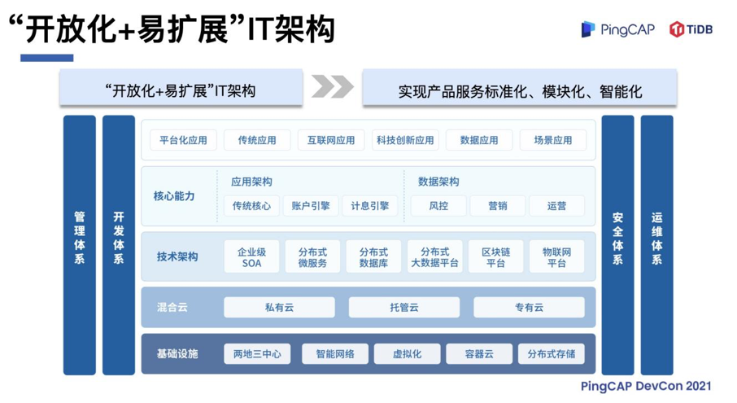

第一个 TiDB 的应用场景是**反电信欺诈业务**，这个系统的特点是需要保存所有客户的交易数据，目前有几十亿条，银行需要把客户的风险和交易数据反馈给公安机关。传统做法就是经由大数据平台跑批生成结果数据返回给公安部门，一条请求过来，我们需要在海量数据里面捞出想要的数据。传统大数据平台的问题是不能支持高并发索引条件查询，一个 SQL 查询请求到大数据平台跑批，大概几十秒才能返回。所以在这种情况下，这笔业务不能做到实时。大家应该知道，同步或是异步对业务逻辑的侵入程度差别是很大的，尤其这种场景下，最核心的逻辑就是一个**查询**，但是开发人员需要在中间做异步、文件发送等，整个数据链很长，业务逻辑的实现比较复杂。

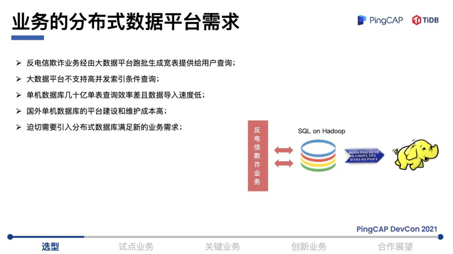

因此，我们在寻找一款理想的数据库能够提供快速查询。如果用国外单机数据库平台建设，成本比较高。浙商银行在数据库的选型上主要有几方面的考虑：数据库集群规模和单表容量**无限制**，大数据量规模下性能比较优异，**兼顾**交易和实时分析场景，具备金融同业的应用案例，同时拥有活跃的**开源生态、丰富的工具及文档**。基于此，浙商银行在当时就选择了 **TiDB 分布式数据库**来落地第一个业务场景。

 

上线之后，TiDB 每天大概同步百万级别行数的数据，像反电信欺诈业务的查询，从原来几十秒的返回时间缩短到了**毫秒级**，速度非常快。我们把 TiDB 当成普通的数据库，查询可以直接返回结果，业务逻辑开发变得非常简单。在这个场景下，我们也验证了TiDB 在**两地三中心**的部署和**多活的高可用能力**。

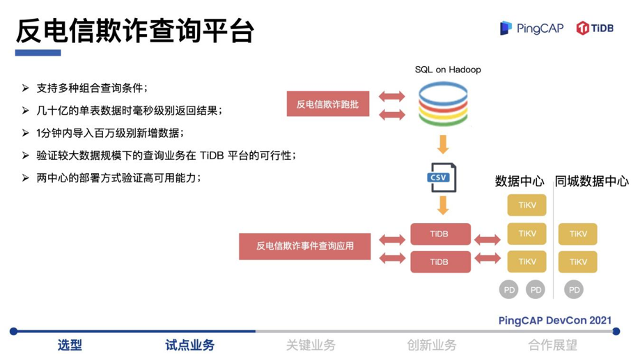

第二个场景是**外汇交易管理平台**，跟上面的场景类似，系统的数据量达到了**亿级**，大概有三亿多条。以前使用的是 **Oracle** 数据库，这种级别的数据量需要用分区表来实现。做运维的人肯定都知道，分区表维护起来非常麻烦。迁移到 TiDB 之后，直观感受到**查询和跑批性能的提升**，不用分区表了，只要建索引直接查就行，非常简单，一套系统就能完成。在这个场景，我们验证了渠道类业务的交易和跑批在 TiDB 平台的可行性。

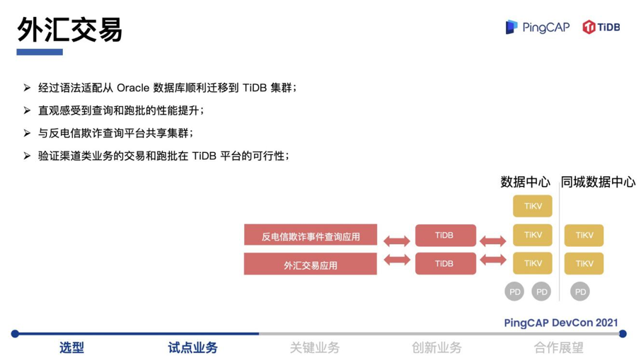

TiDB 是一款很好用的数据库产品，而且还有列存，我们开始基于 TiDB 构建了**分布式 ODS 场景**。以 TiDB 为中心，通过各种数据同步工具，把上游各种 OLTP 系统的业务数据全部同步到 TiDB。业务数据库的种类比较多，有 **DB2、Oracle、MySQL** 等，TiDB 与这些数据库都能连接，其分布式架构满足各类上游异构交易数据库的持续接入，没有容量限制。在这个场景里面，我们应用了 **TiCDC**，把某些表的增量的变化，通过变更数据的捕获框架，接到 **Flink 流计算平台**。基于流平台可以做一些异步的实时的流式计算，应用到管理驾驶舱系统，可以实时统计行业交易、全行各项经营的指标情况等。另外，我们把这些计算结果**同步到移动端**，为手机端用户提供实时报表查看，陆续上线了**在线积分、公益游戏**等应用，逐步替换现有的集中式 ODS 平台。

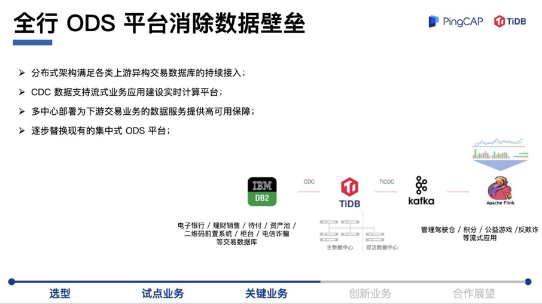

接下来谈谈 TiDB 在**区块链**场景的应用，区块链是浙商银行的拳头产品。区块链存储的特点是一个节点存储了全网的数据，每一个节点数据都是相同的，靠**分布式共识算法**自行同步。因为存储了全网数据，随着数据量的增大，对存储的考验也越来越大。区块链系统传统使用的数据库是 LevelDB，这是一个单机 Key-Value 型数据库，容量有上限。随着交易量的上升，我们测试过当区块链的数据达到一个量级的时候，LevelDB 性能下降很明显。后来我们发现 **TiKV**也是 **Key-Value 型数据库**，在接口上可以匹配得很好。

 

在这个场景中，我们并没有用到完整的 TiDB，而是使用了 **PD 和 TiKV**，把区块链业务的存储迁到 TiKV 上。我们的区块链平台设计了存储接口，以**插件化的形式适配多种存储**，在适配过程中 TiDB 的专业服务支持人员给了我们很多帮助。存储切换到 TiKV 之后，效果非常明显，有效提升了区块链的吞吐能力。

 

总体来说 TiKV 帮助区块链**解决两个问题**：一个是**性能**的问题，一个是**容量**的问题。当交易量、存储量达到一定程度的时候，LevelDB会进行资源回收，首先读写的吞吐量下降，其次在执行回收的时候，性能曲线会发生抖动。TiKV 上线之后进行测试发现效果不错，把压力打上去达到一个很大的量级，TiKV 性能是比较平稳的，根据目前的测试量级，没有看到性能下降的趋势。按照 TiKV 的架构设计，它的承载能力理论上是无限的。

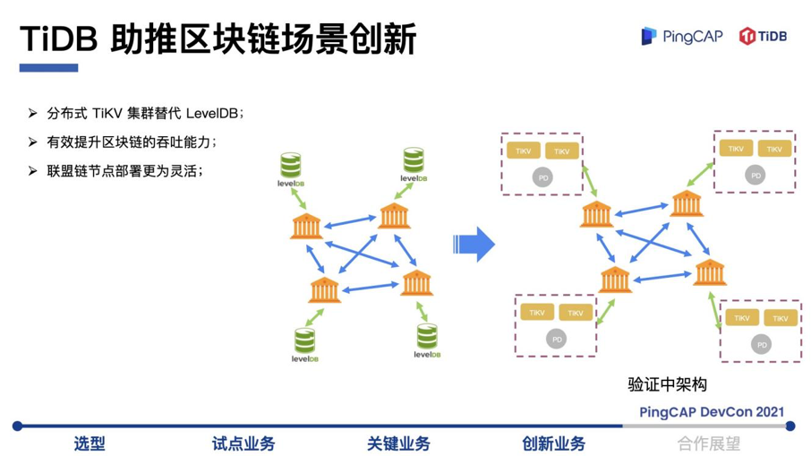

接下来分享一下浙商银行分布式数据中台即新数据中心建设的一些思考，下图是目前整个分布式数据中台的技术方案。**TiDB 应用于分布式 ODS 场景**，全行各类交易库的数据同步到 TiDB，后面有两条路，一条是 **TiCDC**，一条是 **TiSpark**。TiCDC 接到分布式流处理平台，TiSpark 接到分布式批处理平台，后面与大数据平台相连， 利用 TiSpark 接 Spark，数据同步到 **HDFS** 做大数据处理，把流和批的加工结果存到一个统一的终端存储（OLAP 库）。通过数据中台的数据服务层对外屏蔽存储的差异，如果是**近实时的数据分析**的交易会直接把流量打到 **TiFlash** 上，如果是需要**加工后的数据**就访问 **OLAP 库**。

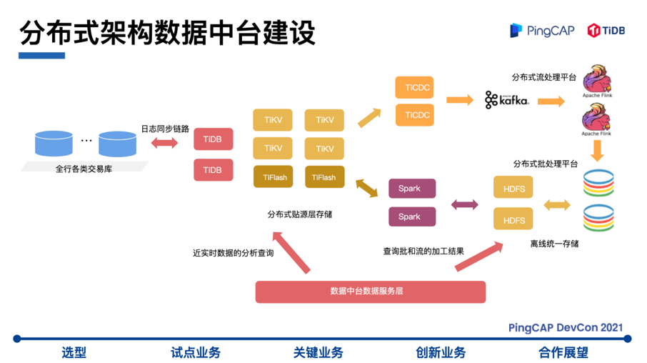

## **深入合作，助推金融场景创新**

最后回顾一下浙商银行与 TiDB 合作的历程，从分布式关系型数据库开始尝试 TiDB，逐步扩展到数据贴源存储和 ODS 的监测，**消除数据孤岛，推进数据共享**。接着浙商银行将 TiDB 应用到全行的数据中台，用实时的数据驱动业务。**我们希望 TiDB 为数据服务打好坚实的基础，把业务服务和数据紧密结合形成一个闭环，最终落地到浙商银行的金融创新场景，如关键交易业务、区块链等。**

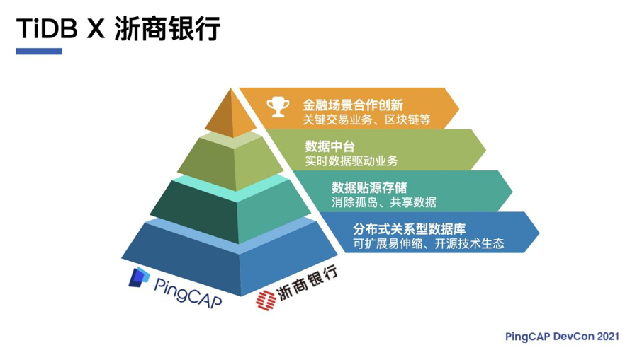

