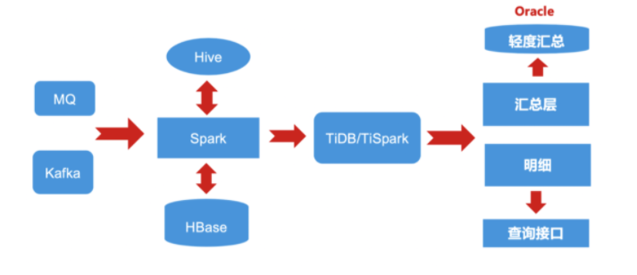

**「我们已经用起来了」**，是我们最喜欢听到的话，简简单单几个字的背后代表着沉甸甸的信任和托付。从今天开始，我们将通过**「相信开放的力量」** 系列深度案例分享，从业务的角度，看看一个数据库为各行业用户带来的业务价值。 **本篇文章将介绍 TiDB 联手中通科技打造全场景全链路数字化平台服务的故事。**

>洞悉包裹的每一段旅程
>
>不负身边的每一份守候

下单秒杀，到收货开箱，相信大多数人对于“双十一”这个特殊时期的快递物流体验相当熟悉。从下单后的『望眼欲穿』到包裹的『全流程追踪』，最近几年，快递再不是以前“肩扛手提的黑盒子”，电子面单、自动化分拣、智能机器人、全链路数字追踪等数字化技术的加持下，快递业正在酝酿一场可以预见的全新蜕变。

中通快递成立于 2002 年，经过十余年的发展，目前整体业务规模达到了世界第一，也是第一个达成年百亿业务量的快递企业，去年的双十一更是完成了订单量超过 2 亿的佳绩。中通科技是中通快递旗下的互联网物流科技平台，拥有一支千余人规模的研发团队，秉承着“互联网+物流”的理念，与公司的战略、业务紧密的衔接，为中通生态圈的业务打造全场景全链路的数字化平台服务。

## 业务挑战

快递的生命周期简单的介绍可以分为五个字，收发到派签。

整个物流的全链路中按照这样的流程会拆解成多个关键节点，在每个关键节点会产生大量的数据，对每个关键节点每一个数据快递公司都会进行相关的分析，包括时效的监控（比如快递的流程跟踪、快递在快递收发点停留时间等等）。原来的架构大量的数据统计分析依赖于在 Oracle 上建好多存储过程，但随着数据量越来越大，存储和计算的问题越来越明显，单纯靠升级 Oracle 的硬件无法从根本上解决问题，并且随着硬件的不断升级，成本也越来越高。

近几年，快递行业的业务量突飞猛进，随着业务发展带来的数据量激增，中通遇到了以下问题：

- 存放在 Oracle Exadata 一体机数据周期越来越短，分库分表的设计满足不了时效需统计分析依赖存储过程，系统的扩展性和可维护性不高。

- 业务高峰时期单机遇到性能瓶颈，故障风险较高，数据同步 T+1 的分析时效不够。

- 如何降低 TCO。

- 业务发展快、数据量激增，能存放在 Exadata 一体机数据周期越来越短，业务方对数据周期需求上升。

- 业务高峰单机性能瓶颈，单点故障风险高，数据同步 T+1，分析时效不够。

- 测试 HBase、Kudu 建设实时数仓，和现有技术栈难以兼容，并且不能很好支撑业务端多维度的 query。

面对这些需求，中通快递新构建的 IT 系统除了要兼容过去的 IT 架构，更要具备敏捷性，要能够更快响应业务发展的需求，并且还能更好地推动未来业务的发展。在关键业务上的支持上，底层的数据库需要满足强一致分布式事务，支持高并发读写，提供灵活的在线扩展能力，并且可以与 Spark 技术生态紧密融合，支持大宽表的建设，支持多维度的查询分析。

## Why TiDB

根据中通实际业务情况和技术痛点，构建了 TiDB 数据库集群，实现了多个应用系统生产数据的实时写入，借助 TiSpark 实现了数据实时分析，汇总数据，同时上层应用提供了标准化的 API 接口，给业务运营人员和快递人员提供了灵活的查询界面，满足了实时、便捷、准确的查询服务请求，选择 TiDB 具体原因如下：

- TiDB 支持在线扩展，数据按 Region 分片，有自带的调度管理组件，进行热点的调度和数据分布。

- 强一致的 ACID 分布式事务、二级索引。

- 能高并发写和更新，并且支持快速响应业务方的需求、进行查询结果。

- 技术生态与 Spark 紧密结合，支持用 Spark 快速的做分钟级统计分析。

- 支持大宽表的建设，支持多维度的查询分析。

## 解决方案

### 订单 & 运单中心

用户通过平台客户端下单后，产生唯一的快递单号作为唯一身份标识。快递除了订单号，还会有很多属性信息，如：邮寄人、邮寄人手机、邮寄人地址、收件人、快递类型等信息。生成快递订单后，用户的邮寄物品才会成为“快递”。

当快递发出后，快递员从收件、扫码、转运等快递的流转事件、地点、时间信息都将会不定期推送至系统。快递流转信息不仅可以是简单的量化数据，也可以是描述性文字、地理位置等特殊信息。系统需要将流转信息记录成快递的监控数据，同时修改快递状态、实时位置等，从而实现包裹的『全流程追踪』。

在中通快递传统的 IT 体系架构里，大量的数据统计分析依赖于 Oracle ，但随着数据量越来越大，存储和计算的问题越来越明显，单纯靠升级 Oracle 的硬件无法从根本上解决问题，并且随着硬件的不断升级，成本也越来越高。

核心业务系统架构图

上图是中通快递整个系统重构后的架构：

- 左边是来自各个环节的消息接入，通过 Spark 实时计算把这些消息接进来，与 Hive 维表在分布式计算里面做一些 Merge 和 JOIN。

- 同时会跟离线 T+1 的计算分析出来的数据、存在 HBase 的数据做 Merge 的计算。

- 最终计算的结果我们会把它存到 TiDB 里面。每天会定时和 TiDB 做一次同步，把 TiDB 的数据同步到 Hive，做一个数据备份。

- 依赖 TiSpark 在 TiDB 上做数据的统计分析，通常称为汇总层，汇总层包括公共数据和业务层数据，我们也会把这些数据放在 Oracle 里面一份，包括轻度汇总和多维汇总。

- 基于 TiDB 去提供明细的服务，像 API 接口的服务、明细查询和一些标签。

**从新的架构上看，每一个关键的节点都支持可横向扩展，解决了单点问题，同时降低了基础的 IT 成本。**

### 二次配送：数字化重塑配送全流程

对于物流企业来说，降低企业物流成本一直是行业挑战，中通快递也在不断地从模式创新上、从全链路优化上、乃至物流的各个环节去提高效率、降低成本。

我们在日常收快递过程中，通常可以看到类似这样的信息：”快递已经到 XXXX 转运中心”、”快递已经到达 XXXX 集散中心”，这种在工厂仓库到配送终点之间，设置中转仓的模式被称为“二次配送”。

其原理就是通过大数据平台，结合仓库地址、物资需求量、车辆运载量、配送次数等数据，进行分析和计算，优化配送路线、合理选择物流中心地址、优化仓库储位，从而降低物流成本，提高物流效率。在中通快递整个快件派送的物流链路过程中，在各个转运环节都会有很多消息的接入，需要针对每一单快件进行全链路路由和时效的预测，定位到每一票快件转运环节，整个过程不仅数据量巨大，并且对时效性要求很高。

TiDB+TiSpark 构建实时宽表

如上图所示，中通快递基于 TiDB 进行实时数仓宽表的建设，业务的 OLTP 数据通过 TiDB 实时写入，后续 OLAP 的业务通过 TiSpark 做分钟级的分析。**经过业务实测，TiSpark 同步 3 亿条数据到 Hive 大概需要 10 分钟，为中通快递的实时数仓建设与离线 T+1 的整合提供保障，有效支撑全链路的时效分析与监控，可以准实时地定位每一票快件在每一个环节的状态。据了解，通过二次配送，在发达且密集城市，平均为企业节省 25% 的每包裹配送费用。**

## 用户收益

信息化智能化的浪潮已成大势，技术与业务齐头并进，才能让快递行业获得未来竞争力。

### 增效：IT 支持效率提升 300%

中通快递 2019 全年完成业务量 121.2 亿件，同比增长 42.2%，超出行业平均增速 16.9 个百分点。**在过去的 2019 年双十一大促中，TiDB 同时支撑线上 OLTP 和 OLAP 的业务， QPS 峰值在 12 万+，支持百亿级的插入和更新，TiSpark 支持业务在线的分钟级统计分析，完美保障了双十一中通快递 IT 服务的稳定运行。** 除此之外，基于 TiDB 构建的新一代数据库基础设施还带来以下收益：

- 解决单点问题，整体架构清晰，可维护性增强，系统扩展性增强。

- 满足高性能 OLTP 业务需求，支持在线横向扩展，随时上下线存储和计算节点，应用无感知。

- 数据存储周期从 15 天支持到 45 天。

- OLTP 和 OLAP 分离，支持更多业务维度的分析。

### 降本：数据驱动精细化运营，成本同比降低 17.1％

面对激烈的竞争态势，中通快递通过技术创新，以 TiDB 为数据底座对业务系统进行一个重新的架构升级，目前中通快递有超过 100 个物理节点，200 余个实例的 TiDB 投入生产使用，主要服务账单、结算中心、订单中心、运单中心、消息中心、转运智能相关产品线，获得收益如下：

- 数据驱动的精细化管理措施持续发挥效益，2020 年二季度，单票成本同比下降 17.1％。

- TiDB 灵活高效、按需扩展的部署方案，相较之前 Oracle ，显著降低 TCO。

## 与客户同行，相信开放的力量

每次数据库架构改善与落地，无论是 TB 级还是 PB 级，都需要付出努力，但这也值得每一个企业去实践。在当下这个时代，不管企业的规模如何，都要学会借助开源的力量，避免去重复的造轮子。

每一个看似轻松的背后都有不为人知的努力，每一个看似光鲜亮丽的背后，都有不为人知的付出。分布式数据库建设之路道阻且长，TiDB 愿与中通科技及每个客户一起，携手并肩把事情做好。