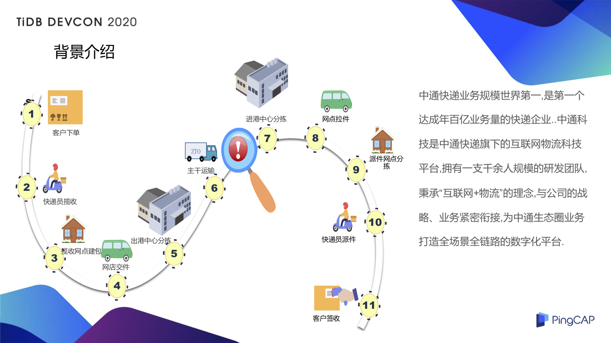
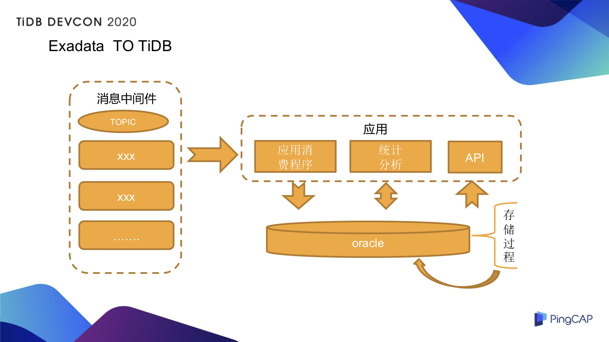
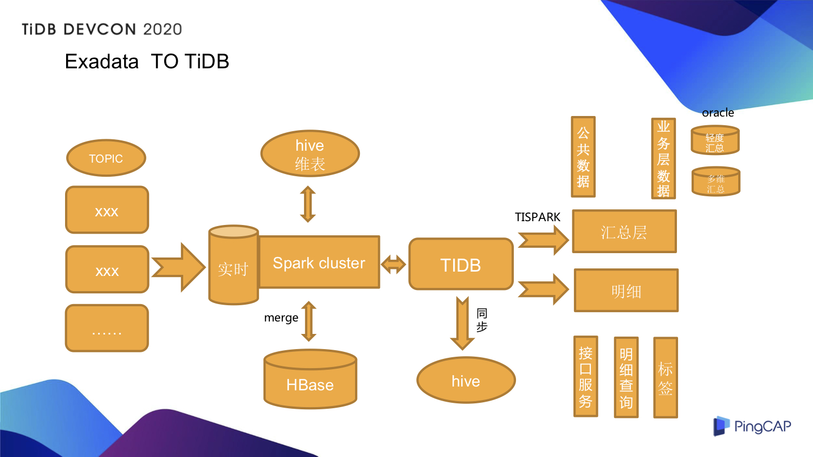

>作者介绍：朱志友，中通快递大数据架构师。

## 中通快递背景介绍

中通快递业务的规模目前是世界第一，是第一个达成年百亿业务量的快递企业，在 2019 年的双十一更是完成了订单量超过 2 亿的佳绩。中通科技是中通快递旗下的互联网物流科技平台，拥有一支千余人规模的研发团队，秉承着“互联网+物流”的理念，与公司的战略、业务紧密的衔接，为中通生态圈的业务打造全场景全链路的数字化平台服务。

上图展示了快递物流的生命周期，简单举个例子，大家如果在某宝上下了一个订单，从付款结束开始，到商家打单，大家的包裹基本上就开启了一个快递的旅程。简单的介绍可以分为五个字，收发到派签，整个物流的全链路中可以拆解成以下的关键节点，客户下单之后快递员的揽收，揽收网点的建包，建包之后会把快递交到中心，至此快递就开启了转运和运输的过程，最终负责派件的末端网点会根据三段码的解析去末端的中心把快递拉到末端的快递网点进行分拣，分拣之后会指派到指定的快递员，进行派件，快递小哥会把快递送到客户的手里，客户完成签收，在我们看来这一票件就完成了快递的全链路的生命周期。在每个环节中会产生大量的数据，对每个环节的每一个数据我们都会进行相关的分析，包括时效的监控。

2017 年的时候，我们就已经开始关注 TiDB ，那时候的关注点主要在解决一些分库分表的问题上，从 2018 年底开始调研测试大数据，我们主要想去解决存储和计算的问题，2019 年初上线服务生产应用。**目前生产上有近 58 个物理节点，同时服务 OLTP 和 OLAP 的业务，服务平稳。支撑了 2019 年双十一的大促，我们的 QPS 峰值在 12 万+，支持百亿级的插入和更新，TiSpark 支持业务在线的分钟级统计分析。实时 ETL 宽表建设，TiSpark 将实时和离线很好的串联起来，在分析上互为补充。**

## Why TiDB

中通为什么会选择 TiDB 呢？随着业务的快速发展，我们遇到了很多技术上面的痛点，主要有以下几个方面：

- 业务发展快、数据量激增， 能存放在 Exadata 一体机数据周期越来越短, 业务方对数据周期需求上升。

- 分库分表设计满足不了业务方分析和时效需求，统计分析依赖存储过程，系统的扩展性和可维护性不高。

- 业务高峰单机性能瓶颈，单点故障风险高，数据同步 T+1，分析时效不够。

- 测试 HBase、Kudu 建设实时数仓，和现有技术栈难以兼容，并且不能很好支撑业务端多维度的 query。

有了痛点，接下来谈一下我们的需求。我们的需求主要有以下几点：

- 支持在线扩展，数据按 region 分片，像 HBase 一样能分裂和迁移，最好自己支持热点调度。

- 强一致的分布式事务、二级索引，这是支持原来 Oracle 业务必须要有的。

- 能高并发写和更新，并且支持我们快速的按照业务方的需求查询结果。

- 技术生态与 Spark 要紧密结合，支持我们用 Spark 快速的做分钟级统计分析。

- 支持大宽表的建设，支持多维度的查询分析。

## Exadata To TiDB

上图是我们线上一个比较核心的系统以前的架构，大家可以看到在各个转运环节中我们有很多的数据，有很多的消息来源。左边是我们对接的消息中间件，从这里可以看到我们有很多的 topic。右边可以分为以下几块，第一个是应用消费程序，我们会把这些中间件的消息消费进来，然后存到 Oracle 里面；另外我们会提供  API 和应用的数据服务，对外提供服务能力。在原来的体系架构里面，大量的数据统计分析依赖于在 Oracle 上建好多存储过程，但随着数据量越来越大，我们发现存储和计算的问题越来越明显，单纯靠升级 Oracle 的硬件无法从根本上解决问题，并且随着硬件的不断升级，成本也越来越高。我们觉得应该从一个新的技术方案上去寻找突破，对我们的业务系统进行一个重新的架构升级。

**这次技术上的升级给我们带来了以下几个好处：**

1. 数据存储周期从 15 天支持到 45 天。

2. 支持在线横向扩展，随时上下线存储和计算节点，应用无感知。

3. 满足高性能的 OLTP 的业务需求，性能略低于 Oracle，这个无法避免，因为 TiDB 是一个分布式的数据库。

4. 数据库单点压力没了，TP 和 AP 分离。

5. 支持更多业务维度的分析。

6. 整体架构清晰，可维护性增强，系统扩展性增强。

7. 硬件成本降低。

上图是我们整个系统重构后的架构：

- 左边这部分还是很多消息的接入，通过 Spark 实时计算把这些消息接进来，与 Hive 维表在分布式计算里面做一些 Merge 和 JOIN。

- 同时会跟离线 T+1 的计算分析出来的数据、存在 HBase 的数据做 Merge 的计算。

- 最终计算的结果我们会把它存到 TiDB 里面。我们每天会定时的和 TiDB 做一次同步，把 TiDB 的数据同步到 Hive，做一个数据备份。

- 我们依赖于 TiSpark 在 TiDB 上做数据的统计分析，通常称为汇总层，汇总层包括公共数据和业务层数据，我们也会把这些数据放在 Oracle 里面一份，包括轻度汇总和多维汇总

- 我们还会基于 TiDB 去提供明细的服务，像 API 接口的服务、明细查询和一些标签。

**从新的架构上看，每一个关键的节点都支持可横向扩展，基本上没有单点或者单关键路径上压力的问题。**

## 实时宽表建设

其实在 2017 年的时候我们就一直在探索实时数仓的建设，我们测试过 HBase 和 Kudu。在国内，小米使用 Kudu 比较多，写入性能还是不错的，但是社区活跃度一般，使用的是 Impala 作为查询引擎，但是在我们的技术栈里主要使用的是 Presto，兼容性有待考虑，而且 Hbase 很难满足我们全部业务 Query 的需求。在我们整个物流链路的过程中，有很多消息的接入，我们需要针对每一票件进行全链路路由和时效的预测，定位到每一票件转运环节，不仅数据量大，并且对时效要求高。有了之前的项目经验，我们决定尝试用 TiDB+TiSpark 构建我们实时宽表建设。

实时数仓宽表建设，业务的 OLTP 数据通过 TiDB 实时写入，我们构建了一个 70+ 字段的宽表，后续 OLAP 的业务是通过 TiSpark 做分钟级的分析，有五分钟也有十分钟的。之前我们采用过 DataX 和 Sqoop，但数据同步的效率远远不如 TiSpark，并且还遇到过把 TiDB Server 拉挂的情况。**经过我们的测试，TiSpark 同步 3 亿条数据到 Hive 大概需要 10 分钟，这为我们的实时数据建设与离线 T+1 的整合提供了保障。并且实时宽表的建设来源于 10 多个 topic，多个消息的接入很难保障消息之间的有序性， TiSpark 可以帮助我们在实时业务分析的场景中融合离线数据。**

上图是我们实时宽表建设一个大概的架构：

- 通过 Spark 把多个消息接入到集群里面做计算，并且和 Hive 维表做 JOIN。

- JOIN 之后我们会把明细数据存到 TiDB，接下来通过 TiSpark 来计算 TiDB 中的数据并存到 Hive，并通过 Presto 集群对外提供分析的数据支持。

- 另外我们会把 T+1 的一些离线分析数据通过 TiSpark 回刷到 TiDB，并通过 TiDB 对外提供业务应用支持的服务。

**以上是我们目前实时宽表的建设，它支撑了我们全链路的时效分析，包括时效的监控，基本上能达到准实时的了解到每一票件在每一个环节是否出了问题。**

## 运维

TiDB 有丰富的监控指标，他们使用的是比较流行的 Prometheus + Grafana，监控指标已经可以满足我们的需求。关于数据同步，我们采用了 DataX T+1 同步到 Hive 做数据备份，但因为我们集群既支持线上业务，也支持开发人员来做一些数据的查询，所以之前遇到过 SQL 把 DB server 拉挂的情况，针对这个问题我们做了一些监控和管控，主要有以下几点：

1. 监控线上特殊账号的慢 SQL，我们自动会杀掉，然后通知到运维和应用的负责人；

2. 开发了 Query 的平台，让用户使用 Spask SQL 去查询 TiDB 的数据，并发和安全的控制；

3. 指标额外接入了小米监控，核心的告警会电话通知到相关的值班人员，相当于做了自动化监控的值班。

## 遇到的问题

下面来说一下在使用 TiDB 的过程我们遇到的一些问题。

**首先是热点问题**，因为我们业务的一些特殊性，在特定的时间范围内会有大量写入、更新的需求，索引热点在目前情况下比较突出，很多业务基于时间来查询，需要创建时间相关的索引或者组合索引，连续时间段的写入或更新会导致索引热点，影响部分写入性能。

**第二点是部分问题排查比较困难**，我们在线上会发现当部分的 SQL 触发了大量的 Coprocessor 时，会导致 KV 示例负载 Load 打满后，集群写入性能下降，此时定位 expensive SQL  需要查看日志，或者通过 Show Processlist 去排查，当 DBserver 较多时，排查比较耗费时间费力，我们想的解决办法是把这些日志的情况全都接入到 ELK。

**第三个问题是内存碎片化**，因为我们有大量数据的更新、插入，也有大批量的数据删除。我们当时用的版本是 TiDB 的 3.0.3 的版本，在系统稳定运行一段时间后，发现监控上的部分节点的监控数据触底了，像 Raftstore CPU，并且相关的监控指标，如 SQL Duration 有缓慢上升的趋势，一开始排查误以为是监控的问题，后来在 TiDB 工程师的协助下，最终定位为内存碎片化的问题，当时通过滚动重启集群暂时解决问题。在 TiDB 3.0.14 的版本中，这个问题已经得到了解决，我们升级后目前未发现异常。

## 总结和展望

目前我们有多条业务线稳定的运行在 3.0.14 的版本上， TiDB 4.0 GA 在 5 月 28 号发布，从 2019 年我们就关注着这个版本的进度，其中很多新的特性都是我们迫切需要的，比如说像大数据量的备份、大事务、TiFlash 等。现在我们 TP 和 AP 的业务在 KV 节点上还不是真正的物理分离，当有大量的分析需求, 且分析的时间周期跨度大、数据量大的时候，数据过滤的性能并不高，TiSpark 的资源需求很大，KV 的节点压力也较大，在业务高峰的时候我们发现分析会影响到部分写入的性能，所以在 4.0 的版本中我们特别关注 TiFlash，TiFlash 是为分析而生的，也是我们迫切需要的。接下来我们会专注 4.0 的测试，加大实时数仓的建设。

>本文整理自朱志友在 [TiDB DevCon 2020](https://pingcap.com/community-cn/devcon2020/) 上的演讲。
