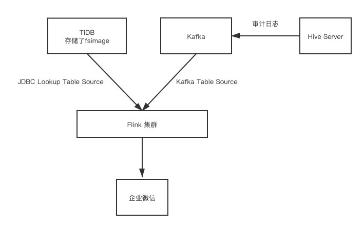
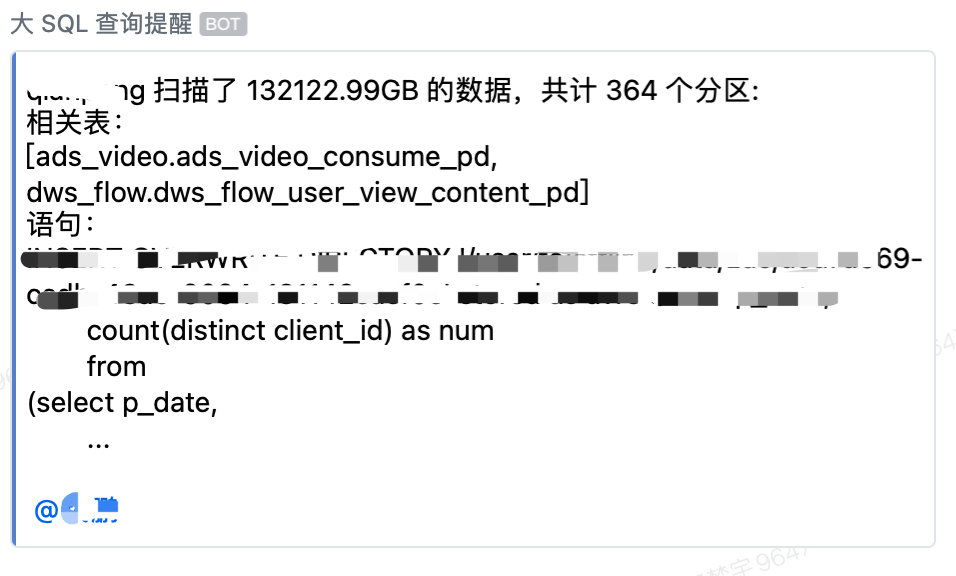

> 作者介绍：胡梦宇，知乎核心架构平台开发工程师，大数据基础架构方向，主要工作内容是负责知乎内部大数据组件的二次开发和数据平台建设。

## 前言

一年前，知乎的大数据架构与 TiDB 首次相遇，那时我们将 Hive MetaStore 的元数据库迁移到了 TiDB，得到了超过单机数据库一个量级的性能提升。在见识过分布式 NewSQL 数据库 TiDB 的威力后，我们对它寄予厚望，将它应用到了大数据架构的其他场景下，如：Hive 大查询报警，NameNode RPC 加速。

## Hive 大查询报警

### 背景

在知乎内部，Hive 主要被应用与两个场景：1. ETL 核心链路任务 2. Adhoc 即席查询。在 ETL 场景下，Hive SQL 任务都比较固定而且稳定，但是在 Adhoc 场景下，用户提交的 Hive SQL 比较随机多变。在用户对 SQL 没有做好优化的情况下，启动的 MapReduce 任务会扫描过多的数据，不仅使得任务运行较慢，还会对 HDFS 造成巨大压力，影响集群的稳定性，这种情况在季度末或者年底出现得极为频繁，有些用户会扫描一季度甚至一整年的数据，这样的查询一旦出现，便会导致集群资源紧张，进而影响 ETL 任务，导致报表延迟产出。

### SQL 大查询实时报警系统简介

针对以上痛点，我们开发了大 SQL 查询实时报警系统，在用户提交 SQL 时，会做以下事情：

1. 解析 SQL 的执行计划，转化成需要扫描的表路径以及分区路径；

2. 汇总所有分区路径的大小，计算出扫描数据总量；

3. 判断扫描分区总量是否超过阈值，如果超过阈值，在企业微信通知用户。

下面详解每一步的具体实现。

### 从执行计划拿到 Hive 扫描的 HDFS 路径

这一步我们利用 Hive Server 的 Hook 机制，在每条 SQL 被解析完成后，向 Kafka 输出一条审计日志，审计日志的格式如下：

```
{
  "operation": "QUERY",
  "user": "hdfs",
  "time": "2021-07-12 15:43:16.022",
  "ip": "127.0.0.1",
  "hiveServerIp": "127.0.0.1",
  "inputPartitionSize": 2,
  "sql": "select count(*) from test_table where pdate in ('2021-07-01','2021-07-02')",
  "hookType": "PRE_EXEC_HOOK",
  "currentDatabase": "default",
  "sessionId": "5e18ff6e-421d-4868-a522-fc3d342c3551",
  "queryId": "hive_20210712154316_fb366800-2cc9-4ba3-83a7-815c97431063",
  "inputTableList": [
    "test_table"
  ],
  "outputTableList": [],
  "inputPaths": [
    "/user/hdfs/tables/default.db/test_table/2021-07-01",
    "/user/hdfs/tables/default.db/test_table/2021-07-02"
  ],
  "app.owner": "humengyu"
}
```

这里我们主要关注以下几个字段：

|  字段  |  含义  |
|  ----  | ----  |
|  operation  | SQL 的类型，如 QUERY, DROP 等  |
|  user  | 提交 SQL 的用户，在知乎内部是组账号  |
|  sql  | 提交的 SQL 内容  |
|  inputPaths  | 扫描的 HDFS 路径  |
|  app.owner  | 提交 SQL 的个人账号  |

### 汇总分区的大小

汇总分区大小需要知道 `inputPaths` 字段里每一个 HDFS 路径的目录大小，这里有以下几种解决方案：

|  方案  |  优点  |  缺点  |
|  ----  | ----  | ----  |
|  调用 HDFS API 实时获取  | 结果准确  |  需要调用 getContentSummary 方法，比较耗费 NameNode 性能，等待时间比较久。  |
|  利用 Hive MetaStore 的分区统计信息 | 速度较快  |  结果可能不准，有些表通过其他计算引擎如 Flink，Spark 直接写入 HDFS 目录，没有及时更新统计信息；  |
|  利用 HDFS 的 fsimage 解析出所有 Hive 目录大小，存入 TiDB  | 速度较快  |  结果具有 T+1 的延迟，当天的分区无法统计大小。  |

考虑到使用场景，大 SQL 查询大部分情况下都是扫描了几个月甚至几年的数据，一两天的分区信息忽略可以接受，我们选择了第三种方案：每天将 HDFS 的 fsimage 解析，并且计算出每个 Hive 目录的大小，再将结果存入 TiDB。因为我们在其他场景也会用到 fsimage 的信息，所以这里我们不仅仅只存储了 Hive 目录，而是存储了整个 HDFS 的目录情况，近百亿条数据。很明显，在如此大的数据量下，还涉及到数据索引相关，TiDB 是一个很好的选择。

### 实时报警



我们将审计日志实时发送至 Kafka，再用 Flink 实时去消费 Kafka 内的审计日志，利用 KafkaTableSource 和 Json Format 将 Kafka 作为流表，再利用 JdbcLookupTableSource 将 TiDB 作为维表，便可轻松计算出每条 SQL 扫描的数据量再进行报警判断。

最后达成的效果如下：



## NameNode PRC 加速

### 背景

故事的起因是这样的，在有一段时间内，经常有用户反馈 Hive 查询卡住没有反应，短的卡十几分钟，长的卡几小时，十分奇怪，经过定位发现是 Hive 内部在调用 getInputSummary 方法时，有一把全局锁，在某一个查询较大时，调用这个方法会花费较长的时间，导致其他的查询线程在等待这把锁的释放。经过阅读源码发现，getInputSummary 方法是可以并发去执行的，它内部其实就是在调用 HDFS 客户端的 getContentSummary 方法，我们将锁去掉，不再使用全局锁的功能，而是采用了类似线程池的方式，让它可以以一个较高的并发度去执行。但是这样会带来一些问题，HDFS 客户端的 getContentSummary 方法类似于文件系统的 du 操作，如果并发度过高，会显著影响 NameNode 性能。不仅仅只有 Hive，其他的计算引擎也会调用 getContentSummary 方法，因此，优化这个方法十分必要。

### 缓存 ContentSummary 信息

知乎在 2019 年 HDFS 就已经拆分了 Federation, 采取的是 Router Base Federation 的方案，引入了 NameNode 的代理组件 Router. 我们只要在 Router 层给 HDFS 的 ContentSummary 做一层缓存，在客户端发起调用时，如果缓存命中，则从缓存读取，如果缓存未命中，则从 NameNode 请求。经过内部讨论，缓存方案有以下几种：

|  方案  |  优点  | 缺点  |
|  ----  | ----  | ----  |
|  客户端第一次请求 Router 时，从 NameNode 返回，更新缓存；第二次请求时，先拿缓存，并且判断目录的修改时间，如果期间发未发生修改，则返回缓存，如果发生了修改，从 NameNode 返回，更新缓存。  | 对于不常修改的目录，只需要请求一次 NameNode。  | 对于第一次请求依然需要去访问 NameNode；只能缓存没有子目录的目录，因为子目录的变更上层目录无法感知。  |
|  每天利用 fsimage 产出一份全目录的 ContentSummary 信息缓存至 TiDB，在客户端请求时，走第一种方案的逻辑。  | 大部分目录的第一次请求都不用走 NameNode。  | 依然只能缓存没有子目录的目录，因为子目录的变更上层目录无法感知。  |

我们选择了第二种方案，因为 ContentSummary 信息在我们之前做 Hive SQL 大查询报警的时候已经产出，所以接入进来十分方便。在接入 TiDB 做缓存，并且给请求路径建索引以后，对于一般情况下的 getContentSummary 请求，延迟能保证在 10ms 以下，而对于没有 TiDB 缓存的 NameNode，这个时间可能会花费几分钟甚至几十分钟。

## 展望

本次我们利用 TiDB 的超大存储和索引功能，缓存了 HDFS 的元信息，满足了知乎内部的一些场景，后续我们会持续改进和扩展此场景：比如缓存 HDFS 文件信息可以做成实时缓存，利用 Edit log 订阅文件变更，然后和 TiDB 里面的存量 fsimage 进行合并，产出低延迟的 NameNode 快照，用于一些在线的分析等。
