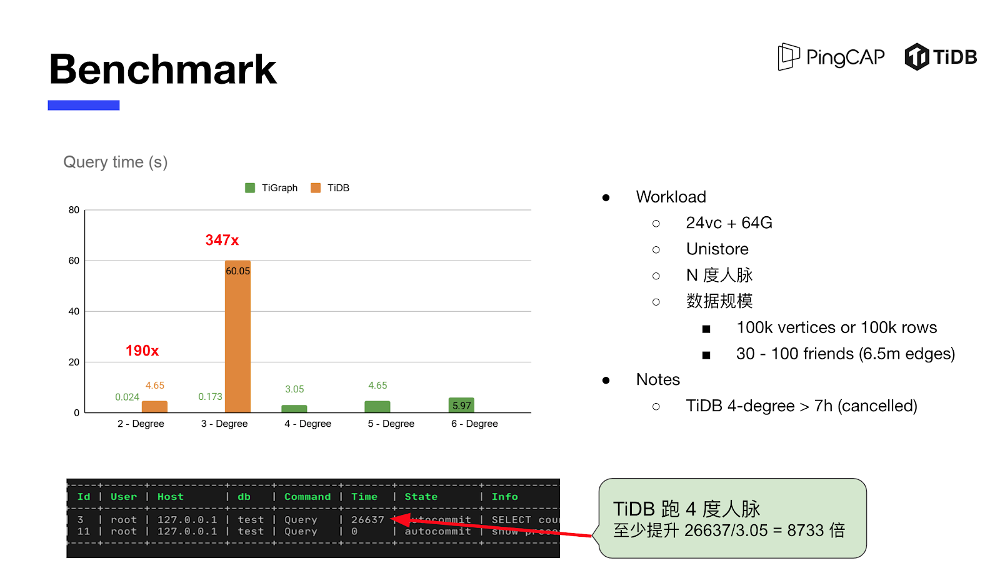
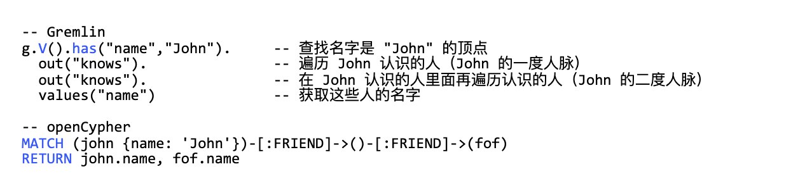
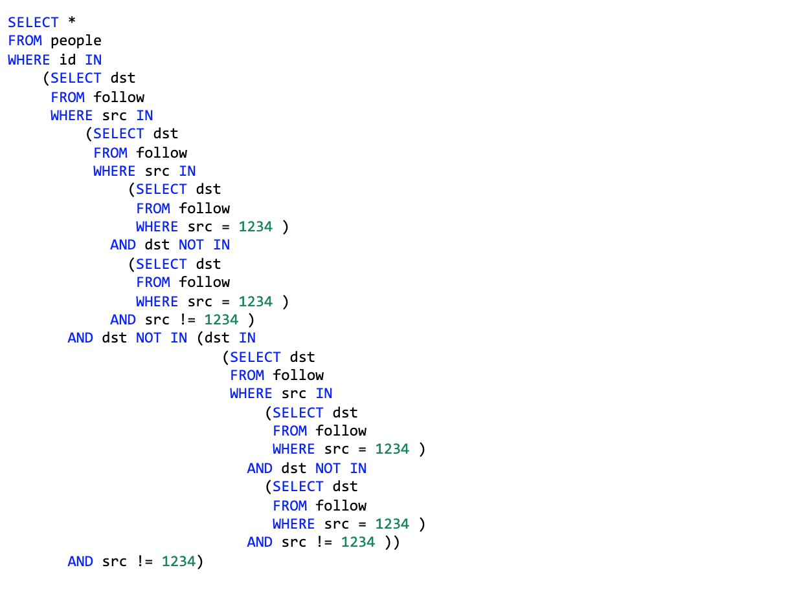
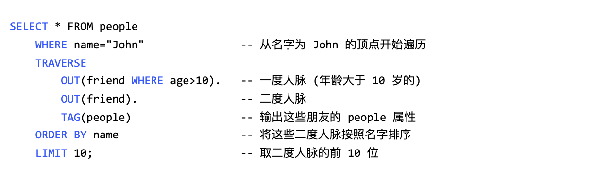

---
title:当 TiDB 遇到图数据库 | TiDB Hackathon 2020 优秀项目分享
author: ['PingCAP']
date: 2021-02-02
summary: 本篇文章将介绍 TiGraph 团队赛前幕后的精彩故事。
tags: ['TiDB Hackathon 2020']
---

新冠是当下沉重的话题，科技可以帮助我们去降低疫情造成的影响，比如在发现一个病例之后，常规的措施都是按照一个地区的粒度进行隔离，如果我们有更加强大的图数据分析引擎，完全可以把防疫这件事情做得更加精准和高效。

首先，我们基于图数据库进行简单的建模：所有人都是这个图模型中的一个顶点，两个人接触之后，会生成一条联系，并新增一条对应的边。然后进行系统的快速实现：所有人都有微信或支付宝，我们在这个系统中新增一个顶点，当两个人接触距离小一个值时，可以通过两个人的坐标或者 NFC 感应来得到这个距离，小于某一个距离，我们就在系统中新增一个边，并记录两个顶点的接触时间。

基于这个模型，当我们发现一个新冠病例之后，就可以利用图数据库进行分析，快速地（秒级）找出在指定时间内接触过的人进行隔离，为防控疫情节省大量的时间和人工成本。

以上是图数据库在日常生活中的一个典型场景，图数据库是一个使用图结构进行语义查询的数据库，它使用节点、边和属性来表示和存储数据。Gartner 认为，图数据存储可以跨越数据孤岛、并有效地建模、探索和查询数据，图分析将在未来几年内高速增长，然而在关系型数据库（RDBMS）之上使用 SQL 查询实现相关分析有点不切实际。

**真的是不切实际吗？请 TiGraph 给你一个全新的回答！**

**在 TiDB Hackathon 2020 赛事中，TiGraph 项目在 TiDB 中实现了一套新的 Key-Value 编码来引入图模式，处理传统关系型数据库难以覆盖的图数据分析场景，并使得 TiDB 在四度人脉的计算性能提升 8700 倍，一举夺得本届赛事的二等奖。**

## 精妙的架构实现

在短短的 Hackathon 期间，要开发一个完整的图数据库显然不太可能，TiGraph 项目尝试验证在 TiDB 中无缝集成图模式：

- 在 SQL 中扩展出一个让 DBA 一眼就能学会的图遍历语法

- 同一个事务中操作图数据和关系型数据的能力

- 将图遍历作为 SQL 子查询（反之亦然）

- 对于 N 度人脉场景的性能对比

TiGraph 的技术栈从上层到下层与 TiDB 是一致的，主要做的工作有两部分：第一部分是写入，在元数据管理方面新增了 TAG/EDGE 两个图的 Schema 类型，分别表示图的点和边，写入时如果发现写入对象的 Schema 是图的 TAG/EDGE 时，就用图数据的 KV 编码，然后就走 2PC 事务提交，这和 TiDB 的流程一模一样，没有区别。

第二部分是读链路，目前主要新增了两个执行算子，一个是 GraphTagReader 算子，用于读取图数据的点的数据。另一个是 Traverse 算子，用于根据指定的边进行图的遍历。因为图计算里面包含三部分，图的遍历、子图匹配和图聚合，这次 Hackathon Demo 主要是做图的遍历，后面去落地这个项目的时候，还需要把子图匹配和图聚合这些算子也设计出来。

##  震撼的性能表现

因为时间有限，TiGraph 在 TiDB 里面仅实现了 Key-Value 的整套逻辑，没有时间在 TiKV 中再用 Rust 重新实现一次，所以采用 TiDB 内置用于跑测试的存储引擎 Unistore。对于数据规模的考虑，一开始计划生成 100w 顶点 + 4000w 边，发现只有 TiGraph 能跑出结果。这是由于没有使用生产级别的分布存储引擎 TiKV，而是选择用于跑单元测试的 Unistore，另外这也不是传统关系型数据库的优势场景，所以 TiDB 跑不出数据。

于是采用更小的数据集，在 10w 行数据 + 650w 条边的规模下，测试 N 度人脉场景下 TiDB + Unistore 与 TiGraph 的性能对比。从上图可以看到，TiGraph 可以跑完六度人脉的测试，但是 TiDB + Unistore 只能跑三度人脉，第四度人脉跑了 7 小时还没有出结果。**随着人脉度的增加，TiGraph 的性能提升越明显，二度人脉的性能提升 190 倍，三度人脉的性能提升 347 倍，四度人脉在有限的时间内没有跑出最终结果，估算至少可以提升 8700 多倍。** TiGraph 后期采用 TiKV 存储后，在海量的图数据规模下也能弹性扩容，再配合 Coprocessor 实现图数据的计算下推，TiGraph 的查询性能还能再进一步提升。

## 难点攻克：TiDB 与图数据库的融合

在同一个事务中处理图数据库和关系型数据，如果一个业务同时使用一个传统关系型数据库和图数据库，那么要在两个数据库中实现事务和强一致性，几乎是基本不可能完成的任务，但是通过 TiGraph 可以出色地完成。

首先，要设计一套与 SQL 极具兼容性、优雅且高扩展的语法，以下是目前两个非常流行的图查询语法两度人脉的示例：

在一套系统中，引入两套查询语法会让用户学习成本更高，经过两天的讨论和碰撞，最终确定了如下示例的图遍历语法：

我们将上面语句拆成两部分来看：

1. SELECT … FROM... 语句的查询结果作为图遍历（TRAVERSE 子句） 的起点

2. 在 TRAVERSE 子句中指定想要遍历的 EDGE (边)，使用图遍历查询起点的二度人脉

如果我们使用目前的 SQL 语法(假设不做任何扩展)写出来大概是：

通过以上对比我们可以看出扩展后的语法是极具表达能力的，同时也非常 SQL-style，另一个好处是将图遍历的使用 TRAVERSE 子句表述后，就可以无缝和 TiDB 关系查询中的其他子句联合使用了，这样可以复用 TiDB 已有的执行算子和表达式等所有的计算能力，并且用户的学习成本也很低。比如我们可以直接复用 WHERE/ORDER BY/LIMIT 子句（在编上加上过滤条件，将图遍历（TRAVERSE 子句）的输出结果作为后面 ORDER BY LIMIT 子句的输入）：

因为 TiDB 中的算子都依赖于强 Schema 的设计，为了复用 TiDB 中这些算子，TiGraph 中的 TAG 和 EDGE 也是强 Schema 的，这样图计算相关算子输出的 Schema 就能和关系型算子的 Schema 完全兼容。TiDB 的上层算子并不需要知道底层是图还是关系型数据，只要在最底层把之前的 TableScan 算子换成 GraphScan ，对于上层来说，所有能力都是可以复用的。

在 SQL 层面有一篇学术论文做了类似的研究，把 Stream 和 Batch 这两个试着用 SQL 去结合。**目前，学术界还没有把 Graph 和 RDBMS 语法结合在一起的，TiGraph 项目实现了三个方面的创新。**

第一个方面是做出一套 SQL Style 的图遍历语法。第二个方面是事务能力，就是在同一个事务里面操作图和关系型数据的能力。按照以前的惯例，用户必须要使用一个图数据库加上一个关系型数据库才能解决实际问题，然而要在两个数据库之间达成强一致基本上是不可能完成的任务，现在 TiGraph 具备这个能力，这是非常有魅力的，后续像子查询只需要在易用性和性能层面做提升就好。

第三个方面就是在 TiKV 里面实现两种不同的编码模型，一种是给关系型的表编码的，一种是给 Graph 编码的。为了避免混合存储在一个 KV 的引擎里面产生冲突，通过加一个 g 的前缀使得整个KV 在 Base 层面就完全隔离，互不影响。

## TiGraph 场景探索

除了上面提到的新冠防疫场景之外，**TiGraph 还将在金融反欺诈、社交网络、知识图谱等场景中发挥作用。**

### 金融反欺诈

所谓近朱者赤近墨者黑，通过用户的关系网络来检测其与风险节点的关联度，可识别出其风险程度并作为一个参考指标，比如某用户三度关系之内是否触黑（有时候看单个节点和单笔交易是很难发现问题的），利用 TiGraph 可以很好地进行关联度检测和分析：

- 检测用户的多层社会关系是否符合正常的图谱特征，如果是孤立的子图则可能是假造的关系网络，该用户存在高风险（包括黑/灰名单、高风险评分节点）

- 检测多层关系网络中是否包含高风险节点，比如二度触黑

- 通过 Personal Rank、Page Rank 等算法计算关系网络中节点的风险评分

对于有组织成规模的数字金融诈骗，TiGraph 可以从复杂网络中快速进行团伙分析，为诈骗阻断提供及时的判断依据。

### 社交网络

大家在使用 Linkedin 的时候，发现有一个侧栏显示你的二度和三度人脉，社交平台通过分析社交网络关系，来帮助你扩展人脉圈子。TiGraph 可以在社交网络里面用作一个计算 N 度人脉的系统，在此之外，还可以将这些社交网络与你的消费记录等信息进行联合，得到一些深层次的信息，进而来帮助社交平台的推荐系统提高转化率。TiGraph 可以打破数据之间的孤岛，建立隔离数据之间的连接，产生 1 + 1 > 2 的效果。

### 知识图谱

知识图谱是 Google 公司在 2012 年提出来的一个概念，可以通过一定方法把知识抽取和清洗出来，然后在图数据库中提供查询。搜索引擎只能告诉用户，查询的结果与哪些页面相关，用户需要肉眼在页面里找答案，而知识图谱可以直接把答案告诉用户。举个例子，TiGraph 能直接告诉你在《权力的游戏》中坦格利安家族的伊利亚丈夫的兄妹是谁，是不是很 Cool ？

## 未来方向

未来想在两个方面进行尝试。首先，关于 TiGraph 项目的实现想写一篇论文，主要的方向有两个：第一个是如何在目前已有的关系型数据库（TiDB）里面去集成图模式；另外一个是具体的语法，需要去证明图计算的三个算子。

其次是 TiGraph 这个项目的工程落地，赛队小伙伴们希望能进一步做深度的开发和实现工作。主要任务就是在 TiKV 里面把这一套 Key-Value 编码实现，并在 TiKV 的 Coprocessor 中实现图计算下推，从而打通整个链路，让图查询可以直接复用 TiDB 已有的执行算子和表达式，图查询和关系型查询也可以无缝结合。

## TiGraph 背后的小伙伴

TiGraph 赛队的三位小伙伴都具有比较扎实的技术功底，喜欢探讨和研究新的技术方向，其中两位都是 TiDB 社区顶级的开发者（pingcap/tidb Contributors）：crazycs520 这个 GitHub ID 虽然有点土，但是位列 TiDB Contributions 总榜 Top 5，wjhuang2016 同学也是一位天才选手。

在 TiDB Hackathon 2020 期间，除了 TiGraph 项目之外，还诞生了很多前沿、有趣的项目，给 TiGraph 赛队小伙伴们留下了深刻的印象：

- ' or 0=0 or ' 队伍的 UDF 实现非常优雅高效，也为这一部分的探索画上了一个句话，以后大概率没有人能做出更加好的 UDF 实现了，当然这也是为什么能拿第一名的原因。

- B.A.D 的 VSC 扩展也是非常有创造性的，甚至在 Hachathon 期间已经发布到 VSC Market 并获得两位数下载。

- GPU 加速计算打开了一个新世界的大门，对于 TPCH 中几个包含 JOIN Query 的性能提升是非常不可思议的。

- T4 组由孙晓光老师 Team 做的 TTL Table 是另一个我非常喜欢的项目，极其实用。

>TiDB Hackathon 2020 把小伙伴们天马行空的想法变成了现实，在获得成就感的同时多了一份感动，我们将重新出发，还有更多的惊喜值得期待！    ——TiGraph 队长 龙恒
