说到 Why HTAP Matters，其实包含两部分，一部分是说为什么我们叫 HTAP，另外一部分是说 TiDB 怎样在 HTAP 架构下发挥它的优势。

## 什么是 HTAP？

HTAP，首先 HTAP 是 Gartner 提出的一个名词，它其实描述的概念很简单，就是一个数据库同时能具备 TP 和 AP 两种能力。TP 就是 Transactional Processing，也就是交易处理，这样的数据库是使用行存，支持实时更新，也可以有高并发，一般来说提供强一致的需求，每次 workload 基本上只触及比较少的数据。通常在数据库里面存的是当前数据。AP 则相反，全称为 Analytical Processing，即分析处理，大多数分析处理的场景是列存，它支持的只是批量更新支持的也是中低并发的 workload，基本上每个查询都会处理大量的数据。一般存放的是历史数据。

所以大家可以看到 TP 和 AP 对于需求和技术侧其实是非常不一样的。因为这些不同，所以传统的数据架构其实是下图这样子的。

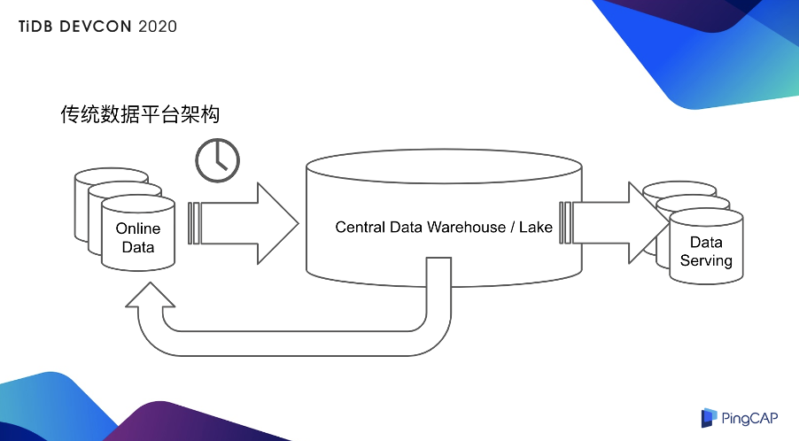

我的在线数据其实是在 online database 上，这部分是处理 TP 的数据，然后 TP 的数据需要通过一个 T+1 导到 AP 数据库，一般来说有很多种选择，比如说你是 Relational 的 Data Warehouse 或者也可以是 Hadoop 的 Data Lake，数据处理完之后有两种选项。一种选项是，数据处理完之后直接出报表或者导到一个 Data Serving 的 database 里面去，或者回馈到在线库。不管是其中哪一个环节都会增加数据的延迟，整个数据架构会比较复杂，其实如果你有一台 HTAP 数据库，它其实是可以给用户降低架构的复杂度，也降低运维成本的，顺便会提升业务的实时性，以及提升业务的敏捷性。敏捷性就是说你要开启一个业务或者要新建一个业务所需要的开发周期和架构周期。为什么呢？大家之前不是都是用这种老的架构，也跑的也好好的。现在其实 TP 和 AP 的边界会变得更加模糊化，AP 业务会变得 TP 化。比如说提供报表的同时也提供高并发的短查询，然后可能会对历史明细提供一些小范围的查询。或者 TP 也会变得更 AP 化，比如在交易的同时需要大规模的分析，或者回馈在线库，优化在线行为，或者要对实时的数据业务进行实时分析，或者要对跨业务线提供一个综合查询能力。

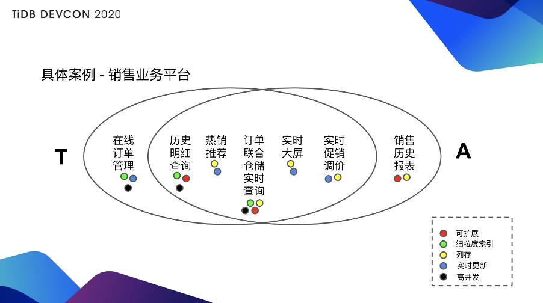

举个具体的例子，比如说有一个很简单的业务叫销售业务平台（见上图），靠左边是偏 TP 的，最 TP 的是在线订单管理，要求的就是纯粹的 TP 能力，大家可以看右下角的注释：绿色的是使用行存索引做细粒度的查询，黑色是高并发，蓝色是实时更新。

最左侧是最典型的 TP 业务，TP 业务来说需求的就是很明显的 TP 业务所有的一些技术特征。再往最右侧来看，最典型的 AP 业务是销售的历史报表，因为是历史报表，所以需要存大量的数据，要求的是可扩展性，一般来说使用列存，列存是用黄色的点。

中间的一些其实是有点像 TP 也有点像 AP 的东西：历史明细查询，虽然数据量也很多，但是可能需要点查某一些数据，比如点查某一个人的明细订单或者点查某一批获批的明细订单；热销推荐，可能需要的是在交易发生的同时迅速的计算出现在卖的最好的是什么东西，它可能是对在线业务的一个多维聚合查询；订单联合仓储的明细查询或者说实时查询，它要求的不只是查询订单库的内容，还可能要求同时查询仓储库的内容；实时大屏就更好理解了，我一边卖的时候一边看哪些东西卖的比较好或者在什么城市卖了哪些东西；实时促销调价会稍微复杂一点，比如根据现在促销的情况，通过程序的方式实时进行调价。

除了一左一右两边分别是 TP 和 AP，中间其实都是 TP 和 AP 混合的场景，因为它对整个技术侧来说需求是非常不一样的，大家可以看到下方标的那些能力的点都是有不同的需求的。

同时满足这些需求其实不是很容易，为什么？比如说扩展性，TP 的扩展性其实是很难做的，虽然 AP 的扩展性，比如说像 AP 数据库或者 Hadoop 那些其实都已经很早就有了，但能做 TP 的数据库还能够扩展的，其实是近几年才有的，就是所谓的 NewSQL。TP 同时要兼具 AP 能力，就要求它同时能有行存和列存两种存储格式，光是这两者还不够，它还要能有机的把这两者统和起来，统和起来就会带来很多问题，比如说在互通数据的时候怎样保持高实时性，同时兼顾一致性。

## TiDB 4.0 HTAP 体系

现在讲一下 TiDB。在 TiDB 4.0 之前，已经具备了一些能力。比如首先它立项的时候是为了一个交易型数据库来设计的，所以最早的时候就已经是一个比较完善的交易型数据库，同时兼容 MySQL 的特性，现在线上已经有万亿级的单库规模，能承载千万级的 QPS 业务，银行核心业务上已经稳定上线。但立项一开始并没有预计到的是，我们其实推出去之后它其实也是一个良好的数据中枢或者叫 data hub 或者是实时数仓的载体。这是以前 TiDB 已经有的两个大类的使用，就是 TP 和 AP。

**从 4.0 来说，TiDB 把 HTAP 体系更加完善了，主要是加入了实时更新的列存，就是 TiFlash**。这套引擎整合在一起其实就是一个可扩展的行存和列存整合的架构，这套整合的架构在存储上是可以使用分离的不同的节点，可以确保两边互相之间没有干扰，它的实时性、一致性、可延展性都能得到很好的保证。复制本身这套体系是没有中间层的，所以复制是非常简便而且非常快的。**就整个体系来说，它不光有列存，有全面支持行存的所有的索引的特性。另外添加了向量化引擎，列存本身和行存之间能通过智能的引擎选择。**

TiDB 本身其实没有办法做很详细的阐述，因为这是一个短 talk。我们在 VLDB 发了一个 paper，之后等这个 paper 可以公开的时候基本上我们会出一些更详细的说明，具体说整个 HTAP 这套体系在 TiDB 里面是怎么设计的。之所以提一下 paper，是想说这个东西并不是我们自嗨说它是 HTAP 或者说是一个很先进的架构，至少这个东西能通过一个顶刊的学术审核，能让研究者也觉得它是一个很有意思的东西。

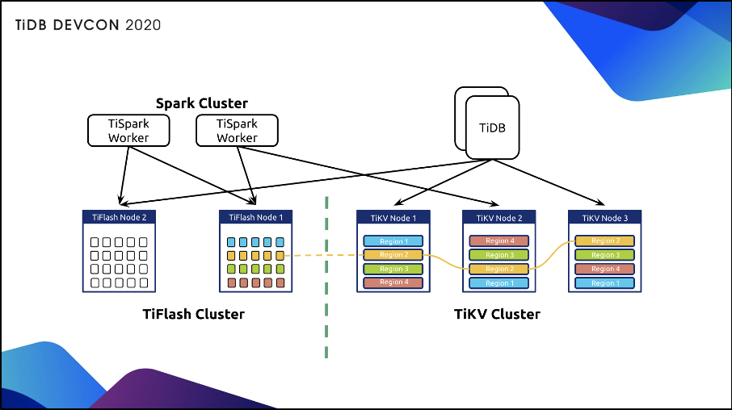

上图是现在 TiDB 4.0 的 HTAP 架构，左侧是新增的 TiFlash 的节点，右侧是 TiKV，上面的计算层还是一样的，上面的计算层还是以 TiDB 或者说以 TiSpark 为主。

### 可扩展的实时更新体系

首先说可扩展的实时更新体系，这里包括几点：

**第一个是 TiDB 的 TiFlash 架构下还是使用 Mutli-Raft 的**，也就是说 TiFlash 复制数据和存储数据的单元，比如说是以 region 为单元存储，这些和 TiKV 还是保持一致的，但是它是从一个行存到列存的复制。

**第二，这个复制的特点是无需中间介质的**，也就是说所有的复制并不像普通的复制体系可能要通过一些分布式的管道，比如像 Kafka 或者其它的 MQ 系统，这样的话，复制其实会有比较大的延迟。在 TiDB 体系底下的行存和列存之间复制是以 region 点到点之间复制的，所以说你可以认为当中没有任何的中间介质，保证复制的实时性。

**第三，它兼顾复制和存储的伸缩性**，也就是说整个体系来说，刚刚说过还是以 Multi-Raft 来做的，所以 Sharding 的单位也是以 region 为单位 Sharding，整个调度的模式还是符合原先的调度模式，所以他还是一样可以自然扩展。有意思的是行存和列存可以分别扩展，也就是说你有可能有一些用户行存可能需要用更多的机器，有一些用户可能列存需要用更多的机器，这相对于那些行存和列存放在同机的系统设计来说，要有很大的优势。

**第四也是最方便的是，以上这些，只需要一道命令来开启。**

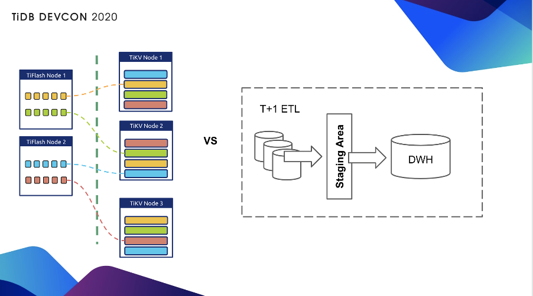

上图中，左边是我们复制体系，大家可以看到是以 region 为单位，region 到 region 直接复制，相对来说传统的如果是 T+1 的 ETL 的话要经过一个 Staging Area 或者哪怕实时复制，可能也需要经过 Kafka 那样的系统，复杂度和延时性都会上升。开启 TiFlash 同步其实只要一条命令：

```
mysql> ALTER TABLE orders SET TIFLASH REPLICA 2;
```

就是为 orders 表创建 2 个列存副本。

### 异步却实时 + 一致的读取

这其实是一个异步复制体系，并不是一个同步强制说两边都要写平才能提供服务的一套体系。**所以说交易事务不会被列存 block，也就是说列存不管你是写的快还是写的慢，交易都不会被列存 block。哪怕说列存这边即使 down 了，行存这里还是可以继续工作。同时虽然是一个异步复制不等待的体系，Raft 整个共识协议会保证我读取的数据是最新的。**

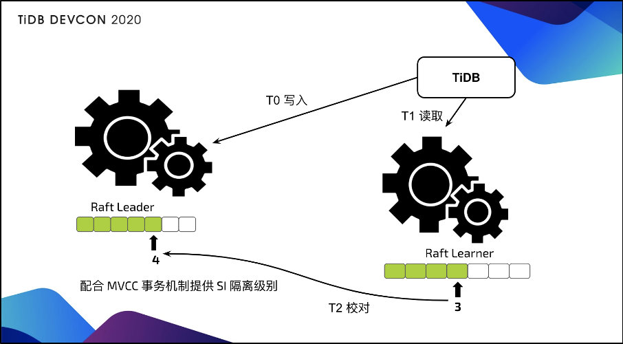

为什么在异步复制底下读取还是可以最新？说起来其实是一个非常简单的东西。可以看上图，我们在读取的同时会对行存的 leader 节点发起一个读取校对，这个校对其实就包含我现在复制的进度是多少，你只要告诉我一个进度号就行了，如果进度号不满足最新的数据要求，其实列存这边会等待。实际上测下来等待如果不是在  90% 到 100% 的满载系统里面，等待的时间其实是非常短的，是以毫秒来计算的。

### 优化器智能选择

**比较有意思的一点是，这套系统并不是一个和行存之间割裂的系统**。行列之间是一个有机整合，怎么整合？就是通过 TiDB 优化器，优化器会把列存当做一个特殊的索引，然后通过统计信息的方式，在不同的行存索引之间选择是一样的方式，就是基于统计信息和代价优化器去选择出现在最快的路径应该是选择行存还是列存或者说选择哪一条索引，所以说这套系统在同一个 TiDB 的入口就可以体现行存和列存两种不同的优势，用户也不需要在一个复杂的查询当中去考虑说我到底是使用行存还是列存，当然用户如果要保证完美的隔离，也可以手工开启只读行存或者只读列存，这样就会对应出 TP 和 AP 之间非常隔离的一种方式。

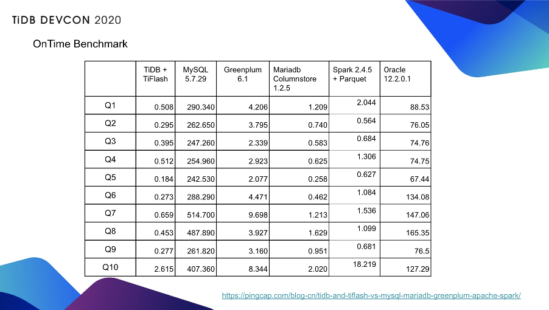

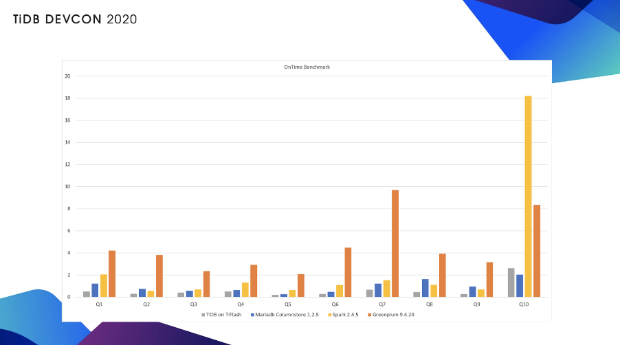

其实之前我们的 [blog](https://pingcap.com/blog-cn/tidb-and-tiflash-vs-mysql-mariadb-greenplum-apache-spark/) 上都写过，由上面两个图可见，这套系统的性能是非常不错的。当时是用 TiDB 加上 TiFlash，对比 Mariadb，对比 Spark 以及对比 Greenplum，当然也对比了 Oracle，但是 Oracle 没有开始它的列存。

### 配合 TiSpark

**整套 HTAP 体系还有一个特色，就是配合 TiSpark 可以无缝衔接 Spark 上的生态**，比如提供 AI 计算、Data Science 的 toolbox、BI 的对接，或者复杂的场景分析，这些都是可以由 Spark 体系加 TiSpark 来提供。它同时也可以 Hadoop Data Lake 当做同一套系统来查询。对于 TiDB 体系来说，则是提供一个重型复杂查询良好的分布式计算的性能。

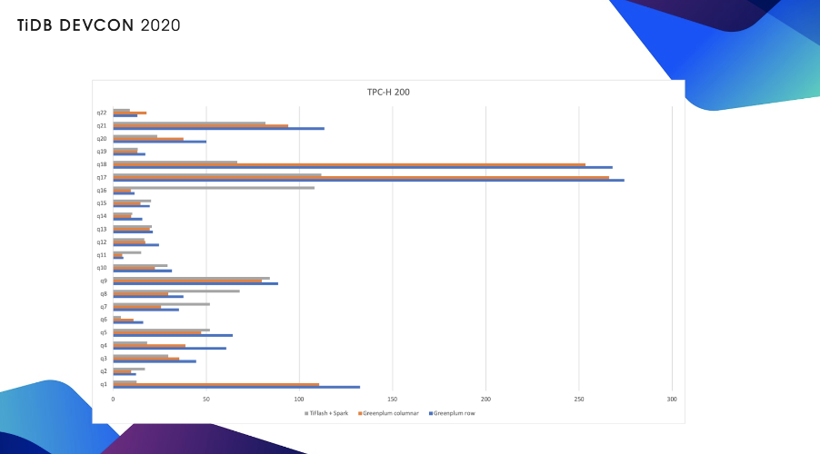

上图是 TiSpark 加 TiFlash 对比 Greenplum 的性能，大家可以看到基本上是处于同一个量级，就是有一些 Greenplum 会更快一些，有一些 TiSpark 加 TiFlash 更快一些。

### TiDB HTAP 应用实践

回到前面已经阐述过的观点，**在 HTAP 场景底下 TiDB 能为用户提供一个简化架构，降低运维复杂度，更重要的是我们提升业务的实时性，提升业务的敏捷性。**

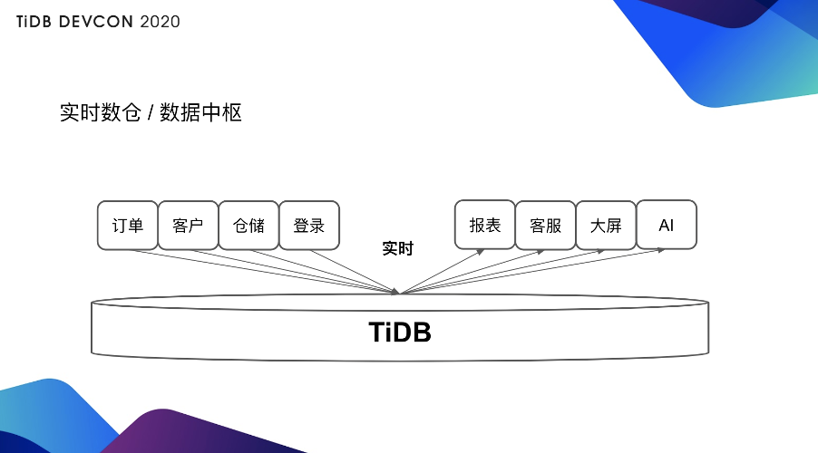

上图是 TiDB 其中 AP 场景当中一个比较主流的用法，就是做一个实时集成，也可以叫实时数仓，也就是说我用同一套 TiDB 可以做一个多源汇聚，不同的数据业务库从不同条线实时汇聚到 TiDB，因为 TiDB 是一个可持续更新的系统，所以它可以很方便的兼容从其它的 OLTP 库同步数据。同时在这套 TiDB 上也可以提供实时的查询，比如说可以提供报表，或者做一个客服系统，把各种不同库汇聚过来的信息给客户提供服务，或者做实时大屏，还可以做 AI。

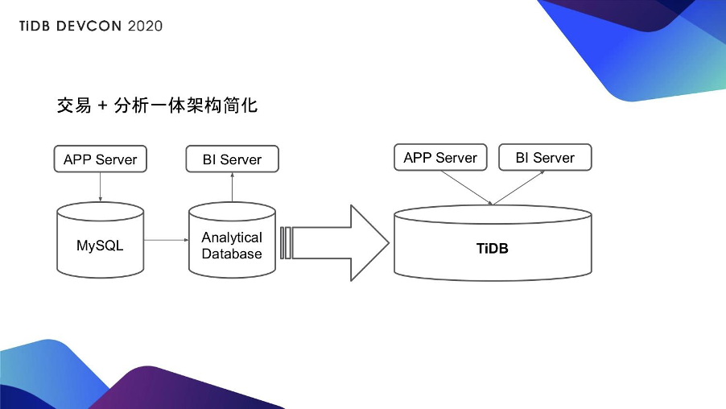

另外一种是更具体一点的用法（见上图），比如原本有很多用户是拿 MySQL 当在线库，然后他需要做 T+1 的同步到一个分析型数据库或者到 Hadoop，MySQL 提供的是在线的业务，BI 工具是连接到分析型数据库或者是连接到 Hadoop 上。对于这样的场景只需要一套 TiDB，原来 APP Server 对接的在线业务库就可以对接 TiDB 的行存，原来 BI 工具对接的报表类分析可以对接 TiDB 的列存。这样的话，对比先前，不光是架构简化还可以大大增加你的实时性能。

有很多人可能会说你说的这么好，其实我不可能把所有业务都迁到 TiDB 上去，我现在也有我很成熟的 Data Warehouse 架构，我也在数仓做了很多建模，有很多方法论，对于这样的场景来说，是不是 TiDB 就没用了呢？

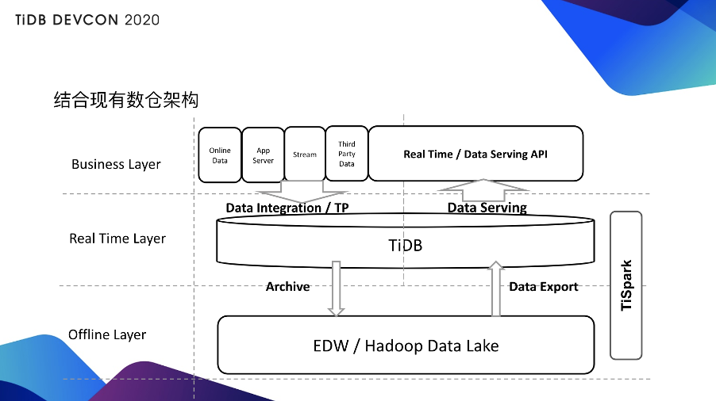

很多现在其实已经有 Hadoop 或者有数据仓库的用户其实是这样使用 TiDB 的 HTAP 体系的（见上图）。对于实施层来说，它会把数据汇聚到 TiDB 当中，TiDB 会提供一个 Real Time Layer，这个 Layer 会直接提供一些实时的查询，甚至直接提供对外的数据业务服务。同时也可以通过 Spark 把数据迁移到 Offline 的 Hadoop Layer，Hadoop Layer 同时可以把数据建完模或者清洗完，或者做一些聚合之后再回馈到 TiDB 层，这样 TiDB 会提供一个更方便的数据服务。因为一般来说不太可能把 Hadoop 直接当做 API 暴露到对外的层面，因为 Hadoop 承载不了这样比较高速实时的查询。所以这样的一套体系就会比较方便的为你整个现有的这套机构赋予一个 real time 的能力。

目前这套系统已经被很多用户应用了，大家可以查看[《TiDB HTAP 助力小红书业务升级》](https://pingcap.com/cases-cn/user-case-xiaohongshu-2/)、[《TiDB 4.0 在 VIPKID 的应用实践》](https://pingcap.com/cases-cn/user-case-vipkid/)、[《海外直播软件 Bigo 的 TiDB 4.0 线上实践》](https://pingcap.com/cases-cn/user-case-bigo/)、[《从 Exadata 到 TiDB，中通快递 HTAP 实践》](https://pingcap.com/cases-cn/user-case-zto-express/)，看看我们的用户现在怎么用以及现在这套他们用的好不好。

>作者简介：马晓宇，PingCAP 实时分析产品负责人。
>本文整理自马晓宇在 [TiDB DevCon 2020](https://pingcap.com/community-cn/devcon2020/) 上的演讲，大会相关视频回顾可以关注官方 Bilibli 账号 TiDB_Robot 的更新。