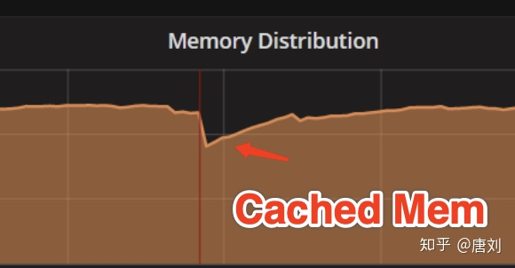
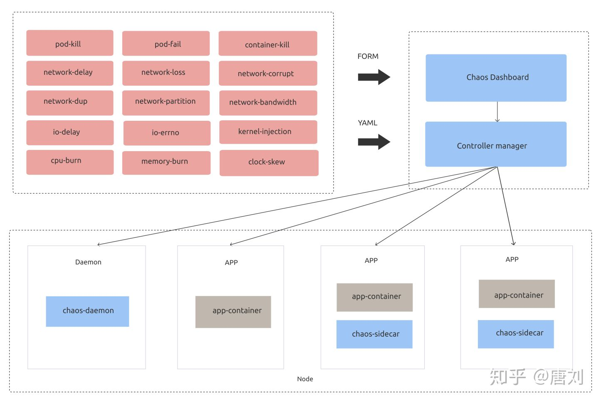

---   
title: 为什么你需要混沌工程以及 Chaos Mesh
author: ['唐刘']
date: 2020-07-13
summary:  分布式系统真的是一个非常复杂的系统，故障无处不在，那么我们如何在这么复杂的分布式系统的世界里面生存下去呢？现在，一个很好的答案就是 - Chaos Engineering，中文里面叫做混沌工程。
tags: ['Chaos Mesh']
--- 

## 信心的毁灭与重建

在我最开始学习编程的时候，我一直觉得写程序是很简单的事情，程序总是按照我的想法串行的执行，给一个输入，总是有着符合预期的固定输出。那时候写代码，可能大的挑战在于理解分支，循环，但无论怎样，只要控制得当，事情总是确定的。

那段时间可以算是非常快乐的日子，直到我遇到了多线程，人生中第一次有了『自信被打破』的恐慌，在多线程的世界里，事情不会在按照我想的方式来正常的运转，我需要考虑 data racing，需要考虑 memory ordering。幸运的是，在经历了短暂的不适应之后，很快我就能很好的拥抱并发了，毕竟我们这个世界本来就是在并行运转的。虽然写多线程程序相比之前更加的困难，但其实只要掌握了一些多线程的并发原语，知道如何使用 mutex，semaphore，channel 这些，其实会发现多线程的世界也是蛮有意思的。再加上，新一代的编程语言，无论是 Go，还是 Rust，都能让大家更加游刃有余的处理并发问题，只要处理得当，给定一个输入，仍然能得到我们想要的输出。只不过，这时候要保证确定性要比之前困难了很多。

但好景不长，在驾驭了多线程之后，我的『自信再一次被打破』了，因为我进入了分布式系统的世界，在这个世界里面，一切都变得不再确定。给定一个输入，我可能得到的结果是未知，因为我不知道这个执行在远端是否被正常的执行了。而人类对于未知恰恰是最恐慌的。我不知道我的系统什么时候会出现网络异常，或者磁盘什么时候突然坏掉，或者机房是不是突然断掉了，一切的一切，对我来说都是未知的，譬如下面是我们在实际中遇到的一个问题：

我们的用户将 TiDB 运行在国内某云厂商的机器上面，然后跟我们反映，读延迟会不定期的增长，我们看了看监控，发现唯一的异常指标就是 Cached 的 memory 那段时间会突然下降。当时真的就懵了，完全不知道原因是什么。最终发现，云厂商的运维监控脚本里面有个 bug，会不定期的将磁盘热拔插，并且将现有的 page cache 刷到磁盘，所以那段时间 TiDB 的 read 操作很多是从磁盘重新读取数据的。

可以看到，分布式系统真的是一个非常复杂的系统，故障无处不在，那么我们如何在这么复杂的分布式系统的世界里面生存下去呢？现在，一个很好的答案就是 - Chaos Engineering，中文里面叫做混沌工程。

## 混沌工程

相比于我们成天担惊受怕系统会出现什么样的问题，还不如提前就模拟线上环境可能出现的各种情况，来看我们的系统是否能做到容错，仍然能继续对外提供服务。当然，我们并不是简单的就在线上环境上面，把机器给断电，或者把网线给拔掉，在混沌工程领域，有一套指导原则，以及标准的实验步骤，具体的可以参考 [PRINCIPLES OF CHAOS ENGINEERING](https://principlesofchaos.org/?lang=ENcontent) 。

简单来说，要做一次混沌实验，我们只需要做到如下的 4 个步骤：

1. 定义系统的稳态，这个稳态就是系统在正常运行的时候一些指标，譬如当前请求的 QPS，latency 等。

2. 将系统分为实验组以及对照组，做出一个假设，譬如我在实验组引入一个故障，这个稳态仍然能在实验组保持。

3. 执行试验，给实验组引入现实世界中的故障，譬如拔掉网卡。

4. 验证第 2 步的假设是否成立，如果实验组的稳态跟对照组不一样了，证明我们的系统在第 3 步的故障中不能很好的容错，所以我们需要改进。

可以看到，上面的步骤非常的简单，但要在实际从很好的做混沌试验，还是有一些困难的，主要在以下几点：

1. **自动化**。我们需要有一套自动化的系统帮我们进行故障注入，进行假设对比等。

2. **尽可能多的引入不同故障**。现实环境中可能会出现非常多的故障，仅仅不是拔网线这么简单，所以引入的故障越多越好。

3. **业务方无感知**。如果我们每次做混沌试验，都要业务系统去配合，譬如在业务里面写一些混沌相关的代码，让混沌试验调用，或者更改系统的部署逻辑，跟混沌试验配合，这种的就属于紧耦合的。

## 你好，Chaos Mesh！！！

所以，为了让大家更好的做混沌试验，我们开发了 [Chaos Mesh](https://chaos-mesh.org/)，Chaos Mesh 是一套基于 Kubernetes 的云原生混沌工程平台。Chaos Mesh 的架构如下：

相比于其他混沌平台，Chaos Mesh 有如下优势：

1. **基于 K8s**。只要你的系统能跑在 K8s 上面，那么就可以无缝的集成 Chaos Mesh，而且不用修改任何业务代码，真正是被测系统无感知。

2. **多种多样的故障注入**。Chaos Mesh 能全方位的帮你对网络，磁盘，文件系统，操作系统等进行故障注入。我们后面也会提供对 K8s，或者云服务自身进行 chaos 的能力。

3. **易于使用**。你无需关注 Chaos Mesh 的底层实现细节，只需用 YAML 配置好混沌试验，就可以实施，后面所有的实验是全自动化的。我们也提供了 Dashboard 能让你在网页上就轻松的进行试验。

4. **可观测性**。Chaos Mesh 的 Dashboard 能很方便的让你观测系统，知道什么时候进行了什么试验，知道你自己的系统当前的运行情况，当然，这里需要一点配置，你需要告诉 Chaos Mesh 如何去获取你系统的稳态指标，譬如你的系统使用 Prometheus，那么就可以告诉 Chaos Mesh 如何去 Prometheus 查询相关的监控指标。

5. **强大的开源社区支持**。Chaos Mesh 的社区成长的非常迅速，我们非常高兴的看到大部分的功能已经由社区支持，并且也有很多用户。你无需担心遇到问题不知道如何解决，当然，你可能要担心下 Chaos Mesh 做实验的时候把你的数据给完全干掉，所以做实验的时候一定要控制好实验半径，这个也是混沌工程的一条原则。

## 来一次 Chaos 实验？

在我们开始一次 Chaos 实验之前，你首先需要满足两个条件：

1. 你自己的业务是跑在 K8s 上面的。
2. 在 K8s 上面 [安装了 ChaosMesh](https://chaos-mesh.org/docs/installation/installation)。

另外，在开始实验之前，这里我还是要强调一下 Chaos 实验的一些注意事项，可能你觉得我这个大叔很啰嗦，但小心驶得万年船，因为稍微一不注意，你可能就丢了数据了。

1. 如果你刚准备将你的系统应用 Chaos Mesh，一定要保证首先在测试环境中使用。你的系统应该还非常的脆弱，如果在线上进行试验，会非常的危险。

2. 在生产系统中，一定要控制好试验的爆炸半径，控制好影响范围，譬如我们可以先对某一个街道的用户进行干扰，然后在扩大到某一个区域，或者某一个城市，如果我们一开始的影响半径就很大，一个稍微不留意，你的 boss 就可能让你第二天滚蛋了。

3. 做混沌实验一定不是随机的瞎做实验，我们是带有目的的，是需要规划好的，与其漫无目的的对系统随机进行故障注入，我们还不如先问自己一个问题『为了对系统在混乱状况下的表现更有信心，在哪里做混沌实验最有价值？』也就是我们要熟悉了解我们的系统，做高杠杆价值的混沌实验。

好了，现在你已经完全准备好了，现在就可以踏上混沌之旅了，因为 Chaos Mesh 的使用是如此简单，你只需要参考 [用户指南](https://chaos-mesh.org/docs/user_guides/run_chaos_experiment) 就能上手使用，所以我就不过多介绍了，如果你仍然遇到了问题，欢迎给 Chaos Mesh 提 [issue](https://github.com/pingcap/chaos-mesh/issues)，相信我，Chaos Mesh 社区会很热情的帮你解决问题的。

## 总结

随着 ServiceMesh，Serverless 等理念的兴起，我们的系统真的越来越趋向于分布式，这样虽然简化了我们单个模块的实现，但整体来看，也可能会导致我们的系统因为过于分布式而变得复杂，那么如何在这种复杂的环境下仍然让我们有信心能保证系统的正常稳定运行，混沌工程可以算是一个很不错的选择。

现在市面上面，支持混沌工程的平台已经有很多了，但我这里仍然推荐 Chaos Mesh，毕竟使用它能让你极大提升你对系统的信心。

最后，欢迎来到复杂的分布式系统世界。

